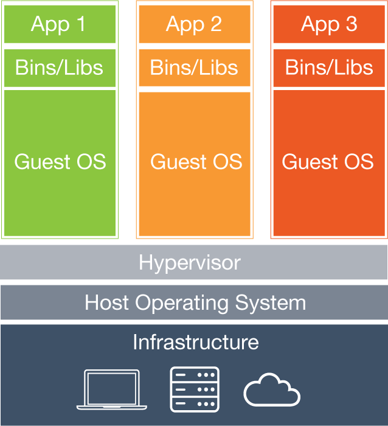
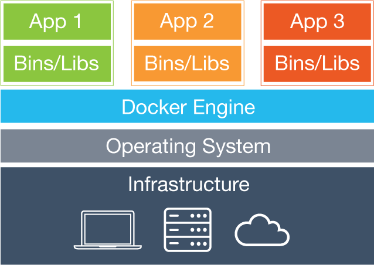
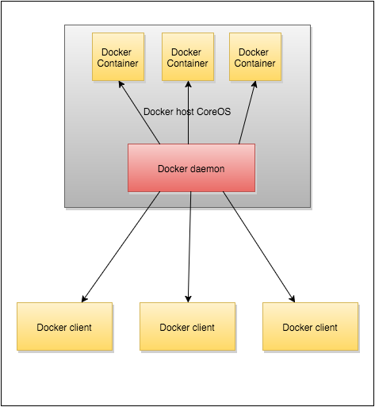

# Docker概述：什么Docker如此特别，它是如何构建的

Docker是一个开源项目，它以基于Linux操作系统级镜像来提供一个抽象的、自动分发的虚拟化附加层，通过该层使得在容器中更加容易打包应用。

容器本身仅是基于Linux的cgroups的一个抽象实现，cgroups是用于监控和限制进程及其子进程占用资源的底层内核结构。Dokcer一开始是采用

LinuX Contrainers

（LXC）的，但是后来切换到runC，前者（LXC）以libcontainer被熟知。runC则是跑在跟宿主相同的操作系统，这使得它可以共享很多宿主的操作系统资源，如RAM、CPU、网络等。

## 为何Docker如此特别？

Docker在虚拟的容器环境之上增加一个应用部署引擎。它是一个轻量级但十分强大的关于虚拟化技术的开源容器，在容器中还整合了构建并容器化应用的工作流程。

好处：

- Docker可以使你迅速地根据组件组合出应用，并消除代码分发过程中遇到的障碍。例如你可以在同一个主机上运行两个应用相同但版本不同的Docker容器。
- Docker使你的代码尽可能快的通过测试并部署到生成环境。
- Docker难以置信的简单易用。无论是在简易版Linux、OSX，还是Windows主机上都可以开始学习Docker。（Windows需要直接运行兼容Linux内核或者运行Docker镜像的虚拟机），
- 你可以在几分钟之内容器化你的应用。大多数Docker容器在一秒内即可启动。
- Docker容器几乎可以在任何地方运行。你可以在台式机、物理服务器、虚拟机上部署容器到数据中心，上传到公有云和私有云均可。这样，你就可以在任何地方运行完全一样的容器。

在我们继续讨论Docker惊艳的容器化特征之前，我们先看一下虚拟机和容器的区别。

## 虚拟机和容器的区别

容器与虚拟机享有相似的资源隔离和分配，但是容器有一套不同的架构方式使得它本身更加便携和高效。我们看下面两个演示二者差别的两个表。

### 虚拟机

每一个虚拟机包括应用、必要的二进制文件和库、完整的客户操作系统，大小总计数十GB。

### 容器

容器包括应用和应用的所有依赖，每个容器都使用容器自身选择的发行版本，但是与其他容器共享宿主操作系统的内核。
在宿主操作系统的用户空间内，他们以隔离的进程方式运行。另外，他们并不像客户操作系统正常运行那样运行所有的进程。而且容器也不绑定任何特别的硬件基础设施！Docker容器在任何计算机任何硬件基础设施任何云都可以运行。

重要的是，虚拟机需要耗时几分钟来启动，而且对资源敏感，然后容器只需要几秒甚至更少时间启动，在资源较少负载过大时也能应付的了。所以，你可以在本地计算机运行很少的几个虚拟机用于开发目的，但是你可以运行很多很多的容器。这可以使你在开发环境中高效的运行应用环境的完整备份。而且，在生成环境中，这些资源节约很容易转化为成本节约。

## 容器组件

Docker容器有一些顶层的组件需要我们先要了解，让我们看一下。

### Docker客户端和服务端

Docker是C/S应用。

Docker客户端跟服务器（守护程序）通信，服务器来做所有的工作。Docker通过包含命令行客户端（供Linux、OS X和Windows使用）和完整RESTful接口的二进制文件来分发。你可以在一台Linux主机上运行Docker守护进程和客户端，或者将你的本地Docker客户端连接到另一台Linux主机的远程Docker守护进程。

### Docker镜像

Docker镜像是Docker的构建基石。这些镜像是Docer生命周期中的构建部分。他们是一种分层的形式，根据一系列说明一步一步构建产生的统一文件系统。Dockefile是一个文本文档，它包含用户可以在命令行调用的所有命令从而组成一个镜像。使用一个基本的Docker镜像，可以添加、拷贝文件、执行命令、开放端口。
你可以认为Docker文件是一种源码，而镜像是为产生容器而被编译的代码，而容器则是运行时代码。Docker文件具有高度的便携性，可以随时共享、存储和更新。

## 注册服务

一旦你构建出一个镜像，你就可以在注册服务中存储它。注册服务有：公共的和私有的。像Docker Hub、Quay.io、Container Registery by Google Cloud的注册服务都有公共和私有的选项。你当然也可以在自己机器上运行一个自己的私有注册服务。

## 容器

容器是镜像的一个运行版本。
你可以认为镜像是Docker的构建或者编译的一面，而容器是Docker的运行或者执行的一面。
容器的生命周期跟你在容器里执行的命令的生命周期是一致的。一个容器可以只执行一个单个命令后立刻结束，或者可以让容器跟随耗时的命令一直运行。

## 总结

在本文我们讲述了：

- 什么使得Docker如此特别
- 虚拟机和容器的主要区别
- 组成Docker的主要组件

在我的下一篇博文中，我们将介绍启动容器、构建镜像，并在数据分区中工作的内容

原文链接：[Docker Overview, Part One](https://deis.com/blog/2016/docker-overview-pt-1/)（翻译：姜俊厚）
来源： <http://dockone.io/article/1160>