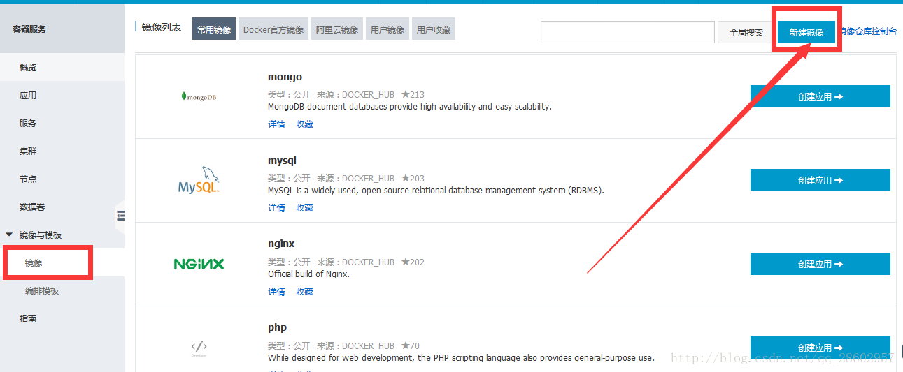

前面我们使用[Docker](http://lib.csdn.net/base/docker)快速搭建了nginx+[PHP](http://lib.csdn.net/base/php)开发环境，并部署了自己的网站。

当然小伙伴们可以在上面装自己需要的其他东西，比如[MySQL](http://lib.csdn.net/base/mysql)，或者php的其他扩展。

但是我们应该如何将该容器持久化，或者部署到更多机器上。

这里我只讲解将自己的容器制作成镜像并提交至阿里云镜像仓库。

查看我们正在运行的容器

```
docker@default:~$ docker ps CONTAINER ID IMAGE COMMAND CREATED STATUS PORTS NAMES cdbd28fe5ca9 5a7e "/bin/bash" 36 minutes ago Up 35 minutes 0.0.0.0:80->80/tcp test
```

docker commit :从容器创建一个新的镜像。

语法

> docker commit [OPTIONS] [Container](http://lib.csdn.net/base/docker) [REPOSITORY[:TAG]]

OPTIONS说明：

```
-a :提交的镜像作者；

-c :使用Dockerfile指令来创建镜像；

-m :提交时的说明文字；

-p :在commit时，将容器暂停。

```

```
docker@default:~$ docker commit -a "authorname" -m "my test commit" cdbd mycentos:v1.0 846602252aa32738c716ec8c42b62998400a4bdc531968ce45523e57d449151e docker@default:~$ docker@default:~$ docker@default:~$ docker images REPOSITORY TAG IMAGE ID CREATED VIRTUAL SIZE mycentos v1.0 846602252aa3 7 seconds ago 875.3 MB
```

成功提交镜像，接下来，我们需要登录阿里云的控制，选择容器服务




然后创建镜像仓库

注意：第一次创建需要填写namespace，并设置密码，改密码即为登录docker和提交的密码


上传完毕后，选择管理


根据下面的提示，完成操作即可。

