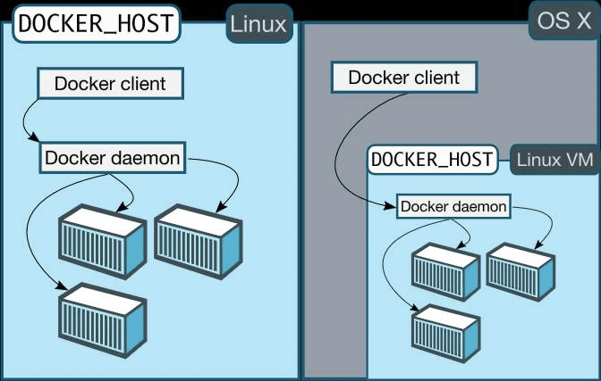

# 前端也应该了解点 docker 知识：docker 架构（上）

作者: 正寻 发表于: [2016-01-21](http://taobaofed.org/blog/2016/01/21/feders-should-kown-some-docker-2/)

上一篇文章 [前端也应该了解点 docker 知识：docker 的理念与场景 ](http://taobaofed.org/blog/2016/01/19/feders-should-kown-some-docker-1/)介绍了 docker 的一些理念，以及在前端方面可能的应用场景，本篇我们梳理一下 docker 的架构。

话说，我们团队的小明同学看了上篇文章之后，很是激动，迫不及待的想尝试下 docker ，然后按照网上一些教程跑出来了一个 “Hello world” ，激动的差点把鼠标给扔了。如果小明的故事到这里，那就不是我们团队的小明了，他是位爱动脑筋，对细节刨根问底的同学，他没有沉浸在跑出来 “Hello world”， 而是想了解下什么 image，container，registry，machine 等都是啥玩意。
他于是找到了我，问了我些上面的问题。然后我把我和小明的聊天整理了一下，然后以期帮助更多像小明这样的同学。

Q1：我的笔记本是 mac，为什么我安装的时候还要装 virtualbox ？

首先我们要知道，docker 提出的容器技术并不是 docker 首创，在之前就有了 LXC 等基于 Linux 内核特性（ cgroups 和 namespace ）的容器技术，而 docker 可以看做是加强版的 LXC ，增加了类似`更强的可移植性`，`版本控制`，`类库可分享（ docker hub ）` 等一些列简化容器操作功能。就是因为这些简化操作，让容器的使用和管理更方便，也是 docker 为什么一下子就火起来的一个很大原因。
回到问题上，docker 简单来讲就是一个容器管理工具（同时在此基础上创建了一个生态闭环）。但是 docker 还是在操作系统之上的一个程序，它是需要内核特性支持的。就目前来看 docker 只能原生跑在 Linux 上面，这是它所依赖的底层技术决定的。不管你是在 Windows 还是 mac 上安装 docker 都要安装一个类似 virtualbox 这样跑 Linux 的虚拟机工具。

总结来讲，docker 因为底层依赖的原因目前只能跑在具有相关特性的 Linux 上面，而要在不支持这些特性的操作系统上安装 docker，就需要额外多装一个 Linux 的环境了。



Q2：原来如此，怪不得第一步先让我 docker-machine 创建一个 vm 来跑 docker，那这个 docker-machine 是干什么的。

我们从上面这个问题知道，docker 原生只能跑在 Linux 上面。你想想如果只能跑在 Linux 上，那和 docker 的理念 `run anywhere` 是相悖的，也就不会有那么多人去追捧了。

后来就有了 `boot2docker` 这个工具。 boot2docker 包含两部分 ：

1. 一个轻量级的基于 tiny core Linux（一种 Linux 发行版） 的 iso 镜像
2. 管理和设置 vm 的 boot2docker 工具

然后有了 boot2docker 之后，mac 和 Windows 上就能跑 docker 了。

因为 boot2docker 只支持 virtualbox ，很多像 AWS, Microsoft Azure， VMware 等云环境也想方便的跑 docker ，就不能使用这个了。

然后就有了 docker-machine 。 docker-machine 的出现就是为了解决 docker 可以安装在更多的地方的一个管理工具。你也可以理解是大大的扩展了 boot2docker ，为 docker 的方便安装，官方开发的一个工具。它帮你屏蔽了一些安装的麻烦，让你更好更快的用上 docker。

另外，在官方的叫法里面，安装的 docker 叫做 `docker-engine`，在别人说到 docker-engine 的时候，你就知道是泛指 docker 本身就行。


Q 3：你能解释下 `docker run hello-world` ， 都发生了什么么 ？

你这个问题有点大啊，那我就尽量简单来描述。

1. 使用 docker-machine 创建一个 vm

   ```
   docker-machine create -d virtualbox default

   ```

2. 启动 vm

   ```
   docker-machine start default

   ```

3. 设置环境变量
   在 Linux 上是不需要的，但是通过 docker-machine 创建的则需要，see <http://stackoverflow.com/questions/25234792/what-does-the-docker-host-variable-do>

   ```
   eval "$(docker-machine env default)"

   ```

4. docker run hello-world


前 3 点算是对前两个问题的一个演示，我们看看第 4 点到底发生了什么。

首先，我们输入的 `docker run hello-world`. 字面意思是启动一个使用`hello-world` 镜像的容器。

docker 本身的 C/S 架构的。为了验证这一点，我们去我们创建的 vm 里面看一下有没有 docker 的守护进程，运行 `docker-machine ssh default`
然后就会进入 vm ，`ps -ef |grep 'docker -d'` 可以看到这个进程。

docker 命令本身就是充当了 docker 的 client 的角色，用来发送消息给 docker daemon 。 docker daemon 再将收到的命令进行路由，执行对应的操作。我们不仅仅可以使用 docker 命令来操作 docker，另外还有 `rest api` 等都可以和 docker 通信，进一步来操作 docker。

接下来，我们从 gif 动画里面可以清楚的看到，第一句：不能在本地找到 `hello-world` 镜像。

这里面提到了镜像也就是 `image` 。 镜像是 docker 当中一个非常重要的技术和概念。
镜像是一个只读的模板。里面可能安装了 CentOS 系统，安装了 Node.js 应用。镜像用来创建容器。举个不恰当的例子，镜像就是一个类，容器就是这个类 new 出来的实例。

docker 首先会在本地查找镜像，如果没有找到，就会去 docker hub 上去搜索，这也是上面 gif 动画的第二句输出的意思。而 docker hub 是官方提供的镜像仓库，我们也可以登陆后可以把我们创建的镜像 push 到 docker hub，然后其他人就可以 pull 到本地来使用。

关于镜像的更多操作，可以参见官方文档<https://docs.docker.com/engine/userguide/dockerimages/>

另外镜像还具有分层的概念。


关于镜像分层的介绍可以参见 <http://www.infoq.com/cn/articles/analysis-of-docker-file-system-aufs-and-devicemapper>

我们接着往下看，下载完镜像之后，就会使用该镜像创建一个容器，并输出了 hello world 。docker 也很友好的描述了这个过程：

```
To generate this message, Docker took the following steps:
 1. The Docker client contacted the Docker daemon.
 2. The Docker daemon pulled the "hello-world" image from the Docker Hub.
 3. The Docker daemon created a new container from that image which runs the
    executable that produces the output you are currently reading.
 4. The Docker daemon streamed that output to the Docker client, which sent it
    to your terminal.

```

那么关于镜像的话题还有几个：

1. 如何使用 DockerFile build 镜像
2. 如何对镜像进行管理
3. 如何创建自己的私有 registry

我们先把这几个话题留在这里，后面还会再说。

最后总结一下，docker 是 C/S 架构，docker client 把命令发给 docker daemon ，然后 daemon 进行具体的操作。在执行 docker run 的过程中，docker 先会检查本地是否有相关镜像，如果没有就会去 docker hub 进行检索并下载到本地。


随着不断梳理和小明的聊天记录，我开始有点烦小明了，问题真多，篇幅有限，剩下的几个问题，我们下次再叙。
Q 4: 一个容器终归没什么意思，那么容器之间是怎么通信的？
Q 5: 镜像是静态的，那我的代码怎么部署进去？
Q 6: 每次启动都要 docker run 一次，有没有更快更方便的方式？
Q 7: 据说我们有个 sandbox 项目，能介绍下吗？

最后感谢小明的友谊客串，小明真是个好同志。

来源： <http://taobaofed.org/blog/2016/01/21/feders-should-kown-some-docker-2/>