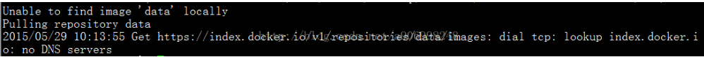
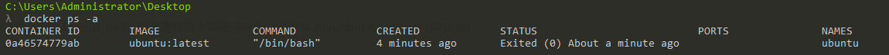
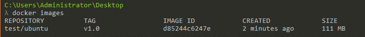
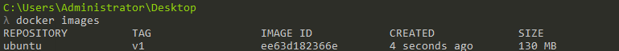

# 在 docker 之间导出导入镜像


很喜欢玩docker，但最新遇到一个问题，公司给的新机器的dns有问题，导致pull不下来镜像。

 没办法了，没有镜像什么神马都干不了，又不能花很多时间去搭建私有的镜像库，只有另寻办法了。

废话少说，经过探究，发现 docker 提供把镜像导出export（保存save）为文件的机制，这样就可以把镜像copy到任意地方了。

## **1. 导出 export - 导入 import**

格式：**docker export CONTAINER(容器)**

使用 docker ps -a 查看本机已有的容器，如：

 

 

我们使用容器 furious_bell，现在要将这个容器保存为一个文件 myunbuntu-export-0402.tar

```
docker export  ubuntu >  myunbuntu-export-0402.tar
```

导出完成后，就可以使用 import 导入了

```
docker import myunbuntu-export-0402.tar   test/ubuntu:v1.0
```

使用 docker images 查看导入本机的镜像，如：

 

## **2.保存save - 加载 load**

格式：**docker save IMAGE(镜像)**

使用 **docker images** 查看本机已有的镜像（也可以使用 **docker commit <CONTAIN-ID> <IMAGE-NAME>**命令把一个正在运行的容器保存为镜像），如：



 

这里有个基础镜像：ubuntu:v1，现在要将这个镜像保存为一个文件myubuntu-save-0402.tar

```
 docker save ubuntu:v1 > myubuntu-save-0402.tar  
```

有点慢，稍微等待一下，没有任何warn信息就表示保存OK。ubuntu:v1是镜像名称和版本号

现在就可以在任何装 docker 的地方加载 刚保存的镜像了

```
docker load < myubuntu-save-0402.tar
```

如果是在windows中则使用

```
 docker load -i   myubuntu-save-0402.tar 
```

-i 解释：  --input, -i         Read from tar archive file, instead of STDIN

## **3.导出 export 与 保存 save 的区别**

 (1).export导出的镜像文件大小  小于 save保存的镜像

 (2).export 导出（import导入）是根据容器拿到的镜像，再导入时会丢失镜像所有的历史，所以无法进行回滚操作（docker tag <LAYER ID> <IMAGE NAME>）；而save保存（load加载）的镜像，没有丢失镜像的历史，可以回滚到之前的层（layer）。（查看方式：docker images --tree）

注：导入加载进来觉得不合适可以使用 docker rm 容器ID 、 docker rmi 镜像ID 来删掉。

​       移除所有的容器和镜像（大扫除）：

```
docker kill $(docker ps -q) ; docker rm $(docker ps -a -q) ; docker rmi $(docker images -q -a)   
```

 

参考：

http://www.tuicool.com/articles/emYVRzv
http://my.oschina.net/zjzhai/blog/225112
http://www.sxt.cn/u/756/blog/5339 

来源： <http://blog.csdn.net/a906998248/article/details/46236687>