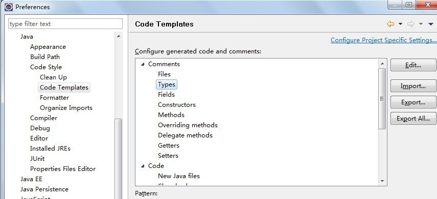
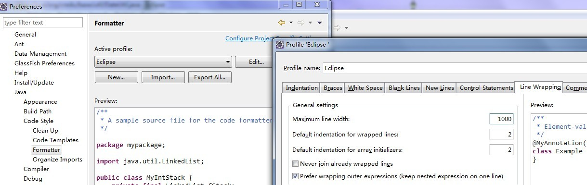
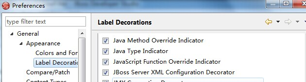
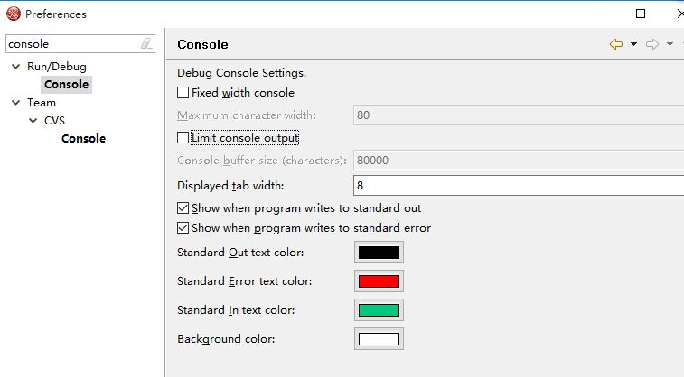

# eclipse设置和优化


# 1.eclipse下的编码设置:

- **eclipse 中使用模板新建 JSP,xhtml等 文件时**，默认的编码为：ISO-8859-1。 ISO-8859-1 编码对于中文的显示是不支持的，如果要支持简体中文，则编码方式应为 GBK 或者 GB2312 或者 UTF-8(推荐) 等。右键菜单栏window --> preferences --> 在type filter text中输入jsp; --> 选择下面的jsp -> 选择creating files组中的encoding 为UTF-8编码就可以了
- 如果要使新建立工程、java文件直接使UTF-8则需要做以下工作： 
  1、windows->Preferences...打开"首选项"对话框，左侧导航树，导航到general->Workspace，右侧 Text file encoding，选择Other，改变为UTF-8，以后新建立工程其属性对话框中的Text file encoding即为UTF-8。
  2、windows->Preferences...打开"首选项"对话框，左侧导航树，导航到general->Content Types，右侧Context Types树，点开Text，选择Java Source File，在下面的Default encoding输入框中输入UTF-8，点Update，则设置Java文件编码为UTF-8。其他java应用开发相关的文件 如：properties、XML等已经由Eclipse缺省指定，分别为ISO8859-1，UTF-8，如开发中确需改变编码格式则可以在此指定。
  3、经过上述两步，新建java文件即为UTF-8编码，Eclipse编译、运行、调试都没问题，但是做RCP应用的Product输出时、或者 插件输出时，则总是出错，要么不能编译通过(输出时要重新compile)、要么输出的插件运行时中文显示乱码。此时需要再RCP应用、或插件 Plugin工程的build.properties中增加一行，javacDefaultEncoding.. = UTF-8。让输出时编译知道java源文件时UTF-8编码。这个设置需要保证所有的java源文件时UTF-8编码格式，如果不全是，可以参考 Eclipse帮中(Plug-in Development Environment Guide > Reference > Feature and Plug-in Build configuration)，建议全部java源文件是UTF-8编码。

# 2.取消单词拼写检查

Myeclipse菜单 window——General——Editors——Text Editors——Spelling——把右边的Enable spell checking的勾去掉就行了，也就是取消单词的拼写检查。

# 3.去除不需要加载的模块

通过Windows - Preferences打开配置窗口，依次选择左侧的General - Startup and Shutdown，这个时候在右侧就显示出了Eclipse启动时加载的模块，可以根据自己的实际情况去除一些模块。
windows–>perferences–>general–>startup and shutdown

关掉没用的启动项：

WTP webservice UI plug-in,Equinox Provisioning platform Automatic Update Support

一个是ui视图,一个是自动更新.我去掉了.

# 4、取消在启动时自动验证项目配置文件

默认情况下Eclipse在启动的时候会自动验证每个项目的配置文件，这是一个非常耗时的过程，可以在Preferences窗口依次选择 MyEclipse - Validation，然后在右侧的Validator列表中只保留 Manual 项就可以了。如果需要验证的时候只需要选中文件，然后右键选择 MyEclipse - Run Validation就可以了。

windows–>perferences–>myeclipse–>validation
把 除了manual 下面的全部点掉，build下只留 classpath dependency Validator
手工验证方法：
在要验证的文件上，单击鼠标右键–>myeclipse–>run validation

# 5,修改Eclipse安装目录的eclipse.ini文件，加大JVM的非堆内存

Eclipse的设置如下:
打开eclipse配置文件eclipse.ini，更改把-Xmx（其数值代表jvm可以使用的最大内存数）
-Xms256m
-Xmx1024m

# 6.修改Eclipse编辑JSP,xhtml等页面时的编辑工具

Window > perferences > General > Editors > File Associations >
在File types 中选择 *.jsp > 在Associated editors 中将自己要用的设置为默认。

# 7.设置字体大小

```
在window->perferences->General->Appearance->Colors and Fonts->Text Font 单击change 修改
```

# **8.Eclipse中高亮显示相同的变量**

**问题描述：**

   在eclipse中使用快捷键或其他原因，不小心按错了，使得变量的高亮显示没了。  
**1.解决方法** **：**  
选择: **windows-> preferences->java->Editor->Mark Occurences ** 
选择最上的复选框，下面的就有很多了。  
其中的 **Local variables**就是变量的高亮显示。  
**2.也有更简单的办法： ** 
**网上搜了一下，原来是Toggle Mark Occurrences (Alt + Shift + 0)这个按钮没有按下，在工具栏的小黄颜色的笔 的形状的图标。 ** 
**3.改变其颜色：**  
选择: **windows-> preferences->java->Editor->Mark Occurences->第一行有个“Annotations”点击进入，显示出列表，找到 Occurrence annotation 右边选择Color即可。 ** 

# 9.Eclipse Ctrl+alt+J的注释修改



新建一个XML文件.输入一下内容:

 

```
<?xml version="1.0" encoding="UTF-8" standalone="no"?><templates><template autoinsert="true" context="typecomment_context" deleted="false" description="Comment for created types" enabled="true" id="org.eclipse.jdt.ui.text.codetemplates.typecomment" name="typecomment">/**
 * &lt;p&gt;Project: Credo's Base&lt;/p&gt;
 * &lt;p&gt;Description: &lt;/p&gt;
 * &lt;p&gt;Copyright (c) ${year} LionCredo.All Rights Reserved.&lt;/p&gt;
 * @author &lt;a href="zhaoqianjava@foxmail.com"&gt;LionCredo&lt;/a&gt;
 */</template></templates>
```

导入就ok了.

# 10.Eclipse设置每行的单词数,防止换行

如图所示设置



## **web换行,是进主菜单--web里进行设置.**

# 11.**关于eclipse配置文件导出问题：**

​    eclipse的默认配置一般不能满足我们的要求，我们一般会修改一些配置，如字体、背景颜色、快捷键及一些template等等，这样方便我们的开发。可是当我们新建一个工作空间的时候，eclipse又会使用默认配置，怎样将我们习惯的配置导出然后导入新工作空间呢？

  **  方法一：使用eclipse的导出功能（不推荐，很多配置不能导出）**

​    工作目录中右键选择Export->General->Preference，这样可以导出epf文件，新的工作空间中可以用Import导入该配置文件，这个方法的确可以导入绝大多数的配置，但是并不全，导入后会丢失很多配置。

​    方法二：将workspace/.metadata/.plugins/org.eclipse.core.runtime中的.settings文件夹拷贝出来，里面就是所有的配置文件，新建工作空间的时候将该.settings文件夹替换掉新工作空间中的.settings文件夹即可。（有网友是将.plugings文件夹替换，但是.plugings文件夹太大了，实际上就是替换.settings文件夹，.settings只有几百k。）

12.在类文件上标注是接口还是枚举类等



勾选上"java type indicator" 即可看到效果

# 12.显示java 类型,是接口还是抽象类还是枚举等.

勾选General--Appearance--Lable Desirations--Java Type Indicator

# 13.html页面中,属性为中文,对应字体的设置


# 14. console输出完整信息



limit console output 不要勾选

# 15.关闭Eclipse 页面的 tern- Go to definition

Go to **Window** - **Preferences** - **General** - **Editors** - **Text Editors** - **Hyperlinking** preference page,**remove .******

16.删除launchBar

Go to **Window** - **Preferences** -Run-Debug-Launching--launchBar,Close