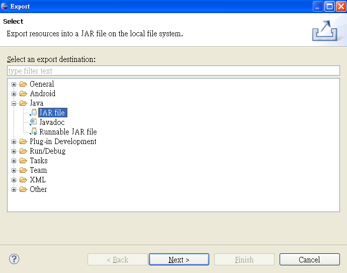
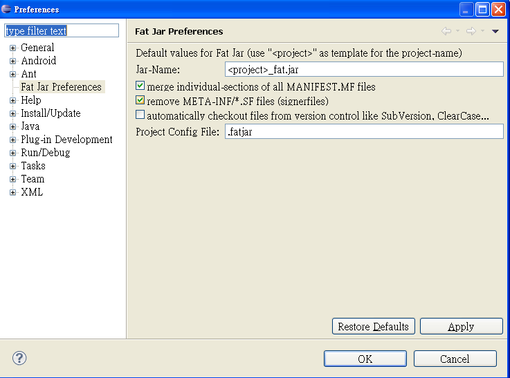
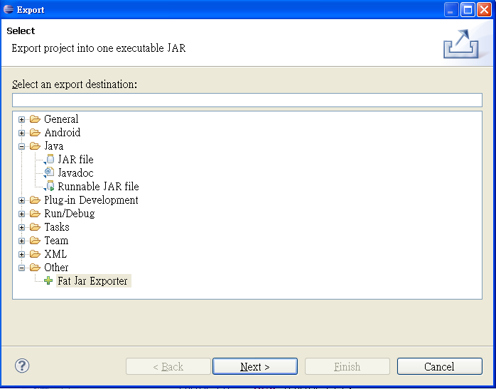
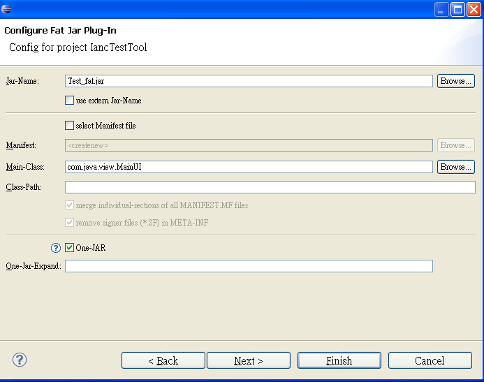

# 通过Eclipse生成可运行的jar包

分类: java
日期: 2014-09-11

原文地址: 

http://blog.chinaunix.net/uid-29632145-id-4465851.html

------

****[通过Eclipse生成可运行的jar包 ]()*2014-09-11 14:10:06*

分类： Java

相信大家在开发java的时候一定会遇到要求将java工程打包成可运行的jar的需求，今天我在这篇博客中详细讲解一下生成可运行jar的方法。

\1. 工程中不包含第三方的jar包

这种情况比较简单，选中需要生成jar的工程，右击-->Export，出现如下的窗口

选中java--- > JAR file--> next --- > next --- > main class要选中默认启动的main class，之后点击finish就生产了一个可以运行的jar包了。

运行jar包的方法：

 cmd,进入jar包所在的位置，运行命令 java -jar *.jar，就可以了。

2.工程包含第三方的jar包时

如果工程中包含第三方的jar包时，安装上面的方法生产的jar包，在运行时会报java.lang.NoClassDefFoundError的错，经过google, baidu很多网站之后，发现需要安装eclipse的插件，插件地址是：http://sourceforge.net/projects/fjep/ 下载的文件是net.sf.fjep.fatjar_0.0.31.zip，解压缩后你会看到plugins文件夹中的net.sf.fjep.fatjar_0.0.31.jar文件(简称Fat jar)。

Fat jar插件的安装方式：

把Fat jar文件拷贝到你的eclipse目录下的plugins中..重新启动你的eclipse平台，然后查看Window---preferences,弹出的窗口中有Fat jar preferences这一项则说明你已经安装成功了,没有这一项则未安装成功,需要多做如下几步操作：到你的eclipse目录下的configuration---org.eclipse.update，并删除platform.xml文件，然后重新启动eclipse.查看Window---preferences,你会发现Fat jar，效果如下图：

接下来就可以生成包含第三方jar包的可运行的jar包了。

选中工程，右击 -- > Export --- > Other --- > Fat jar Exportor，效果如下图所示，

然后，next ---> 选中要生成jar包的工程 --  > next ---> 出现如下图所示的界面

在这里需要设置Main-class，它的值是工程运行的main class，并且勾上One-JAR,点击 next ---> finish，这样就生成了包含第三方jar包的可运行的jar包。以上上在基于Eclipse 3.6.2的效果，如果是Eclipse 3.6以下的版本（具体的版本不确定，因为我没有试过），在选中工程右击后，会有Build Fat Jar，如下图所示，

接下来的操作大同小异了。

 