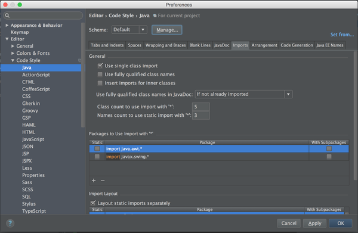
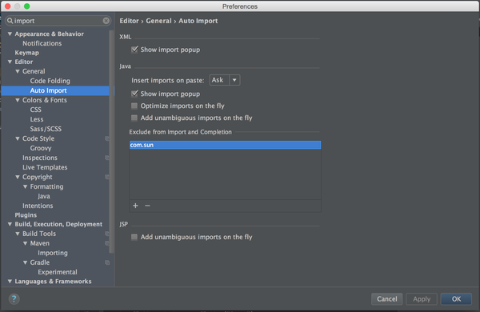

# idea怎么取消自动保存，自动导入会自动import .-怎么办？-image-201708191911.md

## **1，自动导入会自动import .\*问题**

打开设置 > Editor > Code Style > Java > Scheme Default > Imports

① 将 Class count to use import with "*" 改为 99 （导入同一个包的类超过这个数值自动变为 * ）
② 将 Names count to use static import with "*" 改为 99 （同上，但这是静态导入的）
③ 将 Package to Use import with "*" 删掉默认的这两个包 （不管使用多少个类，只要在这个列表里都会变为 * ）
PS：Scheme Default 是针对全局的，你也可以只修改某个Project的

额外教学
打开设置 > Editor > General > Auto Import
可以在这里添加一些包，让这些包从自动导入的提示中排除出去，如com.sun。（每次要导入List时都会出来捣乱）

## 2，关闭自动保存**问题**

自动导入已经有知友说了。
关闭自动保存，把　Appearance & Behavior -> System Settings 下的
Save files on frame deactivation
Save files automatically if application is idea for XXX sec.
都反选。
把 Editor -> General -> Editor Tabs 下的
Mark modified tabs with asterisk
选中

重启IDEA即可（我这里不重启的话不会生效）。但不是所有文件都有效，例如我这里pom.xml就总是会被自动保存，估计有其他插件在触发自动保存。

题外话，其实IDEA的Local History功能很完善，再配合Git之类的本地代码管理，习惯了随时自动保存特性后不会有任何问题。除非你使用了某种外部监视文件改动的软件，又不想频繁触发，否则的话我个人是建议开启自动保存的。

来源： <https://www.zhihu.com/question/35806024>