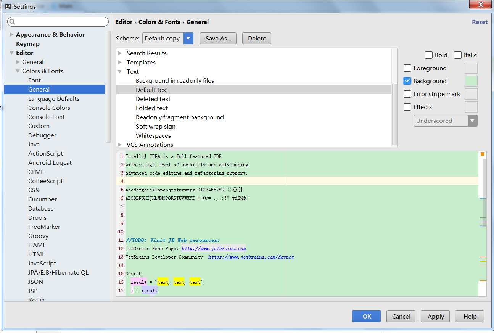

最近Idea比较流行，Eclipse因为maven的问题，运行起来非常慢，各种提示也不够智能。

现在开发基本都转到了idea，用着感觉确实不错，很方便。

但是设置和快捷键都不同了，需要一些学习成本。

现特别记录一下比较常用的设置，方便自己，方便他人。

## **1.修改背景保护色**

**老版本：**


**15版本：**

****


```
对眼睛有益的RGB数值分别是（204 232 207） #CCE8CF
```

