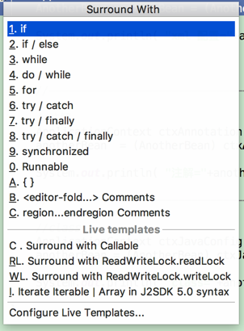
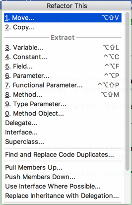

# 常用快捷键整理

常用自定义快捷键（eclipse模式）：


## 选中代码前后生成相应代码

选定代码块按 Ctrl+Alt+T,      如下图：




## 重构功能

选定代码块按 Ctrl+Shift+Alt+T   ,叫做Refactor This




## **集成关系和调用关系 查看源码** 

ctrl+alt+h  方法的调用关系(Open Call Hierarchy)

f4            继承关系(Open Type Hierarchy)


## Ctrl+J 键，会看到弹出很多块代码组合

例如，大多时候，我们要生成这样一段代码： 

public static void main(String[] args) { 

​        SystemManagerDao smd = new SystemManagerDao(); 

} 

只需在要插入的位置同时按下Ctrl+J 键，会看到弹出很多快捷键组合，而且右边有完整的介绍，然后按下p键，此时弹出4个以p开头的快捷键组合，选择psvm,就是public static void main 4个关键字的每个开头字母的组合。回车，便生成了main方法，很快的。其它都是一样，先同时按下Ctrl+J 键，然后选择你要的快捷键组合，例如：选择psfi，回车。将自动public static final int代码。Ctrl+J 键下面有非常多的组合，还能生成一个for循环。 

1.下面介绍几个Ctrl+J 键常用的组合（快捷键组合都是小写）： 

psfs：public static final String 

psfi：public static final int 

psvm：public static void main(String[] args) {   

​    } 

Psf：public static final 

Serr： System.err.println(""); 

Souf： System.out.printf(""); 

Sout： System.out.println(""); 

Soutm：System.out.println("SystemManagerDao."); 

Soutv：System.out.println("var = "+var); 

ArrayList<SysUserVO> arrayList=new ArrayList<SysUserVO>(); 

Iter：for(SysUserVO sysUserVO:arrayList) 

以上几个是我们编码中最常用的，还有更多的，就不一一列举了。 


## idea代码折叠

在intelliJ idea中不仅可以对类、方法等结构的代码进行折叠（ctrl+-）还可以自定义折叠代码。intelliJ支持两种风格的自定义代码折叠，如下：

visual studio style

```
//region Description    Your code goes here...    
//endregion  
```

netbeans style

```
// <editor-fold desc="Description">    Your code goes here...    
// </editor-fold>  
```

你可以直接手写，也可以使用快捷键实现对一段代码的自定义折叠，快捷键为：ctrl+alt+t

来源： <http://www.cnblogs.com/flying_bat/p/5505913.html>


[也可以一次性折叠所有Java代码的快捷键设置](Intellij IDEA 中一次性折叠所有Java代码的快捷键设置 collapse all-image-201708191833.md)


## 其他

ctrl+l   go to line 到代码的第几行


书签（查看书签：shift+F11，添加书签  : a、Ctrl+F11 弹出一个小框来指定式 .b、Ctrl+shift+数字）

 

Ctrl+K 参照选中的Word快速定位到下一个（如果没有选中word，则搜索上一次使用搜索的word）

Ctrl+Shift+K 参照选中的Word快速定位到上一个

 

  