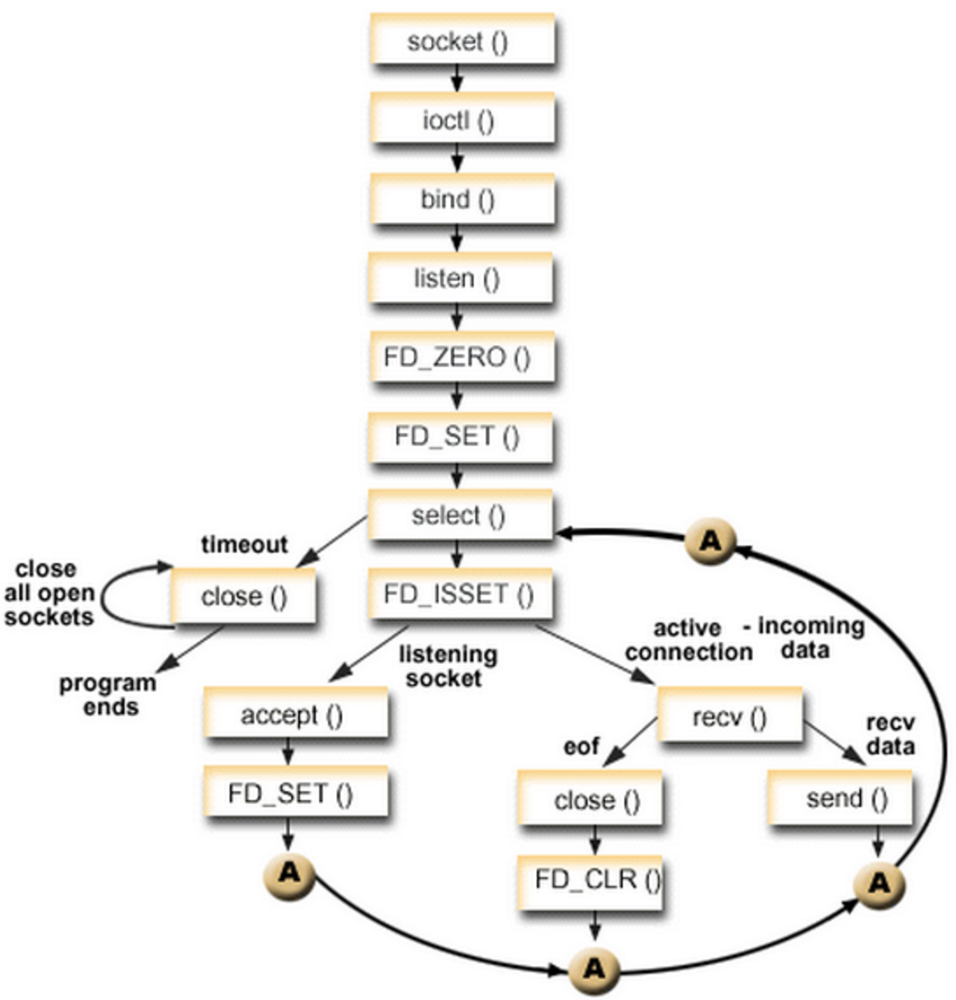
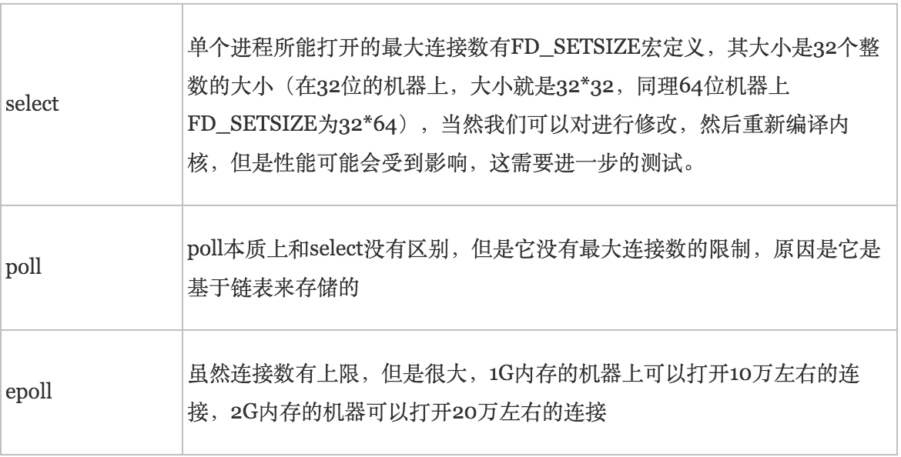
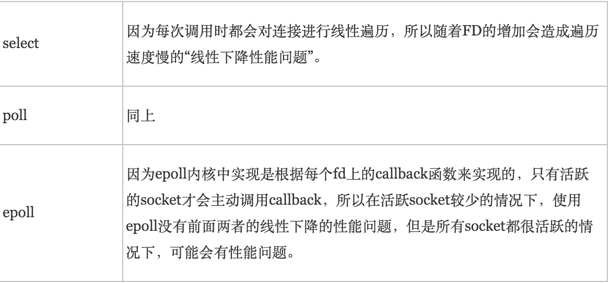

# 聊聊IO多路复用之select、poll、epoll详解

IO多路复用是指内核一旦发现进程指定的一个或者多个IO条件准备读取，它就通知该进程。IO多路复用适用如下场合：

> 1. 当客户处理多个描述符时（一般是交互式输入和网络套接口），必须使用I/O复用。
> 2. 当一个客户同时处理多个套接口时，而这种情况是可能的，但很少出现。
> 3. 如果一个TCP服务器既要处理监听套接口，又要处理已连接套接口，一般也要用到I/O复用。
> 4. 如果一个服务器即要处理TCP，又要处理UDP，一般要使用I/O复用。
> 5. 如果一个服务器要处理多个服务或多个协议，一般要使用I/O复用。

与多进程和多线程技术相比，`I/O多路复用技术的最大优势是系统开销小，系统不必创建进程/线程`，也不必维护这些进程/线程，从而大大减小了系统的开销。

目前支持I/O多路复用的系统调用有 `select，pselect，poll，epoll`，I/O多路复用就是`通过一种机制，一个进程可以监视多个描述符，一旦某个描述符就绪（一般是读就绪或者写就绪），能够通知程序进行相应的读写操作`。`但select，pselect，poll，epoll本质上都是同步I/O`，因为他们都需要在读写事件就绪后自己负责进行读写，也就是说这个读写过程是阻塞的，而异步I/O则无需自己负责进行读写，异步I/O的实现会负责把数据从内核拷贝到用户空间。

对于IO多路复用机制不理解的同学，可以先行参考[《聊聊Linux 五种IO模型》](http://www.jianshu.com/p/486b0965c296)，来了解Linux五种IO模型。

# 1 select、poll、epoll简介

epoll跟select都能提供多路I/O复用的解决方案。在现在的Linux内核里有都能够支持，`其中epoll是Linux所特有，而select则应该是POSIX所规定`，一般操作系统均有实现。

## 1.1 select

**基本原理：**

> select 函数监视的文件描述符分3类，分别是writefds、readfds、和exceptfds。调用后select函数会阻塞，直到有描述符就绪（有数据 可读、可写、或者有except），或者超时（timeout指定等待时间，如果立即返回设为null即可），函数返回。当select函数返回后，可以通过遍历fdset，来找到就绪的描述符。

**基本流程，如图所示：**

输入图片说明

select目前几乎在所有的平台上支持，`其良好跨平台支持也是它的一个优点`。`select的一个缺点在于单个进程能够监视的文件描述符的数量存在最大限制`，在Linux上一般为1024，`可以通过修改宏定义甚至重新编译内核的方式提升这一限制`，但是这样也会造成效率的降低。

`select本质上是通过设置或者检查存放fd标志位的数据结构来进行下一步处理`。这样所带来的缺点是：

1. **select最大的缺陷就是单个进程所打开的FD是有一定限制的，它由FD_SETSIZE设置，默认值是1024。**

   > 一般来说这个数目和系统内存关系很大，`具体数目可以cat /proc/sys/fs/file-max察看`。32位机默认是1024个。64位机默认是2048.

2. **对socket进行扫描时是线性扫描，即采用轮询的方法，效率较低。**

   > 当套接字比较多的时候，每次select()都要通过遍历FD_SETSIZE个Socket来完成调度，不管哪个Socket是活跃的，都遍历一遍。这会浪费很多CPU时间。`如果能给套接字注册某个回调函数，当他们活跃时，自动完成相关操作，那就避免了轮询`，这正是epoll与kqueue做的。

3. **需要维护一个用来存放大量fd的数据结构，这样会使得用户空间和内核空间在传递该结构时复制开销大。**

## 1.2 poll

**基本原理：**

> `poll本质上和select没有区别，它将用户传入的数组拷贝到内核空间`，然后查询每个fd对应的设备状态，如果设备就绪则在设备等待队列中加入一项并继续遍历，如果遍历完所有fd后没有发现就绪设备，则挂起当前进程，直到设备就绪或者主动超时，被唤醒后它又要再次遍历fd。这个过程经历了多次无谓的遍历。

**它没有最大连接数的限制，原因是它是基于链表来存储的，但是同样有一个缺点：**

> 1. `大量的fd的数组被整体复制于用户态和内核地址空间之间`，而不管这样的复制是不是有意义。
> 2. `poll还有一个特点是“水平触发”`，如果报告了fd后，没有被处理，那么下次poll时会再次报告该fd。

**注意：**

> 从上面看，select和poll都需要在返回后，`通过遍历文件描述符来获取已经就绪的socket`。事实上，`同时连接的大量客户端在一时刻可能只有很少的处于就绪状态`，因此随着监视的描述符数量的增长，其效率也会线性下降。

## 1.3 epoll

epoll是在2.6内核中提出的，是之前的select和poll的增强版本。相对于select和poll来说，epoll更加灵活，没有描述符限制。`epoll使用一个文件描述符管理多个描述符，将用户关系的文件描述符的事件存放到内核的一个事件表中，这样在用户空间和内核空间的copy只需一次`。

**基本原理：**

> `epoll支持水平触发和边缘触发，最大的特点在于边缘触发，它只告诉进程哪些fd刚刚变为就绪态，并且只会通知一次`。还有一个特点是，`epoll使用“事件”的就绪通知方式`，通过epoll_ctl注册fd，`一旦该fd就绪，内核就会采用类似callback的回调机制来激活该fd`，epoll_wait便可以收到通知。

**epoll的优点：**

> 1. `没有最大并发连接的限制`，能打开的FD的上限远大于1024（1G的内存上能监听约10万个端口）。
> 2. `效率提升，不是轮询的方式，不会随着FD数目的增加效率下降`。只有活跃可用的FD才会调用callback函数；`即Epoll最大的优点就在于它只管你“活跃”的连接，而跟连接总数无关`，因此在实际的网络环境中，Epoll的效率就会远远高于select和poll。
> 3. `内存拷贝`，利用mmap()文件映射内存加速与内核空间的消息传递；`即epoll使用mmap减少复制开销`。

**epoll对文件描述符的操作有两种模式：LT（level trigger）和ET（edge trigger）。LT模式是默认模式，LT模式与ET模式的区别如下：**

> LT模式：当epoll_wait检测到描述符事件发生并将此事件通知应用程序，`应用程序可以不立即处理该事件`。下次调用epoll_wait时，会再次响应应用程序并通知此事件。
>
> ET模式：当epoll_wait检测到描述符事件发生并将此事件通知应用程序，`应用程序必须立即处理该事件`。如果不处理，下次调用epoll_wait时，不会再次响应应用程序并通知此事件。

1. **LT模式**

   > `LT(level triggered)是缺省的工作方式，并且同时支持block和no-block socket`。在这种做法中，内核告诉你一个文件描述符是否就绪了，然后你可以对这个就绪的fd进行IO操作。`如果你不作任何操作，内核还是会继续通知你的`。

2. **ET模式**

   > `ET(edge-triggered)是高速工作方式，只支持no-block socket`。在这种模式下，当描述符从未就绪变为就绪时，内核通过epoll告诉你。然后它会假设你知道文件描述符已经就绪，并且不会再为那个文件描述符发送更多的就绪通知，直到你做了某些操作导致那个文件描述符不再为就绪状态了(比如，你在发送，接收或者接收请求，或者发送接收的数据少于一定量时导致了一个EWOULDBLOCK 错误）。`但是请注意，如果一直不对这个fd作IO操作(从而导致它再次变成未就绪)，内核不会发送更多的通知(only once)`。
   >
   > `ET模式在很大程度上减少了epoll事件被重复触发的次数，因此效率要比LT模式高`。epoll工作在ET模式的时候，`必须使用非阻塞套接口`，以避免由于一个文件句柄的阻塞读/阻塞写操作把处理多个文件描述符的任务饿死。

3. 在select/poll中，`进程只有在调用一定的方法后，内核才对所有监视的文件描述符进行扫描`，而epoll事先通过epoll_ctl()来注册一个文件描述符，`一旦基于某个文件描述符就绪时，内核会采用类似callback的回调机制`，迅速激活这个文件描述符，当进程调用epoll_wait()时便得到通知。(`此处去掉了遍历文件描述符，而是通过监听回调的的机制。这正是epoll的魅力所在。`)

**注意：**

> 如果没有大量的idle-connection或者dead-connection，epoll的效率并不会比select/poll高很多，但是当遇到大量的idle-connection，就会发现epoll的效率大大高于select/poll。

# 2 select、poll、epoll区别

1. **支持一个进程所能打开的最大连接数**

   

   ​

   ​

2. **FD剧增后带来的IO效率问题**

   

   ​

   ​

3. **消息传递方式**

   

   ​

   ​

**综上，在选择select，poll，epoll时要根据具体的使用场合以及这三种方式的自身特点：**

> 1. 表面上看epoll的性能最好，`但是在连接数少并且连接都十分活跃的情况下，select和poll的性能可能比epoll好`，毕竟epoll的通知机制需要很多函数回调。
> 2. `select低效是因为每次它都需要轮询`。但低效也是相对的，视情况而定，也可通过良好的设计改善。

http://www.jianshu.com/p/dfd940e7fca2