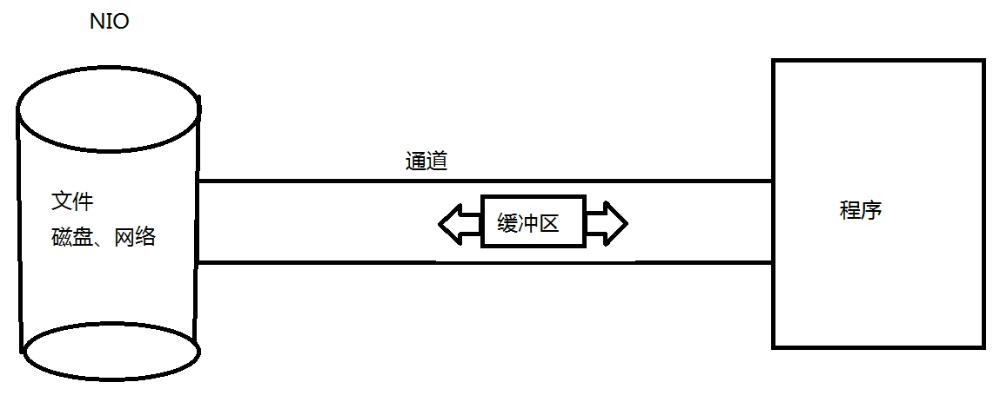
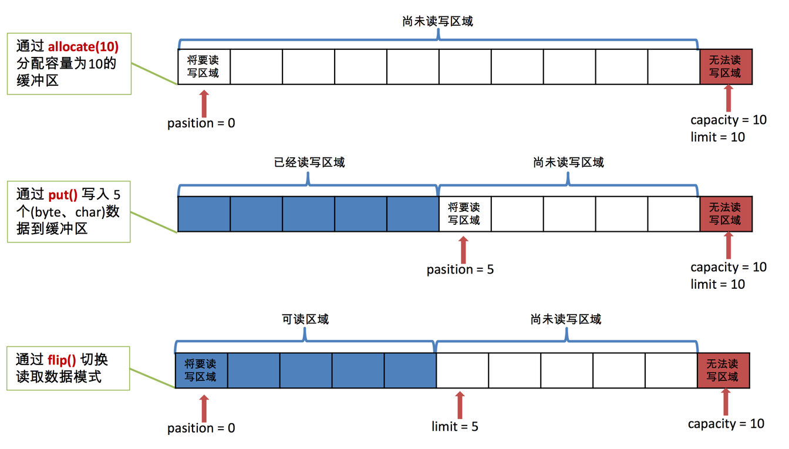
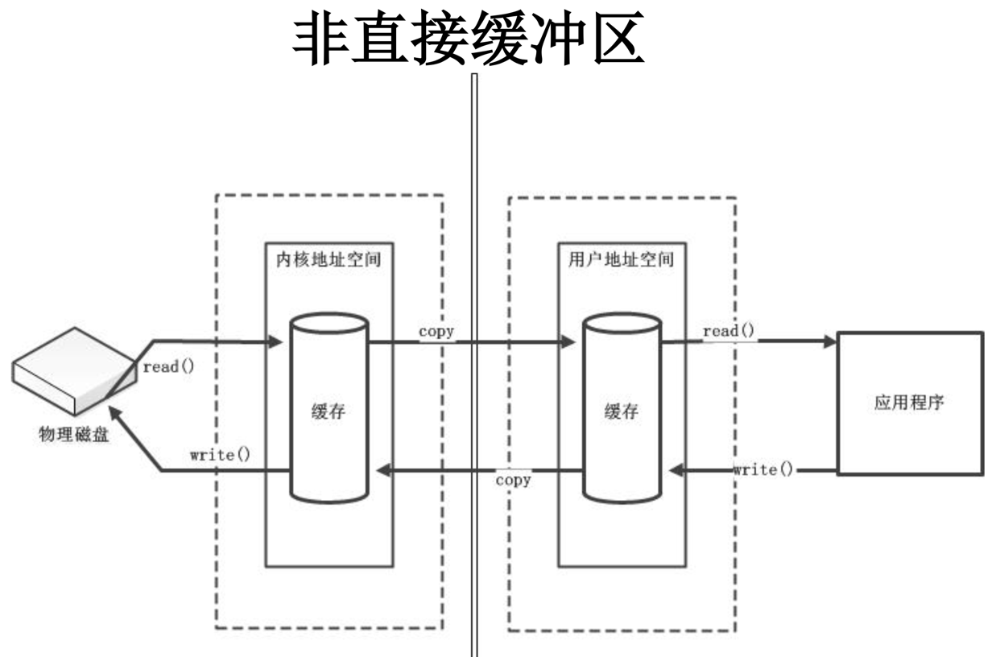
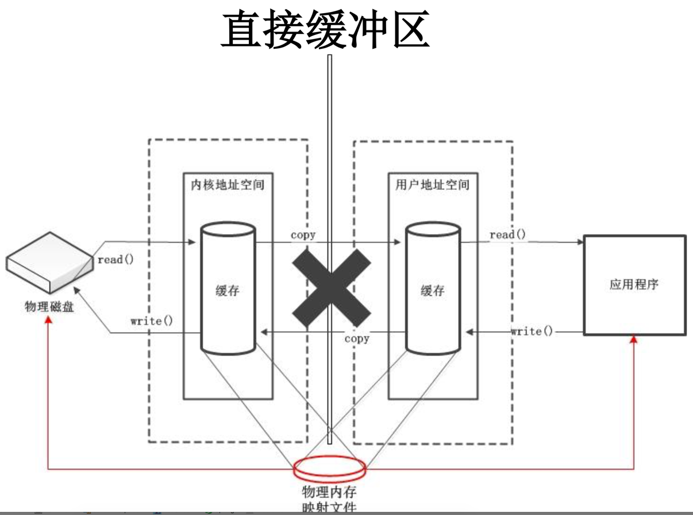
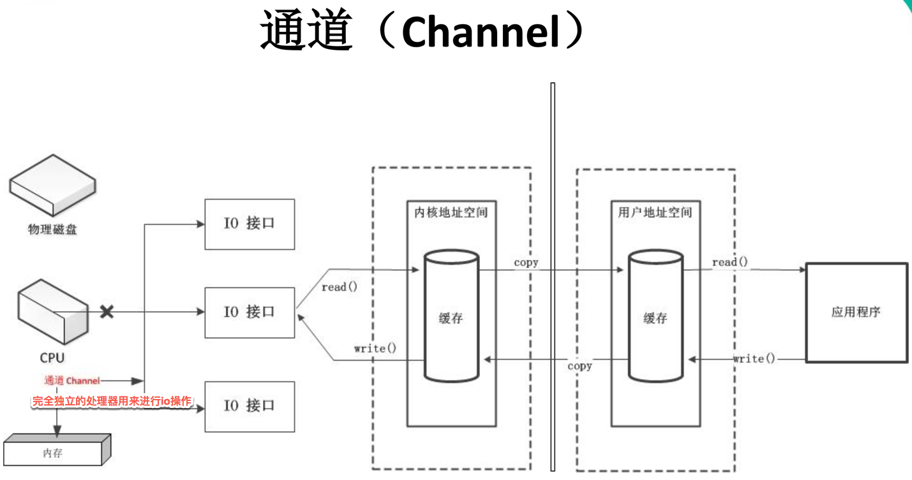
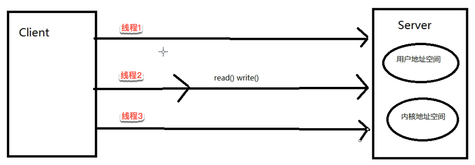
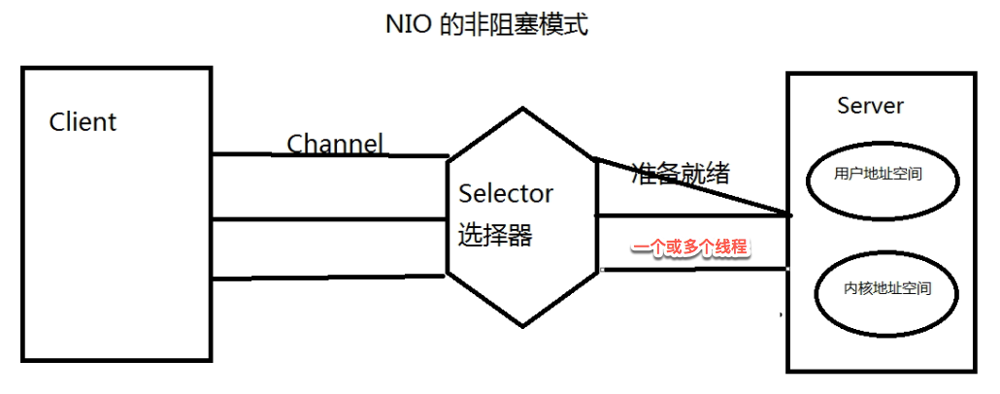
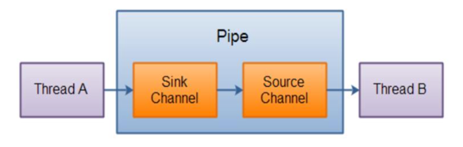

# nio学习笔记

/Users/jerryye/backup/studio/AvailableCode/basis/io_nio/io_nio_demo

## 主要内容

1. Java NIO 简介
2. Java NIO 与 IO 的主要区别
3. 缓冲区(Buffer)和通道(Channel)
4. 文件通道(FileChannel)
5. NIO 的非阻塞式网络通信
   选择器(Selector)
   SocketChannel、ServerSocketChannel、DatagramChannel
6. 管道(Pipe)
7. Java NIO2 (Path、Paths 与 Files )


## Java NIO 简介

Java NIO(New IO 或者 Non Blocking IO )是从Java 1.4版本开始引入的一个新的IO API，可以替代标准的Java IO API。NIO与原来的IO有同样的作用和目的，但是使用的方式完全不同，NIO支持面向缓冲区的、基于通道的IO操作。NIO将以更加高效的方式进行文件的读写操作。


##  Java NIO 与 IO 的主要区别

| IO                   | NIO                    |
| -------------------- | ---------------------- |
| 面向流(Stream Oriented) | 面向缓冲区(Buffer Oriented) |
| 阻塞IO(Blocking IO)    | 非阻塞IO(Non Blocking IO) |
| (无)                  | 选择器(Selectors)         |


## 缓冲区(Buffer)和通道(Channel)概述

Java NIO系统的核心在于:通道(Channel)和缓冲区(Buffer)。通道表示打开到 IO 设备(例如:文件、套接字)的连接。若需要使用 NIO 系统，需要获取用于连接 IO 设备的通道以及用于容纳数据的缓冲区。然后操作缓冲区，对数据进行处理。

**简而言之，Channel(想成 铁路) 负责传输， Buffer(想成 火车,双向的) 负责存储**



### 缓冲区(Buffer)

#### 一、缓冲区(Buffer)简介

Buffer 就像一个数组，可以保存多个相同类型的数据。根

据数据类型不同(boolean 除外) ，有以下 Buffer 常用子类:

ByteBuffer(最常用,网络都是字节流)
CharBuffer
ShortBuffer
IntBuffer
LongBuffer
FloatBuffer
DoubleBuffer

上述 Buffer 类 他们都采用相似的方法进行管理数据，只是各自管理的数据类型不同而已。都是通过如下方法获取一个 Buffer

对象:
**static XxxBuffer allocate(int capacity)** : 创建一个容量为 capacity 的 XxxBuffer 对象


#### 二、缓冲区的基本属性

Buffer 中的重要概念:
**容量 (capacity)** :表示 Buffer 最大数据容量，缓冲区容量不能为负，并且创

建后不能更改。

**限制 (limit**):第一个不应该读取或写入的数据的索引，即位于 limit 后的数据不可读写。缓冲区的限制不能为负，并且不能大于其容量。

**位置 (position**):下一个要读取或写入的数据的索引。缓冲区的位置不能为负，并且不能大于其限制

<u>标记 (mark)与重置 (reset</u>):标记是一个索引，通过 Buffer 中的 mark() 方法指定 Buffer 中一个特定的 position，之后可以通过调用 reset() 方法恢复到这个 position.

标记、位置、限制、容量遵守以下不变式:0<=mark<=position<=limit<=capacity


以下是初始化,写入,读取缓冲区模式:




####  三、Buffer 的常用方法

| 方法                       | 描述                                 |
| ------------------------ | ---------------------------------- |
| `Buffer clear()`         | `清空缓冲区并返回对缓冲区的引用`                  |
| Buffer flip()            | 将缓冲区的界限设置为当前位置，并将当前位置充值为 0         |
| `int capacity()`         | 返回 Buffer 的 capacity 大小            |
| `boolean hasRemaining()` | `判断缓冲区中是否还有元素`                     |
| int limit()              | 返回 Buffer 的界限(limit) 的位置           |
| Buffer limit(int n)      | 将设置缓冲区界限为 n, 并返回一个具有新 limit 的缓冲区对象 |
| Buffer mark()            | 对缓冲区设置标记                           |
| `int position()`         | 返回缓冲区的当前位置 position                |
| Buffer position(int n)   | 将设置缓冲区的当前位置为 n , 并返回修改后的 Buffer 对象 |
| `int remaining()`        | 返回 position 和 limit 之间的元素个数        |
| Buffer reset()           | 将位置 position 转到以前设置的 mark 所在的位置    |
| Buffer rewind()          | 将位置设为为 0， 取消设置的 mark               |

#### 四、缓冲区的数据操作

Buffer 所有子类提供了两个用于数据操作的方法:get()与 put() 方法

**获取 Buffer 中的数据**

get() :读取单个字节
get(byte[] dst):批量读取多个字节到 dst 中
get(int index):读取指定索引位置的字节(不会移动 position)

**放入数据到 Buffer 中**
put(byte b):将给定单个字节写入缓冲区的当前位置

put(byte[] src):将 src 中的字节写入缓冲区的当前位置
put(int index, byte b):将指定字节写入缓冲区的索引位置(不会移动 position)

#### 五、直接与非直接缓冲区

- 字节缓冲区要么是直接的，要么是非直接的。如果为直接字节缓冲区，则Java虚拟机会尽最大努力直接在此缓冲区上执行本机 I/O 操作。也就是说，在每次调用基础操作系统的一个本机 I/O 操作之前(或之后)，虚拟机都会尽量避免将缓冲区的内容复制到中间缓冲区中(或从中间缓冲区中复制内容)。

- 直接字节缓冲区可以通过调用此类的**allocateDirect()工厂方法**来创建。此方法返回的<u>缓冲区进行分配和取消分配所需成本通常高于非直接缓冲区</u>。直接缓冲区的内容可以驻留在常规的垃圾回收堆之外，因此，它们对应用程序的内存需求量造成的影响可能并不明显。所以，建议将直接缓冲区主要分配给那些易受基础系统的本机 I/O 操作影响的大型、持久的缓冲区。一般情况下，最好仅在直接缓冲区能在程序性能方面带来明显好处时分配它们。

- 直接字节缓冲区还可以通过**FileChannel的map()方法**将文件区域直接映射到内存中来创建。该方法返回**MappedByteBuffer** 。Java 平台的实现有助于通过 JNI 从本机代码创建直接字节缓冲区。如果以上这些缓冲区中的某个缓冲区实例指的是不可访问的内存区域，则试图访问该区域不会更改该缓冲区的内容，并且将会在访问期间或稍后的某个时间导致抛出不确定的异常。

- 字节缓冲区是直接缓冲区还是非直接缓冲区可通过调用其<u>isDirect()</u>方法来确定。提供此方法是为了能够在性能关键型代码中执行显式缓冲区管理。







#### 六、完整示例代码:

/Users/jerryye/backup/studio/AvailableCode/basis/io_nio/io_nio_demo/src/main/java/com/practice/NIO/TestBuffer.java

```
package com.atguigu.nio;

import java.nio.ByteBuffer;

import org.junit.Test;

/*
 * 一、缓冲区（Buffer）：在 Java NIO 中负责数据的存取。缓冲区就是数组。用于存储不同数据类型的数据
 * 
 * 根据数据类型不同（boolean 除外），提供了相应类型的缓冲区：
 * ByteBuffer(最常用,网络都是字节流)
 * CharBuffer
 * ShortBuffer
 * IntBuffer
 * LongBuffer
 * FloatBuffer
 * DoubleBuffer
 * 
 * 上述缓冲区的管理方式几乎一致，通过 allocate() 获取缓冲区
 * 
 * 二、缓冲区存取数据的两个核心方法：
 * put() : 存入数据到缓冲区中
 * get() : 获取缓冲区中的数据
 * 
 * 三、缓冲区中的四个核心属性：
 * capacity : 容量，表示缓冲区中最大存储数据的容量。一旦声明不能改变。
 * limit : 界限，表示缓冲区中可以操作数据的大小。（limit 后数据不能进行读写）
 * position : 位置，表示缓冲区中正在操作数据的位置。
 * 
 * mark : 标记，表示记录当前 position 的位置。可以通过 reset() 恢复到 mark 的位置
 * 
 * 0 <= mark <= position <= limit <= capacity
 * 
 * 四、直接缓冲区与非直接缓冲区：
 * 非直接缓冲区：通过 allocate() 方法分配缓冲区，将缓冲区建立在 JVM 的内存中
 * 直接缓冲区：通过 allocateDirect() 方法分配直接缓冲区，将缓冲区建立在物理内存中。可以提高效率
 */
public class TestBuffer {
	
	@Test
	public void test3(){
		//分配直接缓冲区
		ByteBuffer buf = ByteBuffer.allocateDirect(1024);
		
		System.out.println(buf.isDirect());
	}
	
	@Test
	public void test2(){
		String str = "abcde";
		
		ByteBuffer buf = ByteBuffer.allocate(1024);
		
		buf.put(str.getBytes());
		
		buf.flip();
		
		byte[] dst = new byte[buf.limit()];
		buf.get(dst, 0, 2);
		System.out.println(new String(dst, 0, 2));
		System.out.println(buf.position());
		
		//mark() : 标记
		buf.mark();
		
		buf.get(dst, 2, 2);
		System.out.println(new String(dst, 2, 2));
		System.out.println(buf.position());
		
		//reset() : 恢复到 mark 的位置
		buf.reset();
		System.out.println(buf.position());
		
		//判断缓冲区中是否还有剩余数据
		if(buf.hasRemaining()){
			
			//获取缓冲区中可以操作的数量
			System.out.println(buf.remaining());
		}
	}
	
	@Test
	public void test1(){
		String str = "abcde";
		
		//1. 分配一个指定大小的缓冲区
		ByteBuffer buf = ByteBuffer.allocate(1024);
		
		System.out.println("-----------------allocate()----------------");
		System.out.println(buf.position());
		System.out.println(buf.limit());
		System.out.println(buf.capacity());
		
		//2. 利用 put() 存入数据到缓冲区中
		buf.put(str.getBytes());
		
		System.out.println("-----------------put()----------------");
		System.out.println(buf.position());
		System.out.println(buf.limit());
		System.out.println(buf.capacity());
		
		//3. 切换读取数据模式
		buf.flip();
		
		System.out.println("-----------------flip()----------------");
		System.out.println(buf.position());
		System.out.println(buf.limit());
		System.out.println(buf.capacity());
		
		//4. 利用 get() 读取缓冲区中的数据
		byte[] dst = new byte[buf.limit()];
		buf.get(dst);
		System.out.println(new String(dst, 0, dst.length));
		
		System.out.println("-----------------get()----------------");
		System.out.println(buf.position());
		System.out.println(buf.limit());
		System.out.println(buf.capacity());
		
		//5. rewind() : 可重复读
		buf.rewind();
		
		System.out.println("-----------------rewind()----------------");
		System.out.println(buf.position());
		System.out.println(buf.limit());
		System.out.println(buf.capacity());
		
		//6. clear() : 清空缓冲区. 但是缓冲区中的数据依然存在，但是处于“被遗忘”状态
		buf.clear();
		
		System.out.println("-----------------clear()----------------");
		System.out.println(buf.position());
		System.out.println(buf.limit());
		System.out.println(buf.capacity());
		
		System.out.println((char)buf.get());
		
	}

}

```

### 通道(Channel)

#### 一、通道(Channel)简介

通道(Channel):由 java.nio.channels 包定义的。Channel 表示 IO 源与目标打开的连接。Channel 类似于传统的“流”。只不过 Channel本身不能直接访问数据，Channel 只能与Buffer 进行交互。




#### 二、通道接口常用类

Java 为 Channel 接口提供的最主要实现类如下:

- 
  FileChannel:用于读取、写入、映射和操作文件的通道。

- DatagramChannel:通过 UDP 读写网络中的数据通道。
- SocketChannel:通过 TCP 读写网络中的数据。
- ServerSocketChannel:可以监听新进来的 TCP 连接，对每一个新进来的连接都会创建一个 SocketChannel。

#### 三、获取通道三个方式

1. 获取通道的一种方式是对支持通道的对象调用getChannel() 方法。支持通道的类如下:


```
本地 IO：
FileInputStream/FileOutputStream
RandomAccessFile

网络IO：
Socket
ServerSocket
DatagramSocket
```


2. 在 JDK 1.7 中的 NIO.2 针对各个通道提供了静态方法 open()
3. 在 JDK 1.7 中的 NIO.2 的 Files 工具类的 newByteChannel()

####  四、通道之间的数据传输

```
transferFrom()
transferTo()

	//通道之间的数据传输(直接缓冲区)
	@Test
	public void test3() throws IOException{
		FileChannel inChannel = FileChannel.open(Paths.get("d:/1.mkv"), StandardOpenOption.READ);
		FileChannel outChannel = FileChannel.open(Paths.get("d:/2.mkv"), StandardOpenOption.WRITE, StandardOpenOption.READ, StandardOpenOption.CREATE);
		
//		inChannel.transferTo(0, inChannel.size(), outChannel);
		outChannel.transferFrom(inChannel, 0, inChannel.size());
		
		inChannel.close();
		outChannel.close();
	}
```

#### 五、分散(Scatter)与聚集(Gather)

 * 分散读取（Scattering Reads）：将通道中的数据按顺序分散到多个缓冲区中
 * 聚集写入（Gathering Writes）：将多个缓冲区中的数据聚集到通道中

```
	//分散和聚集
	@Test
	public void test4() throws IOException{
		RandomAccessFile raf1 = new RandomAccessFile("data/1.txt", "rw");
		
		//1. 获取通道
		FileChannel channel1 = raf1.getChannel();
		
		//2. 分配指定大小的缓冲区
		ByteBuffer buf1 = ByteBuffer.allocate(100);
		ByteBuffer buf2 = ByteBuffer.allocate(1024);
		
		//3. 分散读取
		ByteBuffer[] bufs = {buf1, buf2};
		channel1.read(bufs);
		
		for (ByteBuffer byteBuffer : bufs) {
			byteBuffer.flip();
		}
		
		System.out.println(new String(bufs[0].array(), 0, bufs[0].limit()));
		System.out.println("-----------------");
		System.out.println(new String(bufs[1].array(), 0, bufs[1].limit()));
		
		//4. 聚集写入
		RandomAccessFile raf2 = new RandomAccessFile("data/2.txt", "rw");
		FileChannel channel2 = raf2.getChannel();
		
		channel2.write(bufs);
	}
```

#### 六、字符集：Charset

 * 编码：字符串 -> 字节数组
 * 解码：字节数组  -> 字符串

```
	//字符集
	@Test
	public void test6() throws IOException{
		Charset cs1 = Charset.forName("GBK");
		
		//获取编码器
		CharsetEncoder ce = cs1.newEncoder();
		
		//获取解码器
		CharsetDecoder cd = cs1.newDecoder();
		
		CharBuffer cBuf = CharBuffer.allocate(1024);
		cBuf.put("尚硅谷威武！");
		cBuf.flip();
		
		//编码
		ByteBuffer bBuf = ce.encode(cBuf);
		
		for (int i = 0; i < 12; i++) {
			System.out.println(bBuf.get());
		}
		
		//解码
		bBuf.flip();
		CharBuffer cBuf2 = cd.decode(bBuf);
		System.out.println(cBuf2.toString());
		
		System.out.println("------------------------------------------------------");
		
		Charset cs2 = Charset.forName("GBK");
		bBuf.flip();
		CharBuffer cBuf3 = cs2.decode(bBuf);
		System.out.println(cBuf3.toString());
	}


	/**
	 * <B>Description:</B> 所有支持的字符集 <br>
	 * <B>Create on:</B> 2017/11/13 上午9:55 <br>
	 *
	 * @author xiangyu.ye
	 */
	@Test
	public void test5(){
		Map<String, Charset> map = Charset.availableCharsets();
		
		Set<Entry<String, Charset>> set = map.entrySet();
		
		for (Entry<String, Charset> entry : set) {
			System.out.println(entry.getKey() + "=" + entry.getValue());
		}
	}
```


#### 六、完整示例代码:

/Users/jerryye/backup/studio/AvailableCode/basis/io_nio/io_nio_demo/src/main/java/com/practice/NIO/TestChannel.java

```
package com.practice.NIO;

import java.io.FileInputStream;
import java.io.FileOutputStream;
import java.io.IOException;
import java.io.RandomAccessFile;
import java.nio.ByteBuffer;
import java.nio.CharBuffer;
import java.nio.MappedByteBuffer;
import java.nio.channels.FileChannel;
import java.nio.channels.FileChannel.MapMode;
import java.nio.charset.Charset;
import java.nio.charset.CharsetDecoder;
import java.nio.charset.CharsetEncoder;
import java.nio.file.Paths;
import java.nio.file.StandardOpenOption;
import java.util.Map;
import java.util.Map.Entry;
import java.util.Set;

import org.junit.Test;
import sun.lwawt.macosx.CMenu;

/*
 * 一、通道（Channel）：用于源节点与目标节点的连接。在 Java NIO 中负责缓冲区中数据的传输。Channel 本身不存储数据，因此需要配合缓冲区进行传输。
 * 
 * 二、通道的主要实现类
 * 	java.nio.channels.Channel 接口：
 * 		|--FileChannel
 * 		|--SocketChannel
 * 		|--ServerSocketChannel
 * 		|--DatagramChannel
 * 
 * 三、获取通道
 * 1. Java 针对支持通道的类提供了 getChannel() 方法
 * 		本地 IO：
 * 		FileInputStream/FileOutputStream
 * 		RandomAccessFile
 * 
 * 		网络IO：
 * 		Socket
 * 		ServerSocket
 * 		DatagramSocket
 * 		
 * 2. 在 JDK 1.7 中的 NIO.2 针对各个通道提供了静态方法 open()
 * 3. 在 JDK 1.7 中的 NIO.2 的 Files 工具类的 newByteChannel()
 * 
 * 四、通道之间的数据传输
 * transferFrom()
 * transferTo()
 * 
 * 五、分散(Scatter)与聚集(Gather)
 * 分散读取（Scattering Reads）：将通道中的数据分散到多个缓冲区中
 * 聚集写入（Gathering Writes）：将多个缓冲区中的数据聚集到通道中
 * 
 * 六、字符集：Charset
 * 编码：字符串 -> 字节数组
 * 解码：字节数组  -> 字符串
 * 
 */
public class TestChannel {
	
	//字符集
	@Test
	public void test6() throws IOException{
		Charset cs1 = Charset.forName("GBK");
		
		//获取编码器
		CharsetEncoder ce = cs1.newEncoder();
		
		//获取解码器
		CharsetDecoder cd = cs1.newDecoder();
		
		CharBuffer cBuf = CharBuffer.allocate(1024);
		cBuf.put("尚硅谷威武！");
		cBuf.flip();
		
		//编码
		ByteBuffer bBuf = ce.encode(cBuf);
		
		for (int i = 0; i < 12; i++) {
			System.out.println(bBuf.get());
		}
		
		//解码
		bBuf.flip();
		CharBuffer cBuf2 = cd.decode(bBuf);
		System.out.println(cBuf2.toString());
		
		System.out.println("------------------------------------------------------");
		
		Charset cs2 = Charset.forName("GBK");
		bBuf.flip();
		CharBuffer cBuf3 = cs2.decode(bBuf);
		System.out.println(cBuf3.toString());
	}


	/**
	 * <B>Description:</B> 所有支持的字符集 <br>
	 * <B>Create on:</B> 2017/11/13 上午9:55 <br>
	 *
	 * @author xiangyu.ye
	 */
	@Test
	public void test5(){
		Map<String, Charset> map = Charset.availableCharsets();
		
		Set<Entry<String, Charset>> set = map.entrySet();
		
		for (Entry<String, Charset> entry : set) {
			System.out.println(entry.getKey() + "=" + entry.getValue());
		}
	}
	
	//分散和聚集
	@Test
	public void test4() throws IOException{
		RandomAccessFile raf1 = new RandomAccessFile("data/1.txt", "rw");
		
		//1. 获取通道
		FileChannel channel1 = raf1.getChannel();
		
		//2. 分配指定大小的缓冲区
		ByteBuffer buf1 = ByteBuffer.allocate(100);
		ByteBuffer buf2 = ByteBuffer.allocate(1024);
		
		//3. 分散读取
		ByteBuffer[] bufs = {buf1, buf2};
		channel1.read(bufs);
		
		for (ByteBuffer byteBuffer : bufs) {
			byteBuffer.flip();
		}
		
		System.out.println(new String(bufs[0].array(), 0, bufs[0].limit()));
		System.out.println("-----------------");
		System.out.println(new String(bufs[1].array(), 0, bufs[1].limit()));
		
		//4. 聚集写入
		RandomAccessFile raf2 = new RandomAccessFile("data/2.txt", "rw");
		FileChannel channel2 = raf2.getChannel();
		
		channel2.write(bufs);
	}
	
	//通道之间的数据传输(直接缓冲区)
	@Test
	public void test3() throws IOException{
		FileChannel inChannel = FileChannel.open(Paths.get("d:/1.mkv"), StandardOpenOption.READ);
		FileChannel outChannel = FileChannel.open(Paths.get("d:/2.mkv"), StandardOpenOption.WRITE, StandardOpenOption.READ, StandardOpenOption.CREATE);
		
//		inChannel.transferTo(0, inChannel.size(), outChannel);
		outChannel.transferFrom(inChannel, 0, inChannel.size());
		
		inChannel.close();
		outChannel.close();
	}
	
	//使用直接缓冲区完成文件的复制(内存映射文件),有风险,jvm清理需要等待gc,才能释放资源,不稳定
	@Test
	public void test2() throws IOException{//2127-1902-1777
		long start = System.currentTimeMillis();
		
		FileChannel inChannel = FileChannel.open(Paths.get("d:/1.mkv"), StandardOpenOption.READ);
		FileChannel outChannel = FileChannel.open(Paths.get("d:/2.mkv"), StandardOpenOption.WRITE, StandardOpenOption.READ, StandardOpenOption.CREATE);
		
		//内存映射文件
		MappedByteBuffer inMappedBuf = inChannel.map(MapMode.READ_ONLY, 0, inChannel.size());
		MappedByteBuffer outMappedBuf = outChannel.map(MapMode.READ_WRITE, 0, inChannel.size());
		
		//直接对缓冲区进行数据的读写操作
		byte[] dst = new byte[inMappedBuf.limit()];
		inMappedBuf.get(dst);
		outMappedBuf.put(dst);
		
		inChannel.close();
		outChannel.close();
		
		long end = System.currentTimeMillis();
		System.out.println("耗费时间为：" + (end - start));
	}
	
	//利用通道完成文件的复制（非直接缓冲区）
	@Test
	public void test1(){//10874-10953
		long start = System.currentTimeMillis();
		
		FileInputStream fis = null;
		FileOutputStream fos = null;
		//①获取通道
		FileChannel inChannel = null;
		FileChannel outChannel = null;
		try {
			fis = new FileInputStream("d:/1.mkv");
			fos = new FileOutputStream("d:/2.mkv");
			
			inChannel = fis.getChannel();
			outChannel = fos.getChannel();
			
			//②分配指定大小的缓冲区
			ByteBuffer buf = ByteBuffer.allocate(1024);
			
			//③将通道中的数据存入缓冲区中
			while(inChannel.read(buf) != -1){
				buf.flip(); //切换读取数据的模式
				//④将缓冲区中的数据写入通道中
				outChannel.write(buf);
				buf.clear(); //清空缓冲区
			}
		} catch (IOException e) {
			e.printStackTrace();
		} finally {
			if(outChannel != null){
				try {
					outChannel.close();
				} catch (IOException e) {
					e.printStackTrace();
				}
			}
			
			if(inChannel != null){
				try {
					inChannel.close();
				} catch (IOException e) {
					e.printStackTrace();
				}
			}
			
			if(fos != null){
				try {
					fos.close();
				} catch (IOException e) {
					e.printStackTrace();
				}
			}
			
			if(fis != null){
				try {
					fis.close();
				} catch (IOException e) {
					e.printStackTrace();
				}
			}
		}
		
		long end = System.currentTimeMillis();
		System.out.println("耗费时间为：" + (end - start));
		
	}

}

```


##  NIO 的非阻塞式网络通信

### 阻塞与非阻塞

传统的 IO 流都是阻塞式的。也就是说，当一个线程调用 read() 或 write()时，该线程被阻塞，直到有一些数据被读取或写入，该线程在此期间不能执行其他任务。因此，在完成网络通信进行 IO 操作时，由于线程会阻塞，所以服务器端必须为每个客户端都提供一个独立的线程进行处理，当服务器端需要处理大量客户端时，性能急剧下降。

Java NIO 是非阻塞模式的。当线程从某通道进行读写数据时，若没有数据可用时，该线程可以进行其他任务。线程通常将非阻塞 IO 的空闲时间用于在其他通道上执行 IO 操作，所以单独的线程可以管理多个输入和输出通道。因此，NIO 可以让服务器端使用一个或有限几个线程来同时处理连接到服务器端的所有客户端。


传统阻塞io图:



非阻塞io图:




### 选择器(Selector)

选择器(Selector) 是 SelectableChannle 对象的多路复用器，Selector 可以同时监控多个 SelectableChannel 的 IO 状况，也就是说，利用 Selector可使一个单独的线程管理多个 Channel。Selector 是非阻塞 IO 的核心。

SelectableChannle 的结构如下图:

```
  	   java.nio.channels.Channel 接口：
  			|--SelectableChannel
  				|--SocketChannel
  				|--ServerSocketChannel
  				|--DatagramChannel
  
  				|--Pipe.SinkChannel
  				|--Pipe.SourceChannel
```

####  选择器(Selector)的应用

创建 Selector :通过调用 Selector.open() 方法创建一个 Selector。

```
		//4. 获取选择器
		Selector selector = Selector.open();
```

向选择器注册通道:SelectableChannel.register(Selector sel,  int ops)

```
		//1. 获取通道
		ServerSocketChannel ssChannel = ServerSocketChannel.open();
		
		//2. 切换非阻塞模式
		ssChannel.configureBlocking(false);
		
		//3. 绑定连接
		ssChannel.bind(new InetSocketAddress(9898));
		
		//4. 获取选择器
		Selector selector = Selector.open();
		
		//5. 将通道注册到选择器上, 并且指定“监听接收事件”
		ssChannel.register(selector, SelectionKey.OP_ACCEPT);
```

- 当调用 register(Selector sel, int ops) 将通道注册选择器时，选择器

  ​	对通道的监听事件，需要通过第二个参数 ops 指定。


-  可以监听的事件类型(可使用 SelectionKey 的四个常量表示):  

  读 : SelectionKey.OP_READ (1)

  写 : SelectionKey.OP_WRITE (4) 

  连接:SelectionKey.OP_CONNECT (8)  

  接收 : SelectionKey.OP_ACCEPT (16)


-  若注册时不止监听一个事件，则可以使用“位或”操作符连接。例:

```
//注册"监听事件"
int interestSet = SelectionKey.OP_READ | SelectionKey.OP_WRITE;
```

####  SelectionKey

SelectionKey:表示 SelectableChannel 和 Selector 之间的注册关系。每次向选择器注册通道时就会选择一个事件(选择键)。选择键包含两个表示为整数值的操作集。操作集的每一位都表示该键的通道所支持的一类可选择操作。

| 方法                           | 描述                  |
| ---------------------------- | ------------------- |
| int   interestOps()          | 获取感兴趣事件集合           |
| int   readyOps()             | 获取通道已经准备就绪的操作的集合    |
| SelectableChannel  channel() | 获取注册通道              |
| Selector  selector()         | 返回选择器               |
| boolean isReadable()         | 检测 Channal 中读事件是否就绪 |
| boolean isWritable()         | 检测 Channal 中写事件是否就绪 |
| boolean isConnectable()      | 检测 Channel 中连接是否就绪  |
| boolean isAcceptable()       | 检测 Channel 中接收是否就绪  |

####  Selector 的常用方法

| 方法                       | 描述                                       |
| ------------------------ | ---------------------------------------- |
| Set<SelectionKey> keys() | 所有的 SelectionKey 集合。代表注册在该Selector上的Channel |
| selectedKeys()           | 被选择的 SelectionKey 集合。返回此Selector的已选择键集   |
| int select()             | 监控所有注册的Channel，当它们中间有需要处理的 IO 操作时，该方法返回，并将对应得的 SelectionKey 加入被选择的SelectionKey 集合中，该方法返回这些 Channel 的数量。 |
| int select(long timeout) | 可以设置超时时长的 select() 操作                    |
| int selectNow()          | 执行一个立即返回的 select() 操作，该方法不会阻塞线程          |
| Selector wakeup()        | 使一个还未返回的 select() 方法立即返回                 |
| void close()             | 关闭该选择器                                   |


### SocketChannel

-  Java NIO中的SocketChannel是一个连接到TCP网络套接字的通道。


- 操作步骤:

  ​	打开 SocketChannel

  ​	读写数据
   	关闭 SocketChannel

### ServerSocketChannel

-  Java NIO中的 ServerSocketChannel 是一个可以 监听新进来的TCP连接的通道，就像标准IO中 的ServerSocket一样。


###  DatagramChannel 

- Java NIO中的DatagramChannel是一个能收发 UDP包的通道。  


- 操作步骤: 

  ​	打开 

  ​	DatagramChannel  

  ​	接收/发送数据


###  管道 (Pipe) 

/Users/jerryye/backup/studio/AvailableCode/basis/io_nio/io_nio_demo/src/main/java/com/practice/NIO/networkIO/TestPipe.java

 Java NIO 管道是2个线程之间的单向数据连接。 Pipe有一个source通道和一个sink通道。数据会 被写到sink通道，从source通道读取。




##  NIO.2 – Path、Paths、Files

/Users/jerryye/backup/studio/AvailableCode/basis/io_nio/io_nio_demo/src/main/java/com/practice/NIO/networkIO/TestNIO_2.java

### NIO.2

  随着 JDK 7 的发布，Java对NIO进行了极大的扩展，增强了对文件处理和文件系统特性的支持，以至于我们称他们为 NIO.2。因为 NIO  供的一些功能，NIO已经成为文件处理中越来越重要的部分。

### Path 与 Paths

  java.nio.file.Path 接口代表一个平台无关的平台路径， 述了目

录结构中文件的位置。

  Paths 供的get()方法用来获取Path对象:
  Path get(String first, String ... more) : 用于将多个字符串串连成路径。

  Path常用方法:

-    booleanendsWith(Stringpath):判断是否以path路径结束
-    booleanstartsWith(Stringpath):判断是否以path路径开始
-    boolean isAbsolute() : 判断是否是绝对路径
-    PathgetFileName():返回与调用Path对象关联的文件名
-    Path getName(int idx) : 返回的指定索引位置 idx 的路径名称
-    intgetNameCount():返回Path根目录后面元素的数量
-    PathgetParent():返回Path对象包含整个路径，不包含Path对象指定的文件路径
-    PathgetRoot():返回调用Path对象的根路径
-    Path resolve(Path p) :将相对路径解析为绝对路径
-    PathtoAbsolutePath():作为绝对路径返回调用Path对象
-    StringtoString():返回调用Path对象的字符串表示形式

### Files 类

  java.nio.file.Files 用于操作文件或目录的工具类。

  Files常用方法:
  Path copy(Path src, Path dest, CopyOption ... how) : 文件的复制
  Path createDirectory(Path path, FileAttribute<?> ... attr) : 创建一个目录
  Path createFile(Path path, FileAttribute<?> ... arr) : 创建一个文件
  void delete(Path path) : 删除一个文件
  Path move(Path src, Path dest, CopyOption...how) : 将 src 移动到 dest 位置
  long size(Path path) : 返回 path 指定文件的大小


  Files常用方法:用于判断

-    boolean exists(Path path, LinkOption ... opts) : 判断文件是否存在

-    boolean isDirectory(Path path, LinkOption ... opts) : 判断是否是目录

-    boolean isExecutable(Path path) : 判断是否是可执行文件

-    boolean isHidden(Path path) : 判断是否是隐藏文件

-    boolean isReadable(Path path) : 判断文件是否可读

-    boolean isWritable(Path path) : 判断文件是否可写

-    boolean notExists(Path path, LinkOption ... opts) : 判断文件是否不存在

-    public static <A extends BasicFileAttributes> A readAttributes(Path path,Class<A> type,LinkOption...options) : 获取与 path 指定的文件相关联的属性。

    Files常用方法:用于操作内容


-    SeekableByteChannel newByteChannel(Path path, OpenOption...how) : 获取与指定文件的连接，

  how 指定打开方式。

-    DirectoryStream newDirectoryStream(Path path) : 打开 path 指定的目录

-    InputStream newInputStream(Path path, OpenOption...how):获取 InputStream 对象

-    OutputStream newOutputStream(Path path, OpenOption...how) : 获取 OutputStream 对象

### 自动资源管理

-   Java 7 增加了一个新特性，该特性 供了另外一种管理资源的方式，这种方式能自动关闭文件。这个特性有时被称为自动资源管理(Automatic Resource Management, ARM)， 该特性以 try 语句的扩展版为基础。自动资源管理主要用于，当不再需要文件(或其他资源)时，可以防止无意中忘记释放它们。


- 自动资源管理基于 try 语句的扩展形式:

```
try(需要关闭的资源声明){//可能发生异常的语句

}catch(异常类型 变量名){//异常的处理语句

}
......
finally{

//一定执行的语句

}
```

当 try 代码块结束时，自动释放资源。因此不需要显示的调用 close() 方法。该形式也称为“带资源的 try 语句”。

注意:
1try 语句中声明的资源被隐式声明为 final ，资源的作用局限于带资源的 try 语句
2可以在一条 try 语句中管理多个资源，每个资源以“;” 隔开即可。
3需要关闭的资源，必须实现了 AutoCloseable 接口或其自接口 Closeable

```
	//自动资源管理：自动关闭实现 AutoCloseable 接口的资源
	@Test
	public void test8(){
		try(FileChannel inChannel = FileChannel.open(Paths.get("1.jpg"), StandardOpenOption.READ);
				FileChannel outChannel = FileChannel.open(Paths.get("2.jpg"), StandardOpenOption.WRITE, StandardOpenOption.CREATE)){
			
			ByteBuffer buf = ByteBuffer.allocate(1024);
			inChannel.read(buf);
			
		}catch(IOException e){
			
		}
	}
```

