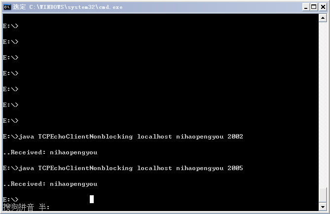
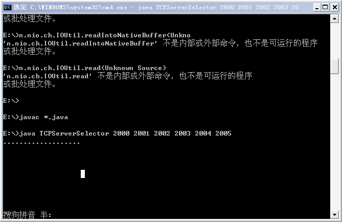

# 【Java TCP/IP Socket】基于NIO的TCP通信（含代码）

代码位置:/Users/jerryye/backup/studio/AvailableCode/basis/io_nio/io_nio_demo/src/main/java/com/practice/NIO/complexTcp

#    NIO主要原理及使用

​    NIO采取通道（Channel）和缓冲区(Buffer)来传输和保存数据，它是非阻塞式的I/O，即在等待连接、读写数据（这些都是在一线程以客户端的程序中会阻塞线程的操作）的时候，程序也可以做其他事情，以实现线程的异步操作。

   考虑一个即时消息服务器，可能有上千个客户端同时连接到服务器，但是在任何时刻只有非常少量的消息需要读取和分发（如果采用线程池或者一线程一客户端方式，则会非常浪费资源），这就需要一种方法能阻塞等待，直到有一个信道可以进行I/O操作。NIO的Selector选择器就实现了这样的功能，一个Selector实例可以同时检查一组信道的I/O状态，它就类似一个观察者，只要我们把需要探知的SocketChannel告诉Selector,我们接着做别的事情，当有事件（比如，连接打开、数据到达等）发生时，它会通知我们，传回一组SelectionKey,我们读取这些Key,就会获得我们刚刚注册过的SocketChannel,然后，我们从这个Channel中读取数据，接着我们可以处理这些数据。

​    Selector内部原理实际是在做一个对所注册的Channel的轮询访问，不断的轮询(目前就这一个算法)，一旦轮询到一个Channel有所注册的事情发生，比如数据来了，它就会读取Channel中的数据，并对其进行处理。

​    要使用选择器，需要创建一个Selector实例，并将其注册到想要监控的信道上（通过Channel的方法实现）。最后调用选择器的select（）方法，该方法会阻塞等待，直到有一个或多个信道准备好了I/O操作或等待超时，或另一个线程调用了该选择器的wakeup（）方法。现在，在一个单独的线程中，通过调用select（）方法，就能检查多个信道是否准备好进行I/O操作，由于非阻塞I/O的异步特性，在检查的同时，我们也可以执行其他任务。

#    基于NIO的TCP连接的建立步骤

  **服务端**

​    1、传建一个Selector实例；

​    2、将其注册到各种信道，并指定每个信道上感兴趣的I/O操作；

​    3、重复执行：

​        1）调用一种select（）方法；

​        2）获取选取的键列表；

​        3）对于已选键集中的每个键：

​           a、获取信道，并从键中获取附件（如果为信道及其相关的key添加了附件的话）；

​           b、确定准备就绪的操纵并执行，如果是accept操作，将接收的信道设置为非阻塞模式，并注册到选择器；

​           c、如果需要，修改键的兴趣操作集；

​           d、从已选键集中移除键

​     **客户端**

   与基于多线程的TCP客户端大致相同，只是这里是通过信道建立的连接，但在等待连接建立及读写时，我们可以异步地执行其他任务。

#    基于NIO的TCP通信Demo

​    下面给出一个基于NIO的TCP通信的Demo，客户端发送一串字符串到服务端，服务端将该字符串原原本本地反馈给客户端。

​    客户端代码及其详细注释如下：

```
import java.net.InetSocketAddress;  
import java.net.SocketException;  
import java.nio.ByteBuffer;  
import java.nio.channels.SocketChannel;  
  
public class TCPEchoClientNonblocking {  
    public static void main(String args[]) throws Exception{  
        if ((args.length < 2) || (args.length > 3))   
        throw new IllegalArgumentException("参数不正确");  
        //第一个参数作为要连接的服务端的主机名或IP  
        String server = args[0];   
        //第二个参数为要发送到服务端的字符串  
        byte[] argument = args[1].getBytes();  
        //如果有第三个参数，则作为端口号，如果没有，则端口号设为7  
        int servPort = (args.length == 3) ? Integer.parseInt(args[2]) : 7;  
        //创建一个信道，并设为非阻塞模式  
        SocketChannel clntChan = SocketChannel.open();  
        clntChan.configureBlocking(false);  
        //向服务端发起连接  
        if (!clntChan.connect(new InetSocketAddress(server, servPort))){  
            //不断地轮询连接状态，直到完成连接  
            while (!clntChan.finishConnect()){  
                //在等待连接的时间里，可以执行其他任务，以充分发挥非阻塞IO的异步特性  
                //这里为了演示该方法的使用，只是一直打印"."  
                System.out.print(".");    
            }  
        }  
        //为了与后面打印的"."区别开来，这里输出换行符  
        System.out.print("\n");  
        //分别实例化用来读写的缓冲区  
        ByteBuffer writeBuf = ByteBuffer.wrap(argument);  
        ByteBuffer readBuf = ByteBuffer.allocate(argument.length);  
        //接收到的总的字节数  
        int totalBytesRcvd = 0;   
        //每一次调用read（）方法接收到的字节数  
        int bytesRcvd;   
        //循环执行，直到接收到的字节数与发送的字符串的字节数相等  
        while (totalBytesRcvd < argument.length){  
            //如果用来向通道中写数据的缓冲区中还有剩余的字节，则继续将数据写入信道  
            if (writeBuf.hasRemaining()){  
                clntChan.write(writeBuf);  
            }  
            //如果read（）接收到-1，表明服务端关闭，抛出异常  
            if ((bytesRcvd = clntChan.read(readBuf)) == -1){  
                throw new SocketException("Connection closed prematurely");  
            }  
            //计算接收到的总字节数  
            totalBytesRcvd += bytesRcvd;  
            //在等待通信完成的过程中，程序可以执行其他任务，以体现非阻塞IO的异步特性  
            //这里为了演示该方法的使用，同样只是一直打印"."  
            System.out.print(".");   
        }  
        //打印出接收到的数据  
        System.out.println("Received: " +  new String(readBuf.array(), 0, totalBytesRcvd));  
        //关闭信道  
        clntChan.close();  
    }  
}  
```

​    服务端用单个线程监控一组信道，代码如下：

```
import java.io.IOException;  
import java.net.InetSocketAddress;  
import java.nio.channels.SelectionKey;  
import java.nio.channels.Selector;  
import java.nio.channels.ServerSocketChannel;  
import java.util.Iterator;  
  
public class TCPServerSelector{  
    //缓冲区的长度  
    private static final int BUFSIZE = 256;   
    //select方法等待信道准备好的最长时间  
    private static final int TIMEOUT = 3000;   
    public static void main(String[] args) throws IOException {  
        if (args.length < 1){  
            throw new IllegalArgumentException("Parameter(s): <Port> ...");  
        }  
        //创建一个选择器  
        Selector selector = Selector.open();  
        for (String arg : args){  
            //实例化一个信道  
            ServerSocketChannel listnChannel = ServerSocketChannel.open();  
            //将该信道绑定到指定端口  
            listnChannel.socket().bind(new InetSocketAddress(Integer.parseInt(arg)));  
            //配置信道为非阻塞模式  
            listnChannel.configureBlocking(false);  
            //将选择器注册到各个信道  
            listnChannel.register(selector, SelectionKey.OP_ACCEPT);  
        }  
        //创建一个实现了协议接口的对象  
        TCPProtocol protocol = new EchoSelectorProtocol(BUFSIZE);  
        //不断轮询select方法，获取准备好的信道所关联的Key集  
        while (true){  
            //一直等待,直至有信道准备好了I/O操作  
            if (selector.select(TIMEOUT) == 0){  
                //在等待信道准备的同时，也可以异步地执行其他任务，  
                //这里只是简单地打印"."  
                System.out.print(".");  
                continue;  
            }  
            //获取准备好的信道所关联的Key集合的iterator实例  
            Iterator<SelectionKey> keyIter = selector.selectedKeys().iterator();  
            //循环取得集合中的每个键值  
            while (keyIter.hasNext()){  
                SelectionKey key = keyIter.next();   
                //如果服务端信道感兴趣的I/O操作为accept  
                if (key.isAcceptable()){  
                    protocol.handleAccept(key);  
                }  
                //如果客户端信道感兴趣的I/O操作为read  
                if (key.isReadable()){  
                    protocol.handleRead(key);  
                }  
                //如果该键值有效，并且其对应的客户端信道感兴趣的I/O操作为write  
                if (key.isValid() && key.isWritable()) {  
                    protocol.handleWrite(key);  
                }  
                //这里需要手动从键集中移除当前的key  
                keyIter.remove();   
            }  
        }  
    }  
}  
```

​    这里为了使不同协议都能方便地使用这个基本的服务模式，我们把信道中与具体协议相关的处理各种I/O的操作分离了出来，定义了一个接口，如下：

```
import java.nio.channels.SelectionKey;  
import java.io.IOException;  
  
/** 
*该接口定义了通用TCPSelectorServer类与特定协议之间的接口， 
*它把与具体协议相关的处理各种I/O的操作分离了出来， 
*以使不同协议都能方便地使用这个基本的服务模式。 
*/  
public interface TCPProtocol{  
    //accept I/O形式  
    void handleAccept(SelectionKey key) throws IOException;  
    //read I/O形式  
    void handleRead(SelectionKey key) throws IOException;  
    //write I/O形式  
    void handleWrite(SelectionKey key) throws IOException;  
}  
```

​    接口的实现类代码如下：

```
import java.nio.channels.SelectionKey;  
import java.nio.channels.SocketChannel;  
import java.nio.channels.ServerSocketChannel;  
import java.nio.ByteBuffer;  
import java.io.IOException;  
  
public class EchoSelectorProtocol implements TCPProtocol {  
    private int bufSize; // 缓冲区的长度  
    public EchoSelectorProtocol(int bufSize){  
    this.bufSize = bufSize;  
    }  
  
    //服务端信道已经准备好了接收新的客户端连接  
    public void handleAccept(SelectionKey key) throws IOException {  
        SocketChannel clntChan = ((ServerSocketChannel) key.channel()).accept();  
        clntChan.configureBlocking(false);  
        //将选择器注册到连接到的客户端信道，并指定该信道key值的属性为OP_READ，同时为该信道指定关联的附件  
        clntChan.register(key.selector(), SelectionKey.OP_READ, ByteBuffer.allocate(bufSize));  
    }  
  
    //客户端信道已经准备好了从信道中读取数据到缓冲区  
    public void handleRead(SelectionKey key) throws IOException{  
        SocketChannel clntChan = (SocketChannel) key.channel();  
        //获取该信道所关联的附件，这里为缓冲区  
        ByteBuffer buf = (ByteBuffer) key.attachment();  
        long bytesRead = clntChan.read(buf);  
        //如果read（）方法返回-1，说明客户端关闭了连接，那么客户端已经接收到了与自己发送字节数相等的数据，可以安全地关闭  
        if (bytesRead == -1){   
            clntChan.close();  
        }else if(bytesRead > 0){  
        //如果缓冲区总读入了数据，则将该信道感兴趣的操作设置为为可读可写  
        key.interestOps(SelectionKey.OP_READ | SelectionKey.OP_WRITE);  
        }  
    }  
      
    //客户端信道已经准备好了将数据从缓冲区写入信道  
    public void handleWrite(SelectionKey key) throws IOException {  
    //获取与该信道关联的缓冲区，里面有之前读取到的数据  
    ByteBuffer buf = (ByteBuffer) key.attachment();  
    //重置缓冲区，准备将数据写入信道  
    buf.flip();   
    SocketChannel clntChan = (SocketChannel) key.channel();  
    //将数据写入到信道中  
    clntChan.write(buf);  
    if (!buf.hasRemaining()){   
    //如果缓冲区中的数据已经全部写入了信道，则将该信道感兴趣的操作设置为可读  
      key.interestOps(SelectionKey.OP_READ);  
    }  
    //为读入更多的数据腾出空间  
    buf.compact();   
  }  
  
}  
```

​    执行结果如下：







​      

   **说明：**以上的服务端程序，select（）方法第一次能选择出来的准备好的信道都是服务端信道，其关联键值的属性都为OP_ACCEPT，亦及有效操作都为accept，在执行handleAccept方法时，为取得连接的客户端信道也进行了注册，属性为OP_READ，这样下次轮询调用select（）方法时，便会检查到对read操作感兴趣的客户端信道（当然也有可能有关联accept操作兴趣集的信道），从而调用handleRead方法，在该方法中又注册了OP_WRITE属性，那么第三次调用select（）方法时，便会检测到对write操作感兴趣的客户端信道（当然也有可能有关联read操作兴趣集的信道），从而调用handleWrite方法。

​    

   **结果：**从结果中很明显地可以看出，服务器端在等待信道准备好的时候，线程没有阻塞，而是可以执行其他任务，这里只是简单的打印"."，客户端在等待连接和等待数据读写完成的时候，线程没有阻塞，也可以执行其他任务，这里也正是简单的打印"."。

#    几个需要注意的地方

对于非阻塞SocketChannel来说，一旦已经调用connect（）方法发起连接，底层套接字可能既不是已经连接，也不是没有连接，而是正在连接。由于底层协议的工作机制，套接字可能会在这个状态一直保持下去，这时候就需要循环地调用finishConnect（）方法来检查是否完成连接，在等待连接的同时，线程也可以做其他事情，这便实现了线程的异步操作。

​    2、write（）方法的非阻塞调用哦只会写出其能够发送的数据，而不会阻塞等待所有数据，而后一起发送，因此在调用write（）方法将数据写入信道时，一般要用到while循环,如：

while（buf.hasRemaining()）

​    channel.write(buf);

​    3、任何对key（信道）所关联的兴趣操作集的改变，都只在下次调用了select（）方法后才会生效。

​    4、selectedKeys（）方法返回的键集是可修改的，实际上在两次调用select（）方法之间，都必须手动将其清空，否则，它就会在下次调用select（）方法时仍然保留在集合中，而且可能会有无用的操作来调用它，换句话说，select（）方法只会在已有的所选键集上添加键，它们不会创建新的建集。

​    5、对于ServerSocketChannel来说，accept是唯一的有效操作，而对于SocketChannel来说，有效操作包括读、写和连接，另外，对于DatagramChannle，只有读写操作是有效的。


http://blog.csdn.net/ns_code/article/details/15545057

