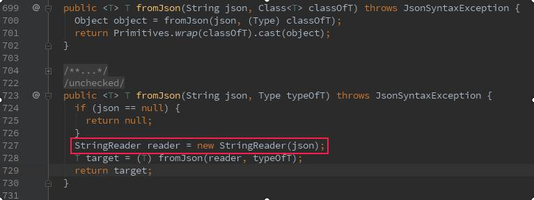
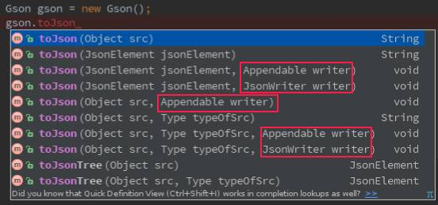
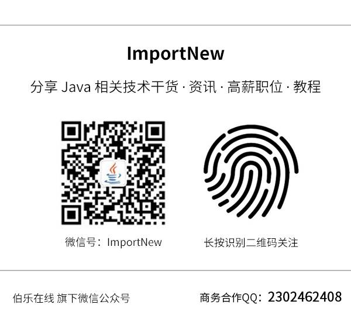

（点击上方公众号，可快速关注）

> 来源：怪盗kidou，
>
> www.jianshu.com/p/c88260adaf5e
>
> [如有好文章投稿，请点击 → 这里了解详情](http://mp.weixin.qq.com/s?__biz=MjM5NzMyMjAwMA==&mid=2651477193&idx=3&sn=db1c998f961b9d780c7d138f1dfc0ba4&scene=21#wechat_redirect)

注：此系列基于Gson 2.4。

上一篇文章《 [Gson使用指南（1）](http://mp.weixin.qq.com/s?__biz=MjM5NzMyMjAwMA==&mid=2651478304&idx=2&sn=a112112e3426221cedc11b920f80d88f&chksm=bd25355f8a52bc4989aedbe5f399eb022a8a25424080e82cc061f0dd4b1e3dd6a3daae570e9f&scene=21#wechat_redirect)》我们了解了Gson的基础用法，这次我们继续深入了解Gson的使用方法。

本次的主要内容：

- Gson的流式反序列化
- Gson的流式序列化
- 使用GsonBuilder导出null值、格式化输出、日期时间及其它小功能

## **一、Gson的流式反序列化**

### **自动方式**

Gson提供了fromJson()和toJson() 两个直接用于解析和生成的方法，前者实现反序列化，后者实现了序列化。同时每个方法都提供了重载方法，我常用的总共有5个。

这是我在上一篇文章开头说的，但我到最后也一直没有是哪5个，这次我给列出来之后，你就知道这次讲的是哪个了。

> Gson.toJson(Object);
>
> Gson.fromJson(Reader,Class);
>
> Gson.fromJson(String,Class);
>
> Gson.fromJson(Reader,Type);
>
> Gson.fromJson(String,Type);

好了，本节结束！

看第2、4行,Reader懂了吧

### **手动方式**

手动的方式就是使用stream包下的JsonReader类来手动实现反序列化，和Android中使用pull解析XML是比较类似的。

> String json = "{\"name\":\"怪盗kidou\",\"age\":\"24\"}";
>
> User user = new User();
>
> JsonReader reader = new JsonReader(new StringReader(json));
>
> reader.beginObject(); // throws IOException
>
> while (reader.hasNext()) {
>
> ​    String s = reader.nextName();
>
> ​    switch (s) {
>
> ​        case "name":
>
> ​            user.name = reader.nextString();
>
> ​            break;
>
> ​        case "age":
>
> ​            user.age = reader.nextInt(); //自动转换
>
> ​            break;
>
> ​        case "email":
>
> ​            user.email = reader.nextString();
>
> ​            break;
>
> ​    }
>
> }
>
> reader.endObject(); // throws IOException
>
> System.out.println(user.name);  // 怪盗kidou
>
> System.out.println(user.age);   // 24
>
> System.out.println(user.email); // ikidou@example.com

其实自动方式最终都是通过JsonReader来实现的，如果第一个参数是String类型，那么Gson会创建一个StringReader转换成流操作。

Gson流式解析

## **二、Gson的流式序列化**

### **自动方式**

Gson.toJson方法列表

所以啊，学会利用IDE的自动完成是多么重要这下知道了吧！

可以看出用红框选中的部分就是我们要找的东西。

提示：PrintStream(System.out) 、StringBuilder、StringBuffer和*Writer都实现了Appendable接口。

> Gson gson = new Gson();
>
> User user = new User("怪盗kidou",24,"ikidou@example.com");
>
> gson.toJson(user,System.out); // 写到控制台

### **手动方式**

> JsonWriter writer = new JsonWriter(new OutputStreamWriter(System.out));
>
> writer.beginObject() // throws IOException
>
> ​        .name("name").value("怪盗kidou")
>
> ​        .name("age").value(24)
>
> ​        .name("email").nullValue() //演示null
>
> ​        .endObject(); // throws IOException
>
> writer.flush(); // throws IOException
>
> //{"name":"怪盗kidou","age":24,"email":null}

提示：除了beginObject、endObject还有beginArray和endArray，两者可以相互嵌套，注意配对即可。beginArray后不可以调用name方法，同样beginObject后在调用value之前必须要调用name方法。

## **三、 使用GsonBuilder导出null值、格式化输出、日期时间**

一般情况下Gson类提供的 API已经能满足大部分的使用场景，但我们需要更多更特殊、更强大的功能时，这时候就引入一个新的类 GsonBuilder。

GsonBuilder从名上也能知道是用于构建Gson实例的一个类，要想改变Gson默认的设置必须使用该类配置Gson。

GsonBuilder用法

> Gson gson = new GsonBuilder()
>
> ​               //各种配置
>
> ​               .create(); //生成配置好的Gson

Gson在默认情况下是不动导出值null的键的，如：

> public class User {
>
> ​    //省略其它
>
> ​    public String name;
>
> ​    public int age;
>
> ​    public String email;
>
> }

> Gson gson = new Gson();
>
> User user = new User("怪盗kidou",24);
>
> System.out.println(gson.toJson(user)); //{"name":"怪盗kidou","age":24}

可以看出，email字段是没有在json中出现的，当我们在调试是、需要导出完整的json串时或API接中要求没有值必须用Null时，就会比较有用。

使用方法：

> Gson gson = new GsonBuilder()
>
> ​        .serializeNulls()
>
> ​        .create();
>
> User user = new User("怪盗kidou", 24);
>
> System.out.println(gson.toJson(user)); //{"name":"怪盗kidou","age":24,"email":null}

格式化输出、日期时间及其它：

这些都比较简单就不一一分开写了。

> Gson gson = new GsonBuilder()
>
> ​        //序列化null
>
> ​        .serializeNulls()
>
> ​        // 设置日期时间格式，另有2个重载方法
>
> ​        // 在序列化和反序化时均生效
>
> ​        .setDateFormat("yyyy-MM-dd")
>
> ​        // 禁此序列化内部类
>
> ​        .disableInnerClassSerialization()
>
> ​        //生成不可执行的Json（多了 )]}' 这4个字符）
>
> ​        .generateNonExecutableJson()
>
> ​        //禁止转义html标签
>
> ​        .disableHtmlEscaping()
>
> ​        //格式化输出
>
> ​        .setPrettyPrinting()
>
> ​        .create();

注意：内部类(Inner Class)和嵌套类(Nested Class)的区别

这次文章就到这里，欢迎提问互动，如有不对的地方请指正。

## **下篇文章内容提要**

- 字段过滤的几种方法

- 基于@Expose注解
- 基于访问修饰符
- 基于版本
- 自定义规则

- POJO与JSON的字段映射规则

**本系列：**

- [Gson使用指南（1）](http://mp.weixin.qq.com/s?__biz=MjM5NzMyMjAwMA==&mid=2651478304&idx=2&sn=a112112e3426221cedc11b920f80d88f&chksm=bd25355f8a52bc4989aedbe5f399eb022a8a25424080e82cc061f0dd4b1e3dd6a3daae570e9f&scene=21#wechat_redirect)
- Gson使用指南（2）

看完本文有收获？请转发分享给更多人

**关注「ImportNew」，看技术干货**

