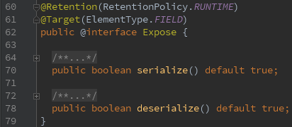
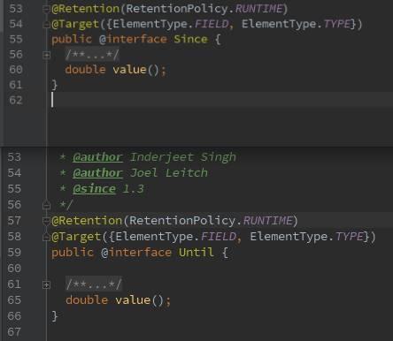
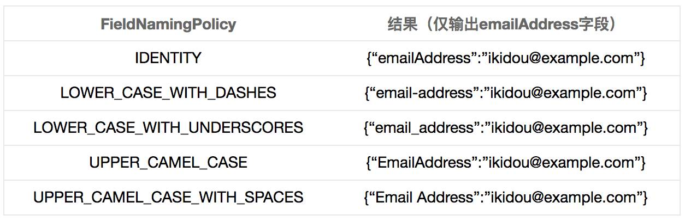
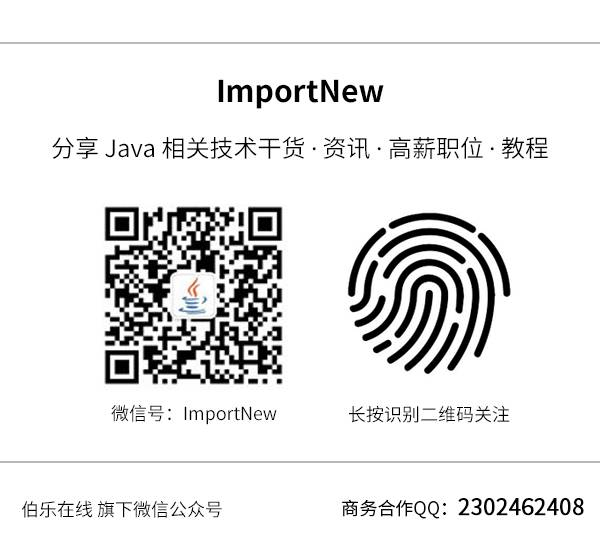

（点击上方公众号，可快速关注）

> 来源：怪盗kidou，
>
> www.jianshu.com/p/0e40a52c0063
>
> [如有好文章投稿，请点击 → 这里了解详情](http://mp.weixin.qq.com/s?__biz=MjM5NzMyMjAwMA==&mid=2651477193&idx=3&sn=db1c998f961b9d780c7d138f1dfc0ba4&scene=21#wechat_redirect)

**注：此系列基于Gson 2.4。**

本次的主要内容：

- 字段过滤的几种方法

- 基于@Expose注解
- 基于版本
- 基于访问修饰符
- 基于策略（作者最常用）

- POJO与JSON的字段映射规则

## **一、字段过滤的几种方法**

字段过滤Gson中比较常用的技巧，特别是在Android中，在处理业务逻辑时可能需要在设置的POJO中加入一些字段，但显然在序列化的过程中是不需要的，并且如果序列化还可能带来一个问题就是 循环引用 ，那么在用Gson序列化之前为不防止这样的事件情发生，你不得不作另外的处理。

以一个商品分类Category 为例。

> {
>
>   "id": 1,
>
>   "name": "电脑",
>
>   "children": [
>
> ​    {
>
> ​      "id": 100,
>
> ​      "name": "笔记本"
>
> ​    },
>
> ​    {
>
> ​      "id": 101,
>
> ​      "name": "台式机"
>
> ​    }
>
>   ]
>
> }

一个大分类，可以有很多小分类，那么显然我们在设计Category类时Category本身既可以是大分类，也可以是小分类。

> public class Category {
>
> ​    public int id;
>
> ​    public String name;
>
> ​    public List<Category> children;
>
> }

但是为了处理业务，我们还需要在子分类中保存父分类，最终会变成下面的情况

> public class Category {
>
> ​    public int id;
>
> ​    public String name;
>
> ​    public List<Category> children;
>
> ​    //因业务需要增加，但并不需要序列化
>
> ​    public Category parent; 
>
> }

但是上面的parent字段是因业务需要增加的，那么在序列化是并不需要，所以在序列化时就必须将其排除，那么在Gson中如何排除符合条件的字段呢?下面提供4种方法，大家可根据需要自行选择合适的方式。

### **基于@Expose注解**

@Expose提供了两个属性，且都有默认值，开发者可以根据需要设置不同的值。

@Expose 注解从名字上就可以看出是暴露的意思，所以该注解是用于对处暴露字段的。可是我们以前用Gson的时候也没有@Expose 注解还是不正确的序列化为JSON了么?是的，所以该注解在使用new Gson() 时是不会发生作用。毕竟最常用的API要最简单，所以该注解必须和GsonBuilder配合使用。

使用方法： 简单说来就是需要导出的字段上加上@Expose 注解，不导出的字段不加。注意是不导出的不加。

> @Expose //
>
> @Expose(deserialize = true,serialize = true) //序列化和反序列化都都生效
>
> @Expose(deserialize = true,serialize = false) //反序列化时生效
>
> @Expose(deserialize = false,serialize = true) //序列化时生效
>
> @Expose(deserialize = false,serialize = false) // 和不写一样

注：根据上面的图片可以得出，所有值为true的属性都是可以不写的。

拿上面的例子来说就是

> public class Category {
>
> ​    @Expose public int id;
>
> ​    @Expose public String name;
>
> ​    @Expose public List<Category> children;
>
> ​    //不需要序列化,所以不加 @Expose 注解，
>
> ​    //等价于 @Expose(deserialize = false,serialize = false)
>
> ​    public Category parent; 
>
> }

在使用Gson时也不能只是简单的new Gson()了。

> Gson gson = new GsonBuilder()
>
> ​        .excludeFieldsWithoutExposeAnnotation()
>
> ​        .create();
>
> gson.toJson(category);

### **基于版本**

Gson在对基于版本的字段导出提供了两个注解 @Since 和 @Until,和GsonBuilder.setVersion(Double)配合使用。@Since 和 @Until都接收一个Double值。

使用方法：当前版本(GsonBuilder中设置的版本) 大于等于Since的值时该字段导出，小于Until的值时该该字段导出。

> class SinceUntilSample {
>
> ​    @Since(4)
>
> ​    public String since;
>
> ​    @Until(5)
>
> ​    public String until;
>
> }
>
>  
>
> public void sineUtilTest(double version){
>
> ​        SinceUntilSample sinceUntilSample = new SinceUntilSample();
>
> ​        sinceUntilSample.since = "since";
>
> ​        sinceUntilSample.until = "until";
>
> ​        Gson gson = new GsonBuilder().setVersion(version).create();
>
> ​        System.out.println(gson.toJson(sinceUntilSample));
>
> }
>
> //当version <4时，结果：{"until":"until"}
>
> //当version >=4 && version <5时，结果：{"since":"since","until":"until"}
>
> //当version >=5时，结果：{"since":"since"}

注：当一个字段被同时注解时，需两者同时满足条件。

### **基于访问修饰符**

什么是修饰符? public、static 、final、private、protected 这些就是，所以这种方式也是比较特殊的。

使用方式：

> class ModifierSample {
>
> ​    final String finalField = "final";
>
> ​    static String staticField = "static";
>
> ​    public String publicField = "public";
>
> ​    protected String protectedField = "protected";
>
> ​    String defaultField = "default";
>
> ​    private String privateField = "private";
>
> }

使用GsonBuilder.excludeFieldsWithModifiers构建gson,支持int形的可变参数，值由java.lang.reflect.Modifier提供，下面的程序排除了privateField 、 finalField 和staticField 三个字段。

> ModifierSample modifierSample = new ModifierSample();
>
> Gson gson = new GsonBuilder()
>
> ​        .excludeFieldsWithModifiers(Modifier.FINAL, Modifier.STATIC, Modifier.PRIVATE)
>
> ​        .create();
>
> System.out.println(gson.toJson(modifierSample));
>
> // 结果：{"publicField":"public","protectedField":"protected","defaultField":"default"}

到此为止，Gson提供的所有注解就还有一个@JsonAdapter没有介绍了，而@JsonAdapter将和TypeAdapter将作为该系列第4篇也是最后一篇文章的主要内容。

### **基于策略（自定义规则）**

上面介绍的了3种排除字段的方法，说实话我除了@Expose以外，其它的都是只在Demo用上过，用得最多的就是马上要介绍的自定义规则，好处是功能强大、灵活，缺点是相比其它3种方法稍麻烦一点，但也仅仅只是想对其它3种稍麻烦一点而已。

基于策略是利用Gson提供的ExclusionStrategy接口，同样需要使用GsonBuilder,相关API 2个，分别是addSerializationExclusionStrategy 和addDeserializationExclusionStrategy分别针对序列化和反序化时。这里以序列化为例。

例如：

> Gson gson = new GsonBuilder()
>
> ​        .addSerializationExclusionStrategy(new ExclusionStrategy() {
>
> ​            @Override
>
> ​            public boolean shouldSkipField(FieldAttributes f) {
>
> ​                // 这里作判断，决定要不要排除该字段,return true为排除
>
> ​                if ("finalField".equals(f.getName())) return true; //按字段名排除
>
> ​                Expose expose = f.getAnnotation(Expose.class); 
>
> ​                if (expose != null && expose.deserialize() == false) return true; //按注解排除
>
> ​                return false;
>
> ​            }
>
> ​            @Override
>
> ​            public boolean shouldSkipClass(Class<?> clazz) {
>
> ​                // 直接排除某个类 ，return true为排除
>
> ​                return (clazz == int.class || clazz == Integer.class);
>
> ​            }
>
> ​        })
>
> ​        .create();

有没有很强大?

## **二、 POJO与JSON的字段映射规则**

之前在《 [Gson使用指南（2）](http://mp.weixin.qq.com/s?__biz=MjM5NzMyMjAwMA==&mid=2651478307&idx=3&sn=05fcd92ab35f0e9a07a6311cb7eae9c4&chksm=bd25355c8a52bc4a19189a5cf0e0a9c9a69e835d7d9eb643e2e30b703089e0d6e56a4d576940&scene=21#wechat_redirect)》 属性重命名时 介绍了@SerializedName这个注解的使用，本节的内容与上一次差不多的，但既然叫映射规则那么说的自然是有规律的情况。

还是之前User的例子，已经去除所有注解：

> User user = new User("怪盗kidou", 24);
>
> user.emailAddress = "ikidou@example.com";

GsonBuilder提供了FieldNamingStrategy接口和setFieldNamingPolicy和setFieldNamingStrategy 两个方法。

### **默认实现**

GsonBuilder.setFieldNamingPolicy 方法与Gson提供的另一个枚举类FieldNamingPolicy配合使用，该枚举类提供了5种实现方式分别为：

### **自定义实现**

GsonBuilder.setFieldNamingStrategy 方法需要与Gson提供的FieldNamingStrategy接口配合使用，用于实现将POJO的字段与JSON的字段相对应。上面的FieldNamingPolicy实际上也实现了FieldNamingStrategy接口，也就是说FieldNamingPolicy也可以使用setFieldNamingStrategy方法。

用法：

> Gson gson = new GsonBuilder()
>
> ​        .setFieldNamingStrategy(new FieldNamingStrategy() {
>
> ​            @Override
>
> ​            public String translateName(Field f) {
>
> ​                //实现自己的规则
>
> ​                return null;
>
> ​            }
>
> ​        })
>
> ​        .create();

注意： @SerializedName注解拥有最高优先级，在加有@SerializedName注解的字段上FieldNamingStrategy不生效！

**本系列：**

- [Gson使用指南（1）](http://mp.weixin.qq.com/s?__biz=MjM5NzMyMjAwMA==&mid=2651478304&idx=2&sn=a112112e3426221cedc11b920f80d88f&chksm=bd25355f8a52bc4989aedbe5f399eb022a8a25424080e82cc061f0dd4b1e3dd6a3daae570e9f&scene=21#wechat_redirect)
- [Gson使用指南（2）](http://mp.weixin.qq.com/s?__biz=MjM5NzMyMjAwMA==&mid=2651478307&idx=3&sn=05fcd92ab35f0e9a07a6311cb7eae9c4&chksm=bd25355c8a52bc4a19189a5cf0e0a9c9a69e835d7d9eb643e2e30b703089e0d6e56a4d576940&scene=21#wechat_redirect)
- Gson使用指南（3）

看完本文有收获？请转发分享给更多人

**关注「ImportNew」，看技术干货**

