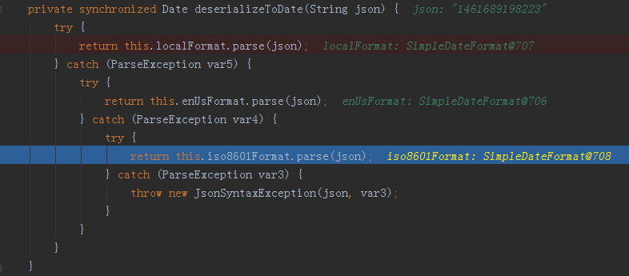

用Gson解析时遇到这个问题

```
com.google.gson.JsonSyntaxException: 1461689198000
04-27 00:46:51.159 17190-20868/link.ebbinghaus.planning W/System.err:     at com.google.gson.internal.bind.DateTypeAdapter.deserializeToDate(DateTypeAdapter.java:74)
04-27 00:46:51.159 17190-20868/link.ebbinghaus.planning W/System.err:     at com.google.gson.internal.bind.DateTypeAdapter.read(DateTypeAdapter.java:59)
04-27 00:46:51.159 17190-20868/link.ebbinghaus.planning W/System.err:     at com.google.gson.internal.bind.DateTypeAdapter.read(DateTypeAdapter.java:41)
04-27 00:46:51.159 17190-20868/link.ebbinghaus.planning W/System.err:     at com.google.gson.internal.bind.ReflectiveTypeAdapterFactory$1.read(ReflectiveTypeAdapterFactory.java:116)
04-27 00:46:51.160 17190-20868/link.ebbinghaus.planning W/System.err:     at com.google.gson.internal.bind.ReflectiveTypeAdapterFactory$Adapter.read(ReflectiveTypeAdapterFactory.java:216)
04-27 00:46:51.160 17190-20868/link.ebbinghaus.planning W/System.err:     at com.google.gson.internal.bind.ReflectiveTypeAdapterFactory$1.read(ReflectiveTypeAdapterFactory.java:116)
04-27 00:46:51.160 17190-20868/link.ebbinghaus.planning W/System.err:     at com.google.gson.internal.bind.ReflectiveTypeAdapterFactory$Adapter.read(ReflectiveTypeAdapterFactory.java:216)
04-27 00:46:51.160 17190-20868/link.ebbinghaus.planning W/System.err:     at com.google.gson.Gson.fromJson(Gson.java:879)
04-27 00:46:51.160 17190-20868/link.ebbinghaus.planning W/System.err:     at com.google.gson.Gson.fromJson(Gson.java:844)
04-27 00:46:51.160 17190-20868/link.ebbinghaus.planning W/System.err:     at com.google.gson.Gson.fromJson(Gson.java:793)
04-27 00:46:51.160 17190-20868/link.ebbinghaus.planning W/System.err:     at com.yurikami.lib.net.parser.impl.ModelParser.parse(ModelParser.java:48)
04-27 00:46:51.160 17190-20868/link.ebbinghaus.planning W/System.err:     at com.yurikami.lib.net.UICallBack.onResponse(UICallBack.java:54)
04-27 00:46:51.160 17190-20868/link.ebbinghaus.planning W/System.err:     at okhttp3.RealCall$AsyncCall.execute(RealCall.java:133)
04-27 00:46:51.160 17190-20868/link.ebbinghaus.planning W/System.err:     at okhttp3.internal.NamedRunnable.run(NamedRunnable.java:32)
04-27 00:46:51.160 17190-20868/link.ebbinghaus.planning W/System.err:     at java.util.concurrent.ThreadPoolExecutor.runWorker(ThreadPoolExecutor.java:1113)
04-27 00:46:51.160 17190-20868/link.ebbinghaus.planning W/System.err:     at java.util.concurrent.ThreadPoolExecutor$Worker.run(ThreadPoolExecutor.java:588)
04-27 00:46:51.160 17190-20868/link.ebbinghaus.planning W/System.err:     at java.lang.Thread.run(Thread.java:818)
04-27 00:46:51.160 17190-20868/link.ebbinghaus.planning W/System.err: Caused by: java.text.ParseException: Failed to parse date ["1461689198000']: Invalid time zone indicator '9' (at offset 0)
04-27 00:46:51.160 17190-20868/link.ebbinghaus.planning W/System.err:     at com.google.gson.internal.bind.util.ISO8601Utils.parse(ISO8601Utils.java:274)
04-27 00:46:51.160 17190-20868/link.ebbinghaus.planning W/System.err:     at com.google.gson.internal.bind.DateTypeAdapter.deserializeToDate(DateTypeAdapter.java:72)
04-27 00:46:51.166 17190-20868/link.ebbinghaus.planning W/System.err:     ... 16 more
04-27 00:46:51.166 17190-20868/link.ebbinghaus.planning W/System.err: Caused by: java.lang.IndexOutOfBoundsException: Invalid time zone indicator '9'
04-27 00:46:51.166 17190-20868/link.ebbinghaus.planning W/System.err:     at com.google.gson.internal.bind.util.ISO8601Utils.parse(ISO8601Utils.java:245)
04-27 00:46:51.166 17190-20868/link.ebbinghaus.planning W/System.err:     ... 17 more
```


## 3个回答

答案对人有帮助，有参考价值0答案没帮助，是错误的答案，答非所问

已采纳

```
     GsonBuilder builder = new GsonBuilder();

        // Register an adapter to manage the date types as long values
        builder.registerTypeAdapter(Date.class, new JsonDeserializer<Date>() {
            public Date deserialize(JsonElement json, Type typeOfT, JsonDeserializationContext context) throws JsonParseException {
                return new Date(json.getAsJsonPrimitive().getAsLong());
            }
        });

        Gson gson = builder.create();
```

从这地方来~
<http://stackoverflow.com/questions/5671373/unparseable-date-1302828677828-trying-to-deserialize-with-gson-a-millisecond>

gson 反序列成Date.class的做的操作




答案对人有帮助，有参考价值0答案没帮助，是错误的答案，答非所问

gson默认可能无法识别这种格式，可能需要你写个转换适配器才行

- [2016年04月27日回答](https://segmentfault.com/q/1010000005014254/a-1020000005014293)
- [评论]()
- [编辑]()

463 声望
来源： <https://segmentfault.com/q/1010000005014254>