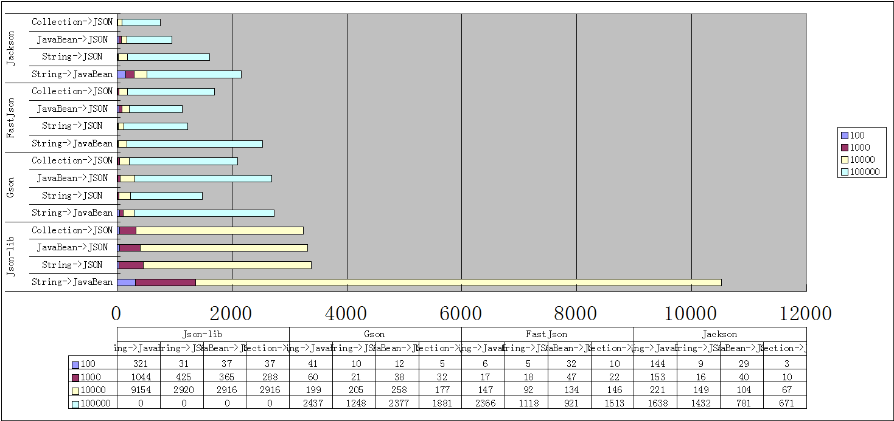

JSON不管是在Web开发还是服务器开发中是相当常见的数据传输格式，一般情况我们对于JSON解析构造的性能并不需要过于关心，除非是在性能要求比较高的系统。 
目前对于[Java](http://lib.csdn.net/base/javase)开源的JSON类库有很多种，下面我们取三个常用的JSON库进行性能[测试](http://lib.csdn.net/base/softwaretest)对比，同时根据测试结果分析如果根据实际应用场景选择最合适的JSON库。 
四个JSON类库分别为：Gson，FastJson，Jackson，Json-lib。 
简单介绍下四个类库的身份背景。

- Gson（项目地址：<https://github.com/google/gson>）。Gson是目前功能最全的Json解析神器，Gson当初是为因应Google公司内部需求而由Google自行研发而来，但自从在2008年五月公开发布第一版后已被许多公司或用户应用。Gson的应用主要为toJson与fromJson两个转换函数，无依赖，不需要例外额外的jar，能够直接跑在JDK上。而在使用这种对象转换之前需先创建好对象的类型以及其成员才能成功的将JSON字符串成功转换成相对应的对象。类里面只要有get和set方法，Gson完全可以将复杂类型的json到bean或bean到json的转换，是JSON解析的神器。
- FastJson（项目地址：<https://github.com/alibaba/fastjson>）。Fastjson是一个Java语言编写的高性能的JSON处理器,由阿里巴巴公司开发。无依赖，不需要例外额外的jar，能够直接跑在JDK上。FastJson在复杂类型的Bean转换Json上会出现一些问题，可能会出现引用的类型，导致Json转换出错，需要制定引用。FastJson采用独创的算法，将parse的速度提升到极致，超过所有json库。
- Jackson（项目地址：<https://github.com/FasterXML/jackson>）。相比json-lib框架，Jackson所依赖的jar包较少，简单易用并且性能也要相对高些。而且Jackson社区相对比较活跃，更新速度也比较快。Jackson对于复杂类型的json转换bean会出现问题，一些集合Map，List的转换出现问题。Jackson对于复杂类型的bean转换Json，转换的json格式不是标准的Json格式。
- Json-lib（项目地址：<http://json-lib.sourceforge.net/index.html>）。json-lib最开始的也是应用最广泛的json解析工具，json-lib 不好的地方确实是依赖于很多第三方包，包括commons-beanutils.jar，commons-collections-3.2.jar，commons-lang-2.6.jar，commons-logging-1.1.1.jar，ezmorph-1.0.6.jar，对于复杂类型的转换，json-lib对于json转换成bean还有缺陷，比如一个类里面会出现另一个类的list或者map集合，json-lib从json到bean的转换就会出现问题。json-lib在功能和性能上面都不能满足现在互联网化的需求。

选择一个合适的JSON库要从多个方面进行考虑：

1. 字符串解析成JSON性能
2. 字符串解析成JavaBean性能
3. JavaBean构造JSON性能
4. 集合构造JSON性能
5. 易用性

对于前四条其实都是从JSON的解析构造性能角度考虑，而最后一条则是考虑易用性，这点对于开发者来说其实也是需要考虑的一个问题，如果该库的API使用难度大，或者很复杂，那么不建议使用，毕竟JSON解析的性能差异并不大。下面的测试结果针对四个不同数量级的JSON字符串，以及分别测试上面提到的前四条性能，结果如下： 

Json-lib在数据量在10W时OOM了，内存开到1G都不行，所以直接Pass了。 
从上面图表可以看到：

1. 字符串解析成JavaBean：当数据量较少时首选FastJson，数据量较大使用Jackson。但是Jackson无法堆一个对象集合进行解析，只能转成一个Map集合，这点Gson和FastJson处理的比较好。
2. 字符串解析成JSON：当数据量较少时首选FastJson，数据量较大使用Jackson。
3. JavaBean构造JSON：当数据量较少时选择Gson，数据量较大可使用Jackson。
4. 集合构造JSON：首先Jackson，其次Fastjson。

上面是从性能角度分析四种JSON类库，从易用性角度来分析的话，FastJson的API设计的最简单，最方便使用，直接使用JSON的两个静态方法即可完成四种操作；而Gson和Jackson都需要new一个对象，虽然这个对象可以复用，但是在实际使用过程中还需要用一个全局变量来保存改变量，同时API设计的也不是很好理解，对于FastJson来说复杂的API是因为他支持流式解析，适合对JSON进行大量且复杂的操作，但是实际应用中对于JSON的操作都是简单的解析成JavaBean，然后JavaBean序列化成JSON字符串即可，复杂的操作很少。 
下面从我自己实际的应用场景出发，考虑该如何选择合适的JSON类库。 
应用场景：游戏服务器，基本是对客户端发送过来的JSON格式字符串解析成JavaBean，然后将封装好的指令转成JSON字符串返回给客户端，这里考虑到JavaBean转成JSON与集合转成JSON的性能差异，所以直接使用集合进行转成JSON，避免使用JavaBean。 
考虑上述场景适合使用FastJson进行JSON字符串解析，Jackson将集合转成JSON格式字符串。 
浅尝辄止，欢迎批评指出。

来源： <http://blog.csdn.net/vickyway/article/details/48157819>