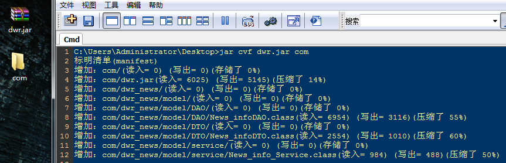
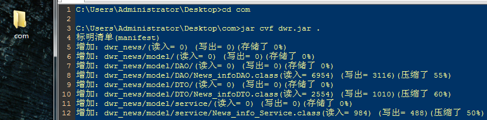

CMD下将JAVA程序打包成 jar 的 公式：

```
jar {c t x u f} [v m e 0 M i] [-C 目录] 文件名……
```


解释：


c ：创建一个 jar 包
t ：显示 jar 包里面的内容
x ：解压 jar 包
u ：添加文件到 jar包
f ：指定 jar 包的文件名
v ：在 CMD 显示详细执行过程(报告)
m ：指定 manufest.mf 文件（该文件可以对jar包及其内容做设置）
0 ：打包 jar包 时不压缩
M ：不产生 manufest.mf 文件，覆盖 m 参数的设置
i ：为打包的 jar包 创建索引文件
c ：进入某目录后再执行 jar 命令，相当于 cd 进入目录然后不带 c 参数执行 jar命令

示例（ v 参数很实用：显示过程）：

1、创建 jar 包
jar cf HelloWord.jar Hello.java
2、创建 jar 包（显示过程： v 参数）
jar cvf HelloWord.jar Hello.java
3、列出 jar 包的内容
jar tvf HelloWord.jar
4、解压 jar 包 [windows平台上的解压软件(WinRAR)也行]
jar xf HelloWord.jar
4、解压 jar 包 [windows平台上的解压软件(WinRAR)也行;显示过程]
jar xvf HelloWord.jar
5、添加文件到 jar 包
jar uf HelloWord.jar Hello123.java

打包一个目录（包括目录结构）：

目录结构：Desktop\com\dwr_news\……

在 Desktop 文件夹中运行cmd 打包命令：



打包当前目录下的所有文件（包括目录结构）：

目录结构：com\dwr_news\……

在 com 文件夹中运行cmd 打包命令：



来源： <<http://blog.csdn.net/little_stars/article/details/7710150>>

 