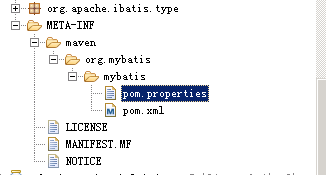
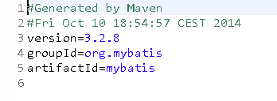
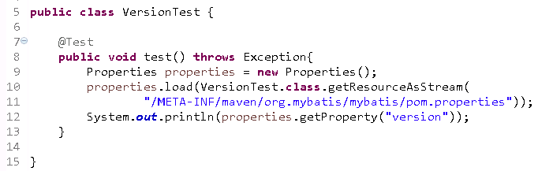

## 获取Jar包版本的简单方法

## **针对Maven管理的Jar包**

在Maven打包的项目中，都有如下文件：



在

```
pom.properties
```

中包含了jar包的版本号信息： 



到这一步就已经出来方法了，读取这个文件的

```
version
```

即可。

以MyBatis为例：



代码示例：

```
            //获取jar项目版本号：
            Properties properties = new Properties();
            properties.load(VersionCacheRest.class.getResourceAsStream("/META-INF/maven/com.feiniu.soa.commodity/commodity_cache/pom.properties"));
            result.put("commodity_cache",properties.getProperty("version"));
```

对于不同的项目，

```
pom.properties
```

路径不一样，只能针对jar包来获取。

## **针对jar包名字包含版本号**

我们可以通过代码获取jar包的完整路径，然后通过截取字符串来得到版本号。

我们需要使用jar包中包含的其中一个类。

例如针对MyBatis：

```
[code]String jarPath = SqlSession.class.getProtectionDomain().getCodeSource().getLocation().getFile();
//得到/X:/xxxx/xx/mybatis-3.2.8.jar
```

之后在对字符串进行处理即可。

来源： <http://www.lai18.com/content/1491793.html>