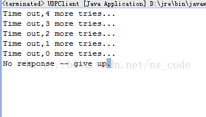
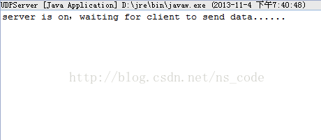
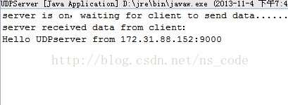
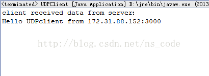

# Java UDP Socket 编程

## UDP 的 Java 支持

UDP 协议提供的服务不同于 TCP 协议的端到端服务，它是面向非连接的，属不可靠协议，UDP 套接字在使用前不需要进行连接。实际上，UDP 协议只实现了两个功能：

- 在 IP 协议的基础上添加了端口；
- 对传输过程中可能产生的数据错误进行了检测，并抛弃已经损坏的数据。

Java 通过 DatagramPacket 类和 DatagramSocket 类来使用 UDP 套接字，客户端和服务器端都通过DatagramSocket 的 send()方法和 receive()方法来发送和接收数据，用 DatagramPacket 来包装需要发送或者接收到的数据。发送信息时，Java 创建一个包含待发送信息的 DatagramPacket 实例，并将其作为参数传递给DatagramSocket实例的send()方法；接收信息时，Java 程序首先创建一个 DatagramPacket 实例，该实例预先分配了一些空间，并将接收到的信息存放在该空间中，然后把该实例作为参数传递给 DatagramSocket 实例的 receive()方法。在创建 DatagramPacket 实例时，要注意：如果该实例用来包装待接收的数据，则不指定数据来源的远程主机和端口，只需指定一个缓存数据的 byte 数组即可（在调用 receive()方法接收到数据后，源地址和端口等信息会自动包含在 DatagramPacket 实例中），而如果该实例用来包装待发送的数据，则要指定要发送到的目的主机和端口。

## UDP 的通信建立的步骤

UDP 客户端首先向被动等待联系的服务器发送一个数据报文。一个典型的 UDP 客户端要经过下面三步操作：

- 创建一个 DatagramSocket 实例，可以有选择对本地地址和端口号进行设置，如果设置了端口号，则客户端会在该端口号上监听从服务器端发送来的数据；
- 使用 DatagramSocket 实例的 send()和 receive()方法来发送和接收 DatagramPacket 实例，进行通信；
- 通信完成后，调用 DatagramSocket 实例的 close()方法来关闭该套接字。

由于 UDP 是无连接的，因此UDP服务端不需要等待客户端的请求以建立连接。另外，UDP服务器为所有通信使用同一套接字，这点与TCP服务器不同，TCP服务器则为每个成功返回的accept()方法创建一个新的套接字。一个典型的UDP服务端要经过下面三步操作：

- 创建一个 DatagramSocket 实例，指定本地端口号，并可以有选择地指定本地地址，此时，服务器已经准备好从任何客户端接收数据报文；
- 使用 DatagramSocket 实例的 receive()方法接收一个 DatagramPacket 实例，当 receive()方法返回时，数据报文就包含了客户端的地址，这样就知道了回复信息应该发送到什么地方；
- 使用 DatagramSocket 实例的 send()方法向服务器端返回 DatagramPacket 实例。

## UDP Socket Demo

/Users/jerryye/backup/studio/AvailableCode/basis/socket_tcp_ip/tcp_udp_socket_demo

这里有一点需要注意：UDP 程序在 receive()方法处阻塞，直到收到一个数据报文或等待超时。由于 UDP 协议是不可靠协议，如果数据报在传输过程中发生丢失，那么程序将会一直阻塞在 receive()方法处，这样客户端将永远都接收不到服务器端发送回来的数据，但是又没有任何提示。为了避免这个问题，我们在客户端使用 DatagramSocket 类的 setSoTimeout()方法来制定 receive()方法的最长阻塞时间，并指定重发数据报的次数，如果每次阻塞都超时，并且重发次数达到了设置的上限，则关闭客户端。

下面给出一个客户端服务端 UDP 通信的 Demo（没有用多线程），该客户端在本地 9000 端口监听接收到的数据，并将字符串"Hello UDPserver"发送到本地服务器的 3000 端口，服务端在本地 3000 端口监听接收到的数据，如果接收到数据，则返回字符串"Hello UDPclient"到该客户端的 9000 端口。在客户端，由于程序可能会一直阻塞在 receive()方法处，因此这里我们在客户端用 DatagramSocket 实例的 setSoTimeout()方法来指定 receive（）的最长阻塞时间，并设置重发数据的次数，如果最终依然没有接收到从服务端发送回来的数据，我们就关闭客户端。

客户端代码如下：

```
package zyb.org.UDP;  

import java.io.IOException;  
import java.io.InterruptedIOException;  
import java.net.DatagramPacket;  
import java.net.DatagramSocket;  
import java.net.InetAddress;  

public class UDPClient {  
    private static final int TIMEOUT = 5000;  //设置接收数据的超时时间  
    private static final int MAXNUM = 5;      //设置重发数据的最多次数  
    public static void main(String args[])throws IOException{  
        String str_send = "Hello UDPserver";  
        byte[] buf = new byte[1024];  
        //客户端在9000端口监听接收到的数据  
        DatagramSocket ds = new DatagramSocket(9000);  
        InetAddress loc = InetAddress.getLocalHost();  
        //定义用来发送数据的DatagramPacket实例  
        DatagramPacket dp_send= new DatagramPacket(str_send.getBytes(),str_send.length(),loc,3000);  
        //定义用来接收数据的DatagramPacket实例  
        DatagramPacket dp_receive = new DatagramPacket(buf, 1024);  
        //数据发向本地3000端口  
        ds.setSoTimeout(TIMEOUT);              //设置接收数据时阻塞的最长时间  
        int tries = 0;                         //重发数据的次数  
        boolean receivedResponse = false;     //是否接收到数据的标志位  
        //直到接收到数据，或者重发次数达到预定值，则退出循环  
        while(!receivedResponse && tries<MAXNUM){  
            //发送数据  
            ds.send(dp_send);  
            try{  
                //接收从服务端发送回来的数据  
                ds.receive(dp_receive);  
                //如果接收到的数据不是来自目标地址，则抛出异常  
                if(!dp_receive.getAddress().equals(loc)){  
                    throw new IOException("Received packet from an umknown source");  
                }  
                //如果接收到数据。则将receivedResponse标志位改为true，从而退出循环  
                receivedResponse = true;  
            }catch(InterruptedIOException e){  
                //如果接收数据时阻塞超时，重发并减少一次重发的次数  
                tries += 1;  
                System.out.println("Time out," + (MAXNUM - tries) + " more tries..." );  
            }  
        }  
        if(receivedResponse){  
            //如果收到数据，则打印出来  
            System.out.println("client received data from server：");  
            String str_receive = new String(dp_receive.getData(),0,dp_receive.getLength()) +   
                    " from " + dp_receive.getAddress().getHostAddress() + ":" + dp_receive.getPort();  
            System.out.println(str_receive);  
            //由于dp_receive在接收了数据之后，其内部消息长度值会变为实际接收的消息的字节数，  
            //所以这里要将dp_receive的内部消息长度重新置为1024  
            dp_receive.setLength(1024);     
        }else{  
            //如果重发MAXNUM次数据后，仍未获得服务器发送回来的数据，则打印如下信息  
            System.out.println("No response -- give up.");  
        }  
        ds.close();  
    }    
}   
```

服务端代码如下：

```
package zyb.org.UDP;  

import java.io.IOException;  
import java.net.DatagramPacket;  
import java.net.DatagramSocket;  

public class UDPServer {   
    public static void main(String[] args)throws IOException{  
        String str_send = "Hello UDPclient";  
        byte[] buf = new byte[1024];  
        //服务端在3000端口监听接收到的数据  
        DatagramSocket ds = new DatagramSocket(3000);  
        //接收从客户端发送过来的数据  
        DatagramPacket dp_receive = new DatagramPacket(buf, 1024);  
        System.out.println("server is on，waiting for client to send data......");  
        boolean f = true;  
        while(f){  
            //服务器端接收来自客户端的数据  
            ds.receive(dp_receive);  
            System.out.println("server received data from client：");  
            String str_receive = new String(dp_receive.getData(),0,dp_receive.getLength()) +   
                    " from " + dp_receive.getAddress().getHostAddress() + ":" + dp_receive.getPort();  
            System.out.println(str_receive);  
            //数据发动到客户端的3000端口  
            DatagramPacket dp_send= new DatagramPacket(str_send.getBytes(),str_send.length(),dp_receive.getAddress(),9000);  
            ds.send(dp_send);  
            //由于dp_receive在接收了数据之后，其内部消息长度值会变为实际接收的消息的字节数，  
            //所以这里要将dp_receive的内部消息长度重新置为1024  
            dp_receive.setLength(1024);  
        }  
        ds.close();  
    }  
}  
```

如果服务器端没有运行，则 receive（）会失败，此时运行结果如下图所示：



如果服务器端先运行，而客户端还没有运行，则服务端运行结果如下图所示：



此时，如果客户端运行，将向服务端发送数据，并接受从服务端发送回来的数据，此时运行结果如下图所示：





## 需要注意的地方

**UDP 套接字和 TCP 套接字的一个微小但重要的差别：UDP 协议保留了消息的边界信息。**

DatagramSocket 的每一次 receive()调用最多只能接收调用一次 send()方法所发送的数据，而且，不同的 receive()方法调用绝对不会返回同一个 send()方法所发送的额数据。

当在 TCP 套接字的输出流上调用 write()方法返回后，所有调用者都知道数据已经被复制到一个传输缓存区中，实际上此时数据可能已经被发送，也有可能还没有被传送，而 UDP 协议没有提供从网络错误中恢复的机制，因此，并不对可能需要重传的数据进行缓存。这就意味着，当send（）方法调用返回时，消息已经被发送到了底层的传输信道中。

**UDP 数据报文所能负载的最多数据，亦及一次传送的最大数据为 65507 个字节。**

当消息从网络中到达后，其所包含的数据被 TCP 的 read()方法或 UDP 的 receive()方法返回前，数据存储在一个先进先出的接收数据队列中。对于已经建立连接的 TCP 套接字来说，所有已接受但还未传送的字节都看作是一个连续的字节序列。然而，对于 UDP 套接字来说，接收到的数据可能来自不同的发送者，一个 UDP 套接字所接受的数据存放在一个消息队列中，每个消息都关联了其源地址信息，每次 receive()调用只返回一条消息。如果 receive()方法在一个缓存区大小为 n 的 DatagramPacket 实例中调用，而接受队里中的第一条消息的长度大于 n，则 receive()方法只返回这条消息的前 n 个字节，超出部分会被自动放弃，而且对接收程序没有任何消息丢失的提示！

出于这个原因，接受者应该提供一个有足够大的缓存空间的 DatagramPacket 实例，以完整地存放调用 receive()方法时应用程序协议所允许的最大长度的消息。一个 DatagramPacket 实例中所允许传输的最大数据量为 65507 个字节，也即是 UDP 数据报文所能负载的最多数据。因此，可以用一个 65600 字节左右的缓存数组来接受数据。

**DatagramPacket 的内部消息长度值在接收数据后会发生改变，变为实际接收到的数据的长度值。**

每一个 DatagramPacket 实例都包含一个内部消息长度值，其初始值为 byte 缓存数组的长度值，而该实例一旦接受到消息，这个长度值便会变为接收到的消息的实际长度值，这一点可以用 DatagramPacket 类的 getLength()方法来测试。如果一个应用程序使用同一个 DatagramPacket 实例多次调用 receive()方法，每次调用前就必须显式地将其内部消息长度重置为缓存区的实际长度，以免接受的数据发生丢失。

以上面的程序为例，若在服务端的 receiver()后加入如下代码：

```
System.out.println(dp_receive.getLength());
```

则得到的输出结果为：15，即接收到的字符串数据“Hello UDPserver”的长度。

**DatagramPacket 的 getData()方法总是返回缓冲区的原始大小，忽略了实际数据的内部偏移量和长度信息。**

由于 DatagramPacket 的 getData()方法总是返回缓冲数组的原始大小，即刚开始创建缓冲数组时指定的大小，在上面程序中，该长度为 1024，因此如果我们要获取接收到的数据，就必须截取 getData()方法返回的数组中只含接收到的数据的那一部分。 在 Java1.6 之后，我们可以使用 Arrays.copyOfRange()方法来实现，只需一步便可实现以上功能：

```
byte[] destbuf = Arrays.copyOfRange(dp_receive.getData(),dp_receive.getOffset(),
dp_receive.getOffset() + dp_receive.getLength());
```

当然，如果要将接收到的字节数组转换为字符串的话，也可以采用本程序中直接 new 一个 String 对象的方法：

```
new String(dp_receive.getData(),dp_receive.getOffset(),
dp_receive.getOffset() + dp_receive.getLength());
```


http://wiki.jikexueyuan.com/project/java-socket/udp.html