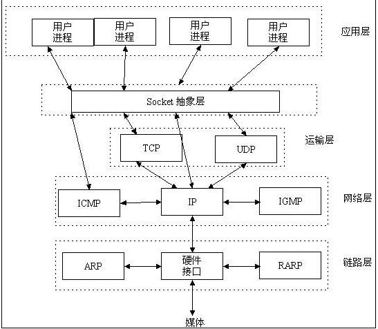
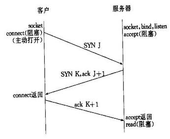

[TOC]

# 我们常说的短连接长连接和socket和http到底有什么关系

全栈步道者 2018-02-06 18:31:57

**最近有人问我长连接和短连接的问题，顺便写文一篇仅供对这几个概念还不是很清楚的朋友学习**

**在开始讲之前先来熟悉几个概念**

## **1.socket**

Socket是应用层与TCP/IP协议族通信的中间软件抽象层，它是一组接口。在设计模式中，Socket其实就是一个门面模式，它把复杂的TCP/IP协议族隐藏在Socket接口后面，对用户来说，一组简单的接口就是全部，让Socket去组织数据，以符合指定的协议.如今大多数基于网络的软件，如浏览器，即时通讯工具甚至是P2P下载都是基于Socket实现的

**Socket通信实例：**

主机 A 的应用程序要能和主机 B 的应用程序通信，必须通过 Socket 建立连接，而建立 Socket 连接必须需要底层 TCP/IP 协议来建立 TCP 连接。建立 TCP 连接需要底层 IP 协议来寻址网络中的主机。我们知道网络层使用的 IP 协议可以帮助我们根据 IP 地址来找到目标主机，但是一台主机上可能运行着多个应用程序，如何才能与指定的应用程序通信就要通过 TCP 或 UPD 的地址也就是端口号来指定。这样就可以通过一个 Socket 实例唯一代表一个主机上的一个应用程序的通信链路了。

## **2.tcp和udp**

**UDP**，也就是用户数据报协议。UDP是一种无连接的协议，这就意味着我们每次发送数据报时，需要同时发送本机的socket描述符和接收端的socket描述符。因此，我们在每次通信时都需要发送额外的数据

**TCP**，也就是传输控制协议。和UDP不同，TCP是一种基于连接的协议。在使用流通信之前，我们必须在通信的一对socket之间建立连接。其中一个socket作为服务器进行监听连接请求。另一个则作为客户端进行连接请求。一旦两个socket建立好了连接，他们可以单向或双向进行数据传输。

## **3.tcp/ip**

TCP/IP是个协议组，可分为三个层次：网络层、传输层和应用层。

在网络层有IP协议、ICMP协议、ARP协议、RARP协议和BOOTP协议。

在传输层中有TCP协议与UDP协议。

在应用层有:TCP包括FTP、HTTP、TELNET、SMTP等协议 UDP包括DNS、TFTP等协议

## **4.TCP连接的建立和关闭**

当网络通信时采用TCP协议时，在真正的读写操作之前，server与client之间必须建立一个连接，当读写操作完成后，双方不再需要这个连接时它们可以释放这个连接，连接的建立是需要三次握手的，而释放则需要4次握手，所以说每个连接的建立都是需要资源消耗和时间消耗的

经典的三次握手示意图：

## **5.短连接**

**连接->传输数据->关闭连接**

**HTTP中的短连接：**是无状态的，浏览器和服务器每进行一次HTTP操作，就建立一次连接，但任务结束就中断连接。

也可以这样说----短连接是指SOCKET连接后发送后接收完数据后马上断开连接。

HTTP的长连接和短连接本质上是TCP长连接和短连接。HTTP属于应用层协议，在传输层使用TCP协议，在网络层使用IP协议。IP协议主要解决网络路由和寻址问题，TCP协议主要解决如何在IP层之上可靠的传递数据包，使在网络上的另一端收到发端发出的所有包，并且顺序与发出顺序一致。

HTTP/1.1起，默认使用长连接，用以保持连接特性。使用长连接的HTTP协议，会在响应头有加入这行代码：

> Connection:keep-alive

HTTP长连接的过期时间

上图中的Keep-Alive: timeout=20，表示这个TCP通道可以保持20秒。另外还可能有max=XXX，表示这个长连接最多接收XXX次请求就断开。对于客户端来说，如果服务器没有告诉客户端超时时间也没关系，服务端可能主动发起四次握手断开TCP连接，客户端能够知道该TCP连接已经无效；另外TCP还有心跳包来检测当前连接是否还活着，方法很多，避免浪费资源。

**tcp中的短连接：**我们模拟一下**TCP**短连接的情况，client向server发起连接请求，server接到请求，然后双方建立连接。client向server发送消息，server回应client，然后一次读写就完成了，这时候双方任何一个都可以发起close操作，不过一般都是client先发起close操作。为什么呢，一般的server不会回复完client后立即关闭连接的，当然不排除有特殊的情况。从上面的描述看，短连接一般只会在client/server间传递一次读写操作

**短连接的优点是**：管理起来比较简单，存在的连接都是有用的连接，不需要额外的控制手段

## **6.长连接**

连接->传输数据->保持连接 -> 传输数据-> 传输中 ->关闭连接。

长连接指建立SOCKET连接后不管是否使用都保持连接，但安全性较差。

**http中的长连接：**HTTP也可以建立长连接的，使用Connection:keep-alive，HTTP 1.1默认进行持久连接。HTTP1.1和HTTP1.0相比较而言，最大的区别就是增加了持久连接支持(貌似最新的 http1.0 可以显示的指定 keep-alive),但还是无状态的，或者说是不可以信任的。

**tcp中的长连接：**接下来我们再模拟一下长连接的情况，client向server发起连接，server接受client连接，双方建立连接。Client与server完成一次读写之后，它们之间的连接并不会主动关闭，后续的读写操作会继续使用这个连接。

首先说一下TCP/IP中的TCP保活功能，保活功能主要为服务器应用提供服务，服务器应用希望知道客户主机是否崩溃，从而可以代表客户使用资源。如果客户已经消失，使得服务器上保留一个半开放的连接，而服务器又在等待来自客户端的数据，则服务器将应远等待客户端的数据，保活功能就是试图在服务器端检测到这种半开放的连接。

如果一个给定的连接在两小时内没有任何的动作，则服务器就向客户发一个探测报文段，客户主机必须处于以下4个状态之一：

1. 客户主机依然正常运行，并从服务器可达。客户的TCP响应正常，而服务器也知道对方是正常的，服务器在两小时后将保活定时器复位。
2. 客户主机已经崩溃，并且关闭或者正在重新启动。在任何一种情况下，客户的TCP都没有响应。服务端将不能收到对探测的响应，并在75秒后超时。服务器总共发送10个这样的探测 ，每个间隔75秒。如果服务器没有收到一个响应，它就认为客户主机已经关闭并终止连接。
3. 客户主机崩溃并已经重新启动。服务器将收到一个对其保活探测的响应，这个响应是一个复位，使得服务器终止这个连接。
4. 客户机正常运行，但是服务器不可达，这种情况与2类似，TCP能发现的就是没有收到探查的响应。

## 什么时候用长连接，短连接？

长连接多用于操作频繁，点对点的通讯，而且连接数不能太多情况，。每个TCP连接都需要三步握手，这需要时间，如果每个操作都是先连接，再操作的话那么处理速度会降低很多，所以每个操作完后都不断开，次处理时直接发送数据包就OK了，不用建立TCP连接。例如：数据库的连接用长连接， 如果用短连接频繁的通信会造成socket错误，而且频繁的socket 创建也是对资源的浪费。

而像WEB网站的http服务一般都用短链接，因为长连接对于服务端来说会耗费一定的资源，而像WEB网站这么频繁的成千上万甚至上亿客户端的连接用短连接会更省一些资源，如果用长连接，而且同时有成千上万的用户，如果每个用户都占用一个连接的话，那可想而知吧。所以并发量大，但每个用户无需频繁操作情况下需用短连好。

https://www.toutiao.com/a6519385969999741444/?tt_from=android_share&utm_campaign=client_share&timestamp=1517961673&app=news_article&iid=25004544584&utm_medium=toutiao_android