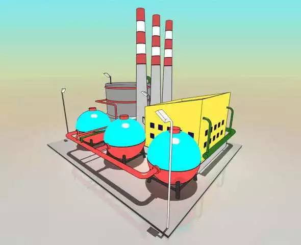
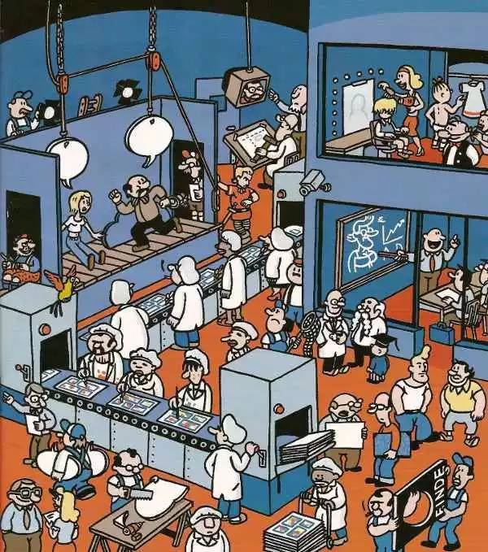
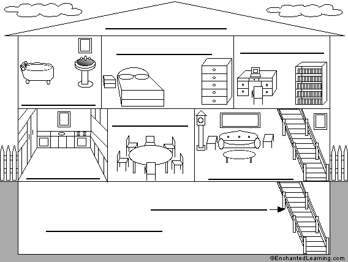

## 如何简单通俗地理解进程与线程？

*2017-04-09* *阮一峰* [程序员之家](##)

> 作者：阮一峰
>
> 原文：www.ruanyifeng.com/blog/
>
> 2013/04/processes_and_threads.html（点击文末阅读原文即可前往） 

**进程（process）**和**线程（thread）**是操作系统的基本概念，但是它们比较抽象，不容易掌握。

最近，我读到一篇材料，发现有一个很好的类比，可以把它们解释地清晰易懂。

1.

计算机的核心是CPU，它承担了所有的计算任务。它就像一座工厂，时刻在运行。

2.

假定工厂的电力有限，一次只能供给一个车间使用。也就是说，一个车间开工的时候，其他车间都必须停工。背后的含义就是，单个CPU一次只能运行一个任务。

3.

进程就好比工厂的车间，它代表CPU所能处理的单个任务。任一时刻，CPU总是运行一个进程，其他进程处于非运行状态。

4.

一个车间里，可以有很多工人。他们协同完成一个任务。

5.

线程就好比车间里的工人。一个进程可以包括多个线程。

6.

车间的空间是工人们共享的，比如许多房间是每个工人都可以进出的。这象征一个进程的内存空间是共享的，每个线程都可以使用这些共享内存。

7.

可是，每间房间的大小不同，有些房间最多只能容纳一个人，比如厕所。里面有人的时候，其他人就不能进去了。这代表一个线程使用某些共享内存时，其他线程必须等它结束，才能使用这一块内存。

8.

一个防止他人进入的简单方法，就是门口加一把锁。先到的人锁上门，后到的人看到上锁，就在门口排队，等锁打开再进去。这就叫**"互斥锁"**（Mutual exclusion，缩写 Mutex），防止多个线程同时读写某一块内存区域。

9.

还有些房间，可以同时容纳n个人，比如厨房。也就是说，如果人数大于n，多出来的人只能在外面等着。这好比某些内存区域，只能供给固定数目的线程使用。

10.

这时的解决方法，就是在门口挂n把钥匙。进去的人就取一把钥匙，出来时再把钥匙挂回原处。后到的人发现钥匙架空了，就知道必须在门口排队等着了。这种做法叫做**"信号量"（Semaphore）**，用来保证多个线程不会互相冲突。

不难看出，mutex是semaphore的一种特殊情况（n=1时）。也就是说，完全可以用后者替代前者。但是，因为mutex较为简单，且效率高，所以在必须保证资源独占的情况下，还是采用这种设计。

11.

操作系统的设计，因此可以归结为三点：

（1）以多进程形式，允许多个任务同时运行；

（2）以多线程形式，允许单个任务分成不同的部分运行；

（3）提供协调机制，一方面防止进程之间和线程之间产生冲突，另一方面允许进程之间和线程之间共享资源。

**PS**：本文适合对进程与线程不甚了解的新手，另外原文评论区也是极为精彩，可以点击文末阅读原文前往探究。

[阅读原文](##)