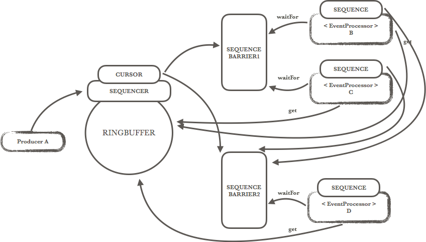

# [Disruptor深入解读](http://www.cnblogs.com/miao-rui/p/6379473.html)

将系统性能优化到极致，永远是程序爱好者所努力的一个方向。在java并发领域，也有很多的实践与创新，小到乐观锁、CAS，大到netty线程模型、纤程Quasar、kilim等。Disruptor是一个轻量的高性能并发框架，以惊人的吞吐量而受到广泛的关注。Disruptor为提高程序的并发性能，提供了很多新的思路，比如：

1. 缓存行填充，消除伪共享；
2. RingBuffer无锁队列设计；
3. 预分配缓存对象，使用缓存的循环覆盖取代缓存的新增删除等；

下文将从源码角度解析Disruptor的实现原理。

### 1 Disruptor术语

Disruptor有很多自身的概念，使得初学者看代码会比较费劲。因此在深入Disruptor原理之前，需要先了解一下Disruptor主要的几个核心类或接口。

- Sequence: 采用缓存行填充的方式对long类型的一层包装，用以代表事件的序号。通过unsafe的cas方法从而避免了锁的开销；
- Sequencer: 生产者与缓存RingBuffer之间的桥梁。单生产者与多生产者分别对应于两个实现SingleProducerSequencer与MultiProducerSequencer。Sequencer用于向RingBuffer申请空间，使用publish方法通过waitStrategy通知所有在等待可消费事件的SequenceBarrier；
- WaitStrategy: WaitStrategy有多种实现，用以表示当无可消费事件时，消费者的等待策略；
- SequenceBarrier: 消费者与缓存RingBuffer之间的桥梁。消费者并不直接访问RingBuffer，从而能减少RingBuffer上的并发冲突；
- EventProcessor: 事件处理器，是消费者线程池Executor的调度单元，是对事件处理EventHandler与异常处理ExceptionHandler等的一层封装；
- Event: 消费事件。Event的具体实现由用户定义；
- RingBuffer: 基于数组的缓存实现，也是创建sequencer与定义WaitStrategy的入口；
- Disruptor: Disruptor的使用入口。持有RingBuffer、消费者线程池Executor、消费者集合ConsumerRepository等引用。

### 2 Disruptor源码分析

#### 2.1 Disruptor并发模型

并发领域的一个典型场景是生产者消费者模型，常规方式是使用queue作为生产者线程与消费者线程之间共享数据的方法，对于queue的读写避免不了读写锁的竞争。Disruptor使用环形缓冲区RingBuffer作为共享数据的媒介。生产者通过Sequencer控制RingBuffer，以及唤醒等待事件的消费者，消费者通过SequenceBarrier监听RingBuffer的可消费事件。考虑一个场景，一个生产者A与三个消费者B、C、D,同时D的事件处理需要B与C先完成。则该模型结构如下：



在这个结构下，每个消费者拥有各自独立的事件序号Sequence，消费者之间不存在共享竞态。SequenceBarrier1监听RingBuffer的序号cursor，消费者B与C通过SequenceBarrier1等待可消费事件。SequenceBarrier2除了监听cursor，同时也监听B与C的序号Sequence，从而将最小的序号返回给消费者D，由此实现了D依赖B与C的逻辑。
RingBuffer是Disruptor高性能的一个亮点。RingBuffer就是一个大数组，事件以循环覆盖的方式写入。与[常规RingBuffer](https://en.wikipedia.org/wiki/Circular_buffer)拥有2个首尾指针的方式不同，Disruptor的RingBuffer只有一个指针(或称序号)，指向数组下一个可写入的位置，该序号在Disruptor源码中就是Sequencer中的cursor，由生产者通过Sequencer控制RingBuffer的写入。为了避免未消费事件的写入覆盖，Sequencer需要监听所有消费者的消息处理进度，也就是gatingSequences。RingBuffer通过这种方式实现了事件缓存的无锁设计。
下面将通过分析源码，来理解Disruptor的实现原理。

#### 2.2 Disruptor类

Disruptor类是Disruptor框架的总入口，能用DSL的形式组织消费者之间的关系链，并提供获取事件、发布事件等方法。它包含以下属性：

```
private final RingBuffer<T> ringBuffer;
/**消费者事件处理线程池**/
private final Executor executor;
/**消费者集合**/
private final ConsumerRepository<T> consumerRepository = new ConsumerRepository<T>();
/**Disruptor是否启动标示，只能启动一次**/
private final AtomicBoolean started = new AtomicBoolean(false);
/**消费者事件异常处理方法**/
private ExceptionHandler<? super T> exceptionHandler = new ExceptionHandlerWrapper<T>();
```

实例化Disruptor的过程，就是实例化RingBuffer与消费线程池Executor的过程。除此之外，Disruptor类最重要的作用是注册消费者，handleEventsWith方法。该方法有多套实现，而每一个消费者最终都会被包装成EventProcessor。createEventProcessors是包装消费者的重要函数。

```
EventHandlerGroup<T> createEventProcessors(final Sequence[] barrierSequences,
                                           final EventHandler<T>[] eventHandlers)
{
    checkNotStarted();
    //每个消费者有自己的事件序号Sequence
    final Sequence[] processorSequences = new Sequence[eventHandlers.length];   
    //消费者通过SequenceBarrier等待可消费事件
    final SequenceBarrier barrier = ringBuffer.newBarrier(barrierSequences);    for (int i = 0, eventHandlersLength = eventHandlers.length; i < eventHandlersLength; i++)
    {
        final EventHandler<T> eventHandler = eventHandlers[i];
        //每个消费者都以BatchEventProcessor被调度
        final BatchEventProcessor<T> batchEventProcessor = new BatchEventProcessor<T>(ringBuffer, barrier, eventHandler);  
        if (exceptionHandler != null)
        {
            batchEventProcessor.setExceptionHandler(exceptionHandler);
        }
        consumerRepository.add(batchEventProcessor, eventHandler, barrier);
        processorSequences[i] = batchEventProcessor.getSequence();
    }
    
    if (processorSequences.length > 0)
    {
        consumerRepository.unMarkEventProcessorsAsEndOfChain(barrierSequences);
    }
    
    return new EventHandlerGroup<T>(this, consumerRepository, processorSequences);
}
```

从程序中可以看出，每个消费者都以BatchEventProcessor的形式被调度，也就是说，消费者的逻辑都在BatchEventProcessor。

#### 2.3 EventProcessor

EventProcessor有两个有操作逻辑的实现类，BatchEventProcessor与WorkProcessor，处理逻辑很相近，这边仅分析BatchEventProcessor。
BatchEventProcessor的构造函数使用DataProvider，而不直接使用RingBuffer，可能是Disruptor考虑到留给用户替换RingBuffer事件存储的空间，毕竟RingBuffer是内存级的。
Disruptor启动时，会调用每个消费者ConsumerInfo(在消费者集合ConsumerRepository中)的start方法，最终会运行到BatchEventProcessor的run方法。

```
@Override
public void run()
{
    if (!running.compareAndSet(false, true))
    {
        throw new IllegalStateException("Thread is already running");
    }
    sequenceBarrier.clearAlert();
    
    notifyStart();
    
    T event = null;
    // sequence.get()标示当前已经处理的序号
    long nextSequence = sequence.get() + 1L;
    try
    {
        while (true)
        {
            try
            {
                // sequenceBarrier最重要的作用，就是让消费者等待下一个可用的序号
                // 可用序号可能会大于nextSequence，从而消费者可以一次处理多个事件
                // 如果该消费者同时也依赖了其他消费者，则会返回最小的那个
                final long availableSequence = sequenceBarrier.waitFor(nextSequence);
                if (nextSequence > availableSequence)
                {
                    Thread.yield();
                }
                
                while (nextSequence <= availableSequence)
                {
                    event = dataProvider.get(nextSequence);
                    // eventHandler是用户定义的事件消费逻辑
                    eventHandler.onEvent(event, nextSequence, nextSequence == availableSequence);
                    nextSequence++;
                }
                
                // 跟踪自己处理的事件
                sequence.set(availableSequence);
            }
            catch (final TimeoutException e)
            {
                notifyTimeout(sequence.get());
            }
            catch (final AlertException ex)
            {
                if (!running.get())
                {
                    break;
                }
            }
            catch (final Throwable ex)
            {
                exceptionHandler.handleEventException(ex, nextSequence, event);
                sequence.set(nextSequence);
                nextSequence++;
            }
        }
    }
    finally
    {
        notifyShutdown();
        running.set(false);
    }
}
```

消费者的逻辑，就是在while循环中，不断查询可消费事件，并由用户自定义的消费逻辑eventHandler进行处理。查询可消费事件的逻辑在SequenceBarrier中。

#### 2.4 SequenceBarrier

SequenceBarrier只有一个实现，ProcessingSequenceBarrier。下面是ProcessingSequenceBarrier的构造函数。

```
public ProcessingSequenceBarrier(final Sequencer sequencer,final WaitStrategy waitStrategy,final Sequence cursorSequence,final Sequence[] dependentSequences)
{
    // 生产者的ringBuffer控制器sequencer
    this.sequencer = sequencer;
    // 消费者等待可消费事件的策略
    this.waitStrategy = waitStrategy;
    // ringBuffer的cursor
    this.cursorSequence = cursorSequence;
    if (0 == dependentSequences.length)
    {
        dependentSequence = cursorSequence;
    }
    else
    {
    // 当依赖其他消费者时，dependentSequence就是其他消费者的序号
        dependentSequence = new FixedSequenceGroup(dependentSequences);
    }
}
```

消费者通过ProcessingSequenceBarrier的waitFor方法等待可消费序号，实际是调用WaitStrategy的waitFor方法。

#### 2.5 WaitStrategy

WaitStrategy有6个实现类，用于代表6种不同的等待策略，比如阻塞策略、忙等策略等。这边就仅分析一个阻塞策略BlockingWaitStrategy。

```
@Override
public long waitFor(long sequence, Sequence cursorSequence, Sequence dependentSequence, SequenceBarrier barrier)
    throws AlertException, InterruptedException
{
    long availableSequence;
    if ((availableSequence = cursorSequence.get()) < sequence)
    {
        lock.lock();
        try
        {
            // 如果ringBuffer的cursor小于需要的序号，也就是生产者没有新的事件发出，则阻塞消费者线程，直到生产者通过Sequencer的publish方法唤醒消费者。
            while ((availableSequence = cursorSequence.get()) < sequence)
            {
                barrier.checkAlert();
                processorNotifyCondition.await();
            }
        }
        finally
        {
            lock.unlock();
        }
    }
    
    // 如果生产者新发布了事件，但是依赖的其他消费者还没处理完，则等待所依赖的消费者先处理。在本文的例子中，就是等B与C先处理完，D才能处理事件。
    while ((availableSequence = dependentSequence.get()) < sequence)
    {
        barrier.checkAlert();
    }
    
    return availableSequence;
}
```

到这里，消费者的程序逻辑也就基本都清楚了。最后再看一下生产者的程序逻辑，主要是Sequencer。

#### 2.6 Sequencer

Sequencer负责生产者对RingBuffer的控制，包括查询是否有写入空间、申请空间、发布事件并唤醒消费者等。Sequencer有两个实现SingleProducerSequencer与MultiProducerSequencer，分别对应于单生产者模型与多生产者模型。只要看懂hasAvailableCapacity()，申请空间也就明白了。下面是SingleProducerSequencer的hasAvailableCapacity实现。

```
@Override
public boolean hasAvailableCapacity(final int requiredCapacity)
{
    long nextValue = pad.nextValue;
    // wrapPoint是一个临界序号，必须比当前最小的未消费序号还小
    long wrapPoint = (nextValue + requiredCapacity) - bufferSize;
    // 当前的最小未消费序号
    long cachedGatingSequence = pad.cachedValue;
    
    if (wrapPoint > cachedGatingSequence || cachedGatingSequence > nextValue)
    {
        long minSequence = Util.getMinimumSequence(gatingSequences, nextValue);
        pad.cachedValue = minSequence;
        
        if (wrapPoint > minSequence)
        {
            return false;
        }
    }
    return true;
}
```

### 3 Disruptor实例

本实例基于3.2.0版本的Disruptor，实现2.1小结描述的并发场景。使用Disruptor的过程非常简单，只需要简单的几步。
定义用户事件：

```
public class MyEvent {
    private long value;
    
    public MyEvent(){}
    
    public long getValue() {
        return value;
    }
    
    public void setValue(long value) {
        this.value = value;
    }
}
```

定义事件工厂，这是实例化Disruptor所需要的：

```
public class MyEventFactory implements EventFactory<MyEvent> {
    public MyEvent newInstance() {
        return new MyEvent();
    }
}
```

定义消费者B、C、D：

```
public class MyEventHandlerB implements EventHandler<MyEvent> {
    public void onEvent(MyEvent myEvent, long l, boolean b) throws Exception {
        System.out.println("Comsume Event B : " + myEvent.getValue());
    }
}

public class MyEventHandlerC implements EventHandler<MyEvent> {
    public void onEvent(MyEvent myEvent, long l, boolean b) throws Exception {
        System.out.println("Comsume Event C : " + myEvent.getValue());
    }
}

public class MyEventHandlerD implements EventHandler<MyEvent> {
    public void onEvent(MyEvent myEvent, long l, boolean b) throws Exception {
        System.out.println("Comsume Event D : " + myEvent.getValue());
    }
}
```

在此基础上，就可以运行Disruptor了：

```
public static void main(String[] args){
    EventFactory<MyEvent> myEventFactory = new MyEventFactory();
    Executor executor = Executors.newCachedThreadPool();
    int ringBufferSize = 32;
    
    Disruptor<MyEvent> disruptor = new Disruptor<MyEvent>(myEventFactory,ringBufferSize,executor, ProducerType.SINGLE,new BlockingWaitStrategy());
    EventHandler<MyEvent> b = new MyEventHandlerB();
    EventHandler<MyEvent> c = new MyEventHandlerC();
    EventHandler<MyEvent> d = new MyEventHandlerD();
    
    SequenceBarrier sequenceBarrier2 = disruptor.handleEventsWith(b,c).asSequenceBarrier();
    BatchEventProcessor processord = new BatchEventProcessor(disruptor.getRingBuffer(),sequenceBarrier2,d);
    disruptor.handleEventsWith(processord);
//  disruptor.after(b,c).handleEventsWith(d);              // 此行能代替上两行的程序逻辑
    RingBuffer<MyEvent> ringBuffer = disruptor.start();    // 启动Disruptor
    for(int i=0; i<10; i++) {
        long sequence = ringBuffer.next();                 // 申请位置
        try {
            MyEvent myEvent = ringBuffer.get(sequence);
            myEvent.setValue(i);                           // 放置数据
        } finally {
            ringBuffer.publish(sequence);                  // 提交，如果不提交完成事件会一直阻塞
        }
        try{
            Thread.sleep(100);
        }catch (Exception e){
        }
    }
    disruptor.shutdown();
}
```

按照程序的逻辑，B与C会率先处理ringBuffer中的事件，且处理顺序不分先后。同一事件被B与C处理完成之后，才会被D处理，结果如下：

```
Comsume Event C : 0
Comsume Event B : 0
Comsume Event D : 0
Comsume Event C : 1
Comsume Event B : 1
Comsume Event D : 1
Comsume Event C : 2
Comsume Event B : 2
Comsume Event D : 2
Comsume Event C : 3
Comsume Event B : 3
Comsume Event D : 3
Comsume Event C : 4
Comsume Event B : 4
Comsume Event D : 4
Comsume Event C : 5
Comsume Event B : 5
Comsume Event D : 5
Comsume Event C : 6
Comsume Event B : 6
Comsume Event D : 6
Comsume Event C : 7
Comsume Event B : 7
Comsume Event D : 7
Comsume Event C : 8
Comsume Event B : 8
Comsume Event D : 8
Comsume Event C : 9
Comsume Event B : 9
Comsume Event D : 9
```

将本例中的Thread.sleep去掉，即可以观察到B与C的处理不分先后，结果符合预期。


本文乃作者原创，转载请注明出处。<http://www.cnblogs.com/miao-rui/p/6379473.html>