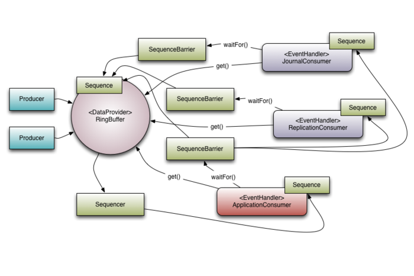

[TOC]

# LMAX Disruptor简介

2017.02.04 16:51* 字数 1675 阅读 224评论 0喜欢 8

## LMAX是什么？

要说Disruptor需要先说下LMAX,LMAX是一个英国外汇黄金交易所，它是第一家也是唯一一家采用多边交易设施Multilateral Trading Facility(MTF)，拥有交易所拍照和经纪商拍照的欧洲顶级金融公司。而LMAX所用的Disruptor技术，在一个线程每秒处理6百万订单。没错，这个Disruptor就是我们这里的
Disruptor。
而Disruptor只是LMAX平台一部分，LMAX是一个新型零售金融交易平台，它能够达到低延迟、高吞吐量(大量交易)。这个系统建立在JVM平台上，核心是一个逻辑处理器，每秒能够处理600百万订单。业务逻辑处理器完全运行在内存中(in-memory)，使用事件源驱动方式(event sourcing)。而业务逻辑处理器核心是Disruptor，这是一个并发组件，能够在无锁情况下实现网络并发查询操作。他们研究表明，现在所谓的高性能研究方向似乎和现在CPU设计是相左的。

## 什么是Disruptor


Disruptor

Disruptor实现了队列的功能，而且是一个有界的队列。所以应用场景自然就是"生产者-消费者"模型了。可以看下JDK中的BlockingQuery是一个FIFO队列，生产者(Producer)发布(Publish)一项事件(Event，消息)时，消费者(Consumer)能够获得通知；当队列中没有事件时，消费者会被阻塞，直到生产者发布了新的事件。而Disruptor不仅仅只是这些：

- 同一个事件可以有多个消费者，消费者之间可以并行处理，可以相互依赖处理
- 预分配用于存储事件的内存
- 针对极高的性能目标而实现极度优化和无锁设计

可能你对这种场景还不是很明白，简单说就是当需要两个独立的处理过程(两个线程)之间需要传递数据时，就可以使用Disruptor，当然可以使用队列。

## Disruptor中的核心概念

- Ring Buffer
  环形缓冲区，曾经是Disruptor中的核心对象，不过从3.0版本开始，只负责对通过Disruptor进行交换的数据(事件)进行存储和更新。在一些高级使用中，Ring Buffer可以由用户自定义的来代替。
- Sequence
  通过递增的序号管理进行交换的数据(事件)，对数据(事件)的处理过程总是沿着序号逐个递增处理的。一个Sequence用于跟踪标识某个特定的事件处理者(RingBuffer/Consumer)的进度。虽然可以使用AutomicLong标识进度，但定义Sequence另一个目的是防止CPU缓存伪共享(Disruptor高性能关键点之一)
- Sequencer
  Sequence是Disruptor的真正核心。这个接口有两个实现类SingleProducerSequence和MultiProducerSequence，它们定义生产者和消费者之间快速、正确地传递数据的并发算法。
- Sequence Barrier
  保持RingBuffer的main published Sequence和Consumer依赖的其它Sequence的引用。Sequence Barrier还定义决定Consumer是否还有可处理的事件逻辑。
- Event
  在Disruptor中，在生产者和消费者之间进行交换的数据称为事件(Event)。它不是Disruptor定义的类型，而是使用者自己定义并指定的(可以看作一个Bean)
- EventHandler
  Disruptor定义的事件处理接口，由用户实现，用于处理事件，是Consumer的真正实现
- EventProcessor
  EventProcessor持有特定消费者(Consumer)的Sequence，并提供用来调用事件处理实现事件循环(Event loop)
- Wait Strategy
  定义Consumer如何等待下一个事件策略。(Disruptor提供了多种策略)
- Producer
  生产者，泛指Disruptor发布事件的代码，Disruptor没有定义特定的接口或类型。



Models

## 简单Demo

### 1.定义事件

事件(Event)是Disruptor进行数据交换的数据类型 

```java
package com.practice.Disruptor.Demo;


/**
 * <B>Description:</B> 定义事件: 事件(Event)是Disruptor进行数据交换的数据类型 <br>
 * <B>Create on:</B> 2017/12/22 下午3:56 <br>
 *
 * @author xiangyu.ye
 * @version 1.0
 */
public class PeopleEvent {
    private String  name;
    private Integer age;
    private Integer sex;

    public void setName(String name) {
        this.name = name;
    }

    public String getName() {
        return name;
    }

    public void setAge(Integer age) {
        this.age = age;
    }

    public void setSex(Integer sex) {
        this.sex = sex;
    }

    public Integer getAge() {
        return age;
    }

    public Integer getSex() {
        return sex;
    }
}

```

 

### 2.定义事件工厂

事件工厂(Event Factory)用来实例化之前的事件(Event)，需要实现接口com.lmax.disruptor.EventFactory<>。Disruptor通过EventFactory在RingBuffer中创建Event的实例。一个Event实例实际被用作一个"数据槽"，发布者发布前，先从RingBuffer获得一个Event的实例，然后往Event中填充数据，之后发布到RingBuffer中，之后由Consumer获得该Event实例并从中取出数据。

```java
package com.practice.Disruptor.Demo;

import com.lmax.disruptor.EventFactory;

/**
 * <B>Description:</B> 定义事件工厂 <br>
 * <B>Create on:</B> 2017/12/22 下午3:57 <br>
 *
 * @author xiangyu.ye
 * @version 1.0
 */
public class PeopleEventFactory implements EventFactory<PeopleEvent> {
    public PeopleEvent newInstance() {
        return new PeopleEvent();
    }
}
```

### 3.定义事件处理的具体实现(业务逻辑核心)

需要实现com.lmax.disruptor.EventHandler<>接口，来定义事件处理的具体逻辑

```Java
package com.practice.Disruptor.Demo;

import com.lmax.disruptor.EventHandler;

/**
 * <B>Description:</B> 定义事件处理的具体实现(业务逻辑核心):需要实现com.lmax.disruptor.EventHandler<>接口，来定义事件处理的具体逻辑 <br>
 * <B>Create on:</B> 2017/12/22 下午3:58 <br>
 *
 * @author xiangyu.ye
 * @version 1.0
 */
public class PeopleEventHandler implements EventHandler<PeopleEvent> {

    public void onEvent(PeopleEvent event, long sequence, boolean endOfBatch) throws Exception {
        System.out.println(
            "name:" + event.getName() + ",sex:" + event.getSex() + ",age:" + event.getAge());
    }
}

```

### 4.组合事件处理流程

```java
package com.practice.Disruptor.Demo;

import com.lmax.disruptor.RingBuffer;
import com.lmax.disruptor.YieldingWaitStrategy;
import com.lmax.disruptor.dsl.Disruptor;
import com.lmax.disruptor.dsl.ProducerType;

import java.util.HashMap;
import java.util.Map;
import java.util.concurrent.Executor;
import java.util.concurrent.Executors;

/**
 * <B>Description:</B> 组合事件处理流程 整体demo调用 测试入口 <br>
 * <B>Create on:</B> 2017/12/22 下午3:59 <br>
 *
 * @author xiangyu.ye
 * @version 1.0
 */
public class DisruptorDemo {

    public static void main(String[] args) {

        //Executor将用来为消费者构建线程
        Executor executor = Executors.newCachedThreadPool();

        //事件工厂用来创建事件
        PeopleEventFactory peopleEventFactory = new PeopleEventFactory();

        //指定Ring Buffer大小，2的倍数
        int buffSize = 1024;

        /**
         * 构造Disruptor
         * 并发系统提高性能之一就是单一写者原则，如果代码中仅有一个事件生产者，可以设置单一生产者模式来提高系统的性能。
         * 通过ProduceType.SINGLE和ProduceType.MULTI进行控制。
         *
         * 等待策略
         * Disruptor默认的等待策略是BlockingWaitStrategy，使用一个锁和条件变量来控制执行和等待，这是最慢的策略，但也是CPU使用最低
         * 和最稳定的策略。
         * SleepingWaitStrategy：也是CPU使用率低的策略，它使用循环等待并且循环间调用LockSupport.parkNanos(1)来睡眠。它的优点在于
         * 生产线程只需记数，而不执行任何命令，并且没有条件变量的消耗。但是对象从生产者到消费者传递延迟变大了，适用于不需要低延迟的场景，
         * YieldingWaitStrategy：是可以被用作低延迟系统的两个策略之一，这种策略在低延迟同时会增加CPU运算量。YieldingWaitStrategy
         * 会循环等待sequence增加到合适值，循环调用Tread.yield()允许其它准备好的线程执行。如果高性能而且事件消费者线程比逻辑内核少的
         * 时候，推荐使用YieldingWaitStrategy策略。
         * BusySpinWaitStrategy是性能最高的策略，同时也是对部署环境要求最高的策略。这个策略最好用在时间处理线程比物理内核数目还要少的时候。
         */
        Disruptor<PeopleEvent> disruptor = new Disruptor<PeopleEvent>(peopleEventFactory, buffSize,
            executor, ProducerType.SINGLE, new YieldingWaitStrategy());

        //链接处理器
        disruptor.handleEventsWith(new PeopleEventHandler());

        //启动Disruptor，启动所有线程
        disruptor.start();

        //从Disruptor获取RingBuffer，用来发布
        RingBuffer<PeopleEvent> ringBuffer = disruptor.getRingBuffer();

        PeopleEventProducer producer = new PeopleEventProducer(ringBuffer);

        Map<String, Object> map = new HashMap<String, Object>();
        map.put("name", "yjz");
        map.put("age", 25);
        map.put("sex", 1);

        producer.onData(map);

    }
}

```


### 5.事件发布

事件发布包括三个步骤：

- 从RingBuffer获取一个可以写入事件的序号
- 获取对应的事件对象，将数据写入事件对象
- 将事件提交到RingBuffer

事件在提交之后才会通知EventProcessor进行处理。

```java
        long sequence = ringBuffer.next();
        try {
            PeopleEvent event = ringBuffer.get(sequence);
            event.setName(data.get("name").toString());
            event.setAge((Integer) data.get("age"));
            event.setSex((Integer) data.get("sex"));
        } finally {
            ringBuffer.publish(sequence);
        }
```

RingBuffer.publish必须在finally来确保调用，如果某个sequence未被提交，将会阻塞还需发布或其它的producer。
Disruptor提供了另一种方式简化上述操作，来确保publish总被调用：

```Java
    private static final EventTranslatorOneArg<PeopleEvent, Map<String, Object>> tranlator = new EventTranslatorOneArg<PeopleEvent, Map<String, Object>>() {
        public void translateTo(PeopleEvent event, long sequence, Map<String, Object> data) {
            event.setName(data.get("name").toString());
            event.setAge((Integer) data.get("age"));
            event.setSex((Integer) data.get("sex"));
        }
    };

    /**
    
     onData用来发布事件，每调用一次就发布一次事件，它的参数会通过事件传递给消费者
     */
    public void onData(Map<String, Object> data) {
        ringBuffer.publishEvent(tranlator, data);
    }
```

事件发布完整代码

```java
package com.practice.Disruptor.Demo;

import com.lmax.disruptor.EventTranslatorOneArg;
import com.lmax.disruptor.RingBuffer;

import java.util.Map;

/**
 * <B>Description:</B> PeopleEventProducer是一个生成事件的源，在这里面通过读取磁盘IO、数据库、network等。
 * 当事件源会在IO读取一部分数据时候触发事件(触发事件不是自动触发的，需要在读取到数据的时候自己触发事件并发布)
 <br>
 * <B>Create on:</B> 2017/12/22 下午4:01 <br>
 *
 * @author xiangyu.ye
 * @version 1.0
 */
public class PeopleEventProducer {

    private final RingBuffer<PeopleEvent> ringBuffer;

    public PeopleEventProducer(RingBuffer ringBuffer) {
        this.ringBuffer = ringBuffer;
    }

    private static final EventTranslatorOneArg<PeopleEvent, Map<String, Object>> tranlator = new EventTranslatorOneArg<PeopleEvent, Map<String, Object>>() {
        public void translateTo(PeopleEvent event, long sequence, Map<String, Object> data) {
            event.setName(data.get("name").toString());
            event.setAge((Integer) data.get("age"));
            event.setSex((Integer) data.get("sex"));
        }
    };

    /**
    
     onData用来发布事件，每调用一次就发布一次事件，它的参数会通过事件传递给消费者
     */
    public void onData(Map<String, Object> data) {
        ringBuffer.publishEvent(tranlator, data);
    }
}

```


### 6.关闭Disruptor

```Java
disruptor.shutdown();
executor.shutdown();
```

这里只是Disruptor的一个简介，深入了解后再继续分享。


http://www.jianshu.com/p/a44b779c22cb