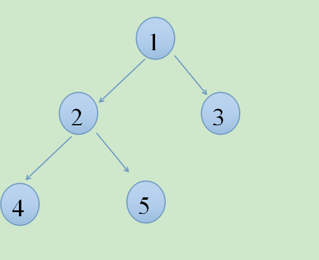

### [java实现树的一般操作](http://709002341.iteye.com/blog/2258198)

- 博客分类：

- [算法实现](http://709002341.iteye.com/category/348849)


​      树是数据结构中最基本的结构，今天的博客更新一下树的基本操作：

## 树的节点结构：

   

Java代码  

```
package tree;  
  
  
/**   
* TreeNode: 普通的树节点 
* @author xuejupo  jpxue@travelsky.com  
* create in 2015-11-19 下午5:30:31   
*     
*/  
public class TreeNode<T> {  
    T value;  
          
    TreeNode<T> leftChild;  
    TreeNode<T> rightChild;  
  
    TreeNode(T value) {  
        this.value = value;  
    }  
    TreeNode() {  
    }  
      
    /**   增加左子节点 
    * addLeft:  
    * @param value  
    * void  返回类型    
    */  
    public void addLeft(T value){  
        TreeNode<T> leftChild = new TreeNode<T>(value);  
        this.leftChild = leftChild;  
    }  
    /**   
    * addRight: 增加右子节点 
    * @param value  
    * void  返回类型    
    */  
    public void addRight(T value){  
        TreeNode<T> rightChild = new TreeNode<T>(value);  
        this.rightChild = rightChild;  
    }  
    /* (non-Javadoc) 
     * @see java.lang.Object#equals(java.lang.Object) 
     * 重载equal方法 
     */  
    @Override  
    public boolean equals(Object obj) {  
        // TODO Auto-generated method stub  
        if(!(obj instanceof TreeNode)){  
            return false;  
        }  
        return this.value.equals(((TreeNode<?>)obj).value);  
    }  
    /* (non-Javadoc) 
     * @see java.lang.Object#hashCode() 
     * 重载hashCode方法 
     */  
    @Override  
    public int hashCode() {  
        // TODO Auto-generated method stub  
        return this.value.hashCode();  
    }  
    @Override  
    public String toString(){  
        return this.value==null?"":this.value.toString();  
    }  
      
      
}  
```

## 树的基本操作类：

Java代码  

```
package tree;  
  
import java.util.ArrayList;  
import java.util.LinkedList;  
import java.util.List;  
import java.util.Queue;  
  
/** 
 * TreeTools:树的操作类 
 *  
 * @author xuejupo jpxue@travelsky.com 
 *  
 *         create in 2015-11-19 下午5:31:05 
 *  
 */  
public class TreeTools {  
  
    /** 
     * getTreeNum: 判断树中节点个数 
     *  
     * @param root 
     *            根节点 
     * @return int 返回类型 
     */  
    public static <T> int getTreeNum(TreeNode<T> root) {  
        if (root == null) {  
            return 0;  
        }  
        return getTreeNum(root.leftChild) + getTreeNum(root.rightChild) + 1;  
    }  
  
    /** 
     * getTreeDepth: 判断树的深度 
     *  
     * @param root 
     *            根节点 
     * @return int 返回类型 
     */  
    public static <T> int getTreeDepth(TreeNode<T> root) {  
        if (root == null) {  
            return 0;  
        }  
        int leftDepth = getTreeDepth(root.leftChild) + 1;  
        int rightDepth = getTreeDepth(root.rightChild) + 1;  
        return Math.max(leftDepth, rightDepth);  
    }  
  
    /** 
     * preOrderTravel: 前序遍历 
     *  
     * @param root 
     *            void 返回类型 
     */  
    public static <T> void preOrderTravel(TreeNode<T> root) {  
        if (root == null) {  
            return;  
        }  
        visitNode(root);  
        preOrderTravel(root.leftChild);  
        preOrderTravel(root.rightChild);  
    }  
  
    /** 
     * midOrderTravel: 中序遍历 
     *  
     * @param root 
     *            void 返回类型 
     */  
    public static <T> void midOrderTravel(TreeNode<T> root) {  
        if (root == null) {  
            return;  
        }  
        midOrderTravel(root.leftChild);  
        visitNode(root);  
        midOrderTravel(root.rightChild);  
    }  
  
    /** 
     * backOrderTravel: 后序遍历 
     *  
     * @param root 
     *            void 返回类型 
     */  
    public static <T> void backOrderTravel(TreeNode<T> root) {  
        if (root == null) {  
            return;  
        }  
        backOrderTravel(root.leftChild);  
        backOrderTravel(root.rightChild);  
        visitNode(root);  
    }  
  
    /** 
     * visitNode: 访问node节点 
     *  
     * @param node 
     *            void 返回类型 
     */  
    private static <T> void visitNode(TreeNode<T> node) {  
        System.out.print(node.value + "\t");  
    }  
  
    /** 
     * levelTravel: 分层遍历 
     *  
     * @param root 
     *            void 返回类型 
     */  
    public static <T> void levelTravel(TreeNode<T> root) {  
        Queue<TreeNode<T>> q = new LinkedList<TreeNode<T>>();  
        q.offer(root);  
        while (!q.isEmpty()) {  
            TreeNode<T> temp = q.poll();  
            visitNode(temp);  
            if (temp.leftChild != null) {  
                q.offer(temp.leftChild);  
            }  
            if (temp.rightChild != null) {  
                q.offer(temp.rightChild);  
            }  
        }  
    }  
  
    /** 
     * getNumForKlevel: 求第K层节点个数 
     *  
     * @param root 
     * @param k 
     * @return int 返回类型 
     */  
    public static <T> int getNumForKlevel(TreeNode<T> root, int k) {  
        if (root == null || k < 1) {  
            return 0;  
        }  
        if (k == 1) {  
            return 1;  
        }  
        int leftNum = getNumForKlevel(root.leftChild, k - 1);  
        int rightNum = getNumForKlevel(root.rightChild, k - 1);  
        return leftNum + rightNum;  
    }  
  
    /** 
     * getLeafNum: 求二叉树中叶子节点的个数 
     *  
     * @param root 
     * @return int 返回类型 
     */  
    public static <T> int getLeafNum(TreeNode<T> root) {  
        if (root == null) {  
            return 0;  
        }  
        if (root.leftChild == null && root.rightChild == null) {  
            return 1;  
        }  
        int leftNum = getLeafNum(root.leftChild);  
        int rightNum = getLeafNum(root.rightChild);  
        return leftNum + rightNum;  
    }  
  
    /** 
     * exchange: 交换根节点的左右子树 
     *  
     * @param root 
     * @return TreeNode 返回类型 
     */  
    public static <T> TreeNode<T> exchange(TreeNode<T> root) {  
        if (root == null) {  
            return null;  
        }  
        TreeNode<T> left = exchange(root.leftChild);  
        TreeNode<T> right = exchange(root.rightChild);  
        root.leftChild = right;  
        root.rightChild = left;  
        return root;  
    }  
  
    /** 
     * nodeIsChild: 查看node是否是root的子节点 
     *  
     * @param root 
     * @param node 
     * @return boolean 返回类型 
     */  
    public static <T> boolean nodeIsChild(TreeNode<T> root, TreeNode<T> node) {  
        if (root == null || node == null) {  
            return false;  
        }  
        if (root == node) {  
            return true;  
        }  
        boolean isFind = nodeIsChild(root.leftChild, node);  
        if (!isFind) {  
            isFind = nodeIsChild(root.rightChild, node);  
        }  
        return isFind;  
    }  
  
    /** 
     * findAllFatherNode: 返回两个节点lnode和rnode的以root为根节点的公共父节点 
     *  
     * @param root 
     *            根节点 
     * @param lNode 
     * @param rNode 
     * @return TreeNode 返回类型 
     */  
    public static <T> TreeNode<T> findAllFatherNode(TreeNode<T> root,  
            TreeNode<T> lNode, TreeNode<T> rNode) {  
        if (lNode == root || rNode == root) {  
            return root;  
        }  
        if (root == null || lNode == null || rNode == null) {  
            return null;  
        }  
        // 如果lNode是左子树的节点  
        if (nodeIsChild(root.leftChild, lNode)) {  
            if (nodeIsChild(root.rightChild, rNode)) {  
                return root;  
            } else {  
                return findAllFatherNode(root.leftChild, lNode, rNode);  
            }  
        } else {  
            if (nodeIsChild(root.leftChild, rNode)) {  
                return root;  
            } else {  
                return findAllFatherNode(root.rightChild, lNode, rNode);  
            }  
        }  
    }  
  
    /** 
     * getTreeFromPreAndMid: 根据前序和中序构建二叉树 
     *  
     * @param pre 
     *            前序序列 
     * @param mid 
     *            中序序列 
     * @return TreeNode 返回类型 
     */  
    public static <T> TreeNode<T> getTreeFromPreAndMid(List<T> pre, List<T> mid) {  
        if (pre == null || mid == null || pre.size() == 0 || mid.size() == 0) {  
            return null;  
        }  
        if (pre.size() == 1) {  
            return new TreeNode<T>(pre.get(0));  
        }  
        TreeNode<T> root = new TreeNode<T>(pre.get(0));  
        // 找出根节点在中序中的位置  
        int index = 0;  
        while (!mid.get(index++).equals(pre.get(0))) {  
        }  
        // 构建左子树的前序  
        List<T> preLeft = new ArrayList<T>(index);  
        // 左子树的中序  
        List<T> midLeft = new ArrayList<T>(index);  
        for (int i = 1; i < index; i++) {  
            preLeft.add(pre.get(i));  
        }  
        for (int i = 0; i < index - 1; i++) {  
            midLeft.add(mid.get(i));  
        }  
  
        // 重建左子树  
        root.leftChild = getTreeFromPreAndMid(preLeft, midLeft);  
        // 右子树的前序  
        List<T> preRight = new ArrayList<T>(pre.size() - index - 1);  
        // 右子树的中序  
        List<T> midRight = new ArrayList<T>(pre.size() - index - 1);  
        for (int i = 0; i <= pre.size() - index - 1; i++) {  
            preRight.add(pre.get(index + i));  
        }  
        for (int i = 0; i <= pre.size() - index - 1; i++) {  
            midRight.add(mid.get(index + i));  
        }  
        // 重建→子树  
        root.rightChild = getTreeFromPreAndMid(preRight, midRight);  
        return root;  
    }  
  
    /** 
     * equals: 查看node1和node2两棵树是否相等(两棵树所有节点都相等) 
     *  
     * @param node1 
     *            node2 两个节点 
     * @return boolean 返回类型 
     */  
    public static <T> boolean equals(TreeNode<T> node1, TreeNode<T> node2) {  
        // TODO Auto-generated method stub  
        if (node1 == null && node2 == null) {  
            return true;  
        } else if (node1 == null || node2 == null) {  
            return false;  
        }  
        boolean isEqual = node1.value.equals(node2.value);  
        boolean isLeftEqual = equals(node1.leftChild, node2.leftChild);  
        boolean isRightEqual = equals(node1.rightChild, node2.rightChild);  
        return isEqual && isLeftEqual && isRightEqual;  
    }  
}  
```

## 测试类：

​     测试类中，先利用节点中的基本操作构建一棵树：


   图1         简单树

​      然后测试了操作类里面几个基本的操作，包括前序和后序遍历，然后根据树的前序序列和中序序列，初始化两个list，分别作为要构建的新树的前序和中序去构建一棵新树，然后比较两棵树是否相同。

​     代码：

Java代码  

```
public static void main(String[] args) {  
        // TODO Auto-generated method stub  
        TreeNode<Integer> t = new TreeNode<Integer>(1);  
        t.addLeft(2);  
        t.addRight(3);  
        t.leftChild.addLeft(4);  
        t.leftChild.addRight(5);  
        System.out.println("中序遍历测试:");  
        TreeTools.midOrderTravel(t);  
        System.out.println("\n前序遍历测试:");  
        TreeTools.preOrderTravel(t);  
        System.out.println("\n后序遍历测试:");  
        TreeTools.backOrderTravel(t);  
        System.out.println("\n层次遍历测试:");  
        TreeTools.levelTravel(t);  
        System.out.println("\n树的深度:"+TreeTools.getTreeDepth(t));  
        System.out.println("树的叶子个数:"+TreeTools.getLeafNum(t));  
        System.out.println("树的节点个数:"+TreeTools.getTreeNum(t));  
        System.out.println("第2层节点个数为:"+TreeTools.getNumForKlevel(t,2));  
        List<Integer> pre = new ArrayList<Integer>();  
        pre.add(1);  
        pre.add(2);  
        pre.add(4);  
        pre.add(5);  
        pre.add(3);  
        List<Integer> mid = new ArrayList<Integer>();  
        mid.add(4);  
        mid.add(2);  
        mid.add(5);  
        mid.add(1);  
        mid.add(3);  
        TreeNode<Integer> root = TreeTools.getTreeFromPreAndMid(pre, mid);  
        System.out.println("\n通过前序和中序构建树测试：");  
        TreeTools.levelTravel(root);  
        System.out.println("\n构建的树比较测试:");  
        System.out.println(TreeTools.equals(t,root));  
    }  
```

 结果为：

Java代码  

```
中序遍历测试:  
4   2   5   1   3     
前序遍历测试:  
1   2   4   5   3     
后序遍历测试:  
4   5   2   3   1     
层次遍历测试:  
1   2   3   4   5     
树的深度:3  
树的叶子个数:3  
树的节点个数:5  
第2层节点个数为:2  
  
通过前序和中序构建树测试：  
1   2   3   4   5     
构建的树比较测试:  
true  
```

​     最后的话：  树的基本操作都很简单，树是我见过的最适合用递归来操作的数据结构了。因为子节点和父节点是一样的类型，而且基本具有同样的属性。

​        以上的方法里面，可能只有利用前序和中序构建一棵树不容易理解。   比如图1里面那棵树，前序是1 2 4 5 3   中序是4 2 5 1 3   前序的1表示根是1，然后在中序序列里，1左边的是根节点的左子树，1后边的是整棵树的右子树，中序1前边有3个数字，右边有1个数字，表示根节点的左子树有3个节点，右子树有1个节点，所以构建根节点左子树的前序和中序时，取根节点前序的2，4，5和根节点中序的425，构建根节点右子树的前序和中序时取根节点的3，然后递归构建即可。

来源： <http://709002341.iteye.com/blog/2258198>