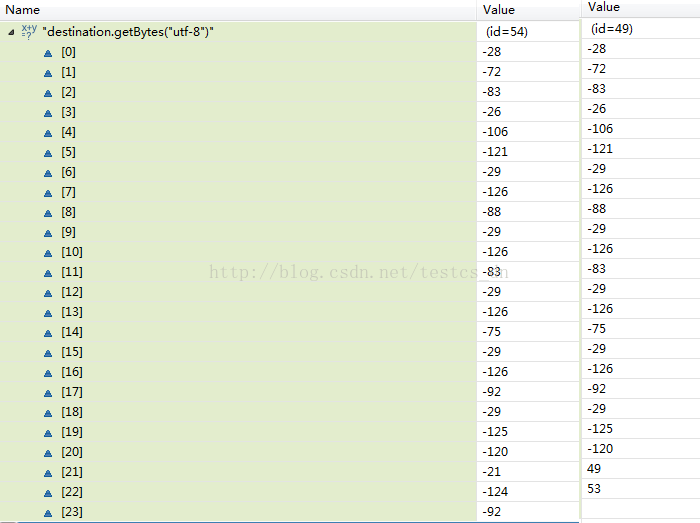

 

[TOC]


# java 获取 string 字符串的编码详解

## 前言

这个方法只是用来大概检查编码. 并不是很准确,因为有可能两个编码出来字符串是一样

## 判断字符串的编码方法:

```java
/** 
 * 判断字符串的编码 
 * 
 * @param str 
 * @return 
 */  
public static String getEncoding(String str) {  
    String encode[] = new String[]{  
            "UTF-8",  
            "ISO-8859-1",  
            "GB2312",  
            "GBK",  
            "GB18030",  
            "Big5",  
            "Unicode",  
            "ASCII"  
    };  
    for (int i = 0; i < encode.length; i++){  
        try {  
            if (str.equals(new String(str.getBytes(encode[i]), encode[i]))) {  
                return encode[i];  
            }  
        } catch (Exception ex) {  
        }  
    }  
      
    return "";  
}  
```

说明：


显示Google记录的2001年至2012年网络上主要编码的使用情况。参考：https://en.wikipedia.org/wiki/UTF-8

## **测试代码：**

```java
public static void main(String[] args) {  
    String str = "中文エキサイト";  
    String encode = getEncoding(str);  
    System.out.println(encode);  
      
    str = "中文エキサイト네이버 중국어사전";  
    encode = getEncoding(str);  
    System.out.println(encode);  
}  
```

执行输出为：

```
UTF-8
UTF-8
```

注意：如果将数组”String encode[]“中”UTF-8“和”GB2312“的位置换一下，结果就会发生改变为：

```
GB2312
UTF-8
```

这是为什么？

通过监视以下代码中的”destination.getBytes“，我们可以发现是存在重码区域的！

```
destination = new String("中文エキサイト네이버 중국어사전17");  
if(destination.equals(new String(destination.getBytes("GB2312"), "GB2312")))  
{  
    System.out.println(destination);  
}  
  
destination = new String("中文エキサイト네이버 중국어사전18");  
if(destination.equals(new String(destination.getBytes("utf-8"), "utf-8")))  
{  
    System.out.println(destination);  
}  
```

如下图：



所以”getEncoding“方法的正确性有是局限性的，一方面是数组中包含的编码的各类是否够全，一方面是需要判断的字符串特征是否明显。

  

http://blog.csdn.net/testcs_dn/article/details/53982619