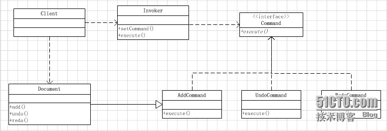

# 【JAVA】设计模式之命令模式（Command模式）的使用分析

## 介绍

命令模式属于23种设计模式中行为模式中的一个，它也是一种简单实用非常普遍的设计模式。
首先看下GOF对命令模式的定义：将一个请求封装为一个对象，从而使你可用不同的请求对客户进行参数化；对请求排队或记录请求日志，以及支持可撤销的操作。
命令模式主要应用于将行为调用者与实现者解耦。比如我们以前惯用的写代码的方式是LogicProcess logic = new LogicProcess(); 然后紧接着调用实现方法logic.process()，这种写法其实非常普遍，但这种写法把行为调用者和行为实现者耦合在了一起，一般情况下并没有什么问题的，但当调用逻辑比较复杂或则调用行为有多种实现时就非常不利于程序的扩展。
命令模式的适用场景描述：
（1）整个调用过程比较繁杂，或者存在多处这种调用。使用Command类对该调用加以封装，便于功能的再利用。
（2）调用前后需要对调用参数进行某些处理。
（3）调用前后需要进行某些额外处理，比如日志，缓存，记录历史操作等。
命令模式结构图如下：



命令模式的参与角色：
（1）抽象命令角色（Command）：抽象命令，包含命令执行的抽象方法
（2）命令接收者（Receiver）：命令接收者角色，它包含所有命令的具体行为实现方法。
（3）具体命令角色（ConcreteCommand）：它包含一个命令接收者对象，并调用接收者的对象相应实现方法。
（4）命令调用者角色（Invoker）：提供给客户端调用，接收客户端所传递的具体命令对象。

## 代码demo

下面看具体代码实现：

### 1、第一个文件抽象命令角色：Command.java

```
/**
 * 抽象命令接口
 */
public interface Command {
    /**
     * 命令执行方法
     */
    public void execute();
}
```

### 2、第二个文件命令接收者角色：Document.java

```
/**
 * 命令接收者 Receiver
 */
public class Document {
    /**
     * 操作实体对象
     */
    public static StringBuffer sbr   = new StringBuffer();
    /**
     * 计数器
     */
    public static int          count = 0;

    /**
     * 撤销实现方法
     */
    public void undo() {
        System.out.println("调用撤销实现方法，字符串递减");
        sbr.deleteCharAt(sbr.length() - 1);
        count--;
        System.out.println("当前文本为：" + sbr.toString());
    }

    /**
     * 恢复实现方法
     */
    public void redo() {
        System.out.println("调用恢复实现方法，字符串递加");
        this.sbr.append(count);
        count++;
        System.out.println("当前文本为：" + sbr.toString());
    }

    /**
     * 执行实现方法
     */
    public void add() {
        System.out.println("调用执行实现方法，字符串递加");
        this.sbr.append(count);
        count++;
        System.out.println("当前文本为：" + sbr.toString());
    }
}
```

### 3、第三个文件具体命令角色：AddCommand.java

```
/**
 * 执行命令实现类
 */
public class AddCommand implements Command {
    /**
     * 命令接受者对象
     */
    public Document doucment;

    /**
     * 构造方法
     * @param document
     */
    public AddCommand(Document document) {
        this.doucment = document;
    }

    @Override
    public void execute() {
        // TODO Auto-generated method stub
        this.doucment.add();
    }
}
```

### 4、第四个文件具体命令角色：UndoCommand.java

```
/**
 * 撤销命令实现类
 */
public class UndoCommand implements Command {
    /**
     * 命令接受者对象
     */
    public Document doucment;

    /**
     * 构造方法
     * @param document
     */
    public UndoCommand(Document document) {
        this.doucment = document;
    }

    @Override
    public void execute() {
        // TODO Auto-generated method stub
        this.doucment.undo();
    }
}
```

### 5、第五个文件具体命令角色：RedoCommand.java

```
/**
 * 恢复命令实现类
 */
public class RedoCommand implements Command {
    /**
     * 命令接受者对象
     */
    public Document doucment;

    /**
     * 构造方法
     * @param document
     */
    public RedoCommand(Document document) {
        this.doucment = document;
    }

    @Override
    public void execute() {
        // TODO Auto-generated method stub
        this.doucment.redo();
    }
}
```

### 6、第六个文件调用者角色：Invoker.java

```
/**
 * 提供给客户端的命令调用方法
 * @author feng
 *
 */
public class Invoker {
    /**
     * 命令对象
     */
    public Command command;

    /**
     * 命令设置方法
     * @param command
     */
    public void setCommand(Command cmd) {
        this.command = cmd;
    }

    /**
     * 命令执行方法
     */
    public void execute() {
        this.command.execute();
    }
}
```

### 7、第七个文件TestMain.java

```
/**
 * 测试Main方法
 */
public class TestMain {
    public static void main(String args[]) {
        Document doc = new Document(); //文档实体对象
        AddCommand addCmd = new AddCommand(doc); //具体命令实体对象
        UndoCommand undoCmd = new UndoCommand(doc); //具体命令实体对象
        RedoCommand redoCmd = new RedoCommand(doc); //具体命令实体对象
        Invoker invoker = new Invoker(); //调用者对象
        invoker.setCommand(addCmd);
        invoker.execute();
        invoker.setCommand(addCmd);
        invoker.execute();
        invoker.setCommand(undoCmd);
        invoker.execute();
        invoker.setCommand(redoCmd);
        invoker.execute();
    }
}
```

## 总结

虽然代码看似挺多，但其实命令模式的结构还是比较清晰的，总的来说命令模式的使用流程就是首先创建一个抽象命令，然后创建多个具体命令实现抽象命令接口，然后创建一个命令接受者角色，它包含各种的行为的具体实现，然后再有一个命令调用者角色，提供给客户端，用于接收客户端的参数。
下面总结下命令模式的优点：
（1）命令模式将行为调用者和各种行为分隔开，降低程序的耦合，便于程序扩展。
（2）命令模式将行为的具体实现封装起来，客户端无需关心行为的具体实现。
（3）命令模式可为多种行为提供统一的调用入口，便于程序对行为的管理和控制。 

本文出自 “[Bolaven的博客](http://bolaven.blog.51cto.com/)” 博客，请务必保留此出处<http://bolaven.blog.51cto.com/8639884/1368935>