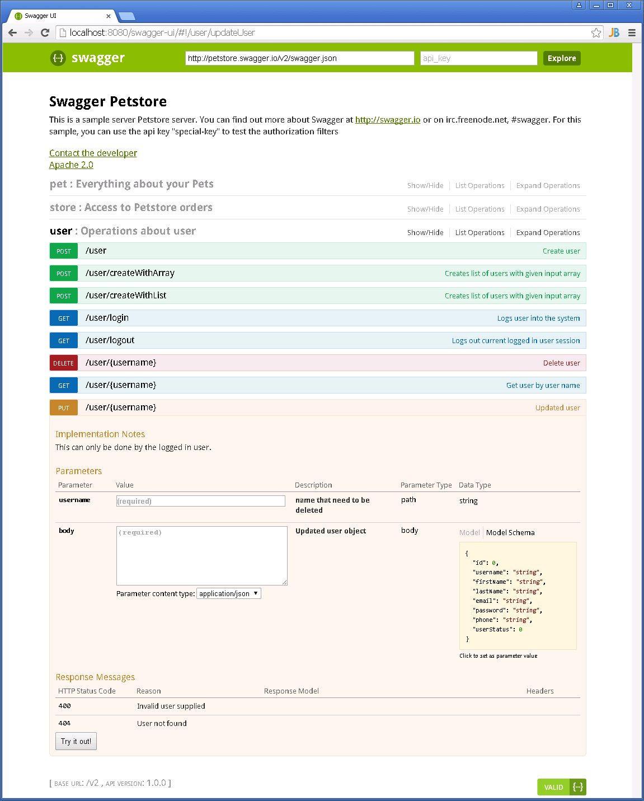
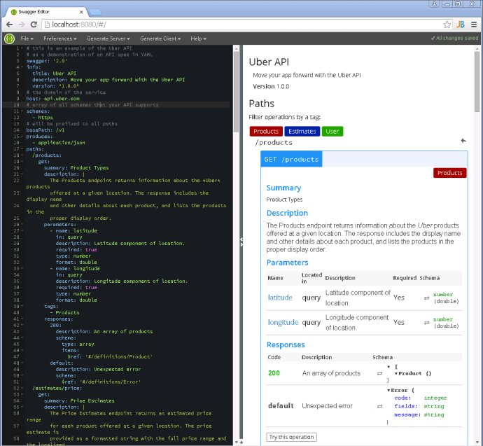

### Swagger学习和实践

最近安装并使用了一下[Swagger-ui](https://github.com/swagger-api/swagger-ui)、[Swagger-editor](https://github.com/swagger-api/swagger-editor)和[Swagger-codegen](https://github.com/swagger-api/swagger-codegen)，感觉还不错。

Swagger 是一个规范和完整的框架，用于生成、描述、调用和可视化 RESTful 风格的 Web 服务。Swagger的目标是对REST API定义一个标准的和语言无关的接口，可让人和计算机无需访问源码、文档或网络流量监测就可以发现和理解服务的能力。当通过Swagger进行正确定义，用户可以理解远程服务并使用最少实现逻辑与远程服务进行交互。与为底层编程所实现的接口类似，Swagger消除了调用服务时可能会有的猜测。

Swagger是一组开源项目，其中主要要项目如下：

- [Swagger-tools](https://github.com/apigee-127/swagger-tools):提供各种与Swagger进行集成和交互的工具。例如模式检验、Swagger 1.2文档转换成Swagger 2.0文档等功能。

- [Swagger-core](https://github.com/swagger-api/swagger-core): 用于Java/Scala的的Swagger实现。与JAX-RS(Jersey、Resteasy、CXF...)、Servlets和[Play框架](http://www.playframework.com/)进行集成。

- [Swagger-js](https://github.com/swagger-api/swagger-js): 用于JavaScript的Swagger实现。

- [Swagger-node-express](https://github.com/swagger-api/swagger-node-express): Swagger模块，用于node.js的[Express web应用框架](http://expressjs.com/)。

- [Swagger-ui](https://github.com/swagger-api/swagger-ui)：一个无依赖的HTML、JS和CSS集合，可以为Swagger兼容API动态生成优雅文档。
  

- Swagger-codegen

  ：一个模板驱动引擎，通过分析用户Swagger资源声明以各种语言生成客户端代码。

  ​

  ```
  C:\tools\swagger-codegen>mvn package
  C:\tools\swagger-codegen\modules\swagger-codegen-cli>mvn package
  C:\tools\swagger-codegen\modules\swagger-generator>mvn package
  C:\tools\swagger-codegen>java -jar modules/swagger-codegen-cli/target/swagger-codegen-cli.jar generate -i http://petstore.swagger.io/v2/swagger.json -l spring-mvc -o yqu/petstore/spring-mvc
  C:\tools\swagger-codegen\yqu\petstore\spring-mvc>mvn package

  ```

  上述操作通过底层使用

  SpringFox

  库，会创建带有Swagger注释的Spring MVC框架代码，包括Controller和DTO类。这样将Swagger-ui部署到Web应用内，就可以通过http://server:8002/v2/sdoc.jsp在线访问API文档了。

- [Swagger-editor](https://github.com/swagger-api/swagger-editor)：可让使用者在浏览器里以YAML格式编辑Swagger API规范并实时预览文档。可以生成有效的Swagger JSON描述，并用于所有Swagger工具（代码生成、文档等等）中。
  

除了Swagger项目自身支持的Java、Scala和JavaScript语言，Swagger社区中还提供了很多支持其他语言的第三方工具，覆盖了Clojure、ColdFusion / CFML、Eiffel、Go、Groovy、.Net、Perl、PHP、Python、Ruby等各种编程语言。

### Swagger总结

Swagger这类API文档工具可以满足下列需

求：

- 支持API自动生成同步的在线文档
  - 这些文档可用于项目内部API审核
  - 方便测试人员了解API
  - 这些文档可作为客户产品文档的一部分进行发布
- 支持API规范生成代码，生成的客户端和服务器端骨架代码可以加速开发和测试速度

跟下列其他API文档工具

相比，Swagger各有优缺点

，但它功能最多、也是

最流行的。

- [RESTful API Modeling Language (RAML)](http://www.raml.org/)
- [apiary](http://apiary.io/)的[API Blueprint](http://apiblueprint.org/)
- [I/O Docs](https://github.com/mashery/iodocs)
- [Web Application Description Language (WADL)](https://wadl.java.net/)

### 参考

------

[Swagger官网](http://swagger.io/)

[GitHub：Swagger](https://github.com/swagger-api)

[Swagger规范](https://github.com/swagger-api/swagger-spec)

[SpringFox官网](http://springfox.io/)

[GitHub：SpringFox](https://github.com/springfox)

[Spring Boot & Swagger UI](http://fruzenshtein.com/spring-boot-swagger-ui/)

来源： <<http://blog.sina.com.cn/s/blog_72ef7bea0102vpu7.html>>

 