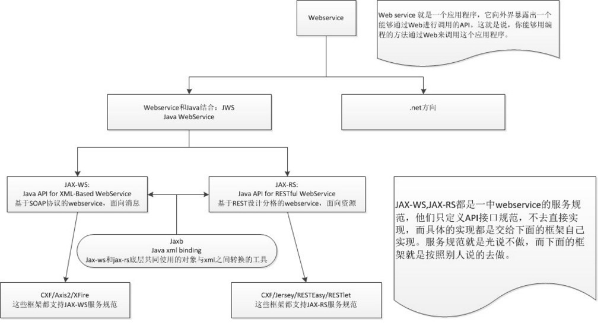

# webservice框架jersey简单总结 @Context注解


项目中更需要使用到webservice，具体的是使用jersey。那么首先需要了解jersey和webservice的关系，捋顺webservice框架的各种实现，通过查阅相关博客，我个人总结webservice的结构图如下：



通过上图，大概可以了解到webservice和jersey的关系了，然后我们需要了解RESTful是什么，自己也是说不太清楚，所以可以看这个博客地址：REST介绍：http://redhacker.iteye.com/blog/1923226

然后，知道了一些概念上的定义，就可以具体使用jersey，自己做了jerseyDemo来简单说名jersey的使用。另外，jersey1.X的版本是sun公司提供的独立的jar包，在2.X版本中，已经将jersey放在glassfish下。同时Java也支持jersey的webservice，支持webservice的注解的包都在javax.ws.rs.*包中。


**jersey常用注解解释：          **                                                                   

 

| **Annotation**  | **作用**              | **说明**                                   |
| --------------- | ------------------- | ---------------------------------------- |
| @GET            | 查询请求                | 相当于数据库的查询数据操作                            |
| @POST           | 插入请求                | 相当于数据库的插入数据操作                            |
| @PUT            | 更新请求                | 相当于数据库的更新数据操作                            |
| @DELETE         | 删除请求                | 相当于数据的删除数据操作                             |
| @Path           | uri路径               | 定义资源的访问路径，client通过这个路径访问资源。比如：@Path("user") |
| @Produces       | 指定返回MIME格式          | 资源按照那种数据格式返回，可取的值有：MediaType.APPLICATION_XXX。比如：@Produces(MediaType.APPLICATION_XML) |
| @Consumes       | 接受指定的MIME格式         | 只有符合这个参数设置的请求再能访问到这个资源。比如@Consumes("application/x-www-form-urlencoded") |
| @PathParam      | uri路径参数             | 写在方法的参数中，获得请求路径参数。比如：@PathParam("username")  String userName |
| @QueryParam     | uri路径请求参数           | 写在方法的参数中，获得请求路径附带的参数。比如：@QueryParam("desc")  String desc |
| @DefaultValue   | 设置@QueryParam参数的默认值 | 如果@QueryParam没有接收到值，就使用默认值。比如：@DefaultValue("description") @QueryParam("desc") String desc |
| @FormParam      | form传递的参数           | 接受form传递过来的参数。比如：@FormParam("name")  String userName |
| @BeanParam      | 通过Bena的形式传递参数       | 接受client传递的bean类型的参数，同时这个bean可以在属性上配置@FormParam用以解决client的属性名称和bean的属性名称不一致的问题。比如：@BeanParam  User user |
| @Context        | 获得一些系统环境信息          | 通过@Context可以获得以下信息：UriInfo、ServletConfig、ServletContext、HttpServletRequest、HttpServletResponse和HttpHeaders等 |
| @XmlRootElement | 将bean转换为xml         | 如果要讲bean以xml或json的格式返回，必须要这个注解。比如：@XmlRootElementpublic class User｛...｝ |
| @XmlElements    |                     |                                          |
| @XmlElement     |                     |                                          |

**Jersey使用示例：**

 

1、添加Maven依赖或者导入jar包

```
<!--jersey -->
<dependency>
<groupId>org.glassfish.jersey.containers</groupId>
<artifactId>jersey-container-servlet-core</artifactId>
<version>2.13</version>
</dependency>
 
<!--JAXB API -->
<dependency>
<groupId>javax.xml.ws</groupId>
<artifactId>jaxws-api</artifactId>
<version>2.1</version>
</dependency>
 
<!-- Json支持 -->
<dependency>
<groupId>org.codehaus.jackson</groupId>
<artifactId>jackson-core-asl</artifactId>
<version>1.9.12</version>
</dependency>
<dependency>
<groupId>org.codehaus.jackson</groupId>
<artifactId>jackson-mapper-asl</artifactId>
<version>1.9.12</version>
</dependency>
<dependency>
<groupId>org.codehaus.jackson</groupId>
<artifactId>jackson-jaxrs</artifactId>
<version>1.9.12</version>
</dependency>
<!-- 编译需要，tomcat里面有 -->
<dependency>
<groupId>javax.servlet</groupId>
<artifactId>servlet-api</artifactId>
<version>2.5</version>
<scope>provided</scope>
</dependency>
<!-- 编译需要，tomcat里面有 -->
```

没有使用Maven的就自己下载相应的jar包，放到classpath下就是了。

2、修改web.xml，配置jerseyServlet

```
<servlet>
<servlet-name>JerseyServlet</servlet-name>
<servlet-class>org.glassfish.jersey.servlet.ServletContainer</servlet-class>
<!-- 配置自己的资源加载类去加载资源 -->
<init-param>
<param-name>javax.ws.rs.Application</param-name>
<param-value>com.cisdi.jersey.api.ApplicationAPI</param-value>
</init-param>
<!-- 配置默认的资源包路径，使用默认的配置类去加载资源 -->
<!-- <init-param> -->
<!-- <param-name>jersey.config.server.provider.packages</param-name> -->
<!-- <param-value>com.cisdi.jersey.api</param-value> -->
<!-- </init-param> -->
<load-on-startup>1</load-on-startup>
</servlet>
<servlet-mapping>
<servlet-name>JerseyServlet</servlet-name>
<url-pattern>/api/*</url-pattern>
</servlet-mapping>
```

上面有两种加载资源的方式，一种是使用自己的资源加载器去加载资源，需要给出自己资源加载器的位置。另一种是使用默认的资源加载器加载，需要给出资源所在的package。个人主张第一种，写一个自己的资源加载器去加载想要加载的资源，这样感觉可控性强一点，接下来会介绍这个资源加载器如何编写。

3、编写自己的资源加载器

```
public class ApplicationAPI extends ResourceConfig {
public ApplicationAPI() {
// 加载resources
register(HelloResource.class);
register(UserResource.class);
 
// 注册数据转换器
register(JacksonJsonProvider.class);
 
// 注册日志
register(LoggingFilter.class);
 
}
}
```

这个类就是将各种资源加载进来，暴露给client。之前说道使用自己的资源加载器可控性强的特点就是可以除了加载业务资源以外，还可以加载日子和其他的需要一些工具资源等等。或者package下的某个资源不想被暴露，就不要加载进来就可以了。

4、书写自己的资源

先弄了一个简单的资源，HelloResource

```
@Path("/hello")
public class HelloResource {
@GET
@Produces(MediaType.TEXT_PLAIN)
public String sayHello() {
return "hello jersey!";
}
}
```

接着可以弄个复杂点得对象资源，UserResource

```
@XmlRootElement
public class User {
private int id;
@FormParam("name")
private String userName;
@FormParam("desc")
private String desc;
        
        Setter/Getter...
}
下面就是UserResource的各个方法
@Path("user")
public class UserResource {
     //这个类的方法都在下面
｝
//这个方法主要介绍@GET，@Path，@Produces，@PathParam，@DefaultValue，@QueryParam注解的使用
@GET
@Path("{username}")
@Produces(MediaType.APPLICATION_XML)
// @Produces({ MediaType.APPLICATION_JSON, MediaType.APPLICATION_XML })
public User getUser(@PathParam("username") String userName, @DefaultValue("description") @QueryParam("desc") String desc) {
User user = new User();
user.setId(new Random().nextInt());
user.setUserName(userName);
user.setDesc(desc);
return user;
}
//访问路径：{host}:{port}/{serviceName}/api/user/username?desc=xxx ;username可以随便写
//这个方法主要介绍@POST，@Consumes,@FormParam注解的使用
@POST
@Path("updateUser")
@Consumes("application/x-www-form-urlencoded")
public void updateUser(@FormParam("name") String userName, @FormParam("desc") String desc) {
User user = new User();
user.setId(1);
user.setUserName(userName);
user.setDesc(desc);
System.out.println(user);
}
//访问路径：{host}:{port}/{serviceName}/api/user/updateUser;这个是通过提交表单访问的
//这个方法主要介绍@BeanParam的使用       
@POST
@Path("updateUser1")
@Produces(MediaType.APPLICATION_XML)
@Consumes("application/x-www-form-urlencoded")
public User updateUser1(@BeanParam User user) {
//注意这个方法需要在User这个bean中使用@FromParam注解
System.out.println(user);
return user;
}
//访问路径：{host}:{port}/{serviceName}/api/user/updateUser1;这个是通过提交表单访问的
 
//这个方法主要介绍@Context注解的使用
@Context
HttpServletRequest request;
 
@Context
HttpServletResponse response;
 
@Context
ServletConfig servletConfig;
 
@Context
ServletContext servletContext;
 
@Context
HttpHeaders header;
 
@Context
UriInfo info;
 
@GET
@Path("/test/{param}")
@Produces(MediaType.APPLICATION_XML)
public User getContext() {
MultivaluedMap<String, String> queryParameters = info.getQueryParameters();
MultivaluedMap<String, String> pathParameters = info.getPathParameters();
 
System.out.println(queryParameters);
System.out.println(pathParameters);
 
System.out.println(this.request);
System.out.println(this.response);
System.out.println(this.servletConfig);
System.out.println(this.servletContext);
System.out.println(this.header);
System.out.println(this.info);
 
return new User(1, "gusi");
 
}
//访问路径：{host}:{port}/{serviceName}/api/user/test/xxx?xxx=xxx&xxx=xxx;xxx都是可以乱写的
说明：使用这种方式有很大的作用，当我们不知道client传递过来的参数名称，或者client传递过来的参数经常变化，
那么我们就可以使用这样方式动态的获得传递给service的参数，然后再进行后续的处理
```


5、通过client程序访问webservice

上面我们可以直接通过浏览器的地址访问webservice，此外还可以通过专门的客户端程序访问，程序如下：

```
public class UserClient {
private static String serverURI = "http://localhost:8080/jerseyDemo/api/user";
 
public static void getContext() {
Client client = ClientBuilder.newClient();
WebTarget target = client.target(serverURI + "/test/context?one='abc'&two=2");
Response response = target.request().get();
response.close();
}
 
public static void addUser() {
User user1 = new User(1, "name1", "desc1");
User user2 = new User(2, "name2", "desc2");
Client client = ClientBuilder.newClient();
WebTarget target = client.target(serverURI + "");
Response response = null;
target.request().buildPost(Entity.entity(user1, MediaType.APPLICATION_XML)).invoke();
response = target.request().buildPost(Entity.entity(user2, MediaType.APPLICATION_XML)).invoke();
response.close();
}
 
public static void deleteUser() {
Client client = ClientBuilder.newClient();
WebTarget target = client.target(serverURI + "/1");
Response response = target.request().delete();
response.close();
}
 
public static void updateUser() {
User user = new User(1, "nameA", "descA");
Client client = ClientBuilder.newClient();
WebTarget target = client.target(serverURI + "");
Response response = target.request().buildPut(Entity.entity(user, MediaType.APPLICATION_XML)).invoke();
response.close();
}
 
public static void getUserById() {
Client client = ClientBuilder.newClient();
// client.register(JacksonJsonProvider.class);
WebTarget target = client.target(serverURI + "/1");
Response response = target.request().get();
User user = response.readEntity(User.class);
System.out.println(user);
response.close();
}
 
public static void getAllUser() {
Client client = ClientBuilder.newClient();
WebTarget target = client.target(serverURI + "");
Response response = target.request().get();
String value = response.readEntity(String.class);
System.out.println(value);
response.close();
}
}
```

上面分别演示了通过Client程序给Service发送POST，PUT，DELETE，GET请求。

6、测试

使用junit单元测试，分别测试发送不同的请求

```
public class UserClientTest {
 
@Test
public void testContext() {
UserClient.getContext();
}
 
@Test
public void testAddUser() {
UserClient.addUser();
}
 
@Test
public void testDeleteUser() {
UserClient.deleteUser();
}
 
@Test
public void testUpdateUser() {
UserClient.updateUser();
}
 
@Test
public void testGetUser() {
UserClient.getUserById();
 
}
 
@Test
public void testGetAllUser() {
UserClient.getAllUser();
}
 
}
```

通过上面的6个步骤，就可一简单的实现webservice的基本使用。

- 查看图片附件

  ​

  来源： <http://dyygusi.iteye.com/blog/2148029>