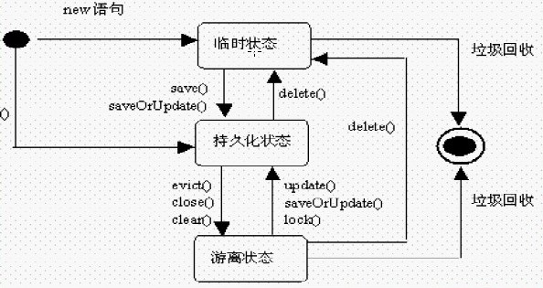

# 深入hibernate的三种状态


学过hibernate的人都可能都知道hibernate有三种状态，transient(瞬时状态)，persistent(持久化状态)以及detached(离线状态)，大家伙也许也知道这三者之间的区别，比如瞬时状态就是刚new出来一个对象，还没有被保存到数据库中，持久化状态就是已经被保存到数据库中，离线状态就是数据库中有，但是session中不存在该对象。但是大家又是否对hibernate的session的那几个特殊方法一清二楚呢？或者说大家是否能够一眼就快速看出一个测试用例在反复的调用session的诸如save，update方法后会到底发出多少条SQL语句呢？本篇随笔将会给你答案，本篇随笔将会以大量的测试用例来掩饰hibernate的这三种状态的转变，相信看完本篇随笔的你会对hibernate的那三种状态有更深入的理解。

好了，废话不多说了，相信大家都知道hibernate的这三种状态的含义，那我们就通过一张图来开始我们的深入hibernate的三种状态之旅吧。



## 1.TestTransient


```
　　　　　　　session = HibernateUtil.openSession();
            session.beginTransaction();
            User user = new User();
            user.setUsername("aaa");
            user.setPassword("aaa");
            user.setBorn(new Date()); /* *  以上user就是一个Transient(瞬时状态),此时user并没有被session进行托管，即在session的
             *  缓存中还不存在user这个对象，当执行完save方法后，此时user被session托管，并且数据库中存在了该对象
             *  user就变成了一个Persistent(持久化对象) */ session.save(user);
            session.getTransaction().commit();
```


此时我们知道hibernate会发出一条insert的语句，执行完save方法后，该user对象就变成了持久化的对象了

```
Hibernate: insert into t_user (born, password, username) values (?, ?, ?)
```

## 2.TestPersistent01


```
　　　　　　　session = HibernateUtil.openSession();
            session.beginTransaction();
            User user = new User();
            user.setUsername("aaa");
            user.setPassword("aaa");
            user.setBorn(new Date()); //以上u就是Transient（瞬时状态），表示没有被session管理并且数据库中没有 //执行save之后，被session所管理，而且，数据库中已经存在，此时就是Persistent状态  session.save(user); //此时u是持久化状态，已经被session所管理，当在提交时，会把session中的对象和目前的对象进行比较 //如果两个对象中的值不一致就会继续发出相应的sql语句 user.setPassword("bbb"); //此时会发出2条sql，一条用户做插入，一条用来做更新 session.getTransaction().commit();
```


在调用了save方法后，此时user已经是持久化对象了，被保存在了session缓存当中，这时user又重新修改了属性值，那么在提交事务时，此时hibernate对象就会拿当前这个user对象和保存在session缓存中的user对象进行比较，如果两个对象相同，则不会发送update语句，否则，如果两个对象不同，则会发出update语句。

```
Hibernate: insert into t_user (born, password, username) values (?, ?, ?)
Hibernate: update t_user set born=?, password=?, username=? where id=?
```

## 3.TestPersistent02


```
　　　　　　　SimpleDateFormat sdf = new SimpleDateFormat("yyyy-MM-dd");
            session = HibernateUtil.openSession();
            session.beginTransaction();
            User u = new User();
            u.setBorn(new Date());
            u.setUsername("zhangsan");
            u.setPassword("zhangsan");
            session.save(u);
            u.setPassword("222"); //该条语句没有意义  session.save(u);
            u.setPassword("zhangsan111"); //没有意义  session.update(u);
            u.setBorn(sdf.parse("1988-12-22")); //没有意义  session.update(u);
            session.getTransaction().commit();
```


这个时候会发出多少sql语句呢？还是同样的道理，在调用save方法后，u此时已经是持久化对象了，记住一点：**如果一个对象以及是持久化状态了，那么此时对该对象进行各种修改，或者调用多次update、save方法时，hibernate都不会发送sql语句，只有当事物提交的时候，此时hibernate才会拿当前这个对象与之前保存在session中的持久化对象进行比较，如果不相同就发送一条update的sql语句，否则就不会发送update语句**

```
Hibernate: insert into t_user (born, password, username) values (?, ?, ?)
Hibernate: update t_user set born=?, password=?, username=? where id=?
```

## 4.TestPersistent03


```
　　　　　　　SimpleDateFormat sdf = new SimpleDateFormat("yyyy-MM-dd");
            session = HibernateUtil.openSession();
            session.beginTransaction();
            User u = new User();
            u.setBorn(sdf.parse("1976-2-3"));
            u.setUsername("zhangsan2");
            u.setPassword("zhangsan2");
            session.save(u); /* * 以下三条语句没有任何意义 */ session.save(u);
            session.update(u);
            session.update(u);
            u.setUsername("zhangsan3");
            session.getTransaction().commit();
```


相信这个测试用例，大家应该都知道结果了，没错，此时hibernate也会发出两条sql语句，原理一样的

```
Hibernate: insert into t_user (born, password, username) values (?, ?, ?)
Hibernate: update t_user set born=?, password=?, username=? where id=?
```

## 5.TestPersistent04


```
　　　　　　　session = HibernateUtil.openSession();
            session.beginTransaction(); //此时u是Persistent User u = (User)session.load(User.class, 4); //由于u这个对象和session中的对象不一致，所以会发出sql完成更新 u.setUsername("bbb");
            session.getTransaction().commit();
```


我们来看看此时会发出多少sql语句呢？同样记住一点：**当session调用load、get方法时，此时如果数据库中有该对象，则该对象也变成了一个持久化对象，被session所托管**。因此，这个时候如果对对象进行操作，在提交事务时同样会去与session中的持久化对象进行比较，因此这里会发送两条sql语句

```
Hibernate: select user0_.id as id0_0_, user0_.born as born0_0_, user0_.password as password0_0_, user0_.username as username0_0_ from t_user user0_ where user0_.id=? Hibernate: update t_user set born=?, password=?, username=? where id=?
```

## 6.TestPersistent05


```
　　　　　　　session = HibernateUtil.openSession();
            session.beginTransaction(); //此时u是Persistent User u = (User)session.load(User.class, 4);
            u.setUsername("123"); //清空session  session.clear();
            session.getTransaction().commit();
```


再看这个例子，当我们load出user对象时，此时user是持久化的对象，在session缓存中存在该对象，此时我们在对user进行修改后，**然后调用session.clear()方法，这个时候就会将session的缓存对象清空，那么session中就没有了user这个对象，这个时候在提交事务的时候，发现已经session中已经没有该对象了，所以就不会进行任何操作**，因此这里只会发送一条select语句

```
Hibernate: select user0_.id as id0_0_, user0_.born as born0_0_, user0_.password as password0_0_, user0_.username as username0_0_ from t_user user0_ where user0_.id=?
```

## 7.TestDetached01


```
　　　　　　　session = HibernateUtil.openSession();
            session.beginTransaction(); //此时u是一个离线对象，没有被session托管 User u = new User();
            u.setId(4);
            u.setPassword("hahahaha"); //当执行save的时候总是会添加一条数据，此时id就会根据Hibernate所定义的规则来生成  session.save(u);
            session.getTransaction().commit();
```


我们看到，当调用了u.setId(4)时，此时u是一个离线的对象，因为数据库中存在id=4的这个对象，但是该对象又没有被session所托管，所以这个对象就是离线的对象，要使离线对象变成一个持久化的对象，应该调用什么方法呢？我们知道调用save方法，可以将一个对象变成一个持久化对象，但是，当save一执行的时候，此时hibernate会根据id的生成策略往数据库中再插入一条数据，所以如果调用save方法，此时数据库会发送一条插入的语句：

```
Hibernate: insert into t_user (born, password, username) values (?, ?, ?)
```

所以对于离线对象，如果要使其变成持久化对象的话，我们不能使用save方法，而应该使用update方法

## 8.TestDetached02


```
　　　　　　　SimpleDateFormat sdf = new SimpleDateFormat("yyyy-MM-dd");
            session = HibernateUtil.openSession();
            session.beginTransaction();
            User u = new User();
            u.setId(5); //完成update之后也会变成持久化状态  session.update(u);
            u.setBorn(sdf.parse("1998-12-22"));
            u.setPassword("world");
            u.setUsername("world"); //会发出一条sql  session.update(u);
            session.getTransaction().commit();
```


此时我们看到，当调用了update方法以后，此时u已经变成了一个持久化的对象，那么如果此时对u对象进行修改操作后，在事务提交的时候，则会拿该对象和session中刚保存的持久化对象进行比较，如果不同就发一条sql语句

```
Hibernate: update t_user set born=?, password=?, username=? where id=?
```

## 9.TestDetached03


```
　　　　　　　SimpleDateFormat sdf = new SimpleDateFormat("yyyy-MM-dd");
            session = HibernateUtil.openSession();
            session.beginTransaction();
            User u = new User();
            u.setId(5); //完成update之后也会变成持久化状态  session.update(u);
            u.setBorn(sdf.parse("1998-12-22"));
            u.setPassword("lisi");
            u.setUsername("lisi"); //会抛出异常 u.setId(333);
            session.getTransaction().commit();
```


我们看这个例子，前面的操作一样，调用update方法后，user变成了一个持久化对象，在对user进行一些修改后，此时又通过 u.setId(333)方法设置了u的ID，那么这个时候，hibernate会报错，因为我们的u当前已经是一个持久化对象，**如果试图修改一个持久化对象的ID的值的话，就会抛出异常**，这点要特别注意

```
org.hibernate.HibernateException: identifier of an instance of com.xiaoluo.bean.User was altered from 5 to 333
```

## 10.TestDetached04


```
　　　　　　　session = HibernateUtil.openSession();
            session.beginTransaction();
            User u = new User();
            u.setId(5); //现在u就是transient对象  session.delete(u); //此时u已经是瞬时对象，不会被session和数据库所管理 u.setPassword("wangwu");
            session.getTransaction().commit();
```


接着我们来看这个例子，这里在调用了session.delete()方法以后，此时后u就会变成一个瞬时对象，因为此时数据库中已经不存在该对象了，既然u已经是一个瞬时对象了，那么对u再进行各种修改操作的话，hibernate也不会发送任何的修改语句，因此这里只会 有一条 delete的语句发生：

```
Hibernate: delete from t_user where id=?
```

## 11.TestDetached05


```
　　　　　　　session = HibernateUtil.openSession();
            session.beginTransaction();
            User u = new User();
            u.setId(4);
            u.setPassword("zhaoliu"); //如果u是离线状态就执行update操作，如果是瞬时状态就执行Save操作 //但是注意：该方法并不常用  session.saveOrUpdate(u);
            session.getTransaction().commit();
```


这里我们来看看 saveOrUpdate这个方法，这个方法其实是一个"偷懒"的方法，如果对象是一个离线对象，那么在执行这个方法后，其实是调用了update方法，如果对象是一个瞬时对象，则会调用save方法，记住：**如果对象设置了ID值，例如u.setId(4)，那么该对象会被假设当作一个离线对象，此时就会执行update操作**。

```
Hibernate: update t_user set born=?, password=?, username=? where id=?
```

如果此时我将u.setId(4)这句话注释掉，那么此时u就是一个瞬时的对象，那么此时就会执行save操作，就会发送一条insert语句

```
Hibernate: insert into t_user (born, password, username) values (?, ?, ?)
```

## 12.TestDetached06


```
　　　　　　　session = HibernateUtil.openSession();
            session.beginTransaction(); //u1已经是持久化状态 User u1 = (User)session.load(User.class, 3);
            System.out.println(u1.getUsername()); //u2是离线状态 User u2 = new User();
            u2.setId(3);
            u2.setPassword("123456789"); //此时u2将会变成持久化状态，在session的缓存中就存在了两份同样的对象,在session中不能存在两份拷贝，否则会抛出异常 session.saveOrUpdate(u2);
```


我们再来看一下这个例子，此时我们的u1已经是持久化的对象了，保存在session缓存中，u2通过调用saveOrUpdate方法后也变成了一个持久化的对象，此时也会保存在session缓存中，这个时候session缓存中就存在了一个持久化对象有两个引用拷贝了，这个时候hibernate就会报错

```
org.hibernate.NonUniqueObjectException: a different object with the same identifier value was already associated with the session: [com.xiaoluo.bean.User#3]
```

一个session中不能存在对一个持久化对象的双重copy的，要解决这个方法，我们这里又要介绍session的另一个方法  merge方法，这个方法的作用就是解决一个持久化对象两分拷贝的问题，这个方法会将两个对象合并在一起成为一个对象。


```
　　　　　　　session = HibernateUtil.openSession();
            session.beginTransaction(); //u1已经是持久化状态 User u1 = (User)session.load(User.class, 3);
            System.out.println(u1.getUsername()); //u2是离线状态 User u2 = new User();
            u2.setId(3);
            u2.setPassword("123456789"); //此时u2将会变成持久化状态，在session的缓存中就存在了两份同样的对象,在session中不能存在两份拷贝，否则会抛出异常 // session.saveOrUpdate(u2); //merge方法会判断session中是否已经存在同一个对象，如果存在就将两个对象合并  session.merge(u2); //最佳实践：merge一般不用 session.getTransaction().commit();
```


我们看到通过调用了merge方法以后，此时会将session中的两个持久化对象合并为一个对象，但是merge方法不建议被使用

```
Hibernate: select user0_.id as id0_0_, user0_.born as born0_0_, user0_.password as password0_0_, user0_.username as username0_0_ from t_user user0_ where user0_.id=? zhangsan
Hibernate: update t_user set born=?, password=?, username=? where id=?
```

终于写完了本篇随笔，本篇随笔可能概念性的内容比较少，基本都是通过测试用例来分析hibernate的三种状态可能会出现的各种情况。

最后总结一下：

**①.对于刚创建的一个对象，如果session中和数据库中都不存在该对象，那么该对象就是瞬时对象(Transient)**

**②.瞬时对象调用save方法，或者离线对象调用update方法可以使该对象变成持久化对象，如果对象是持久化对象时，那么对该对象的任何修改，都会在提交事务时才会与之进行比较，如果不同，则发送一条update语句，否则就不会发送语句**

**③.离线对象就是，数据库存在该对象，但是该对象又没有被session所托管**

****


```
您可以通过点击 右下角 的按钮 来对文章内容作出评价, 也可以通过左下方的 关注按钮 来关注我的博客的最新动态。 

如果文章内容对您有帮助, 不要忘记点击右下角的 推荐按钮 来支持一下哦   

如果您对文章内容有任何疑问, 可以通过评论或发邮件的方式联系我: 501395377@qq.com  / lzp501395377@gmail.com

如果需要转载，请注明出处，谢谢！！
```

