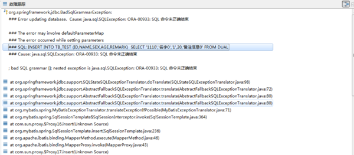

问题：

# mybatis 中用insert into select ..... 报错命令未正确结束，但把这句sql放到plsql中执行正常  

报错信息如上图

sql语句是 INSERT INTO TB_TEST(ID,NAME,SEX,AGE,REMARK) SELECT '110','名字','1',20,'备注' FROM DUAL

 把这句sql放入plsql中执行 是没问题的

但是在mybatis中执行就报错 ORA-00933:SQL 命令未正确结束

请教各位大虾，这个问题如何解决。在线等，谢谢

解决：

我也遇到了同样的问题，语句是正常的，我找了一下原因 是mybatis的这个useGeneratedKeys属性的问题，
官网的解释是 
允许 JDBC 支持自动生成主键，需要驱动兼容。如果设置为 true 则这个设置强制使用自动生成主键，尽管一些驱动不能兼容但仍可正常工作（比如 Derby）。
我写成了这样就不报错了
<insert id="saveOperatorAuthorityLink" parameterType="java.util.List" useGeneratedKeys="false">

来源： <http://zhidao.baidu.com/link?url=H21qWxtszzmF7Wtg9BrBlm3lP1LSt7Mb8DYi_6-1ux_UEtn9VWRpyCeEwJKJix5oZF_pOLhJYLy_7-LDsCSIDKHo4Vf-iDbPgGuiAzNr0zm>