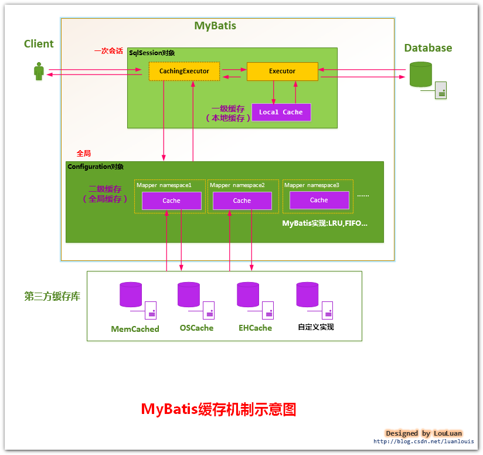
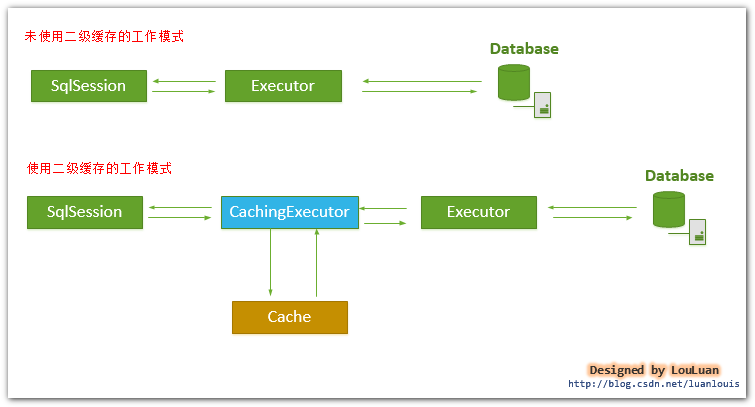
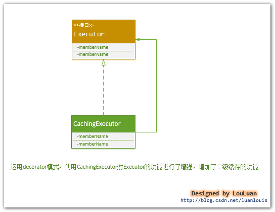
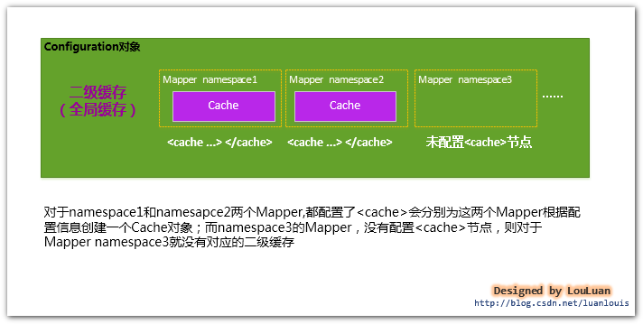
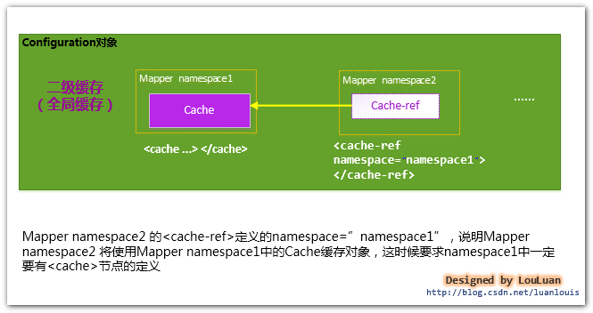
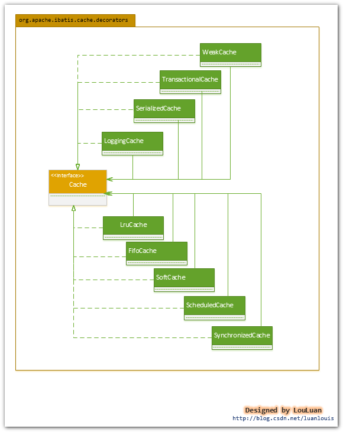

#  《深入理解mybatis原理》 MyBatis的二级缓存的设计原理

 MyBatis的二级缓存是Application级别的缓存，它可以提高对[数据库](http://lib.csdn.net/base/mysql)查询的效率，以提高应用的性能。本文将全面分析MyBatis的二级缓存的设计原理。

### **1.MyBatis的缓存机制整体设计以及二级缓存的工作模式**

​     

​     如上图所示，当开一个会话时，一个**SqlSession**对象会使用一个**Executor**对象来完成会话操作，**MyBatis**的二级缓存机制的关键就是对这个**Executor**对象做文章。如果用户配置了"**cacheEnabled=true**"，那么**MyBatis**在为**SqlSession**对象创建**Executor**对象时，会对**Executor**对象加上一个装饰者：**CachingExecutor**，这时**SqlSession**使用**CachingExecutor**对象来完成操作请求。**CachingExecutor**对于查询请求，会先判断该查询请求在**Application**级别的二级缓存中是否有缓存结果，如果有查询结果，则直接返回缓存结果；如果缓存中没有，再交给真正的**Executor**对象来完成查询操作，之后**CachingExecutor**会将真正**Executor**返回的查询结果放置到缓存中，然后在返回给用户。

​      

​        **CachingExecutor**是**Executor**的装饰者，以增强**Executor**的功能，使其具有缓存查询的功能，这里用到了设计模式中的装饰者模式，

​       **CachingExecutor**和**Executor**的接口的关系如下类图所示：

​    

### 2 . MyBatis二级缓存的划分

> **MyBatis**并不是简单地对整个**Application**就只有一个**Cache**缓存对象，它将缓存划分的更细，即是**Mapper**级别的，即每一个Mapper都可以拥有一个**Cache**对象，具体如下：
>
> > **a.为每一个Mapper分配一个Cache缓存对象（使用<cache>节点配置）；**
> >
> > **b.多个Mapper共用一个Cache缓存对象（使用<cache-ref>节点配置）；**

> **a.为每一个Mapper分配一个Cache缓存对象（使用<cache>节点配置）****MyBatis**将**Application**级别的二级缓存细分到**Mapper**级别，即对于每一个**Mapper.xml**,如果在其中使用了**<cache> **节点，则**MyBatis**会为这个**Mapper**创建一个**Cache**缓存对象，如下图所示：注：  上述的每一个Cache对象，都会有一个自己所属的namespace命名空间，并且会将Mapper的 namespace作为它们的ID；

> **b.多个Mapper共用一个Cache缓存对象（使用<cache-ref>节点配置）**如果你想让多个**Mapper**公用一个**Cache**的话，你可以使用**<cache-ref namespace="">**节点，来指定你的这个**Mapper**使用到了哪一个**Mapper**的**Cache**缓存。
> 

### **3. 使用二级缓存，必须要具备的条件**

​     **MyBatis**对二级缓存的支持粒度很细，它会指定某一条查询语句是否使用二级缓存。

​     虽然在**Mapper**中配置了**<cache>**,并且为此**Mapper**分配了**Cache**对象，这并不表示我们使用**Mapper**中定义的查询语句查到的结果都会放置到**Cache**对象之中，我们必须指定**Mapper**中的某条选择语句是否支持缓存，即如下所示，在**<select> **节点中配置**useCache="true"**，**Mapper**才会对此**Select**的查询支持缓存特性，否则，不会对此**Select**查询，不会经过**Cache**缓存。如下所示，**Select**语句配置了**useCache="true"**，则表明这条**Select**语句的查询会使用二级缓存。

```
<select id="selectByMinSalary" resultMap="BaseResultMap" parameterType="java.util.Map" useCache="true">  
```

总之，要想使某条**Select**查询支持二级缓存，你需要保证：

> **1.  MyBatis支持二级缓存的总开关：全局配置变量参数   cacheEnabled=true**
>
> **2. 该select语句所在的Mapper，配置了<cache> 或<cached-ref>节点，并且有效**
>
> **3. 该select语句的参数 useCache=true**

### 4. 一级缓存和二级缓存的使用顺序

​      请注意，如果你的**MyBatis**使用了二级缓存，并且你的**Mapper**和**select**语句也配置使用了二级缓存，那么在执行**select**查询的时候，**MyBatis**会先从二级缓存中取输入，其次才是一级缓存，即**MyBatis**查询数据的顺序是：

​        **二级缓存    ———> 一级缓存——> 数据库**

### **5. 二级缓存实现的选择**

​    **MyBatis**对二级缓存的设计非常灵活，它自己内部实现了一系列的**Cache**缓存实现类，并提供了各种缓存刷新策略如**LRU，FIFO**等等；另外，**MyBatis**还允许用户自定义**Cache**接口实现，用户是需要实现**org.apache.ibatis.cache.Cache**接口，然后将**Cache**实现类配置在**<cache  type="">**节点的**type**属性上即可；除此之外，**MyBatis**还支持跟第三方内存缓存库如**Memecached**的集成，总之，使用**MyBatis**的二级缓存有三个选择:

**1.MyBatis自身提供的缓存实现；**

**2. 用户自定义的Cache接口实现；**

**3.跟第三方内存缓存库的集成；**

### **6.  MyBatis自身提供的二级缓存的实现**

​     **MyBatis**自身提供了丰富的，并且功能强大的二级缓存的实现，它拥有一系列的**Cache**接口装饰者，可以满足各种对缓存操作和更新的策略。

​     **MyBatis**定义了大量的**Cache**的装饰器来增强**Cache**缓存的功能，如下类图所示。

​     对于每个**Cache**而言，都有一个容量限制，**MyBatis**各供了各种策略来对**Cache**缓存的容量进行控制，以及对**Cache**中的数据进行刷新和置换。**MyBatis**主要提供了以下几个刷新和置换策略：

​    **LRU：（Least Recently Used）**,最近最少使用[算法](http://lib.csdn.net/base/datastructure)，即如果缓存中容量已经满了，会将缓存中最近做少被使用的缓存记录清除掉，然后添加新的记录；

​     **FIFO：（First in first out）**,先进先出算法，如果缓存中的容量已经满了，那么会将最先进入缓存中的数据清除掉；

​    **Scheduled**：指定时间间隔清空算法，该算法会以指定的某一个时间间隔将**Cache**缓存中的数据清空；



### **6. 写在后面（关于涉及到的设计模式）**

  

  在二级缓存的设计上，MyBatis大量地运用了装饰者模式，如CachingExecutor, 以及各种Cache接口的装饰器。关于装饰者模式，读者可以阅读相关资料，我的另外一篇博文    [Java 设计模式 装饰者模式 ](http://blog.csdn.net/luanlouis/article/details/19021803)供读者参考。

本文只是讲述MyBatis二级缓存的基本原理，关于自定义二级缓存和与第三方内存库的集成，将在后续的文章中再做讨论，敬请关注！

作者的话    本文是《深入理解mybatis原理》系列的其中一篇，如果您有兴趣，请关注该系列的其他文章～   觉得本文不错，顺手点个赞哦～～您的鼓励，是我继续分享知识的强大动力！   如果您觉得有不妥或者错误的地方，还请您不吝指教！

 

 

\-----------------------------------------------------------------------------------------------------------------------------------------

​                                                                本文源自  <http://blog.csdn.net/luanlouis/，如需转载，请注明出处，谢谢！>


```

查看评论
13楼 phoonn 4小时前发表 [回复]

您好，我在实际测试源码的时候，发现CachingExecutor是在任何情况下都会包装Executor对象的。无论全局是否开启了cacheEnable策略。这个CachingExecutor是一级缓存的包装还是二级缓存的包装类？
12楼 YEN_CSDN 2016-10-14 22:25发表 [回复]

挺详细的
11楼 征途6 2016-10-05 15:11发表 [回复]

还有个问题，<cache-ref namespace="org.mapper.CostMapperDao"></cache-ref>
这样配置了后好像也没有生效，无法使用CostMapperDao的缓存，后来发现是cacheKey不一样，对比了一下发现是二者的MappedStatement ID不同
10楼 征途6 2016-10-04 18:25发表 [回复]

就是配置了flushCache=true之后useCache好像就无效了
9楼 征途6 2016-10-04 18:06发表 [回复]

有个问题请教下，一个查询语句如果使用了flushCache=true useCache=true后为什么还是会执行第二次查询,看日志它会获取缓存对象然后再次执行查询，如果flushCache=false就会命中缓存，不会进行二次查询 ，请问这是什么原因？
8楼 zbp1025 2015-09-06 20:04发表 [回复]

Executor是装饰者模式的话 baseExecutor应该是装饰者吧
7楼 剑八- 2015-05-25 17:01发表 [回复]

你好，
二级缓存个人觉得，如果对应用的是mybatis自身的或者第三方类似本地形式的cache，这样会有点问题
例：
商品服务有两台机子A和B，对于查询语句：
select * from product where id=1来讲。
第一次查询商品服务机子A，发现二级缓存没有，这时从一级缓存及数据库中进行查找，最终将查询到的结果放入二级缓存

第二次，如果用户对于id为1的商品进行更新，更新操作有可能在商品机子A或B上，这时是否就会产生数据不一致情况？
6楼 剑八- 2015-05-25 17:01发表 [回复]

你好，
二级缓存个人觉得，如果对应用的是mybatis自身的或者第三方类似本地形式的cache，这样会有点问题
例：
商品服务有两台机子A和B，对于查询语句：
select * from product where id=1来讲。
第一次查询商品服务机子A，发现二级缓存没有，这时从一级缓存及数据库中进行查找，最终将查询到的结果放入二级缓存

第二次，如果用户对于id为1的商品进行更新，更新操作有可能在商品机子A或B上，这时是否就会产生数据不一致情况？
5楼 干净的句号 2015-04-14 16:11发表 [回复]

楼主，对于，cache-ref，我有一个问题。我知道是全局共享的。但是全局共享，也没有什么作用啊，比如
mapperA.methodA(); 缓存到mapperA空间 key值是mapperA
mapperB.methodB();缓存到mapperB空间 key值是mapperB
mapperC.methodC();缓存到mapperC空间 key值是mapperC
现在都同一缓存到一个空间mapperD空间，作用还是一样呀！还是，无非就是少了几个namespace而已
4楼 GaryArch 2015-01-12 14:58发表 [回复]

我想问一下，如果系统需要根据登录用户名，链接至不同的数据库。我比较担心数据出现混乱。 比如 用户名A 查询到用户B的数据。
我的理解是，一级缓存，还是可以用。因为一级缓存的作用范围是sqlsession级别。
默认的二级缓存应该不能用。
是否可以通过自己扩展mybatis cache. 将数据库id添加到cache key中 ？
Re: 干净的句号 2015-04-14 16:06发表 [回复]

回复GaryArch：这个需要切换数据库，跟缓存机制没有关系。
3楼 fj359941160 2014-12-07 16:13发表 [回复]

用了二级缓存，开了两个SqlSession，没起作用。
Re: 亦山 2014-12-07 16:24发表 [回复]

回复fj359941160：另外，执行查询后，执行SqlSession.close()，也会将查询结果真正提交到二级缓存处理……
Re: 亦山 2014-12-07 16:17发表 [回复]

回复fj359941160：执行过查询之后，只有执行sqlSession.commit()后才会将查询结果真正提交到二级缓存处理
2楼 bowengod 2014-12-03 10:32发表 [回复]

我用的是3.1.1版本
1楼 bowengod 2014-12-02 22:01发表 [回复] [引用] [举报]

你好，我用过MyBatis的二级缓存，是通过实现Cache接口来跟memcached集成，我发现我Mapper中的select语句并没有设置参数 useCache=true，却用上了二级缓存。。。
Re: 干净的句号 2015-04-14 16:05发表 [回复]

回复bowengod：useCache默认是开启的。
public final class MappedStatement {

//other property
private boolean useCache;
Re: 亦山 2014-12-03 08:59发表 [回复] [引用] [举报]

回复bowengod：这可能跟MyBatis的版本有关吧，我介绍的MyBatis源码是3.2.7版本的，你用的什么版本？
Re: wuzhicheng123456 2015-06-16 17:27发表 [回复] [引用] [举报]

回复亦山：我的是3.1.1默认为true


```

来源： <http://blog.csdn.net/luanlouis/article/details/41408341>