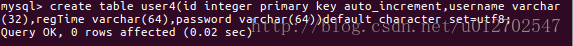

 

[TOC]


# 关于mybatis中typeHandler的两个案例

## 前言

在做开发时，我们经常会遇到这样一些问题，

比如我有一个Java中的Date数据类型，我想将之存到数据库的时候存成一个1970年至今的毫秒数，怎么实现？

再比如我有一个User类，User类中有一个属性叫做interest，这个属性用来描述用户的爱好，它的数据类型是一个List集合，那么我想在把这个List集合存入数据库的时候能够自动的变成`{XXX,XXX,XXX}`这样一个字符串然后存起来，当我从数据库读取的时候也是读取到这样一个字符串，读取成功之后再自动的将之转为一个List集合

，OK，以上两种需求用我们传统的数据库读写操作肯定都是可以实现的，只不过工作量略大，在mybatis中有一个功能略强大的typeHandler专门用来解决数据库中的数据类型和Java中的数据类型之间的转化问题，那么我们今天以上面两种需求为例，来看看typeHandler要怎么使用。如果还有小伙伴对mybatis不太熟悉，建议先阅读一下前面几篇博客（[初识mybatis](http://blog.csdn.net/u012702547/article/details/54408761)/[初识mybatis(二)](http://blog.csdn.net/u012702547/article/details/54425130)/[mybatis常用配置](http://blog.csdn.net/u012702547/article/details/54428432)/[mybatis映射器配置细则](http://blog.csdn.net/u012702547/article/details/54562619)），本文的内容将在前面几篇博客的基础上展开，当然如果小伙伴有mybatis基础，那直接往下看即可。 
事实上，mybatis本身已经为我们提供了许多typeHandler了，系统提供的typeHandler能够满足我们日常开发中的大部分需求，如上这两种特殊的需求就需要我们自己去定义typeHandler了。

## 案例一:日期的转换

先来看日期的转换，假设我现在创建一张表，如下： 
 
这张表中有一个字段叫做regTime，这个字段表示用户的注册时间，它的数据类型为varchar，OK，然后我再在Java中定义一个实体类：

```
public class User {
    private Long id;
    private String username;
    private String password;
    private Date regTime;
    //省略getter/setter
} 
```

这个JavaBean中也有一个regTime字段，不同的是这里的数据类型是Date，OK，如果我不做任何特殊处理，直接像[初识mybatis(二)](http://blog.csdn.net/u012702547/article/details/54425130)这篇博客中介绍的那样向数据库插入数据，也是可以插入成功的，但是插入成功后是这样： 
 
这个当然不是我想要的，我希望存到数据库里的是这样的： 
 
就是我直接向数据库写数据，要写的是一个Date对象，但是写到数据库之后这个Date对象就变成了Date对象所描述的时间到1970年的秒数了，然后当我从数据库读取这个秒数之后，系统又会自动帮我将这个秒数转为Date对象，就是这样两个需求。这个时候，我们要做的事情其实很简单，那就是自定义typeHandler，自定义typeHandler我们有两种方式，一种是实现TypeHandler接口，还有一种简化的写法就是继承自BaseTypeHandler类，我这里先以第二种为例来进行说明。

### 自定义typeHandler继承自BaseTypeHandler

```
@MappedJdbcTypes({JdbcType.VARCHAR})
@MappedTypes({Date.class})
public class MyDateTypeHandler extends BaseTypeHandler<Date> {
    public void setNonNullParameter(PreparedStatement preparedStatement, int i, Date date, JdbcType jdbcType) throws SQLException {
        preparedStatement.setString(i, String.valueOf(date.getTime()));
    }

    public Date getNullableResult(ResultSet resultSet, String s) throws SQLException {
        return new Date(resultSet.getLong(s));
    }

    public Date getNullableResult(ResultSet resultSet, int i) throws SQLException {
        return new Date(resultSet.getLong(i));
    }

    public Date getNullableResult(CallableStatement callableStatement, int i) throws SQLException {
        return callableStatement.getDate(i);
    }
} 
```

关于这个类我说如下几点：

> 1.@MappedJdbcTypes定义的是JdbcType类型，这里的类型不可自己随意定义，必须要是枚举类org.apache.ibatis.type.JdbcType所枚举的数据类型。 
> 2.@MappedTypes定义的是JavaType的数据类型，描述了哪些Java类型可被拦截。 
> 3.在我们启用了我们自定义的这个TypeHandler之后，数据的读写都会被这个类所过滤 
> 4.在setNonNullParameter方法中，我们重新定义要写往数据库的数据。 
> 5.在另外三个方法中我们将从数据库读出的数据类型进行转换。

### 在Mapper中进行配置

自定义好了typeHandler之后，接下来我们需要在userMapper.xml中进行简单的配置，首先我们可以像上文说的，配置resultMap，如下：

```
<resultMap id="userResultMap" type="org.sang.bean.User">
        <result typeHandler="org.sang.db.MyDateTypeHandler" column="regTime" javaType="java.util.Date"
                jdbcType="VARCHAR"
                property="regTime"/>
    </resultMap>12345
```

配置resultMap的时候我们指定了javaType和jdbcType，同时也指定了处理的typeHandler，然后在select中使用这个resultMap：

```
<select id="getUser" resultMap="userResultMap">
        select * from user4
    </select>123
```

但是这种方式有一个缺点那就是只适用于查询操作，即在查询的过程中系统会启用我们自定义的typeHandler，会将秒数转为Date对象，但是在插入的时候却不会启用我们自定义的typeHandler，想要在插入的时候启用自定义的typeHandler，需要我们在insert节点中简单配置一下，如下：

```
<insert id="insertUser" parameterType="org.sang.bean.User">
        INSERT INTO user4(username,password,regTime) VALUES (#{username},#{password},#{regTime,javaType=Date,jdbcType=VARCHAR,typeHandler=org.sang.db.MyDateTypeHandler})
    </insert>
```

也可以只配置javaType和jdbcType，如下：

```
<insert id="insertUser2">
        INSERT INTO user4(username,password,regTime) VALUES (#{username},#{password},#{regTime,javaType=Date,jdbcType=VARCHAR})
    </insert>
```

或者只配置typeHandler：

```
<insert id="insertUser3">
        INSERT INTO user4(username,password,regTime) VALUES (#{username},#{password},#{regTime,typeHandler=org.sang.db.MyDateTypeHandler})
    </insert>123
```

这三种效果都是一样的，都是在插入的时候将数据Date对象转为秒数。OK，如此之后，我们就可以实现将Date对象插入数据库之后变秒数以及将数据库中的秒数读取之后自动转为Date对象了。我们来看一个简单的测试：

```
    @Test
    public void test2() {
        SqlSession sqlSession = null;
        try {
            sqlSession = DBUtils.openSqlSession();
            UserMapper userMapper = sqlSession.getMapper(UserMapper.class);
            User user = new User();
            user.setPassword("222222");
            user.setUsername("李四");
            Date regTime = new Date();
            user.setRegTime(regTime);
            userMapper.insertUser(user);
            sqlSession.commit();
        } catch (Exception e) {
            e.printStackTrace();
            sqlSession.rollback();
        } finally {
            if (sqlSession != null) {
                sqlSession.close();
            }
        }

    }
```

插入结果如下： 


读取代码：

```
@Test
    public void test1() {
        SqlSession sqlSession = null;
        try {
            sqlSession = DBUtils.openSqlSession();
            UserMapper userMapper = sqlSession.getMapper(UserMapper.class);
            List<User> list = userMapper.getUser();
            for (User user : list) {
                System.out.println(user);
            }
            sqlSession.commit();
        } catch (Exception e) {
            e.printStackTrace();
            sqlSession.rollback();
        } finally {
            if (sqlSession != null) {
                sqlSession.close();
            }
        }

    }
```

读取结果如下： 


OK，结果上面几步配置我们就完美的解决了读写时的数据转换问题了，读取时的数据转换除了我们上面介绍的定义resultMap然后在select节点中引用这种方式之外，也可以使用下面这种方式，注意下面这种方式**只能解决读取时的数据转换问题**

### 在配置文件中注册typeHandler

我们需要在我们的mybatis配置文件中注册typeHandler，注册有两种不同的方式，可以像下面这样一个类一个类的注册：

```
<typeHandlers>
        <typeHandler handler="org.sang.db.MyDateTypeHandler"/>
    </typeHandlers>
```

也可以直接注册一个包中所有的typeHandler，系统在启动时会自动扫描包下的所有文件，如下：

```
<typeHandlers>
        <package name="org.sang.db"/>
    </typeHandlers>
```

这样配置完成之后，我们的目的就达到了，当我们进行数据库的读取操作的时候，秒数就会自动转为Date对象。

### 小结

OK，经过上面的介绍，想必小伙伴对typeHandler的使用已经有一定了解了，总结一下就是读取时的配置要和插入时的配置分贝来做，读取时数据转换我们有两种配置方式，分别是resultMap和在mybatis配置文件中配置typeHandlers，插入时的配置就是在insert节点中进行配置。

## 案例二:List集合的转换

OK，如果小伙伴们学会了如何把Date转为秒数，那么对于List集合的转换我就不再赘述了，道理都是一样的，大家可以可以直接在文末下载Demo，Demo中有List集合转换的案例。 
这里给大家看两张效果图吧： 
List集合存入数据库之后变成这样： 
 
读取出来之后又自动转为List集合了，下图是查询操作，实体类，和查询结果： 


OK，以上就是我们对typeHandler的一个简单介绍。

本文案例下载： 
本文案例GitHub地址<https://github.com/lenve/JavaEETest/tree/master/Test27-mybatis6>。

以上。

参考资料： 
《深入浅出MyBatis 技术原理与实战》第三章


http://blog.csdn.net/u012702547/article/details/54572679