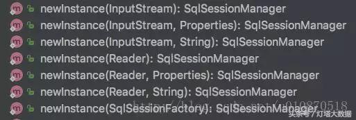
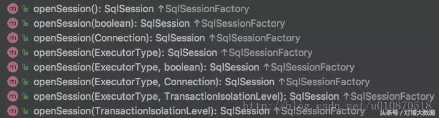

[TOC]


# SqlSessionTemplate是如何保证MyBatis中SqlSession的线程安全的

## 一、DefaultSqlSession的线程不安全性

在MyBatis架构中SqlSession是提供给外层调用的顶层接口，实现类有：DefaultSqlSession、SqlSessionManager以及mybatis-spring提供的实现SqlSessionTemplate。默认的实现类为DefaultSqlSession如。类图结构如下所示：


对于MyBatis提供的原生实现类来说，用的最多的就是DefaultSqlSession，但我们知道DefaultSqlSession这个类不是线程安全的！如下：


## 二、SqlSessionTemplate是如何使用DefaultSqlSession的

而在我们开发的时候肯定会用到Spring，也会用到mybatis-spring框架，在使用MyBatis与Spring集成的时候我们会用到了SqlSessionTemplate这个类，例如下边的配置，注入一个单例的SqlSessionTemplate对象：

```xml
<bean id="sqlSessionTemplate" class="org.mybatis.spring.SqlSessionTemplate">
    <constructor-arg ref="sqlSessionFactory" />
</bean>
```

SqlSessionTemplate的源代码注释如下：


通过源码我们何以看到 SqlSessionTemplate实现了SqlSession接口，也就是说我们可以使用SqlSessionTemplate来代理以往的DefaultSqlSession完成对数据库的操作，但是DefaultSqlSession这个类不是线程安全的，所以DefaultSqlSession这个类不可以被设置成单例模式的。

如果是常规开发模式的话，我们每次在使用DefaultSqlSession的时候都从SqlSessionFactory当中获取一个就可以了。但是与Spring集成以后，Spring提供了一个全局唯一的SqlSessionTemplate对象来完成DefaultSqlSession的功能，问题就是：无论是多个Dao使用一个SqlSessionTemplate，还是一个Dao使用一个SqlSessionTemplate，SqlSessionTemplate都是对应一个sqlSession对象，当多个web线程调用同一个Dao时，它们使用的是同一个SqlSessionTemplate，也就是同一个SqlSession，那么它是如何确保线程安全的呢？让我们一起来分析一下：

## 三、SqlSessionTemplate是如何保证DefaultSqlSession线程安全的

（1）首先，通过如下代码创建代理类，表示创建SqlSessionFactory的代理类的实例，该代理类实现SqlSession接口，定义了方法拦截器，如果调用代理类实例中实现SqlSession接口定义的方法，该调用则被导向SqlSessionInterceptor的invoke方法（代理对象的InvocationHandler就是SqlSessionInterceptor，如果把它命名为SqlSessionInvocationHandler则更好理解！）


核心代码就在 SqlSessionInterceptor的invoke方法当中。

```java
private class SqlSessionInterceptor implements InvocationHandler {
    @Override
    public Object invoke(Object proxy, Method method, Object[] args) 
            throws Throwable {
        //获取SqlSession(这个SqlSession才是真正使用的，它不是线程安全的)
        //这个方法可以根据Spring的事物上下文来获取事物范围内的sqlSession
        SqlSession sqlSession = getSqlSession(
                SqlSessionTemplate.this.sqlSessionFactory,
                SqlSessionTemplate.this.executorType,
                SqlSessionTemplate.this.exceptionTranslator);
        try {
            //调用从Spring的事物上下文获取事物范围内的sqlSession对象
            Object result = method.invoke(sqlSession, args);
            //然后判断一下当前的sqlSession是否被Spring托管 如果未被Spring托管则自动commit
            if (!isSqlSessionTransactional(sqlSession, 
                    SqlSessionTemplate.this.sqlSessionFactory)) {
                // force commit even on non-dirty sessions because some databases require
                // a commit/rollback before calling close()
                sqlSession.commit(true);
            }
            return result;
        } catch (Throwable t) {
            //如果出现异常则根据情况转换后抛出
            Throwable unwrapped = unwrapThrowable(t);
            if (SqlSessionTemplate.this.exceptionTranslator != null && 
                    unwrapped instanceof PersistenceException) {
                // release the connection to avoid a deadlock if the 
                // translator is no loaded. See issue #22
                closeSqlSession(sqlSession, SqlSessionTemplate.this.sqlSessionFactory);
                sqlSession = null;
                Throwable translated = SqlSessionTemplate.this.exceptionTranslator.
                        translateExceptionIfPossible((PersistenceException) unwrapped);
                if (translated != null) {
                    unwrapped = translated;
                }
            }
            throw unwrapped;
        } finally {
            if (sqlSession != null) {
                //关闭sqlSession，它会根据当前的sqlSession是否在Spring的事物上下文当中来执行具体的关闭动作
                //如果sqlSession被Spring管理 则调用holder.released();
                //使计数器-1，否则才真正的关闭sqlSession
                closeSqlSession(sqlSession, SqlSessionTemplate.this.sqlSessionFactory);
            }
        }
    }
}
```

在上面的invoke方法当中使用了两个工具方法分别是：

```
（1）SqlSessionUtils.getSqlSession(SqlSessionFactory sessionFactory, ExecutorType executorType, PersistenceExceptionTranslator exceptionTranslator)
（2）SqlSessionUtils.closeSqlSession(SqlSession session, SqlSessionFactory sessionFactory)
```

那么这两个方法又是如何与Spring的事物进行关联的呢？

1、getSqlSession方法如下：

```java
public static SqlSession getSqlSession(SqlSessionFactory sessionFactory, 
        ExecutorType executorType, PersistenceExceptionTranslator exceptionTranslator) {

    notNull(sessionFactory, NO_SQL_SESSION_FACTORY_SPECIFIED);
    notNull(executorType, NO_EXECUTOR_TYPE_SPECIFIED);

    //根据sqlSessionFactory从当前线程对应的资源map中获取SqlSessionHolder，
    // 当sqlSessionFactory创建了sqlSession，
    //就会在事务管理器中添加一对映射：key为sqlSessionFactory，value为SqlSessionHolder，
    // 该类保存sqlSession及执行方式
    SqlSessionHolder holder = (SqlSessionHolder) TransactionSynchronizationManager.
            getResource(sessionFactory);

    //从SqlSessionHolder中提取SqlSession对象
    SqlSession session = sessionHolder(executorType, holder);
    if (session != null) {
        return session;
    }

    if (LOGGER.isDebugEnabled()) {
        LOGGER.debug("Creating a new SqlSession");
    }
    //如果当前事物管理器中获取不到SqlSessionHolder对象就重新创建一个
    session = sessionFactory.openSession(executorType);

    //将新创建的SqlSessionHolder对象注册到TransactionSynchronizationManager中
    registerSessionHolder(sessionFactory, executorType, exceptionTranslator, session);

    return session;
}
```

2、closeSqlSession方法如下：

```java
//删除了部分日志代码
public static void closeSqlSession(SqlSession session, SqlSessionFactory sessionFactory) {
        //其实下面就是判断session是否被Spring事务管理，如果管理就会得到holder
        SqlSessionHolder holder = (SqlSessionHolder) 
        TransactionSynchronizationManager.getResource(sessionFactory);
        if ((holder != null) && (holder.getSqlSession() == session)) {
            //这里释放的作用，不是关闭，只是减少一下引用数，因为后面可能会被复用 
            holder.released();
        } else {
            //如果不是被spring管理，那么就不会被Spring去关闭回收，就需要自己close 
            session.close();
        }
    }
```


大致的分析到此为止，可能有些许不够顺畅，不过：纸上得来终觉浅，绝知此事要躬行！还希望小伙伴打开自己的编译器，找到此处的代码，认真走一遍流程！

其实通过上面的代码我们可以看出Mybatis在很多地方都用到了代理模式，代理模式可以说是一种经典模式，其实不紧紧在这个地方用到了代理模式，Spring的事物、AOP、Mybatis数据库连接池技术、MyBatis的核心原理（如何在只有接口没有实现类的情况下完成数据库的操作！）等技术都使用了代理技术。

## 四、SqlSessionManager又是什么鬼？

上述说了SqlSession的实现还有一个SqlSessionManager，那么SqlSessionManager到底是什么个东西哪？且看定义如下：


你可能会发现SqlSessionManager的构造方法竟然是private的，那我们怎么创建这个对象哪？其实SqlSessionManager创建对象是通过newInstance的方法创建对象的，但需要注意的是他虽然有私有的构造方法，并且提供给我们了一个公有的newInstance方法，但它并不是一个单例模式！

newInstance有很多重载的方法，如下所示：



SqlSessionManager的openSession方法及其重载的方法是直接通过调用其中底层封装的SqlSessionFactory对象的openSession方法来创建SqlSession对象的，重载方法如下：




SqlSessionManager中实现了SqlSession接口中的方法，例如：select、update等，都是直接调用sqlSessionProxy代理对象中相应的方法。在创建该代理对像的时候使用的InvocationHandler对象是SqlSessionInterceptor，他是定义在SqlSessionManager的一个内部类，其定义如下：


## 五、总结

综上所述，我们应该大致了解了DefaultSqlSession和SqlSessionManager之间的区别：

1、DefaultSqlSession的内部没有提供像SqlSessionManager一样通过ThreadLocal的方式来保证线程的安全性；

2、SqlSessionManager是通过localSqlSession这个ThreadLocal变量，记录与当前线程绑定的SqlSession对象，供当前线程循环使用，从而避免在同一个线程多次创建SqlSession对象造成的性能损耗；

3、DefaultSqlSession不是线程安全的，我们在进行原生开发的时候，需要每次为一个操作都创建一个SqlSession对象，其性能可想而知；

## 六、扩展面试题

那么问题来了：

1、为什么mybatis-spring框架中不直接使用线程安全的SqlSessionManager（SqlSessionFactory它是线程安全的）而是使用DefaultSqlSession这个线程不安全的类，并通过动态代理的方式来保证DefaultSqlSession操作的线程安全性哪？

2、DefaultSqlSession中是如何通过Executor来表现策略模式的或者DefaultSqlSession如何使用策略模式模式的？


http://blog.csdn.net/xlgen157387/article/details/79438676