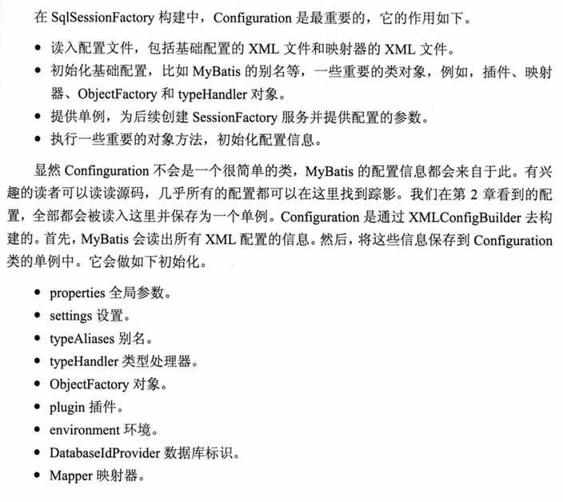

# mybatis源码分析


## mybatis的基本构成


## 构建SqlSessionFactory过程

### 构建Configuration



### 映射器的内部组成

- MappedStatement：保存映射器的一个节点（select|insert|delete|update）。包括许多我们配置的SQL、SQL的id、缓存信息、resultMap、ParameterType、resultType、languageDriver等重要配置内容
- SqlSource：它是提供BoundSql对象的地方，它是MappedStatement的一个属性。描述sql语句（sql语句、入参、和配置信息）
- BoundSql：它是建立SQL和参数的地方。它有3个常用属性：SQL、parameterObject、parameterMappings


### 构建SqlSessionFactory


## SqlSession运行过程

### 映射器的动态代理

MapperFactoryBean.getObject() ：mapper类生产工厂

```
  public T getObject() throws Exception {
    return getSqlSession().getMapper(this.mapperInterface);
  }
```

MapperProxyFactory：mapper代理工厂

```
  public <T> T getMapper(Class<T> type, SqlSession sqlSession) {
    final MapperProxyFactory<T> mapperProxyFactory = (MapperProxyFactory<T>) knownMappers.get(type);
    if (mapperProxyFactory == null) {
      throw new BindingException("Type " + type + " is not known to the MapperRegistry.");
    }
    try {
      return mapperProxyFactory.newInstance(sqlSession);
    } catch (Exception e) {
      throw new BindingException("Error getting mapper instance. Cause: " + e, e);
    }
  }
```

MapperProxy.invoke：mapper代理执行添加逻辑  

```
  public Object invoke(Object proxy, Method method, Object[] args) throws Throwable {
    if (Object.class.equals(method.getDeclaringClass())) {
      try {
        return method.invoke(this, args);
      } catch (Throwable t) {
        throw ExceptionUtil.unwrapThrowable(t);
      }
    }
    //创建方法
    final MapperMethod mapperMethod = cachedMapperMethod(method);
    return mapperMethod.execute(sqlSession, args);
  }
```

MapperMethod：执行sql语句入口

MappedStatement：一个执行方法接口的具体信息。xml文件位置、id 、配置、sql等信


### SqlSession下的四大对象

Mapper执行是MapperProxy代理根据执行的接口方法查询创建MapperMethod然后执行map的方法，最终还是调用sqlSession（其实都是DefaultSqlSession实现类）来执行查询修改插入方法，sqlSession内部执行过程是通过Executor、StatementHandler、ParameterHandler和ResultHandler来完成数据库操作和结果返回的。

- Executor代表执行器，由它来调度StatementHandler、ParameterHandler和ResultHandler等来执行对应的SQL（默认用SimpleExecutor）
- StatementHandler的作用是使用数据库的Statement（PreparedStatement）执行操作，它是四大对象的核心，起到承上启下的作用。（默认用PreparedStatementHandler）
- ParameterHandler用于SQL对参数的处理。
- ResultHandler是进行最后数据集（ResultSet）的封装返回处理的。（默认用DefaultResultSetHandler）


