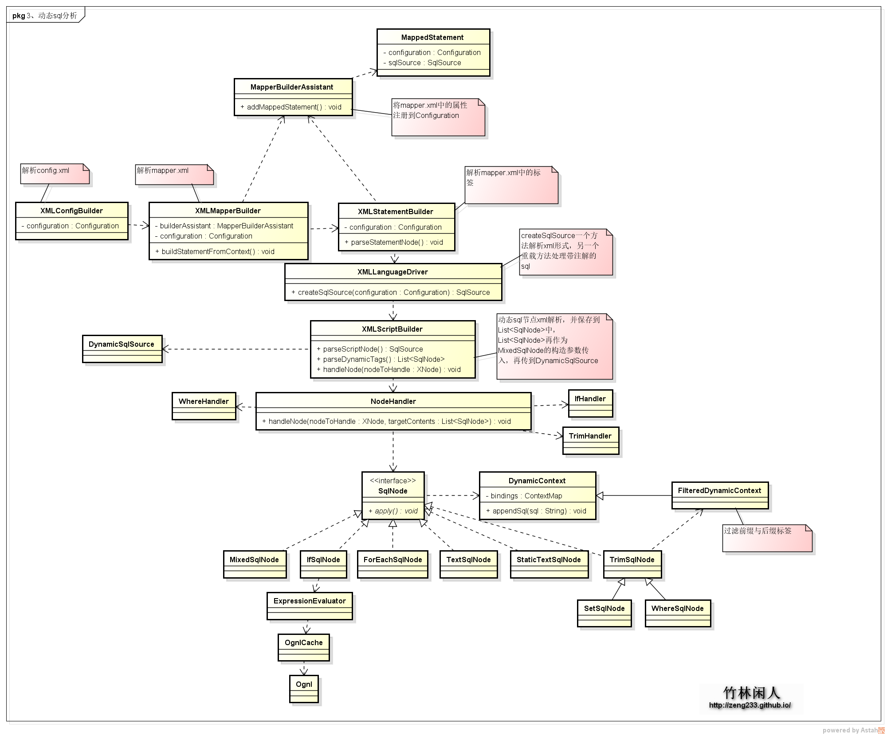
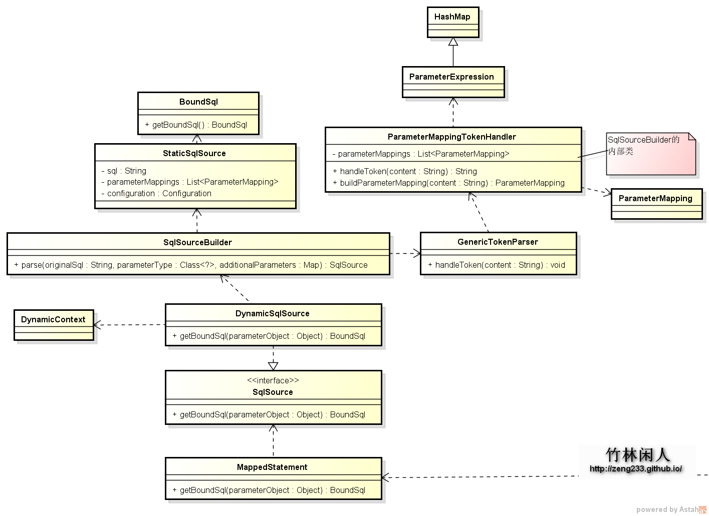

[TOC]


# mybatis源码分析之动态SQL语句分析

By [竹林闲人](https://plus.google.com/106512881304692844041?rel=author)

 发表于 2015-0

## 创建动态SQL

动态SQL作为mybatis最强大的功能之一，比起其他数据层的框架可以在开发中少很多麻烦，再也不用纠结多条件查询等问题了。在最新的mybatis版本，动态标签只有if、choose（when、otherwise）、trim（where、set）、foreach，同时动态标签中还可以使用OGNL表达式进行一些复杂的处理。mybatis生成SQL语句主要类之间的关系如下图所示：



通过简单的一条查询语句跟踪，构建动态sql语句大概类之间的依赖关系就差不多明白了。
以动态查询SQL为例分析：

### 解析xml中的sql标签

XMLStatementBuilder专门解析mapper.xml文件中的sql语句标签，然后再把这条语句的MappedStatement对象添加到Configuration对象中去。 根据标签中的lang属性，可以用不同的语言去解析sql语句，可以为xml、注解、[自定义velocity](https://github.com/mybatis/velocity-scripting)或者[自定义freemarker](https://github.com/mybatis/freemarker-scripting)解析等等。这里以xml为例，解析sql标签中的sql语句，又有个XMLScriptBuilder来处理，把sql语句中的标签处理完了，一条完整的sql就出来了。
根据传入的XNode（sql语句）节点，循环解析XNode的子节点，如果是文本就直接生成StaticTextSqlNode然后传到List，如果是动态标签还要循序下去，直到没有标签。最终把所有节点存入List，然后再作为参数传递到MixedSqlNode ，具体的代码实现参考XMLScriptBuilder：

```java
public SqlSource parseScriptNode() {
    List<SqlNode> contents = parseDynamicTags(context);
    MixedSqlNode rootSqlNode = new MixedSqlNode(contents);
    SqlSource sqlSource = null;
    if (isDynamic) {
      sqlSource = new DynamicSqlSource(configuration, rootSqlNode);
    } else {
      sqlSource = new RawSqlSource(configuration, rootSqlNode, parameterType);
    }
    return sqlSource;
}
...
List<SqlNode> parseDynamicTags(XNode node) {
    List<SqlNode> contents = new ArrayList<SqlNode>();
    NodeList children = node.getNode().getChildNodes();
    for (int i = 0; i < children.getLength(); i++) {
      XNode child = node.newXNode(children.item(i));
      if (child.getNode().getNodeType() == Node.CDATA_SECTION_NODE || child.getNode().getNodeType() == Node.TEXT_NODE) {
        String data = child.getStringBody("");
        TextSqlNode textSqlNode = new TextSqlNode(data);
        if (textSqlNode.isDynamic()) {
          contents.add(textSqlNode);
          isDynamic = true;
        } else {
          contents.add(new StaticTextSqlNode(data));
        }
      } else if (child.getNode().getNodeType() == Node.ELEMENT_NODE) { // issue #628
        String nodeName = child.getNode().getNodeName();
        NodeHandler handler = nodeHandlers(nodeName);
        if (handler == null) {
          throw new BuilderException("Unknown element <" + nodeName + "> in SQL statement.");
        }
        handler.handleNode(child, contents);
        isDynamic = true;
      }
    }
    return contents;
  }

  private class IfHandler implements NodeHandler {
    public IfHandler() {
      // Prevent Synthetic Access
    }

    @Override
    public void handleNode(XNode nodeToHandle, List<SqlNode> targetContents) {
      List<SqlNode> contents = parseDynamicTags(nodeToHandle);
      MixedSqlNode mixedSqlNode = new MixedSqlNode(contents);
      String test = nodeToHandle.getStringAttribute("test");
      IfSqlNode ifSqlNode = new IfSqlNode(mixedSqlNode, test);
      targetContents.add(ifSqlNode);
    }
  }


  NodeHandler nodeHandlers(String nodeName) {
  	//所有的标签处理器
    Map<String, NodeHandler> map = new HashMap<String, NodeHandler>();
    map.put("trim", new TrimHandler());
    map.put("where", new WhereHandler());
    map.put("set", new SetHandler());
    map.put("foreach", new ForEachHandler());
    map.put("if", new IfHandler());
    map.put("choose", new ChooseHandler());
    map.put("when", new IfHandler());
    map.put("otherwise", new OtherwiseHandler());
    map.put("bind", new BindHandler());
    return map.get(nodeName);
  }
```

if标签处理:

```java
package org.apache.ibatis.scripting.xmltags;

/**
 * @author Clinton Begin
 */
public class IfSqlNode implements SqlNode {
  private ExpressionEvaluator evaluator;
  private String test;
  private SqlNode contents;

  public IfSqlNode(SqlNode contents, String test) {
    this.test = test;
    this.contents = contents;
    this.evaluator = new ExpressionEvaluator();
  }

  @Override
  public boolean apply(DynamicContext context) {
    if (evaluator.evaluateBoolean(test, context.getBindings())) {
      contents.apply(context);
      return true;
    }
    return false;
  }

}
```

这样就获取到DynamicSqlSource了，然后DynamicSqlSource作为参数传递到MappedStatement。
参考XMLStatementBuilder的parseStatementNode方法：

```java
SqlSource sqlSource = langDriver.createSqlSource(configuration, context, parameterTypeClass);
```

### 初始化BoundSql

解析动态sql语句的时候，只是把标签去除掉了，#{}表达式还是一样在sql语句里面的，这样显然不能执行。mybatis执行器执行sql语句首先从MappedStatement拿到上次构建的动态sql，参考MappedStatement.getBoundSql()，如图所示：



直接从DynamicSqlSource入手分析，DynamicSqlSource.getBoundSql(Object parameterObject)方法依赖两个重要的类：
1）DynamicContext：保存参数以及拼接SQL语句，ContextMap保存参数，里面使用了MetaObject（防止参数对象里面没有get\set方法）
2）SqlSourceBuilder：处理处理占位符和参数
3）ParameterMappingTokenHandler：SqlSourceBuilder的内部类，通过工具类GenericTokenParser的解析，构建参数对象ParameterMapping并保存到List列表parameterMappings中，然后将SQL语句中的占位符替换成问号（？）
4）StaticSqlSource：动态语句解析后的SqlSource，通过getBoundSql(Object parameterObject)获取到BoundSql
最终生成带?占位符的SQL语句。

针对sql标签中，当个参数时，没有参数标签（如parameterType），只能使用_parameter的原因：
判断if标签使用了OGNL表达式，因为实例化DynamicContext的时候，会将参数装进Map里面，默认的键值就为_parameter，在基本类型对象中没有get/set方法获取不到值，然后就去Map中去找key，如果有key值和这个参数对应，就可以继续拼接SQL了，#{_parameter}或者#{id}作为占位符都可以，但是标签中只能用_parameter 。在实例化ParameterMappingTokenHandler的时候，将这个参数Map用configuration.newMetaObject(additionalParameters)方法实现用反射的MapWrapper代替原始的参数Map，使用期getGetterType就可以判断参数类型了，然后把参数类型赋值给ParameterMapping的javaType。

### 执行SQL语句

参考SimpleExecutor的prepareStatement方法：

```java
private Statement prepareStatement(StatementHandler handler, Log statementLog) throws SQLException {
    Statement stmt;
    log.debug("statemet：获取connection连接，如果要打印日志，则返回代理类ConnectionLogger");
    Connection connection = getConnection(statementLog);
    stmt = handler.prepare(connection);
    log.debug("statement：参数化把占位符替换成具体值");
    handler.parameterize(stmt);
    return stmt;
}

```

因为是动态SQL，会调用PreparedStatementHandler.parameterize方法，最后由DefaultParameterHandler处理带？的占位符，参考setParameters方法：

```java
@Override
public void setParameters(PreparedStatement ps) throws SQLException {
    ErrorContext.instance().activity("setting parameters").object(mappedStatement.getParameterMap().getId());

    log.debug("parameter：解析bandSql中的参数并设置到PreparedStatement");
    List<ParameterMapping> parameterMappings = boundSql.getParameterMappings();
    if (parameterMappings != null) {
      for (int i = 0; i < parameterMappings.size(); i++) {
        ParameterMapping parameterMapping = parameterMappings.get(i);
        if (parameterMapping.getMode() != ParameterMode.OUT) {
          Object value;
          String propertyName = parameterMapping.getProperty();
          if (boundSql.hasAdditionalParameter(propertyName)) { // issue #448 ask first for additional params
            value = boundSql.getAdditionalParameter(propertyName);
          } else if (parameterObject == null) {
            value = null;
          } else if (typeHandlerRegistry.hasTypeHandler(parameterObject.getClass())) {//如果参数类型在typeHandlerRegistry中能找到，就赋值给value
            value = parameterObject;
          } else {
            MetaObject metaObject = configuration.newMetaObject(parameterObject);
            value = metaObject.getValue(propertyName);
          }
          TypeHandler typeHandler = parameterMapping.getTypeHandler();
          JdbcType jdbcType = parameterMapping.getJdbcType();
          if (value == null && jdbcType == null) {
            jdbcType = configuration.getJdbcTypeForNull();
          }
          log.debug("parametor：这里就是执行类似于自定义自己的typehandler进行参数设置");
          typeHandler.setParameter(ps, i + 1, value, jdbcType);
        }
      }
    }
}

```

typeHandler.setParameter就是专门处理传入的参数，然后由setNonNullParameter方法将参数值设置到PreparedStatement，这样最终生成的SQL就带?占位符，出入到PreparedStatement就可以执行了。


http://zeng233.github.io/2015/09/28/2.4mybatis%E6%BA%90%E7%A0%81%E5%88%86%E6%9E%90%E4%B9%8B%E5%8A%A8%E6%80%81SQL%E8%AF%AD%E5%8F%A5%E5%88%86%E6%9E%90/