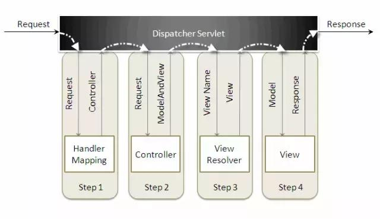
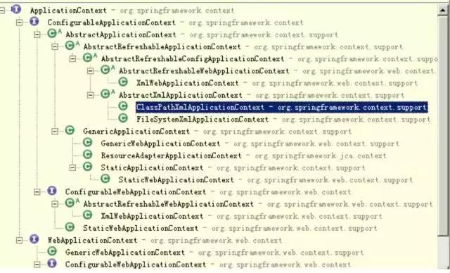

[TOC]


# SpringMVC工作原理详解

## 总体介绍



 

- Dispatcher Servlet分发器
- Handler Mapping 处理器映射
- Controller 控制器
- ModelAndView 模型和视图对象
- ViewResolver 视图解析器

Spring MVC 分离了控制器、模型对象、分派器以及处理程序对象的角色，这种分离让它们更容易进行定制。

Spring MVC属于SpringFrameWork的后续产品，已经融合在Spring Web Flow里面。Spring 框架提供了构建 Web 应用程序的全功能 MVC 模块。

Spring框架是业务层框架，核心组件是容器，它是管理bean的，广义上讲任何一个javaBean它都管理，实例化对象两大概念：IOC、AOP。

## **拦截配置**

*.action拦截所有访问URL后缀为action，/ 拦截所有的访问的URL, 包括action， 静态js, images, css。

如何修改action-servlet.xml文件名和位置？

- 移动action-servlet.xml到src目录下，改名为spring-mvc.xml
- 修改web.xml，给DispatcherServlet增加初始参数
- 通过初始化参数，指定配置文件位置

```
<?xml version="1.0" encoding="utf-8"?>

<servlet> 
  <servlet-name>action</servlet-name>  
  <servlet-class>org.springframework.web.servlet.DispatcherServlet</servlet-class>  
  <init-param> 
    <param-name>contextConfigLocation</param-name>  
    <param-value>classpath:spring-mvc.xml</param-value> 
  </init-param> 
</servlet>
```

**spring-mvc注解方式开发**（spring3.2.2）

- 新建web project，要保证项目编码为UTF-8，否则中文乱码。
- 引入jar包
- web.xml中配置分发器servlet DispatchServlet
- 创建spring配置文件(进行包扫描，和视图解析器) action-servlet.xml 视图解析器访问路径：prefix + logicName + suffix
- 创建控制器
- 创建jsp文件
- 发布、测试

**springMVC是何时加载的？**

它不是随着web容器启动而加载，而是在第一次访问时才加载

**IOC(控制反转)**

将一个类放到spring容器（bean）里面，spring容器来创建对象。

例：正常情况你要吃饭，需要先到食堂，然后买饭吃饭。

- 突然有一天你不想出去了，定了一份外卖，剩了去食堂的过程，只需要吃饭就可以了。
- 将买饭的任务交给送餐的，对应的就是将对象的创建交给spring，过程不用你管 。

把一个类放到spring容器中， 类叫bean，换句话说，一个bean描述一个类。

- beans 存放了很多的类
- id是标识符
- class是类的全名

spring有很多容器的



 

spring关心的是集中管理在java企业应用和web应用中涉及的数据持久化，事务处理，消息中间件，分布式计算等抽象资源，并在此基础上，为应用提供了基于pojo的开发环境。

## Struts1、Struts2和springmvc比较

面试要点：Struts1、Struts2和springmvc比较

- 都是web层框架。
- Struts1是基于servlet；Struts2是基于filter；springmvc是基于servlet 。
- Struts1的action是单例模式，线程不安全的；Struts2 action是原型模式 prototype，每次访问对象都会创建新的实例，保证线程安全性；springmvc controller是单例模式，整个程序只有一个对象实例。Spring的安全性是通过绑定threadlocal实现。
- Struts1使用JSTL EL表达式，但是对集合和索引属性的支持很弱。Struts2采用 OGNL。 struts2是类级别的拦截， 一个类对应一个request上下文，springmvc是方法级别的拦截，一个方法对应一个request上下文，而方法同时又跟一个url对应。
- Strust1中通常以action访问时.do，struts2、spring mvc 都是以.action做结尾。
- spring3 mvc可以认为已经100%零配置了。


https://www.toutiao.com/a6507103492614652429/?tt_from=android_share&utm_campaign=client_share&timestamp=1515126474&app=news_article&iid=22128443611&utm_medium=toutiao_android