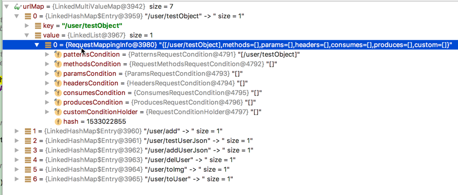

# [SpringMVC源代码学习（六）HanderMapping详解](http://blog.csdn.net/xia4820723/article/details/51438224)


以下内容基于书：[《看透SpringMVC-源代码分析与实践》](https://book.douban.com/subject/26696099/)基本照搬。。。用于自己查阅备忘。

## 抽象类AbstractHandlerMethodMapping

可以看到HandlerMapping家族有两个分支，分别继承自AbstractUrlHandlerMapping与AbstractHandlerMethodMapping。它们又统一继承于*AbstractHandlerMapping*。 
*AbstractHandlerMappin*是接口HandlerMapping的抽象实现，它是一个模板方法，子类通过模板方法提供些初始值或具体的[算法](http://lib.csdn.net/base/datastructure)即可。以前的源代码阅读也能发现[spring](http://lib.csdn.net/base/javaee)的组件都是采用这样的模式。 
*AbstractHandlerMappig*继承了 WebApplicationObjectSupport，初始化代码在initApplicationContext，代码如下：

```
protected void initApplicationContext() throws BeansException {
    extendInterceptors(this.interceptors);
    detectMappedInterceptors(this.adaptedInterceptors);
    initInterceptors();
} 
```

**这三条语句的功能介绍:** 
1、模板方法，子类实现。 
2、将SpringMVC容器，父容器的所有MappedInterceptor类型的Bean添加到本对象的mappedInterceptor属性 
3、将本对象的interceptors按类型分发到mappedInterceptors或adaptedInterceptors

接下来看一下它实现的gethandler方法：

```
public final HandlerExecutionChain getHandler(HttpServletRequest request) throws Exception {
    //尝试调用子类的getHandlerInternal获得handler
    Object handler = getHandlerInternal(request);
    //如果没有获得的话，获得默认handler
    if (handler == null) {
        handler = getDefaultHandler();
    }
    if (handler == null) {
        return null;
    }
    //如果handler是string类型，让它到SpringMVC容器里查找相应的bean
    // Bean name or resolved handler?
    if (handler instanceof String) {
        String handlerName = (String) handler;
        handler = getApplicationContext().getBean(handlerName);
    }
    //返回HandlerExecutionChain
    HandlerExecutionChain executionChain = getHandlerExecutionChain(handler, request);
    if (CorsUtils.isCorsRequest(request)) {
        CorsConfiguration globalConfig = this.corsConfigSource.getCorsConfiguration(request);
        CorsConfiguration handlerConfig = getCorsConfiguration(handler, request);
        CorsConfiguration config = (globalConfig != null ? globalConfig.combine(handlerConfig) : handlerConfig);
        executionChain = getCorsHandlerExecutionChain(request, executionChain, config);
    }
    return executionChain;
} 
```

**总结：**其功能就是根据request找到Handler和Interceptor，组合成HandlerExecutionChain类型并返回。找Handler的过程通过模板方法getHandlerInternal留给子类实现，查找Interceptor是*AbstractHandlerMethodMapping*调用几个与Interceptor相关的Map自己完成的。

### 1. 分支一AbstractUrlHandlerMapping

通过url匹配，将url与对应点handler存放在一个内部map中(handlerMap)， 
handlerMap的初始化由具体的子孙完成，通过模板方法getHandlerInternal。 
另外还单独定义了处理”/”请求的处理器rootHandler。

代码中的buildPathExposingHandler方法的作用是给查找到的Handler注册两个拦截器，作用是将与当前url实际匹配的Pattern、匹配条件和url模板参数设置到request属性里，后面的处理过程就可以直接从request属性中取。

### 2. 分支二AbstractHandlerMethodMapping

它的使用比较广泛，@RequestMapping就属于它。 
匹配内容它将Method作为handler， 
类定义中可以看到泛型T，这个T默认使用的是RequestMappingInfo，它实现了RequestCondition接口，这个接口专门用于保存用于匹配Handler的条件，条件提取自request。详细介绍见[1](http://blog.csdn.net/xia4820723/article/details/51438224#fn:1)，也因此它的匹配内容更多一些。

这个类内部的三个map很重要，介绍一下： 
**handlerMethods:**匹配条件(RequestCondition) 与 HandlerMethod。**用它可以从url获取匹配条件。** 
**urlMap:**匹配条件(RequestCondition)与 url。这些url是Pattern式的，可以使用通配符。这里的Map是MultiValueMap，一个key可以对应多个value，其实就是value用一个list实现。**用它根据匹配条件获得HandlerMethod**。 
**nameMap:**这个是SpringMVC4新增的，保存着name与HandlerMethod的对应关系，这个map主要用在MvcUriComponentsBuilder里面。

urlMap具体示例：




------

1. <http://blog.csdn.net/xia4820723/article/details/51433940> “SpringMVC源代码学习外传（三）RequestCondition” [↩](http://blog.csdn.net/xia4820723/article/details/51438224#fnref:1)


http://blog.csdn.net/xia4820723/article/details/51438224