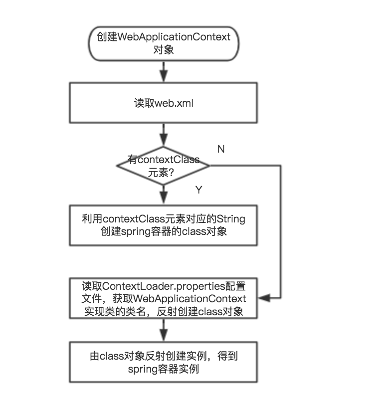

[TOC]


# spring源码分析2 — 容器启动流程

# 1 主要类

部署web应用时，web容器（比如Tomcat）会读取配置在web.xml中的监听器，从而启动spring容器。有了spring容器之后，我们才能使用spring的IOC AOP等特性。弄清spring容器启动流程，有利于理解spring IOC中的各种特性，比如BeanPostProcessor，MessageSource，ApplicationListener等。我们先来看下容器启动流程中涉及的主要类。

**ContextLoaderListener**：注册在web.xml中，web应用启动时，会创建它，并回调它的initWebApplicationContext()方法，从而创建并启动spring容器。必须继承ServletContextListener。

**WebApplicationContext**：用于web应用的spring容器上下文，它代表了spring容器，继承自ApplicationContext。是一个接口，在ContextLoader.properties配置文件中可以声明它的实现类。默认实现类为XmlWebApplicationContext。ApplicationContext继承自BeanFactory，并扩展了它的很多功能。

**ServletContext**：web容器（如tomcat）的上下文，不要和ApplicationContext搞混了。

# 2 流程

## 2.1 web容器启动过程

web容器为spring提供了宿主环境ServletContext，启动时读取web.xml，如下

```
<?xml version="1.0" encoding="UTF-8"?>
<web-app xmlns="http://xmlns.jcp.org/xml/ns/javaee"
         xmlns:xsi="http://www.w3.org/2001/XMLSchema-instance"
         xsi:schemaLocation="http://xmlns.jcp.org/xml/ns/javaee http://xmlns.jcp.org/xml/ns/javaee/web-app_3_1.xsd"
         version="3.1">
    <!--web项目中上下文初始化参数, name value的形式 -->
    <context-param>
        <param-name>contextConfigLocation</param-name>
        <param-value>/WEB-INF/applicationContext.xml</param-value>
    </context-param>

    <!--ContextLoaderListener,会通过它的监听启动spring容器-->
    <listener>
        <listener-class>org.springframework.web.context.ContextLoaderListener</listener-class>
    </listener>

    <!--DispatherServlet,前端MVC核心，分发器，SpringMVC的核心-->
    <servlet>
        <servlet-name>dispatcher</servlet-name>
        <servlet-class>org.springframework.web.servlet.DispatcherServlet</servlet-class>
        <load-on-startup>1</load-on-startup>
    </servlet>
</web-app> 
```

web容器的初始化过程为

1. web容器（如tomcat）读取web.xml, 读取文件中两个节点和
2. 容器创建ServletContext，它是web的上下文，整个web项目都会用到它
3. 读取context-param节点，它以 键值对的形式出现。将节点值转化为键值对，传给ServletContext
4. 容器创建中的实例，创建监听器。监听器必须继承ServletContextListener
5. 调用ServletContextListener的contextInitialized()方法，spring容器的创建和初始化就是在这个方法中

## 2.2 initWebApplicationContext 创建容器和beans

在web容器初始化过程中，会创建节点的监听器，并调用它的contextInitialized()方法。这个方法中会完成spring容器的创建，初始化，以及beans的创建。默认listener为ContextLoaderListener，下面详细分析

```java
public WebApplicationContext initWebApplicationContext(ServletContext servletContext) {
   // 判断是否已经有WebApplicationContext容器了，如果有就不用创建了
   if (servletContext.getAttribute(WebApplicationContext.ROOT_WEB_APPLICATION_CONTEXT_ATTRIBUTE) != null) {
      throw new IllegalStateException(
            "Cannot initialize context because there is already a root application context present - " +
            "check whether you have multiple ContextLoader* definitions in your web.xml!");
   }

  // 省略一段log
   ...

   try {
      // 创建WebApplicationContext
      if (this.context == null) {
         this.context = createWebApplicationContext(servletContext);
      }
     // 判断context有没有父context，取决于web.xml配置文件中locatorFactorySelector参数，如果有父context，则加载它
      if (this.context instanceof ConfigurableWebApplicationContext) {
         ConfigurableWebApplicationContext cwac = (ConfigurableWebApplicationContext) this.context;
         if (!cwac.isActive()) {
            if (cwac.getParent() == null) {
               ApplicationContext parent = loadParentContext(servletContext);
               cwac.setParent(parent);
            }
           // refresh容器，这一步会创建beans，后面详细分析
            configureAndRefreshWebApplicationContext(cwac, servletContext);
         }
      }
     // 将spring容器context，挂载到servletContext这个web容器全局变量中。ServletContext是web容器的上下文。web容器指的是Tomcat等部署web应用的容器，不要和spring容器搞混了。
      servletContext.setAttribute(WebApplicationContext.ROOT_WEB_APPLICATION_CONTEXT_ATTRIBUTE, this.context);

     // 将spring容器context赋值给currentContext变量，保存下来
      ClassLoader ccl = Thread.currentThread().getContextClassLoader();
      if (ccl == ContextLoader.class.getClassLoader()) {
         currentContext = this.context;
      }
      else if (ccl != null) {
         currentContextPerThread.put(ccl, this.context);
      }

      // 省略一段log
     ...

      return this.context;
   }
   // 省略一段异常catch处理
} 
```

initWebApplicationContext()主要做三件事

1. 创建WebApplicationContext，通过createWebApplicationContext()方法
2. 加载spring配置文件，并创建beans。通过configureAndRefreshWebApplicationContext()方法
3. 将spring容器context挂载到ServletContext 这个web容器上下文中。通过servletContext.setAttribute()方法。

### 2.2.1 createWebApplicationContext 创建spring容器

```java
protected WebApplicationContext createWebApplicationContext(ServletContext sc) {
   // 获取WebApplicationContext实现类的class对象，WebApplicationContext只是一个接口，需要有具体的实现类，默认的实现类是XmlWebApplicationContext
   Class<?> contextClass = determineContextClass(sc);
  // 自定义WebApplicationContext必须继承自ConfigurableWebApplicationContext
   if (!ConfigurableWebApplicationContext.class.isAssignableFrom(contextClass)) {
      throw new ApplicationContextException("Custom context class [" + contextClass.getName() +
            "] is not of type [" + ConfigurableWebApplicationContext.class.getName() + "]");
   }
  // 由class对象创建实例对象
   return (ConfigurableWebApplicationContext) BeanUtils.instantiateClass(contextClass);
} 
```

创建spring容器的流程比较简单，具体为两步

1. 获取WebApplicationContext实现类的class对象
2. 根据class对象创建实例对象

那么class对象是怎么获取的呢，具体我们看determineContextClass()方法

```java
protected Class<?> determineContextClass(ServletContext servletContext) {
  // 读取web.xml中的contextClass元素，它是配置在<context-param>节点中的
   String contextClassName = servletContext.getInitParameter(CONTEXT_CLASS_PARAM);
  // 如果web.xml中配置了contextClass，则直接由类名创建class对象
   if (contextClassName != null) {
      try {
         return ClassUtils.forName(contextClassName, ClassUtils.getDefaultClassLoader());
      }
      catch (ClassNotFoundException ex) {
         throw new ApplicationContextException(
               "Failed to load custom context class [" + contextClassName + "]", ex);
      }
   }
  // 如果没有配置contextClass，则读取defaultStrategies的WebApplicationContext这个属性，这个属性在ContextLoader.properties文件中配置的，我们后面详解。之后利用读取的类名创建class对象
   else {
      contextClassName = defaultStrategies.getProperty(WebApplicationContext.class.getName());
      try {
         return ClassUtils.forName(contextClassName, ContextLoader.class.getClassLoader());
      }
      catch (ClassNotFoundException ex) {
         throw new ApplicationContextException(
               "Failed to load default context class [" + contextClassName + "]", ex);
      }
   }
} 
```

defaultStrategies的创建过程如下

```java
private static final String DEFAULT_STRATEGIES_PATH = "ContextLoader.properties";
private static final Properties defaultStrategies;

static {
   // 读取ContextLoader.properties这个配置文件，生成defaultStrategies对象。我们可以把各种默认配置信息都放在这里。例如WebApplicationContext的实现类的类名
   try {
      ClassPathResource resource = new ClassPathResource(DEFAULT_STRATEGIES_PATH, ContextLoader.class);
      defaultStrategies = PropertiesLoaderUtils.loadProperties(resource);
   }
   catch (IOException ex) {
      throw new IllegalStateException("Could not load 'ContextLoader.properties': " + ex.getMessage());
   }
} 
```

默认的ContextLoader.properties 文件如下

```java
org.springframework.web.context.WebApplicationContext=org.springframework.web.context.support.XmlWebApplicationContext 
```

恍然大悟了吧，这个配置文件中声明了WebApplicationContext的实现类类名为XmlWebApplicationContext，也就是说默认采用XmlWebApplicationContext这个spring容器。

### 2.2.2 configureAndRefreshWebApplicationContext加载spring配置文件，创建beans

创建完Spring容器后，就会加载spring配置文件，并创建beans。这个过程在configureAndRefreshWebApplicationContext()方法

```java
protected void configureAndRefreshWebApplicationContext(ConfigurableWebApplicationContext wac, ServletContext sc) {
   // 设置ApplicationContext的id，无关紧要，省略
   ...

   // web容器引用ServletContext，设置到spring容器ApplicationContext中
   wac.setServletContext(sc);

  // 读取web.xml中的contextConfigLocation元素的值，它指明了spring容器配置文件的地址。不采用注解方式时，beans的声明就在这个文件中。这个文件是spring容器的最重要的配置文件。contextConfigLocation元素在web.xml的<context-param>节点中声明的，可以参见文章最开始的一个web.xml例子
   String configLocationParam = sc.getInitParameter(CONFIG_LOCATION_PARAM);
   if (configLocationParam != null) {
      wac.setConfigLocation(configLocationParam);
   }

   // 初始化Servlet的propertySources，不用太care
   ConfigurableEnvironment env = wac.getEnvironment();
   if (env instanceof ConfigurableWebEnvironment) {
      ((ConfigurableWebEnvironment) env).initPropertySources(sc, null);
   }

   // 个性化配置，没做啥事，一般用默认的即可
   customizeContext(sc, wac);

  // 最重要的一步，
   wac.refresh();
}
```

configureAndRefreshWebApplicationContext()这个方法会先读取web.xml中声明的contextConfigLocation元素，通过它找到spring配置文件。然后在refresh()方法中读取配置文件，并创建和初始化beans。所以重中之重还是refresh()方法。我们下面来分析。

```java
// 读取spring xml配置文件，创建和初始化benas，最核心的方法
public void refresh() throws BeansException, IllegalStateException {
   synchronized (this.startupShutdownMonitor) {
      // 准备工作，设置ApplicationContext中的一些标志位，如closed设为false，active设为true。校验添加了required标志的属性，如果他们为空，则抛出MissingRequiredPropertiesException异常。此处比较简单，可自行分析
      prepareRefresh();

      // 读取spring xml配置文件,后面详细分析
      ConfigurableListableBeanFactory beanFactory = obtainFreshBeanFactory();

      // 设置容器beanFactory的各种成员属性，比如beanClassLoader，beanPostProcessors。这里的beanPostProcessor都是系统默认的，不是用户自定义的。比如负责注入ApplicationContext引用到各种Aware中的ApplicationContextAwareProcessor容器后处理器。
      prepareBeanFactory(beanFactory);

      try {
         // 调用默认的容器后处理器，如ServletContextAwareProcessor
         postProcessBeanFactory(beanFactory);

         // 初始化并调用所有注册的容器后处理器BeanFactoryPostProcessor，此处比较麻烦，但不算关键，可自行分析
         invokeBeanFactoryPostProcessors(beanFactory);

         // 注册bean后处理器，将实现了BeanPostProcessor接口的bean找到。先将实现了PriorityOrdered接口的bean排序并注册到容器BeanFactory中，然后将实现了Ordered接口的排序并注册到容器中，最后注册剩下的。
         registerBeanPostProcessors(beanFactory);

         // 初始化MessageSource，用来处理国际化。如果有beanName为“messageSource”，则初始化。否则使用默认的。
         initMessageSource();

         // 初始化ApplicationEventMulticaster，用来进行事件广播。如果有beanName为"applicationEventMulticaster"，则初始化它。否则使用默认的SimpleApplicationEventMulticaster。广播事件会发送给所有监听器，也就是实现了ApplicationListener的类。关于spring事件体系，可以参见 http://blog.csdn.net/caihaijiang/article/details/7460888
         initApplicationEventMulticaster();

         // 初始化其他特殊的bean。子类可以override这个方法。如WebApplicationContext的themeSource
         onRefresh();

         // 注册事件监听器，也就是所有实现了ApplicationListener的类。会将监听器加入到事件广播器ApplicationEventMulticaster中，所以在广播时就可以发送消息给所有监听器了。
         registerListeners();

         // 初始化所有剩下的singleton bean(没有标注lazy-init的)，后面详细分析
         finishBeanFactoryInitialization(beanFactory);

         // 最后一步，完成refresh。回调LifecycleProcessor，发送ContextRefreshedEvent事件等，比较简单，可自行分析
         finishRefresh();
      }

      catch (BeansException ex) {
         // 异常处理，省略
        ...
      }

      finally {
         // 清理资源
         resetCommonCaches();
      }
   }
} 
```

refresh()方法流程很多，并且都很复杂。我们后面分两篇文章重点来分析obtainFreshBeanFactory()和finishBeanFactoryInitialization()。前一个读取并解析XML配置文件，后一个创建并初始化普通singleton bean。

# 3 流程图

spring容器初始化的整个流程图如下


创建WebApplicationContext对象流程如下



读取XML配置文件，创建beans流程如下


  http://blog.csdn.net/u013510838/article/details/75066884