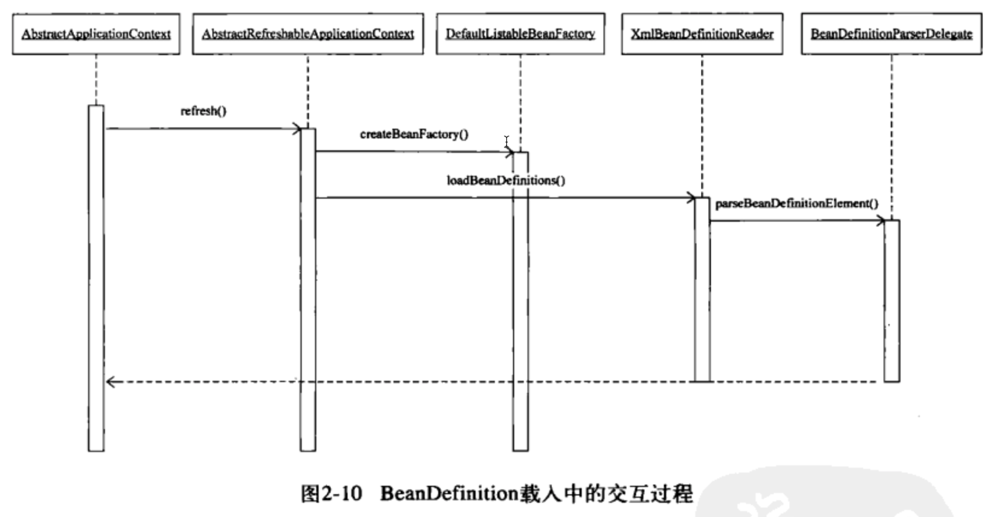

# spring源码阅读笔记-image-201709122117.md

## spring ioc 容器

### BeanDefinition转入，bean xml标签解析

DefaultBeanDefinitionDocumentReader.parseDefaultElement

具体的Spring BeanDefinition的解析是在BeanDefinitionParserDelegate中完成的?这 个类
 包含 对各种Spring Bean定义规则的处 ， 感兴趣的读者可以仔细研究?  如我们最熟悉
的对Bean 元素 的处  是怎样 完成的，也就 是怎样 处 在 XML 定义  件中 出现的
<bean></bean>这个最常 的元素信息

				
​			
​		

会去读每个jar META-INF/spring.handlers   ContextNamespaceHandler 对应的解析处理xml标签


## Spring AOP	

### 名词介绍：

#### Advice通知：

为切面增强提供织入接口。就是切面点需要执行的逻辑处理。

#### Pointcut切点：

决定advice通知应该作用于哪个连接点。

#### Advisor通知器：

完成对目标方法的切面增强设计（Advice）和关注点的设计（Pointcut）以后，需要一个对象把它们结合起来，完成这个作用的就是Advisor（通知器）。


TransactionProxyFactoryBean

事务代理工厂

BeanFactoryTransactionAttributeSourceAdvisor

事务通知器

TransactionAttribute

事务属性

TransactionStatus   TransactionInfo


NameMatchTransactionAttributeSource

AnnotationTransactionAttributeSource(注解事务匹配)

事务属性匹配获取


TransactionInterceptor

事务advice通知 处理事务具体实现地方  invoke


### 用户aop配置


#### 对应aop基础对象

代理工厂：ProxyFactory   在AspectJAwareAdvisorAutoProxyCreator用ProxyFactory   创建代理


Advisor通知器：AspectJPointcutAdvisor


Advice通知 处理事务具体实现地方  invoke：

AspectJAroundAdvice  

AspectJAroundAdvice的抽象类AbstractAspectJAdvice中字段protected final Method aspectJAdviceMethod;用来保存具体配置实现类方法


Pointcut切点：AspectJExpressionPointcut


#### aop:config标签

根据xml配置\<aop:config\>标签会创建AspectJAwareAdvisorAutoProxyCreator、AspectJExpressionPointcut、AspectJAroundAdvice、AspectJPointcutAdvisor等类的BeanDefinition 


 

根据注解配置生成advice  ConfigBeanDefinitionParser

```
	/**
	 * Gets the advice implementation class corresponding to the supplied {@link Element}.
	 */
	private Class getAdviceClass(Element adviceElement, ParserContext parserContext) {
		String elementName = parserContext.getDelegate().getLocalName(adviceElement);
		if (BEFORE.equals(elementName)) {
			return AspectJMethodBeforeAdvice.class;
		}
		else if (AFTER.equals(elementName)) {
			return AspectJAfterAdvice.class;
		}
		else if (AFTER_RETURNING_ELEMENT.equals(elementName)) {
			return AspectJAfterReturningAdvice.class;
		}
		else if (AFTER_THROWING_ELEMENT.equals(elementName)) {
			return AspectJAfterThrowingAdvice.class;
		}
		else if (AROUND.equals(elementName)) {
			return AspectJAroundAdvice.class;
		}
		else {
			throw new IllegalArgumentException("Unknown advice kind [" + elementName + "].");
		}
	}
```


### @Transactional注解事务的实现

#### 对应aop基础对象

代理工厂：ProxyFactory   在InfrastructureAdvisorAutoProxyCreator用ProxyFactory   创建代理

Advisor通知器：BeanFactoryTransactionAttributeSourceAdvisor

Advice通知 处理事务具体实现地方  invoke：TransactionInterceptor

Pointcut切点：TransactionAttributeSourcePointcut


事务属性vo：TransactionAttribute

事务属性信息匹配获取：

TransactionStatus   TransactionInfo

AnnotationTransactionAttributeSource(注解事务匹配)


#### tx:annotation-driven标签

根据xml配置\<tx:annotation-driven transaction-manager="txManager" />标签会创建InfrastructureAdvisorAutoProxyCreator、AnnotationTransactionAttributeSource、TransactionInterceptor、BeanFactoryTransactionAttributeSourceAdvisor等类的BeanDefinition 


在类实例化的时候就已经设置好代理和拦截器

#### 什么时候扫描Transactional注解标识方法需要添加事务?

答：获取bean 的时候，AbstractAutowireCapableBeanFactory.initializeBean() 中循环匹配（根据BeanFactoryTransactionAttributeSourceAdvisor类的pointcut进行切面匹配）所有的方法，把有事务注解的放到AnnotationTransactionAttributeSource.attributeCache 缓存中。在执行方法的时候，根据AnnotationTransactionAttributeSource.getTransactionAttribute()判断是不是有事务，BeanFactoryTransactionAttributeSourceAdvisor.advice进行切面逻辑添加处理


#### 创建代理的对象是哪个？

InfrastructureAdvisorAutoProxyCreator.postProcessAfterInitialization 来创建代理，在它的AbstractAutoProxyCreator抽象类中

```
	/**
	 * Create an AOP proxy for the given bean.
	 * @param beanClass the class of the bean
	 * @param beanName the name of the bean
	 * @param specificInterceptors the set of interceptors that is
	 * specific to this bean (may be empty, but not null)
	 * @param targetSource the TargetSource for the proxy,
	 * already pre-configured to access the bean
	 * @return the AOP proxy for the bean
	 * @see #buildAdvisors
	 */
	protected Object createProxy(
			Class<?> beanClass, String beanName, Object[] specificInterceptors, TargetSource targetSource) {

		ProxyFactory proxyFactory = new ProxyFactory();
		// Copy our properties (proxyTargetClass etc) inherited from ProxyConfig.
		proxyFactory.copyFrom(this);

		if (!shouldProxyTargetClass(beanClass, beanName)) {
			// Must allow for introductions; can't just set interfaces to
			// the target's interfaces only.
			Class<?>[] targetInterfaces = ClassUtils.getAllInterfacesForClass(beanClass, this.proxyClassLoader);
			for (Class<?> targetInterface : targetInterfaces) {
				proxyFactory.addInterface(targetInterface);
			}
		}

		Advisor[] advisors = buildAdvisors(beanName, specificInterceptors);
		for (Advisor advisor : advisors) {
			proxyFactory.addAdvisor(advisor);
		}

		proxyFactory.setTargetSource(targetSource);
		customizeProxyFactory(proxyFactory);

		proxyFactory.setFrozen(this.freezeProxy);
		if (advisorsPreFiltered()) {
			proxyFactory.setPreFiltered(true);
		}

		return proxyFactory.getProxy(this.proxyClassLoader);
	}
```

