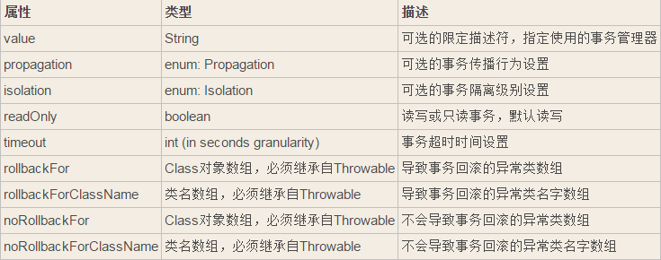

[TOC]


# Spring @Transactional 事务原理及使用


## 1、Spring @Transactional的配置

#### 步骤一、在Spring配置文件中引入命名空间

```
<beans xmlns="http://www.springframework.org/schema/beans"
           xmlns:xsi="http://www.w3.org/2001/XMLSchema-instance"
           xmlns:tx="http://www.springframework.org/schema/tx"
           xsi:schemaLocation="http://www.springframework.org/schema/beans
           http://www.springframework.org/schema/beans/spring-beans-2.0.xsd
           http://www.springframework.org/schema/tx
           http://www.springframework.org/schema/tx/spring-tx-2.0.xsd">
```

#### 步骤二、xml配置文件中，添加事务管理器bean配置

```
<!-- 事务管理器配置，单数据源事务 -->
    <bean id="pkgouTransactionManager"
        class="org.springframework.jdbc.datasource.DataSourceTransactionManager">
        <property name="dataSource" ref="pkGouDataSource" />
    </bean>
<!-- 使用annotation定义事务 -->
    <tx:annotation-driven transaction-manager="pkgouTransactionManager" />

```

#### 步骤三、在使用事务的方法或者类上添加 @Transactional(“pkgouTransactionManager”)注解

## 2、 Spring @Transactional的传播行为和隔离级别

### 1> 事务注解方式: @Transactional

- 标注在类前：标示类中所有方法都进行事务处理
- 标注在接口、实现类的方法前：标示方法进行事务处理

### 2> 事务传播行为介绍:

| 事务传播行为                                   | 说明                                       |
| ---------------------------------------- | ---------------------------------------- |
| @Transactional(propagation=Propagation.REQUIRED) | 如果有事务， 那么加入事务， 没有的话新建一个(默认情况)            |
| @Transactional(propagation=Propagation.NOT_SUPPORTED) | 容器不为这个方法开启事务                             |
| @Transactional(propagation=Propagation.REQUIRES_NEW) | 不管是否存在事务，都创建一个新的事务，原来的挂起，新的执行完毕，继续执行老的事务 |
| @Transactional(propagation=Propagation.MANDATORY) | 必须在一个已有的事务中执行，否则抛出异常                     |
| @Transactional(propagation=Propagation.NEVER) | 必须在一个没有的事务中执行，否则抛出异常(与Propagation.MANDATORY相反) |
| @Transactional(propagation=Propagation.SUPPORTS) | 如果其他bean调用这个方法，在其他bean中声明事务，那就用事务。如果其他bean没有声明事务，那就不用事务 |

### 3> 事务超时设置:

@Transactional(timeout=30) //默认是30秒

### 4> 事务隔离级别:

| 事务隔离级别                                   | 说明                          |
| ---------------------------------------- | --------------------------- |
| @Transactional(isolation = Isolation.READ_UNCOMMITTED) | 读取未提交数据(会出现脏读， 不可重复读)，基本不使用 |
| @Transactional(isolation = Isolation.READ_COMMITTED)(SQLSERVER默认) | 读取已提交数据(会出现不可重复读和幻读)        |
| @Transactional(isolation = Isolation.REPEATABLE_READ) | 可重复读(会出现幻读)                 |
| @Transactional(isolation = Isolation.SERIALIZABLE) | 串行化                         |

- 脏读 : 一个事务读取到另一事务未提交的更新数据
- 不可重复读 : 在同一事务中， 多次读取同一数据返回的结果有所不同， 换句话说， 后续读取可以读到另一事务已提交的更新数据。相反，”可重复读”在同一事务中多次读取数据时，能够保证所读数据一样，也就是后续读取不能读到另一事务已提交的更新数据
- 幻读 : 一个事务读到另一个事务已提交的insert数据

@Transactional的属性：



## 3、 Spring @Transactional的工作原理

- 自动提交

默认情况下，数据库处于自动提交模式。每一条语句处于一个单独的事务中，在这条语句执行完毕时，如果执行成功则隐式的提交事务，如果执行失败则隐式的回滚事务。
事务管理，是一组相关的操作处于一个事务之中，因此必须关闭数据库的自动提交模式。这点，Spring会在org/springframework/jdbc/datasource/DataSourceTransactionManager.java中将底层连接的自动提交特性设置为false。

```
// switch to manual commit if necessary。 this is very expensive in some jdbc drivers，
// so we don't want to do it unnecessarily (for example if we've explicitly
// configured the connection pool to set it already)。if (con。getautocommit()) 
{
    txobject.setmustrestoreautocommit(true);
    if (logger.isdebugenabled()) 
    {
        logger.debug("switching jdbc connection [" + con + "] to manual commit");
    }
    //首先将自动提交属性改为false
    con.setautocommit(false);
}
```

- spring事务回滚规则

Spring事务管理器回滚一个事务的推荐方法是在当前事务的上下文内抛出异常。Spring事务管理器会捕捉任何未处理的异常，然后依据规则决定是否回滚抛出异常的事务。
默认配置下，Spring只有在抛出的异常为运行时unchecked异常时才回滚该事务，也就是抛出的异常为RuntimeException的子类(Errors也会导致事务回滚)。而抛出checked异常则不会导致事务回滚。
Spring也支持明确的配置在抛出哪些异常时回滚事务，包括checked异常。也可以明确定义哪些异常抛出时不回滚事务。
还可以编程性的通过setRollbackOnly()方法来指示一个事务必须回滚，在调用完setRollbackOnly()后你所能执行的唯一操作就是回滚。

## 4、 Spring @Transactional的注意事项

- 由于Spring事务管理是基于接口代理或动态字节码技术，通过AOP实施事务增强的。

（1）对于基于接口动态代理的AOP事务增强来说，由于接口的方法是public的，这就要求实现类的实现方法必须是public的（不能是protected，private等），同时不能使用static的修饰符。所以，可以实施接口动态代理的方法只能是使用“public”或“public final”修饰符的方法，其它方法不可能被动态代理，相应的也就不能实施AOP增强，也即不能进行Spring事务增强。

（2）基于CGLib字节码动态代理的方案是通过扩展被增强类，动态创建子类的方式进行AOP增强植入的。由于使用final,static,private修饰符的方法都不能被子类覆盖，相应的，这些方法将不能被实施的AOP增强。

所以，必须特别注意这些修饰符的使用，@Transactional 注解只被应用到 public 可见度的方法上。 如果你在 protected、private 或者 package-visible 的方法上使用 @Transactional 注解，它也不会报错，但是这个被注解的方法将不会展示已配置的事务设置。

- 用 spring 事务管理器，由spring来负责数据库的打开，提交，回滚。默认遇到运行期异常(throw new RuntimeException(“注释”);)会回滚，即遇到不受检查（unchecked）的异常时回滚；而遇到需要捕获的异常(throw new Exception(“注释”);)不会回滚，即遇到受检查的异常（就是非运行时抛出的异常，编译器会检查到的异常叫受检查异常或说受检查异常）时，需我们指定方式来让事务回滚 要想所有异常都回滚，要加上 @Transactional( rollbackFor={Exception。class，其它异常}) 。如果让unchecked异常不回滚： @Transactional(notRollbackFor=RunTimeException.class)如下:

```
@Transactional(rollbackFor=Exception.class) //指定回滚，遇到异常Exception时回滚
public void methodName() 
{
throw new Exception("注释");
}
```

```
@Transactional(noRollbackFor=Exception.class)//指定不回滚，遇到运行期异常(throw new RuntimeException("注释");)会回滚
public ItimDaoImpl getItemDaoImpl() 
{
throw new RuntimeException("注释");
}
```

-仅仅 @Transactional注解的出现不足于开启事务行为，它仅仅是一种元数据，能够被可以识别 @Transactional注解和上述的配置适当的具有事务行为的beans所使用。其实，根本上是 元素的出现 开启了事务行为。

- Spring团队的建议是你在具体的类（或类的方法）上使用 @Transactional 注解，而不要使用在类所要实现的任何接口上。你当然可以在接口上使用 @Transactional 注解，但是这将只能当你设置了基于接口的代理时它才生效。因为注解是不能继承的，这就意味着如果你正在使用基于类的代理时，那么事务的设置将不能被基于类的代理所识别，而且对象也将不会被事务代理所包装（将被确认为严重的）。因此，请接受Spring团队的建议并且在具体的类火方法上使用 @Transactional 注解。
- @Transactional 注解标识的方法，处理过程尽量的简单。尤其是带锁的事务方法，能不放在事务里面的最好不要放在事务里面。可以将常规的数据库查询操作放在事务前面进行，而事务内进行增、删、改、加锁查询等操作。
- @Transactional 注解的默认事务管理器bean是“transactionManager”，如果声明为其他名称的事务管理器，需要在方法上添加@Transational(“managerName”)。
- @Transactional 注解标注的方法中不要出现网络调用、比较耗时的处理程序，因为，事务中数据库连接是不会释放的，如果每个事务的处理时间都非常长，那么宝贵的数据库连接资源将很快被耗尽。

 


http://tech.lede.com/2017/02/06/rd/server/SpringTransactional/