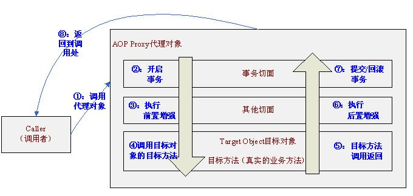
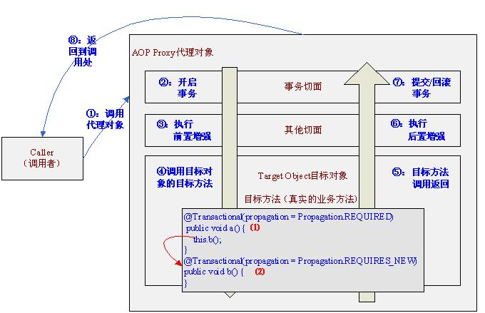
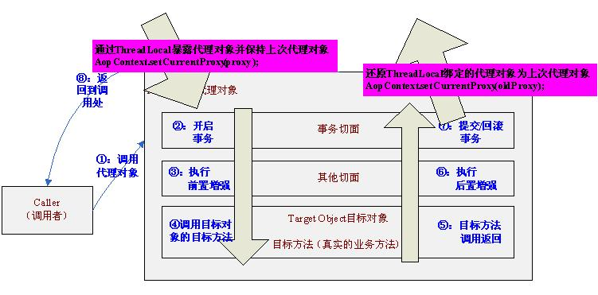
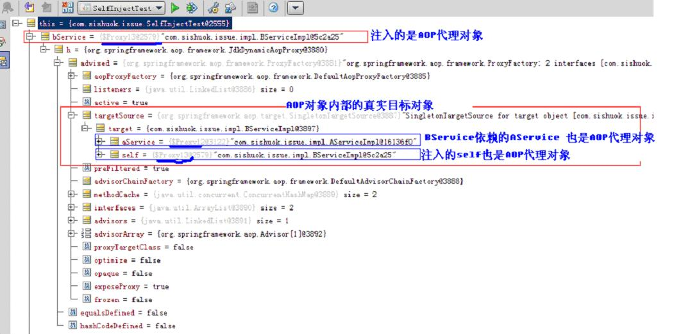
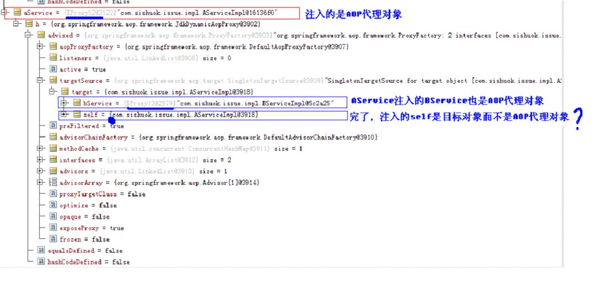

 

前些日子一朋友在需要在目标对象中进行自我调用，且需要实施相应的事务定义，且网上的一种通过BeanPostProcessor的解决方案是存在问题的。因此专门写此篇帖子分析why。

### 1、预备知识

aop概念请参考【[http://www.iteye.com/topic/1122401](http://jinnianshilongnian.iteye.com/topic/1122401)】和【[http://jinnianshilongnian.iteye.com/blog/1418596](http://jinnianshilongnian.iteye.com/blog/1418596)】

[spring](http://lib.csdn.net/base/17)的事务管理，请参考【[http://jinnianshilongnian.iteye.com/blog/1441271](http://jinnianshilongnian.iteye.com/blog/1441271)】

 

 

使用AOP 代理后的方法调用执行流程，如图所示

也就是说我们首先调用的是AOP代理对象而不是目标对象，首先执行事务切面，事务切面内部通过TransactionInterceptor环绕增强进行事务的增强，即进入目标方法之前开启事务，退出目标方法时提交/回滚事务。

### 2、测试代码准备

Java代码  

1. public interface AService {  
2. ​    public void a();  
3. ​    public void b();  
4. }  
5.    
6. @Service()  
7. public class AServiceImpl1 implements AService{  
8. ​    @Transactional(propagation = Propagation.REQUIRED)  
9. ​    public void a() {  
10. ​        this.b();  
11. ​    }  
12. ​    @Transactional(propagation = Propagation.REQUIRES_NEW)  
13. ​    public void b() {  
14. ​    }  
15. }  

 

### 3、问题

目标对象内部的自我调用将无法实施切面中的增强，如图所示

此处的this指向目标对象，因此调用this.b()将不会执行b事务切面，即不会执行事务增强，因此b方法的事务定义“@Transactional(propagation = Propagation.REQUIRES_NEW)”将不会实施，即结果是b和a方法的事务定义是一样的，可以从以下日志看出：

 

 org.springframework.transaction.annotation.AnnotationTransactionAttributeSource Adding transactional method 'a' with attribute: PROPAGATION_REQUIRED,ISOLATION_DEFAULT; ''

org.springframework.beans.factory.support.DefaultListableBeanFactory Returning cached instance of singleton bean 'txManager'

org.springframework.orm.hibernate4.HibernateTransactionManager Creating new transaction with name [com.sishuok.service.impl.AServiceImpl1.a]: PROPAGATION_REQUIRED,ISOLATION_DEFAULT; ''  -----创建a方法事务

org.springframework.orm.hibernate4.HibernateTransactionManager Opened new Session …… for [hibernate](http://lib.csdn.net/base/17)transaction  ---打开Session

……

org.springframework.transaction.support.TransactionSynchronizationManager Initializing transaction synchronization

org.springframework.transaction.interceptor.TransactionInterceptor Getting transaction for [com.sishuok.service.impl.AServiceImpl1.a]

org.springframework.transaction.interceptor.TransactionInterceptor Completing transaction for [com.sishuok.service.impl.AServiceImpl1.a] ----完成a方法事务

org.springframework.orm.hibernate4.HibernateTransactionManager Triggering beforeCommit synchronization

org.springframework.orm.hibernate4.HibernateTransactionManager Triggering beforeCompletion synchronization

org.springframework.orm.hibernate4.HibernateTransactionManager Initiating transaction commit

 

org.springframework.orm.hibernate4.HibernateTransactionManager Committing Hibernate transaction on Session ……---提交a方法事务

或

org.springframework.orm.hibernate4.HibernateTransactionManager Rolling back Hibernate transaction on Session ……---如果有异常将回滚a方法事务

 

org.springframework.orm.hibernate4.HibernateTransactionManager Triggering afterCommit synchronization

org.springframework.orm.hibernate4.HibernateTransactionManager Triggering afterCompletion synchronization

org.springframework.transaction.support.TransactionSynchronizationManager Clearing transaction synchronization

……

org.springframework.orm.hibernate4.HibernateTransactionManager Closing Hibernate Session …… after transaction     --关闭Session

 

我们可以看到事务切面只对a方法进行了事务增强，没有对b方法进行增强。

 

### 3、解决方案

此处a方法中调用b方法时，只要通过AOP代理调用b方法即可走事务切面，即可以进行事务增强，如下所示：

Java代码  

1. public void a() {  
2. aopProxy.b();//即调用AOP代理对象的b方法即可执行事务切面进行事务增强  
3. }  

 

判断一个Bean是否是AOP代理对象可以使用如下三种方法：

AopUtils.isAopProxy(bean)        ： 是否是代理对象；

AopUtils.isCglibProxy(bean)       ： 是否是CGLIB方式的代理对象；

AopUtils.isJdkDynamicProxy(bean) ： 是否是JDK动态代理方式的代理对象；

### 3.1、通过ThreadLocal暴露Aop代理对象

**1****、开启暴露Aop****代理到ThreadLocal****支持（如下配置方式从spring3****开始支持）**

Java代码  

1. <aop:aspectj-autoproxy expose-proxy="true"/><!—注解风格支持-->  

Java代码  

1. <aop:config expose-proxy="true"><!—xml风格支持-->   

   

**2****、修改我们的业务实现类**

this.b();-----------修改为--------->((AService) AopContext.currentProxy()).b();

 

**3****、执行测试用例，日志如下**

 

 

org.springframework.beans.factory.support.DefaultListableBeanFactory Returning cached instance of singleton bean 'txManager'

org.springframework.orm.hibernate4.HibernateTransactionManager Creating new transaction with name [com.sishuok.service.impl.AServiceImpl2.a]: PROPAGATION_REQUIRED,ISOLATION_DEFAULT; ''   -----创建a方法事务

org.springframework.orm.hibernate4.HibernateTransactionManager Opened new Session ……for Hibernate transaction  --打开a Session

org.springframework.orm.hibernate4.HibernateTransactionManager Preparing JDBC Connection of Hibernate Session ……

org.springframework.orm.hibernate4.HibernateTransactionManager Exposing Hibernate transaction as JDBC transaction ……

……

org.springframework.transaction.support.TransactionSynchronizationManager Initializing transaction synchronization

org.springframework.transaction.interceptor.TransactionInterceptor Getting transaction for [com.sishuok.service.impl.AServiceImpl2.a]

 

org.springframework.transaction.annotation.AnnotationTransactionAttributeSource Adding transactional method 'b' with attribute: PROPAGATION_REQUIRES_NEW,ISOLATION_DEFAULT; ''

……

org.springframework.orm.hibernate4.HibernateTransactionManager Suspending current transaction, creating new transaction with name [com.sishuok.service.impl.AServiceImpl2.b]  -----创建b方法事务（并暂停a方法事务）

……

org.springframework.orm.hibernate4.HibernateTransactionManager Opened new Session  for Hibernate transaction  ---打开b Session

……

org.springframework.transaction.support.TransactionSynchronizationManager Initializing transaction synchronization

org.springframework.transaction.interceptor.TransactionInterceptor Getting transaction for [com.sishuok.service.impl.AServiceImpl2.b]

org.springframework.transaction.interceptor.TransactionInterceptor Completing transaction for [com.sishuok.service.impl.AServiceImpl2.b] ----完成b方法事务

 

org.springframework.orm.hibernate4.HibernateTransactionManager Triggering beforeCommit synchronization

org.springframework.orm.hibernate4.HibernateTransactionManager Triggering beforeCompletion synchronization

org.springframework.orm.hibernate4.HibernateTransactionManager Initiating transaction commit

org.springframework.orm.hibernate4.HibernateTransactionManager Committing Hibernate transaction on Session …… ---提交b方法事务

org.springframework.orm.hibernate4.HibernateTransactionManager Triggering afterCommit synchronization

org.springframework.orm.hibernate4.HibernateTransactionManager Triggering afterCompletion synchronization

org.springframework.transaction.support.TransactionSynchronizationManager Clearing transaction synchronization

……

org.springframework.orm.hibernate4.HibernateTransactionManager Closing Hibernate Session …… after transaction  --关闭 b Session

 

-----到此b方法事务完毕

 

org.springframework.orm.hibernate4.HibernateTransactionManager Resuming suspended transaction after completion of inner transaction ---恢复a方法事务

……

org.springframework.transaction.support.TransactionSynchronizationManager Initializing transaction synchronization

org.springframework.transaction.interceptor.TransactionInterceptor Completing transaction for [com.sishuok.service.impl.AServiceImpl2.a] ----完成a方法事务

org.springframework.orm.hibernate4.HibernateTransactionManager Triggering beforeCommit synchronization

org.springframework.orm.hibernate4.HibernateTransactionManager Triggering beforeCompletion synchronization

org.springframework.orm.hibernate4.HibernateTransactionManager Initiating transaction commit

org.springframework.orm.hibernate4.HibernateTransactionManager Committing Hibernate transaction on Session ……---提交a方法事务

org.springframework.orm.hibernate4.HibernateTransactionManager Triggering afterCommit synchronization

org.springframework.orm.hibernate4.HibernateTransactionManager Triggering afterCompletion synchronization

org.springframework.transaction.support.TransactionSynchronizationManager Clearing transaction synchronization

……

org.springframework.orm.hibernate4.HibernateTransactionManager Closing Hibernate Session …… after transaction  --关闭 a Session

 

 

 

**此处我们可以看到b****方法的事务起作用了。**

** **

以上方式是解决目标对象内部方法自我调用并实施事务的最简单的解决方案。

 

**4****、实现原理分析**

4.1、在进入代理对象之后通过AopContext.serCurrentProxy(proxy)暴露当前代理对象到ThreadLocal，并保存上次ThreadLocal绑定的代理对象为oldProxy；

4.2、接下来我们可以通过 AopContext.currentProxy() 获取当前代理对象；

4.3、在退出代理对象之前要重新将ThreadLocal绑定的代理对象设置为上一次的代理对象，即AopContext.serCurrentProxy(oldProxy)。

 

有些人不喜欢这种方式，说通过ThreadLocal暴露有性能问题，其实这个不需要考虑，因为事务相关的（Session和Connection）内部也是通过SessionHolder和ConnectionHolder暴露到ThreadLocal实现的。

 

不过自我调用这种场景确实只有很少情况遇到，因此不用这种方式我们也可以通过如下方式实现。

### 3.2、通过初始化方法在目标对象中注入代理对象

Java代码  

1. @Service  
2. public class AServiceImpl3 implements AService{  
3. ​    @Autowired  //①  注入上下文  
4. ​    private ApplicationContext context;  
5. ​      
6. ​    private AService proxySelf; //②  表示代理对象，不是目标对象  
7. ​    @PostConstruct  //③ 初始化方法  
8. ​    private void setSelf() {  
9. ​        //从上下文获取代理对象（如果通过proxtSelf=this是不对的，this是目标对象）  
10. ​        //此种方法不适合于prototype Bean，因为每次getBean返回一个新的Bean  
11. ​        proxySelf = context.getBean(AService.class);   
12. ​    }  
13. ​    @Transactional(propagation = Propagation.REQUIRED)  
14. ​    public void a() {  
15. ​       proxySelf.b(); //④ 调用代理对象的方法 这样可以执行事务切面  
16. ​    }  
17. ​    @Transactional(propagation = Propagation.REQUIRES_NEW)  
18. ​    public void b() {  
19. ​    }  
20. }  

 

此处日志就不分析，和3.1类似。此种方式不是很灵活，所有需要自我调用的实现类必须重复实现代码。

### 3.3、通过BeanPostProcessor 在目标对象中注入代理对象

此种解决方案可以参考[http://fyting.iteye.com/blog/109236](http://fyting.iteye.com/blog/109236)。

 

BeanPostProcessor 的介绍和使用敬请等待我的下一篇分析帖。

 

**一、定义****BeanPostProcessor ****需要使用的标识接口**

 

Java代码  

1. public interface BeanSelfAware {  
2. ​    void setSelf(Object proxyBean);  
3. }  

 即我们自定义的BeanPostProcessor （InjectBeanSelfProcessor）如果发现我们的Bean是实现了该标识接口就调用setSelf注入代理对象。

 

**二、Bean****实现**

Java代码  

1. @Service  
2. public class AServiceImpl4 implements AService, BeanSelfAware {//此处省略接口定义  
3. ​    private AService proxySelf;  
4. ​    public void setSelf(Object proxyBean) { //通过InjectBeanSelfProcessor注入自己（目标对象）的AOP代理对象  
5. ​        this.proxySelf = (AService) proxyBean;  
6. ​    }  
7. ​    @Transactional(propagation = Propagation.REQUIRED)  
8. ​    public void a() {  
9. ​        proxySelf.b();//调用代理对象的方法 这样可以执行事务切面  
10. ​    }  
11. ​    @Transactional(propagation = Propagation.REQUIRES_NEW)  
12. ​    public void b() {  
13. ​    }  
14. }   

实现BeanSelfAware标识接口的setSelf将代理对象注入，并且通过“proxySelf.b()”这样可以实施b方法的事务定义。

 

**三、InjectBeanSelfProcessor****实现**

 

Java代码  

1. @Component  
2. public class InjectBeanSelfProcessor implements BeanPostProcessor {  
3. ​    public Object postProcessBeforeInitialization(Object bean, String beanName) throws BeansException {  
4. ​        return bean;  
5. ​    }  
6. ​    public Object postProcessAfterInitialization(Object bean, String beanName) throws BeansException {  
7. ​        if(bean instanceof BeanSelfAware) {//如果Bean实现了BeanSelfAware标识接口，就将代理对象注入  
8. ​            ((BeanSelfAware) bean).setSelf(bean); //即使是prototype Bean也可以使用此种方式  
9. ​        }  
10. ​        return bean;  
11. ​    }  
12. }  

 

postProcessAfterInitialization根据目标对象是否实现BeanSelfAware标识接口，通过setSelf(bean)将代理对象（bean）注入到目标对象中，从而可以完成目标对象内部的自我调用。

 

关于BeanPostProcessor的执行流程等请一定参考我的这篇帖子，否则无法继续往下执行。

 

**四、****InjectBeanSelfProcessor****的问题**

**（1****、场景：**通过InjectBeanSelfProcessor进行注入代理对象且循环依赖场景下会产生前者无法通过setSelf设置代理对象的问题。 循环依赖是应该避免的，但是实际工作中不可避免会有人使用这种注入，毕竟没有强制性。

 

**（2****、用例**

**（2.1****、****定义****BeanPostProcessor ****需要使用的标识接口**

和3.1中一样此处不再重复。

** **

**（****2.2****、****Bean****实现**

 

Java代码  

1. @Service  
2. public class AServiceImpl implements AService, BeanSelfAware {//此处省略Aservice接口定义  
3. ​    @Autowired  
4. ​    private BService bService;   //①  通过@Autowired方式注入BService  
5. ​    private AService self;       //②  注入自己的AOP代理对象  
6. ​    public void setSelf(Object proxyBean) {  
7. ​        this.self = (AService) proxyBean;  //③ 通过InjectBeanSelfProcessor注入自己（目标对象）的AOP代理对象  
8. ​        System.out.println("AService=="+ AopUtils.isAopProxy(this.self)); //如果输出true标识AOP代理对象注入成功  
9. ​    }  
10. ​    @Transactional(propagation = Propagation.REQUIRED)  
11. ​    public void a() {  
12. ​        self.b();  
13. ​    }  
14. ​    @Transactional(propagation = Propagation.REQUIRES_NEW)  
15. ​    public void b() {  
16. ​    }  
17. }  

 ** **

 

Java代码  

1. @Service  
2. public class BServiceImpl implements BService, BeanSelfAware {//此处省略Aservice接口定义  
3. ​    @Autowired  
4. ​    private AService aService;  //①  通过@Autowired方式注入AService  
5. ​    private BService self;      //②  注入自己的AOP代理对象  
6. ​    public void setSelf(Object proxyBean) {  //③ 通过InjectBeanSelfProcessor注入自己（目标对象）的AOP代理对象  
7. ​        this.self = (BService) proxyBean;  
8. ​        System.out.println("BService=" + AopUtils.isAopProxy(this.self)); //如果输出true标识AOP代理对象注入成功  
9. ​    }  
10. ​    @Transactional(propagation = Propagation.REQUIRED)  
11. ​    public void a() {  
12. ​        self.b();  
13. ​    }  
14. ​    @Transactional(propagation = Propagation.REQUIRES_NEW)  
15. ​    public void b() {  
16. ​    }  
17. }  

此处A依赖B，B依赖A，即构成循环依赖，此处不探讨循环依赖的设计问题（实际工作应该避免循环依赖），只探讨为什么循环依赖会出现注入代理对象失败的问题。

** **

循环依赖请参考我的博文【[http://jinnianshilongnian.iteye.com/blog/1415278](http://jinnianshilongnian.iteye.com/blog/1415278)】。

依赖的初始化和销毁顺序请参考我的博文【[http://jinnianshilongnian.iteye.com/blog/1415461](http://jinnianshilongnian.iteye.com/blog/1415461)】。

 

**（2.3****、InjectBeanSelfProcessor****实现**

和之前3.3中一样 此处不再重复。

** **

**（2.4****、测试用例**

 

Java代码  

1. @RunWith(value = SpringJUnit4ClassRunner.class)  
2. @ContextConfiguration(value = {"classpath:spring-config.xml"})  
3. public class SelfInjectTest {  
4. ​    @Autowired  
5. ​    AService aService;  
6. ​    @Autowired  
7. ​    BService bService;  
8. ​    @Test  
9. ​    public void test() {  
10. ​    }  
11. }  

  

执行如上测试用例会输出：

BService=true

AService==false

即BService通过InjectBeanSelfProcessor注入代理对象成功，而AService却失败了（实际是注入了目标对象），如下是debug得到的信息：

 

 

**（2. 5****、这是为什么呢，怎么在循环依赖会出现这种情况？**

 

敬请期待我的下一篇分析帖。

### 3.4、改进版的InjectBeanSelfProcessor的解决方案

Java代码  

1. @Component  
2. public class InjectBeanSelfProcessor2 implements BeanPostProcessor, ApplicationContextAware {  
3. ​    private ApplicationContext context;  
4. ​    //① 注入ApplicationContext  
5. ​    public void setApplicationContext(ApplicationContext applicationContext) throws BeansException {  
6. ​        this.context = applicationContext;  
7. ​    }  
8. ​    public Object postProcessAfterInitialization(Object bean, String beanName) throws BeansException {  
9. ​        if(!(bean instanceof BeanSelfAware)) { //② 如果Bean没有实现BeanSelfAware标识接口 跳过  
10. ​            return bean;  
11. ​        }  
12. ​        if(AopUtils.isAopProxy(bean)) { //③ 如果当前对象是AOP代理对象，直接注入  
13. ​            ((BeanSelfAware) bean).setSelf(bean);  
14. ​        } else {  
15. ​            //④ 如果当前对象不是AOP代理，则通过context.getBean(beanName)获取代理对象并注入  
16. ​            //此种方式不适合解决prototype Bean的代理对象注入  
17. ​            ((BeanSelfAware)bean).setSelf(context.getBean(beanName));  
18. ​        }  
19. ​        return bean;  
20. ​    }  
21. ​    public Object postProcessBeforeInitialization(Object bean, String beanName) throws BeansException {  
22. ​        return bean;  
23. ​    }  
24. }  

 

### 5、总结

**纵观其上：**

【3.1 通过ThreadLocal暴露Aop代理对象】适合解决所有场景（不管是singleton Bean还是prototype Bean）的AOP代理获取问题（即能解决目标对象的自我调用问题）；

 

【3.2 通过初始化方法在目标对象中注入代理对象】 和【3.4 改进版的InjectBeanSelfProcessor的解决方案】能解决普通（无循环依赖）的AOP代理对象注入问题，而且也能解决【3.3】中提到的循环依赖（应该是singleton之间的循环依赖）造成的目标对象无法注入AOP代理对象问题，但该解决方案不适合解决循环依赖中包含prototype Bean的自我调用问题；

 

【3.3 通过BeanPostProcessor 在目标对象中注入代理对象】：只能解决 普通（无循环依赖）的 的Bean注入AOP代理，无法解决循环依赖的AOP代理对象注入问题，即无法解决目标对象的自我调用问题。

 

没有完美的解决方案，只有最适用的解决方案。

 

测试代码请参考附件，jar包与[http://www.iteye.com/topic/1120924](http://jinnianshilongnian.iteye.com/topic/1120924)使用的是一样的

来源： [http://jinnianshilongnian.iteye.com/blog/1487235](http://jinnianshilongnian.iteye.com/blog/1487235)