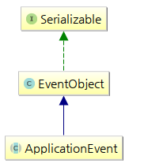
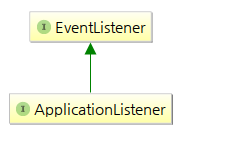
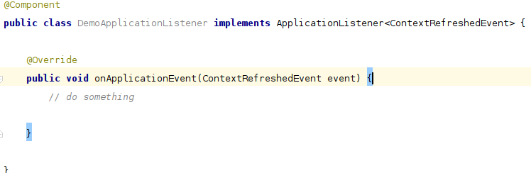
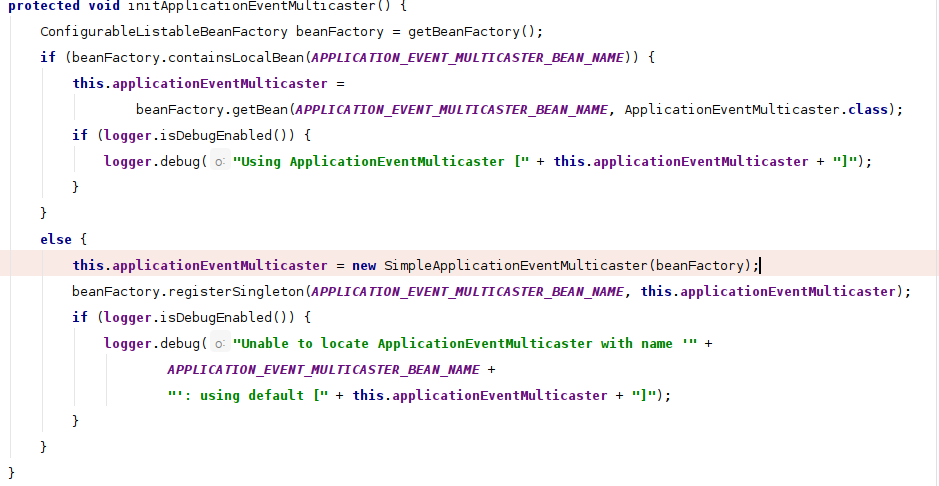
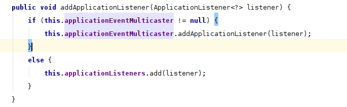

[TOC]

# Spring中的事件机制

Spring中的事件机制是一个观察者模式的实现.观察者模式就是一个目标对象管理所有相依于它的观察者对象,并且在它本身的状态改变时主动发出通知.Spring的事件由ApplicationContext发布

## ApplicationEvent

ApplicationEvent充当事件的角色,这是一个Abstract实现,所有的事件必须继承自该类,约束子类实现的体现,我们可以实现这个类定义自己的事件




Spring中默认存在的事件有

> - ContextStartedEvent：ApplicationContext启动后触发的事件
> - ContextStoppedEvent：ApplicationContext停止后触发的事件
> - ContextRefreshedEvent：ApplicationContext初始化或刷新完成后触发的事件
> - ContextClosedEvent：ApplicationContext关闭后触发的事件

- [x] WEB项目里会存在两个容器，一个是rootApplicationContext ,另一个就是projectName-servlet context,这个时候会触发两次ContextRefreshedEvent,注意rootApplicationContext没有parent,可以以此来区分

## ApplicationListener

ApplicationListener充当监听器的角色




想要监听相关事件只要实现ApplicationListener接口,并将该类注册到Spring中托管就可以,接口中的事件可以是Spring中的事件也可以是自定义实现的ApplicationEvent的子类




## ApplicationEventMulticaster

ApplicationEventMulticaster充当事件发布的角色,ApplicationContext通过带调用

初始化



 

添加监听器,这里所有被spring托管的Bean中的ApplicationListener实现都会被注册




对于我们自定义的事件需要我们在条件满足的情况下手动触发

```java
    @Resource
    private ApplicationContext applicationContext;

    public void process() {
        applicationContext.publishEvent(new DemoEvent(applicationContext));
    }

```

提交事件后,ApplicationEventMulticaster会触发相关的ApplicationListener进行响应

## 异步

关于异步,给一个线程池就可以,可以配置全局的线程池,这个全局会影响所有的事件,不推荐.推荐在监听器内部添加线程池,多线程响应事件.

监听器

```java
    private static ExecutorService executor = Executors.newSingleThreadExecutor();

    @Override
    public void onApplicationEvent(DemoEvent event) {
        executor.execute( do something);
    }
```


https://www.jianshu.com/p/ccea84c2a6ba