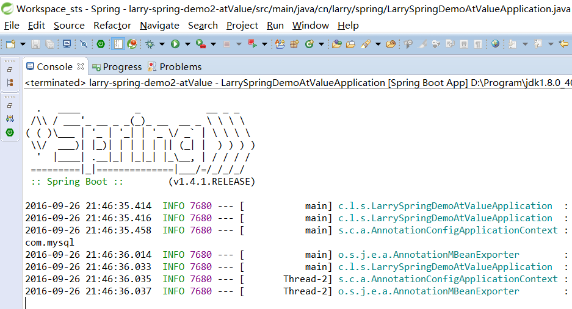

[TOC]

/Users/jerryye/backup/studio/AvailableCode/framework/spring/spring_el_value/spring_el_value_demo

# spring3.0 使用@value 加载配置文件property   Spring @Value 

## 说明

起因

一直的用法是 @Value("${jdbc.driverClass}") 这样，但在Spring官方文档里又看到 @Value("#{a.b}")的用法。

于是研究了下。

结论

@Value的值有两类：

① ${ property **:** default_value }

② #{ obj.property**? :** default_value }

就是说，第一个注入的是外部参数对应的property，第二个则是SpEL表达式对应的内容。

那个 default_value，就是前面的值为空时的默认值。注意二者的不同。

## 具体例子

1、使用STS 新建一个Spring Boot项目，依赖部分留空。

2、在application.properties 文件中添加如下内容：

```
jdbc.driverClass=com.mysql
jdbc.url=3306@local
jdbc.user=admin
jdbc.pwd=pwd
```

3、新建类ValueDemo，内容如下：

```
import javax.annotation.PostConstruct;

import org.springframework.beans.factory.annotation.Value;
import org.springframework.stereotype.Component;

@Component
public class ValueDemo {
    @Value("${jdbc.driverClass}")
    private String driver;

    @PostConstruct
    public void run() {
        System.out.println(driver);
    }

}
```

4、启动Spring Boot项目，输出如下：



这就是常用的 **$**{ properties }，很简单。继续。

5、再新建一个类AnotherObj，内容如下：

```
 1 package cn.larry.spring;
 2 
 3 import org.springframework.beans.factory.annotation.Value;
 4 import org.springframework.stereotype.Component;
 5 
 6 @Component
 7 public class AnotherObj {
 8     @Value("${jdbc.user}")
 9     private String name;
10     @Value("{jdbc.pwd}")
11     private String pwd;
12 
13     public String getName() {
14         return name;
15     }
16 
17     public void setName(String name) {
18         this.name = name;
19     }
20 
21     public String getPwd() {
22         return pwd;
23     }
24 
25     public void setPwd(String pwd) {
26         this.pwd = pwd;
27     }
28 
29 }
```

6、修改ValueDemo，如下：

```
 1 package cn.larry.spring;
 2 
 3 import javax.annotation.PostConstruct;
 4 
 5 import org.springframework.beans.factory.annotation.Value;
 6 import org.springframework.stereotype.Component;
 7 
 8 @Component
 9 public class ValueDemo {
10     @Value("${jdbc.driverClass}")
11     private String driver;
12     
13     @Value("#{anotherObj.name}")
14     private String name;
15     
16     @PostConstruct
17     public void run(){
18         System.out.println(driver);
19         System.out.println(name);
20     }
21     
22 }
```

7、再次执行Spring Boot项目，结果如下：

 .png)

这里展示的是 **#**{ SpEL }的效果。

8、有意思的是，二者可以结合使用，如：#{ '${}' } ，注意单引号，注意不能反过来，测试如下。

application.properties文件中添加一行：media=jdbc.url

ValueDemo类修改如下：

```
 1 package cn.larry.spring;
 2 
 3 import javax.annotation.PostConstruct;
 4 
 5 import org.springframework.beans.factory.annotation.Value;
 6 import org.springframework.stereotype.Component;
 7 
 8 @Component
 9 public class ValueDemo {
10     @Value("${jdbc.driverClass}")
11     private String driver;
12     
13     @Value("#{anotherObj.name}")
14     private String name;
15     
16 //    @Value("${ '#{anotherObj.media}' }") //这个不支持。
17     @Value("#{ '${media}' }")
18     private String media;
19     
20     @PostConstruct
21     public void run(){
22         System.out.println(driver);
23         System.out.println(name);
24         System.out.println(media);
25     }
26     
27 }
```

9、执行Spring Boot项目，结果如下：

  .png)

另外，默认值很浅显，也不再测试了。

有兴趣的可以自行测试。

 

放个码云的地址上来，希望能帮到一些人。

[项目地址](https://git.oschina.net/larryzeal/ValueDemo)

来源： <http://www.cnblogs.com/larryzeal/p/5910149.html>