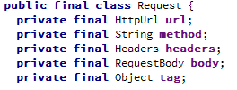

[TOC]


# OkHttp使用完全教程

标签 : Http请求, OkHttp 
时间 : 2016.08.02

------

上一节我们讲述了Http请求的过程, 这一节我们就讲述下OkHttp是怎么完成Http请求的. 
为了更好的理解OKHttp，强烈推荐先看一下http的整个请求过程~[文加图, 理解Http请求与响应](http://blog.csdn.net/oncealong/article/details/52087284)，提升软实力。

## 1. 历史上Http请求库优缺点

在讲述OkHttp之前, 我们看下没有OkHttp的时代, 我们是如何完成http请求的. 
在没有OkHttp的日子, 我们使用`HttpURLConnection`或者`HttpClient`. 那么这两者都有什么优缺点呢? 为什么不在继续使用下去呢? 
`HttpClient`是Apache基金会的一个开源网络库, 功能十分强大, API数量众多, 但是正是由于庞大的API数量使得我们很难在不破坏兼容性的情况下对它进行升级和扩展, 所以Android团队在提升和优化HttpClient方面的工作态度并不积极. 
`HttpURLConnection`是一种多用途, 轻量极的HTTP客户端, 提供的API比较简单, 可以容易地去使用和扩展. 不过在Android 2.2版本之前, `HttpURLConnection`一直存在着一些令人厌烦的bug. 比如说对一个可读的InputStream调用close()方法时，就有可能会导致连接池失效了。那么我们通常的解决办法就是直接禁用掉连接池的功能：

```
private void disableConnectionReuseIfNecessary() {    
    // 这是一个2.2版本之前的bug    
    if (Integer.parseInt(Build.VERSION.SDK) < Build.VERSION_CODES.FROYO) {    
        System.setProperty("http.keepAlive", "false");    
    }    
}    123456
```

因此, 一般的推荐是在2.2之前, 使用`HttpClient`, 因为其bug较少. 在2.2之后, 推荐使用`HttpURLConnection`, 因为API简单, 体积小, 并且有压缩和缓存机制, 并且Android团队后续会继续优化`HttpURLConnection`.

但是, 上面两个类库和`OkHttp`比起来就弱爆了, 因为OkHttp不仅具有高效的请求效率, 并且提供了很多开箱即用的网络疑难杂症解决方案. 
\- 支持HTTP/2, HTTP/2通过使用多路复用技术在一个单独的TCP连接上支持并发, 通过在一个连接上一次性发送多个请求来发送或接收数据 
\- 如果HTTP/2不可用, 连接池复用技术也可以极大减少延时 
\- 支持GZIP, 可以压缩下载体积 
\- 响应缓存可以直接避免重复请求 
\- 会从很多常用的连接问题中自动恢复 
\- 如果您的服务器配置了多个IP地址, 当第一个IP连接失败的时候, OkHttp会自动尝试下一个IP 
\- OkHttp还处理了代理服务器问题和SSL握手失败问题

使用 OkHttp 无需重写您程序中的网络代码。OkHttp实现了几乎和java.net.HttpURLConnection一样的API。如果你用了 Apache HttpClient，则OkHttp也提供了一个对应的okhttp-apache 模块。

还有一个好消息, 从Android 4.4起, 其`HttpURLConnection`的内部实现已经变为`OkHttp`, 您可以参考这两个网页:[爆栈网](http://stackoverflow.com/questions/26000027/does-android-use-okhttp-internally)和[Twitter](https://twitter.com/JakeWharton/status/482563299511250944).

## 2. OkHttp类与http请求响应的映射

在讲解OkHttp使用之前, 再看下我们Http请求和响应都有哪些部分组成.

### 2.1 http请求


所以一个类库要完成一个http请求, 需要包含 `请求方法`, `请求地址`, `请求协议`, `请求头`, `请求体`这五部分. 这些都在`okhttp3.Request`的类中有体现, 这个类正是代表http请求的类. 看下图: 
 
其中`HttpUrl`类代表`请求地址`, `String method`代表`请求方法`, `Headers`代表请求头, `RequestBody`代表请求体. `Object tag`这个是用来取消http请求的标志, 这个我们先不管. 这里也许你在疑惑, `请求协议`呢? 为什么没有请求协议对应的类. 且听我慢慢道来, 下面就会讲到这个问题.

#### 2.1.1 请求协议的协商升级

目前, Http/1.1在全世界大范围的使用中, 直接废弃跳到http/2肯定不现实. 不是每个用户的浏览器都支持http/2的, 也不是每个服务器都打算支持http/2的, 如果我们直接发送http/2格式的协议, 服务器又不支持, 那不是挂掉了! 总不能维护一个全世界的网站列表, 表示哪些支持http/2, 哪些不支持? 
为了解决这个问题, 从稍高层次上来说, 就是为了更方便地部署新协议, HTTP/1.1 引入了 Upgrade 机制. 这个机制在 RFC7230 的「[6.7 Upgrade](http://httpwg.org/specs/rfc7230.html#header.upgrade)」这一节中有详细描述. 
简单说来, 就是先问下你支持http/2么? 如果你支持, 那么接下来我就用http/2和你聊天. 如果你不支持, 那么我还是用原来的http/1.1和你聊天.

1.客户端在请求头部中指定`Connection`和`Upgrade`两个字段发起 HTTP/1.1 协议升级. HTTP/2 的协议名称是 h2c, 代表 HTTP/2 ClearText.

```
GET / HTTP/1.1
Host: example.com
Connection: Upgrade, HTTP2-Settings
Upgrade: h2c
HTTP2-Settings: <base64url encoding of HTTP/2 SETTINGS payload>12345
```

2.如果服务端不同意升级或者不支持 Upgrade 所列出的协议，直接忽略即可（当成 HTTP/1.1 请求，以 HTTP/1.1 响应）.

```
HTTP/1.1 200 OK
Content-Length: 243
Content-Type: text/html

...12345
```

如果服务端同意升级，那么需要这样响应：

```
HTTP/1.1 101 Switching Protocols
Connection: Upgrade
Upgrade: h2c

[ HTTP/2 connection ... ]12345
```

HTTP Upgrade 响应的状态码是 101，并且响应正文可以使用新协议定义的数据格式。

这样就可以完成从http/1.1升级到http/2了. 同样也可以从http/1.1升级到WebSocket.

这样, 你就了解了为什么OkHttp没有指定具体请求协议了吧. 因为OkHttp使用了请求协议的协商升级, 无论是1.1还是2, 都先只以1.1来发送, 并在发送的信息头里包含协议升级字段. 接下来就看服务器是否支持协议升级了. OkHttp使用的协议升级字段是`ALPN`, 如果有兴趣, 可以更深入的查阅相关资料.

#### 2.1.2 OkHttp请求

接下来我们构造一个http请求, 并查看请求具体内容.

```
final Request request = new Request.Builder().url("https://github.com/").build();1
```

我们看下在内存中, 这个请求是什么样子的, 是否如我们上文所说和`请求方法`, `请求地址`, `请求头`, `请求体`一一对应. 


### 2.2 http响应

我们看下一个http响应由哪些部分组成, 先看下响应组成图: 

可以看到大体由`应答首行`, `应答头`, `应答体`构成. 但是`应答首行`表达的信息过多, `HTTP/1.1`表示`访问协议`, `200`是响应码, `OK`是描述状态的消息. 根据单一职责, 我们不应该把这么多内容用一个`应答首行`来表示. 这样的话, 我们的响应就应该由`访问协议`, `响应码`, `描述信息`, `响应头`, `响应体`来组成.

#### 2.2.1 OkHttp响应

我们看下OkHttp库怎么表示一个响应: 
 
可以看到`Response`类里面有`Protocol`代表`请求协议`, `int code`代表`响应码`, `String message`代表`描述信息`, `Headers`代表`响应头`, `ResponseBody`代表`响应体`. 当然除此之外, 还有`Request`代表持有的请求, `Handshake`代表SSL/TLS握手协议验证时的信息, 这些额外信息我们暂时不问.

有了刚才说的OkHttp响应的类组成, 我们看下OkHttp请求后响应在内存中的内容:

```
final Request request = new Request.Builder().url("https://github.com/").build();
Response response = client.newCall(request).execute();12
```

 
可以看到和我们的分析十分一致.

讲了OkHttp里的请求类和响应类, 我们接下来就可以直接讲述OkHttp的使用方法了.

## 3 HTTP GET

### 3.1 同步GET

同步GET的意思是一直等待http请求, 直到返回了响应. 在这之间会阻塞进程, 所以通过get不能在Android的主线程中执行, 否则会报错.

```
private final OkHttpClient client = new OkHttpClient();

public void run() throws Exception {
    Request request = new Request.Builder()
        .url("http://publicobject.com/helloworld.txt")
        .build();

    Response response = client.newCall(request).execute();
    if (!response.isSuccessful()) throw new IOException("Unexpected code " + response);

    Headers responseHeaders = response.headers();
    for (int i = 0; i < responseHeaders.size(); i++) {
      System.out.println(responseHeaders.name(i) + ": " + responseHeaders.value(i));
    }

    System.out.println(response.body().string());
}1234567891011121314151617
```

OkHttpClient实现了`Call.Factory`接口, 是Call的工厂类, Call负责发送执行请求和读取响应. 
Request代表Http请求, 通过Request.Builder辅助类来构建. 
client.newCall(request)通过传入一个http request, 返回一个Call调用. 然后执行execute()方法, 同步获得 
Response代表Http请求的响应. response.body()是ResponseBody类, 代表响应体, 可以通过responseBody.string()获得字符串的表达形式, 或responseBody.bytes()获得字节数组的表达形式, 这两种形式都会把文档加入到内存. 也可以通过responseBody.charStream()和responseBody.byteStream()返回流来处理.

上述代码完成的功能是下载一个文件, 打印他的响应头, 以string形式打印响应体. 
响应体的string()方法对于小文档来说十分方便高效. 但是如果响应体太大（超过1MB）, 应避免使用 string()方法, 因为它会将把整个文档加载到内存中. 
对于超过1MB的响应body, 应使用流的方式来处理响应body. 这和我们处理xml文档的逻辑是一致的, 小文件可以载入内存树状解析, 大文件就必须流式解析.

### 3.2 异步GET

异步GET是指在另外的工作线程中执行http请求, 请求时不会阻塞当前的线程, 所以可以在Android主线程中使用. 
下面是在一个工作线程中下载文件, 当响应可读时回调Callback接口. 当响应头准备好后, 就会调用Callback接口, 所以读取`响应体`时可能会阻塞. OkHttp现阶段不提供异步api来接收响应体。

```
private final OkHttpClient client = new OkHttpClient();

public void run() throws Exception {
    Request request = new Request.Builder()
        .url("http://publicobject.com/helloworld.txt")
        .build();

    client.newCall(request).enqueue(new Callback() {
      @Override public void onFailure(Request request, Throwable throwable) {
        throwable.printStackTrace();
      }

      @Override public void onResponse(Response response) throws IOException {
        if (!response.isSuccessful()) throw new IOException("Unexpected code " + response);

        Headers responseHeaders = response.headers();
        for (int i = 0; i < responseHeaders.size(); i++) {
          System.out.println(responseHeaders.name(i) + ": " + responseHeaders.value(i));
        }

        System.out.println(response.body().string());
      }
    });
}123456789101112131415161718192021222324
```

## 4 HTTP POST

### 4.1 Post方式提交String

下面是使用HTTP POST提交请求到服务. 这个例子提交了一个markdown文档到web服务, 以HTML方式渲染markdown. 因为整个请求体都在内存中, 因此避免使用此api提交大文档（大于1MB）.

```
public static final MediaType MEDIA_TYPE_MARKDOWN
  = MediaType.parse("text/x-markdown; charset=utf-8");

private final OkHttpClient client = new OkHttpClient();

public void run() throws Exception {
    String postBody = ""
        + "Releases\n"
        + "--------\n"
        + "\n"
        + " * _1.0_ May 6, 2013\n"
        + " * _1.1_ June 15, 2013\n"
        + " * _1.2_ August 11, 2013\n";

    Request request = new Request.Builder()
        .url("https://api.github.com/markdown/raw")
        .post(RequestBody.create(MEDIA_TYPE_MARKDOWN, postBody))
        .build();

    Response response = client.newCall(request).execute();
    if (!response.isSuccessful()) throw new IOException("Unexpected code " + response);

    System.out.println(response.body().string());
}123456789101112131415161718192021222324
```

### 4.2 Post方式提交流

以流的方式POST提交请求体. 请求体的内容由流写入产生. 这个例子是流直接写入Okio的BufferedSink. 你的程序可能会使用OutputStream, 你可以使用BufferedSink.outputStream()来获取. OkHttp的底层对流和字节的操作都是基于Okio库, Okio库也是Square开发的另一个IO库, 填补I/O和NIO的空缺, 目的是提供简单便于使用的接口来操作IO.

```
public static final MediaType MEDIA_TYPE_MARKDOWN
      = MediaType.parse("text/x-markdown; charset=utf-8");

private final OkHttpClient client = new OkHttpClient();

public void run() throws Exception {
    RequestBody requestBody = new RequestBody() {
      @Override public MediaType contentType() {
        return MEDIA_TYPE_MARKDOWN;
      }

      @Override public void writeTo(BufferedSink sink) throws IOException {
        sink.writeUtf8("Numbers\n");
        sink.writeUtf8("-------\n");
        for (int i = 2; i <= 997; i++) {
          sink.writeUtf8(String.format(" * %s = %s\n", i, factor(i)));
        }
      }

      private String factor(int n) {
        for (int i = 2; i < n; i++) {
          int x = n / i;
          if (x * i == n) return factor(x) + " × " + i;
        }
        return Integer.toString(n);
      }
    };

    Request request = new Request.Builder()
        .url("https://api.github.com/markdown/raw")
        .post(requestBody)
        .build();

    Response response = client.newCall(request).execute();
    if (!response.isSuccessful()) throw new IOException("Unexpected code " + response);

    System.out.println(response.body().string());
}1234567891011121314151617181920212223242526272829303132333435363738
```

### 4.3 Post方式提交文件

以文件作为请求体是十分简单的。

```
public static final MediaType MEDIA_TYPE_MARKDOWN
  = MediaType.parse("text/x-markdown; charset=utf-8");

private final OkHttpClient client = new OkHttpClient();

public void run() throws Exception {
    File file = new File("README.md");

    Request request = new Request.Builder()
        .url("https://api.github.com/markdown/raw")
        .post(RequestBody.create(MEDIA_TYPE_MARKDOWN, file))
        .build();

    Response response = client.newCall(request).execute();
    if (!response.isSuccessful()) throw new IOException("Unexpected code " + response);

    System.out.println(response.body().string());
}123456789101112131415161718
```

### 4.4 Post方式提交表单

使用FormEncodingBuilder来构建和HTML`<form>`标签相同效果的请求体. 键值对将使用一种HTML兼容形式的URL编码来进行编码.

```
 private final OkHttpClient client = new OkHttpClient();

  public void run() throws Exception {
    RequestBody formBody = new FormBody.Builder()
        .add("search", "Jurassic Park")
        .build();
    Request request = new Request.Builder()
        .url("https://en.wikipedia.org/w/index.php")
        .post(formBody)
        .build();

    Response response = client.newCall(request).execute();
    if (!response.isSuccessful()) throw new IOException("Unexpected code " + response);

    System.out.println(response.body().string());
  }12345678910111213141516
```

### 4.5 Post方式提交分块请求

MultipartBody.Builder可以构建复杂的请求体, 与HTML文件上传形式兼容. 多块请求体中每块请求都是一个请求体, 可以定义自己的请求头. 这些请求头可以用来描述这块请求, 例如它的Content-Disposition. 如果Content-Length和Content-Type可用的话, 他们会被自动添加到请求头中.

```
private static final String IMGUR_CLIENT_ID = "...";
  private static final MediaType MEDIA_TYPE_PNG = MediaType.parse("image/png");

  private final OkHttpClient client = new OkHttpClient();

  public void run() throws Exception {
    // Use the imgur image upload API as documented at https://api.imgur.com/endpoints/image
    RequestBody requestBody = new MultipartBody.Builder()
        .setType(MultipartBody.FORM)
        .addFormDataPart("title", "Square Logo")
        .addFormDataPart("image", "logo-square.png",
            RequestBody.create(MEDIA_TYPE_PNG, new File("website/static/logo-square.png")))
        .build();

    Request request = new Request.Builder()
        .header("Authorization", "Client-ID " + IMGUR_CLIENT_ID)
        .url("https://api.imgur.com/3/image")
        .post(requestBody)
        .build();

    Response response = client.newCall(request).execute();
    if (!response.isSuccessful()) throw new IOException("Unexpected code " + response);

    System.out.println(response.body().string());
  }12345678910111213141516171819202122232425
```

## 5. 其他用法

### 5.1 提取响应头

典型的HTTP头像是一个`Map<String, String>` : 每个字段都有一个或没有值. 但是一些头允许多个值, 像Guava的Multimap. 
例如: HTTP响应里面提供的Vary响应头, 就是多值的. OkHttp的api试图让这些情况都适用. 
当写请求头的时候, 使用header(name, value)可以设置唯一的name、value. 如果已经有值, 旧的将被移除, 然后添加新的. 使用addHeader(name, value)可以添加多值（添加, 不移除已有的）. 
当读取响应头时, 使用header(name)返回最后出现的name、value. 通常情况这也是唯一的name、value. 如果没有值, 那么header(name)将返回null. 如果想读取字段对应的所有值, 使用headers(name)会返回一个list. 
为了获取所有的Header, Headers类支持按index访问.

```
private final OkHttpClient client = new OkHttpClient();

public void run() throws Exception {
    Request request = new Request.Builder()
        .url("https://api.github.com/repos/square/okhttp/issues")
        .header("User-Agent", "OkHttp Headers.java")
        .addHeader("Accept", "application/json; q=0.5")
        .addHeader("Accept", "application/vnd.github.v3+json")
        .build();

    Response response = client.newCall(request).execute();
    if (!response.isSuccessful()) throw new IOException("Unexpected code " + response);

    System.out.println("Server: " + response.header("Server"));
    System.out.println("Date: " + response.header("Date"));
    System.out.println("Vary: " + response.headers("Vary"));
}1234567891011121314151617
```

### 5.2 使用Gson来解析JSON响应

Gson是一个在JSON和Java对象之间转换非常方便的api库. 这里我们用Gson来解析Github API的JSON响应. 
注意: ResponseBody.charStream()使用响应头Content-Type指定的字符集来解析响应体. 默认是UTF-8.

```
private final OkHttpClient client = new OkHttpClient();
  private final Gson gson = new Gson();

  public void run() throws Exception {
    Request request = new Request.Builder()
        .url("https://api.github.com/gists/c2a7c39532239ff261be")
        .build();
    Response response = client.newCall(request).execute();
    if (!response.isSuccessful()) throw new IOException("Unexpected code " + response);

    Gist gist = gson.fromJson(response.body().charStream(), Gist.class);
    for (Map.Entry<String, GistFile> entry : gist.files.entrySet()) {
      System.out.println(entry.getKey());
      System.out.println(entry.getValue().content);
    }
  }

  static class Gist {
    Map<String, GistFile> files;
  }

  static class GistFile {
    String content;
  }123456789101112131415161718192021222324
```

### 5.3 响应缓存

为了缓存响应, 你需要一个你可以读写的缓存目录, 和缓存大小的限制. 这个缓存目录应该是私有的, 不信任的程序应不能读取缓存内容. 
一个缓存目录同时拥有多个缓存访问是错误的. 大多数程序只需要调用一次new OkHttp(), 在第一次调用时配置好缓存, 然后其他地方只需要调用这个实例就可以了. 否则两个缓存示例互相干扰, 破坏响应缓存, 而且有可能会导致程序崩溃. 
响应缓存使用HTTP头作为配置. 你可以在请求头中添加Cache-Control: max-stale=3600 , OkHttp缓存会支持. 你的服务通过响应头确定响应缓存多长时间, 例如使用Cache-Control: max-age=9600.

```
private final OkHttpClient client;

public CacheResponse(File cacheDirectory) throws Exception {
    int cacheSize = 10 * 1024 * 1024; // 10 MiB
    Cache cache = new Cache(cacheDirectory, cacheSize);

    client = new OkHttpClient();
    client.setCache(cache);
}

public void run() throws Exception {
    Request request = new Request.Builder()
        .url("http://publicobject.com/helloworld.txt")
        .build();

    Response response1 = client.newCall(request).execute();
    if (!response1.isSuccessful()) throw new IOException("Unexpected code " + response1);

    String response1Body = response1.body().string();
    System.out.println("Response 1 response:          " + response1);
    System.out.println("Response 1 cache response:    " + response1.cacheResponse());
    System.out.println("Response 1 network response:  " + response1.networkResponse());

    Response response2 = client.newCall(request).execute();
    if (!response2.isSuccessful()) throw new IOException("Unexpected code " + response2);

    String response2Body = response2.body().string();
    System.out.println("Response 2 response:          " + response2);
    System.out.println("Response 2 cache response:    " + response2.cacheResponse());
    System.out.println("Response 2 network response:  " + response2.networkResponse());

    System.out.println("Response 2 equals Response 1? " + response1Body.equals(response2Body));
}123456789101112131415161718192021222324252627282930313233
```

如果需要阻值response使用缓存, 使用`CacheControl.FORCE_NETWORK`. 如果需要阻值response使用网络, 使用`CacheControl.FORCE_CACHE`. 
警告: 如果你使用`FORCE_CACHE`, 但是response要求使用网络, OkHttp将会返回一个`504 Unsatisfiable Request`响应.

#### 5.3.1 Force a Network Response

有些时候, 比如用户刚刚点击`刷新`按钮, 这时必须跳过缓存, 直接从服务器抓取数据. 为了强制全面刷新, 我们需要添加`no-cache`指令:

```
connection.addRequestProperty("Cache-Control", "no-cache");1
```

这样就可以强制每次请求直接发送给源服务器, 而不经过本地缓存版本的校验, 常用于需要确认认证的应用和严格要求使用最新数据的应用.

#### 5.3.2 Force a Cache Response

有时你会想立即显示资源. 这样即使在后台正下载着最新资源, 你的客户端仍然可以先显示原有资源, 毕竟有个东西显示比没有东西显示要好. 
如果需要限制让请求优先使用本地缓存资源, 需要增加`only-if-cached`指令:

```
try {
     connection.addRequestProperty("Cache-Control", "only-if-cached");
     InputStream cached = connection.getInputStream();
     // the resource was cached! show it
  catch (FileNotFoundException e) {
     // the resource was not cached
 }
}12345678
```

### 5.4 取消一个Call

使用Call.cancel()可以立即停止掉一个正在执行的call. 如果一个线程正在写请求或者读响应, 将会引发IOException. 当call没有必要的时候, 使用这个api可以节约网络资源. 例如当用户离开一个应用时, 不管同步还是异步的call都可以取消. 
你可以通过tags来同时取消多个请求. 当你构建一请求时, 使用RequestBuilder.tag(tag)来分配一个标签, 之后你就可以用OkHttpClient.cancel(tag)来取消所有带有这个tag的call.

```
  private final ScheduledExecutorService executor = Executors.newScheduledThreadPool(1);
  private final OkHttpClient client = new OkHttpClient();

  public void run() throws Exception {
    Request request = new Request.Builder()
        .url("http://httpbin.org/delay/2") // This URL is served with a 2 second delay.
        .build();

    final long startNanos = System.nanoTime();
    final Call call = client.newCall(request);

    // Schedule a job to cancel the call in 1 second.
    executor.schedule(new Runnable() {
      @Override public void run() {
        System.out.printf("%.2f Canceling call.%n", (System.nanoTime() - startNanos) / 1e9f);
        call.cancel();
        System.out.printf("%.2f Canceled call.%n", (System.nanoTime() - startNanos) / 1e9f);
      }
    }, 1, TimeUnit.SECONDS);

    try {
      System.out.printf("%.2f Executing call.%n", (System.nanoTime() - startNanos) / 1e9f);
      Response response = call.execute();
      System.out.printf("%.2f Call was expected to fail, but completed: %s%n",
          (System.nanoTime() - startNanos) / 1e9f, response);
    } catch (IOException e) {
      System.out.printf("%.2f Call failed as expected: %s%n",
          (System.nanoTime() - startNanos) / 1e9f, e);
    }
  }123456789101112131415161718192021222324252627282930
```

### 5.5 超时

没有响应时使用超时结束call. 没有响应的原因可能是客户点链接问题、服务器可用性问题或者这之间的其他东西. OkHttp支持连接超时, 读取超时和写入超时.

```
  private final OkHttpClient client;

  public ConfigureTimeouts() throws Exception {
    client = new OkHttpClient.Builder()
        .connectTimeout(10, TimeUnit.SECONDS)
        .writeTimeout(10, TimeUnit.SECONDS)
        .readTimeout(30, TimeUnit.SECONDS)
        .build();
  }

  public void run() throws Exception {
    Request request = new Request.Builder()
        .url("http://httpbin.org/delay/2") // This URL is served with a 2 second delay.
        .build();

    Response response = client.newCall(request).execute();
    System.out.println("Response completed: " + response);
  }123456789101112131415161718
```

### 5.6 每个call的配置

使用OkHttpClient, 所有的HTTP Client配置包括代理设置、超时设置、缓存设置. 当你需要为单个call改变配置的时候, 调用`OkHttpClient.newBuilder()`. 这个api将会返回一个builder, 这个builder和原始的client共享相同的连接池, 分发器和配置. 
下面的例子中，我们让一个请求是500ms的超时、另一个是3000ms的超时。

```
  private final OkHttpClient client = new OkHttpClient();

  public void run() throws Exception {
    Request request = new Request.Builder()
        .url("http://httpbin.org/delay/1") // This URL is served with a 1 second delay.
        .build();

    try {
      // Copy to customize OkHttp for this request.
      OkHttpClient copy = client.newBuilder()
          .readTimeout(500, TimeUnit.MILLISECONDS)
          .build();

      Response response = copy.newCall(request).execute();
      System.out.println("Response 1 succeeded: " + response);
    } catch (IOException e) {
      System.out.println("Response 1 failed: " + e);
    }

    try {
      // Copy to customize OkHttp for this request.
      OkHttpClient copy = client.newBuilder()
          .readTimeout(3000, TimeUnit.MILLISECONDS)
          .build();

      Response response = copy.newCall(request).execute();
      System.out.println("Response 2 succeeded: " + response);
    } catch (IOException e) {
      System.out.println("Response 2 failed: " + e);
    }
  }12345678910111213141516171819202122232425262728293031
```

### 5.7 处理验证

这部分和HTTP AUTH有关.

#### 5.7.1 HTTP AUTH

使用HTTP AUTH需要在server端配置http auth信息, 其过程如下: 
\- 客户端发送http请求 
\- 服务器发现配置了http auth, 于是检查request里面有没有”Authorization”的http header 
\- 如果有, 则判断Authorization里面的内容是否在用户列表里面, Authorization header的典型数据为”Authorization: Basic jdhaHY0=”, 其中Basic表示基础认证, jdhaHY0=是base64编码的”user:passwd”字符串. 如果没有，或者用户密码不对，则返回http code 401页面给客户端. 
\- 标准的http浏览器在收到401页面之后, 应该弹出一个对话框让用户输入帐号密码; 并在用户点确认的时候再次发出请求, 这次请求里面将带上Authorization header.

一次典型的访问场景是：

- 浏览器发送http请求（没有Authorization header）
- 服务器端返回401页面
- 浏览器弹出认证对话框
- 用户输入帐号密码，并点确认
- 浏览器再次发出http请求（带着Authorization header）
- 服务器端认证通过，并返回页面
- 浏览器显示页面

#### 5.7.2 OkHttp认证

OkHttp会自动重试未验证的请求. 当响应是`401 Not Authorized`时，`Authenticator`会被要求提供证书. Authenticator的实现中需要建立一个新的包含证书的请求. 如果没有证书可用, 返回null来跳过尝试. 
使用`Response.challenges()`来获得任何`authentication challenges`的 schemes 和 realms. 当完成一个`Basic challenge`, 使用`Credentials.basic(username, password)`来解码请求头.

```
  private final OkHttpClient client;

  public Authenticate() {
    client = new OkHttpClient.Builder()
        .authenticator(new Authenticator() {
          @Override public Request authenticate(Route route, Response response) throws IOException {
            System.out.println("Authenticating for response: " + response);
            System.out.println("Challenges: " + response.challenges());
            String credential = Credentials.basic("jesse", "password1");
            return response.request().newBuilder()
                .header("Authorization", credential)
                .build();
          }
        })
        .build();
  }

  public void run() throws Exception {
    Request request = new Request.Builder()
        .url("http://publicobject.com/secrets/hellosecret.txt")
        .build();

    Response response = client.newCall(request).execute();
    if (!response.isSuccessful()) throw new IOException("Unexpected code " + response);

    System.out.println(response.body().string());
  }123456789101112131415161718192021222324252627
```

当认证无法工作时, 为了避免多次重试, 你可以返回空来放弃认证. 例如, 当`exact credentials`已经尝试过, 你可能会直接想跳过认证, 可以这样做:

```
  if (credential.equals(response.request().header("Authorization"))) {
    return null; // If we already failed with these credentials, don't retry.
   }123
```

当重试次数超过定义的次数, 你若想跳过认证, 可以这样做:

```
  if (responseCount(response) >= 3) {
    return null; // If we've failed 3 times, give up.
  }

  private int responseCount(Response response) {
    int result = 1;
    while ((response = response.priorResponse()) != null) {
      result++;
    }
    return result;
  }1234567891011
```

这样, 对OkHttp的使用我们就讲完了, 下一节会讲OkHttp内部实现.

谢谢下列文章: 
<http://www.blogjava.net/yongboy/archive/2015/03/18/423570.html> 
<http://www.jcodecraeer.com/a/anzhuokaifa/androidkaifa/2015/0106/2275.html> 
<http://www.jianshu.com/p/aad5aacd79bf> 
<https://imququ.com/post/protocol-negotiation-in-http2.html> 
<http://blog.csdn.net/wwwsq/article/details/7255062>


http://blog.csdn.net/oncealong/article/details/52096477