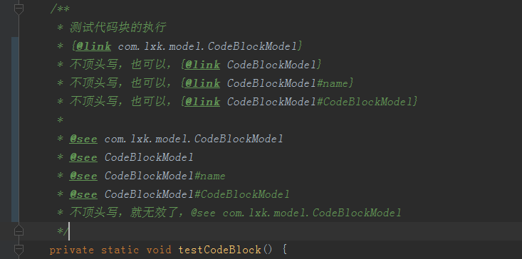
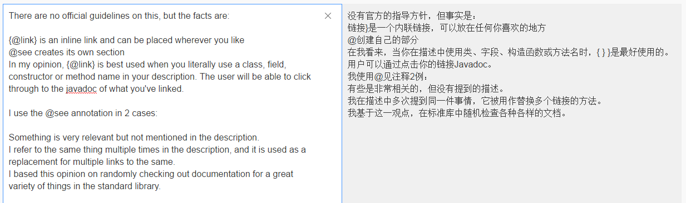

# javadoc中{@link}与@see的简单使用以及区别

写代码的时候，有时候，你需要写一些注释，把内容相互关联起来，方便自己或别人看的时候，可以直接找到你关联的代码类或者啥的。
这个时候，{@link}与@see，这2个javadoc注解就派上用场了，
不管他具体有什么功能，咱就只管一个，他可以链接代码，让注释看的更清楚易懂。方便你我他。
@see 标签允许用户引用其他类的文档。具体使用方式如下：
@see classname
@see fully-qualified-classname
@see fully-qualified-classname#方法名称
@see fully-qualified-classname#属性名称
我在使用的时候，发现这个只能单独一行顶头写，如果不顶头写就不管用了，没了链接的效果。
但是，{@link}这个却可以随便放。
具体使用方法和上面那个@see是一样的。
实际效果，看下面的图吧。

来源： [http://blog.csdn.net/qq_27093465/article/details/59121608](http://blog.csdn.net/qq_27093465/article/details/59121608)