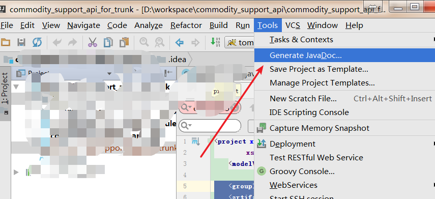

# javadoc生成出现错误“编码 GBK 的不可映射字符” 

在使用Eclipse进行javadoc的导出时，提示“编码 GBK 的不可映射字符”，应该就是中文注释Eclipse不认，需要在调用javadoc.exe的时候传递编码集告诉它采用什么编码去生成javadoc文档。

 打开eclipse，project – Export – javadoc 一项一项的选你要输出javadoc的项目，最后一步中VM设置行中加入以下代码 

 -encoding utf-8 -charset utf-8 

 经过以上操作，输出的html代码不会发生“编码 GBK 的不可映射字符 ”问题，而且html字符编码都设为了UTF-8，问题彻底解决。

 idea使用截图：

 

  

  

 来源： [https://my.oschina.net/tiancai/blog/155299](https://my.oschina.net/tiancai/blog/155299)