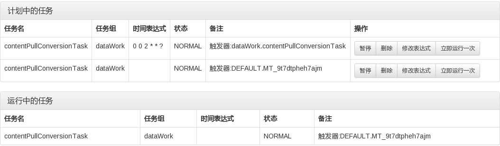

# Spring 3整合Quartz 2实现定时任务三：动态暂停 恢复 修改和删除任务

前面我们已经完成了spring 3和quartz 2的整合以及动态添加定时任务，我们接着来完善它，使之能支持更多的操作，例如暂停、恢复、修改等。

在动态添加定时任务中其实已经涉及到了其中的一些代码，这里我们再来细化的理一理。先来看一下我们初步要实现的目标效果图，这里我们只在内存中操作，并没有把quartz的任何信息保存到数据库，即使用的是RAMJobStore，当然如果你有需要，可以实现成JDBCJobStore，那样任务信息将会更全面，貌似还有专门的监控工具，不过本人没有用过：



如上图，我们要先列出计划中的定时任务以及正在执行中的定时任务，这里的正在执行中指的是任务已经触发线程还没执行完的情况。比如每天2点执行一个数据导入操作，这个操作执行时间需要5分钟，在这5分钟之内这个任务才是运行中的任务。当任务正常时可以使用暂停按钮，任务暂停时可以使用恢复按钮。

trigger各状态说明：

None：Trigger已经完成，且不会在执行，或者找不到该触发器，或者Trigger已经被删除 NORMAL:正常状态 PAUSED：暂停状态 COMPLETE：触发器完成，但是任务可能还正在执行中 BLOCKED：线程阻塞状态 ERROR：出现错误

##### 计划中的任务

指那些已经添加到quartz调度器的任务，因为quartz并没有直接提供这样的查询接口，所以我们需要结合JobKey和Trigger来实现，核心代码：

```
Scheduler scheduler = schedulerFactoryBean.getScheduler();
GroupMatcher<JobKey> matcher = GroupMatcher.anyJobGroup();
Set<JobKey> jobKeys = scheduler.getJobKeys(matcher);
List<ScheduleJob> jobList = new ArrayList<ScheduleJob>();
for (JobKey jobKey : jobKeys) {
    List<? extends Trigger> triggers = scheduler.getTriggersOfJob(jobKey);
    for (Trigger trigger : triggers) {
        ScheduleJob job = new ScheduleJob();
        job.setJobName(jobKey.getName());
        job.setJobGroup(jobKey.getGroup());
        job.setDesc("触发器:" + trigger.getKey());
        Trigger.TriggerState triggerState = scheduler.getTriggerState(trigger.getKey());
        job.setJobStatus(triggerState.name());
        if (trigger instanceof CronTrigger) {
            CronTrigger cronTrigger = (CronTrigger) trigger;
            String cronExpression = cronTrigger.getCronExpression();
            job.setCronExpression(cronExpression);
        }
        jobList.add(job);
    }
}
```

上面代码中的jobList就是我们需要的计划中的任务列表，需要注意一个job可能会有多个trigger的情况，在下面讲到的立即运行一次任务的时候，会生成一个临时的trigger也会出现在这。这里把一个Job有多个trigger的情况看成是多个任务。我们前面包括在实际项目中一般用到的都是CronTrigger ，所以这里我们着重处理了下CronTrigger的情况。

##### 运行中的任务

实现和计划中的任务类似，核心代码：

```
Scheduler scheduler = schedulerFactoryBean.getScheduler();
List<JobExecutionContext> executingJobs = scheduler.getCurrentlyExecutingJobs();
List<ScheduleJob> jobList = new ArrayList<ScheduleJob>(executingJobs.size());
for (JobExecutionContext executingJob : executingJobs) {
    ScheduleJob job = new ScheduleJob();
    JobDetail jobDetail = executingJob.getJobDetail();
    JobKey jobKey = jobDetail.getKey();
    Trigger trigger = executingJob.getTrigger();
    job.setJobName(jobKey.getName());
    job.setJobGroup(jobKey.getGroup());
    job.setDesc("触发器:" + trigger.getKey());
    Trigger.TriggerState triggerState = scheduler.getTriggerState(trigger.getKey());
    job.setJobStatus(triggerState.name());
    if (trigger instanceof CronTrigger) {
        CronTrigger cronTrigger = (CronTrigger) trigger;
        String cronExpression = cronTrigger.getCronExpression();
        job.setCronExpression(cronExpression);
    }
    jobList.add(job);
}
```

##### 暂停任务

这个比较简单，核心代码：

```
Scheduler scheduler = schedulerFactoryBean.getScheduler();
JobKey jobKey = JobKey.jobKey(scheduleJob.getJobName(), scheduleJob.getJobGroup());
scheduler.pauseJob(jobKey);
```

##### 恢复任务

和暂停任务相对，核心代码：

```
Scheduler scheduler = schedulerFactoryBean.getScheduler();
JobKey jobKey = JobKey.jobKey(scheduleJob.getJobName(), scheduleJob.getJobGroup());
scheduler.resumeJob(jobKey);
```

##### 删除任务

删除任务后，所对应的trigger也将被删除

```
Scheduler scheduler = schedulerFactoryBean.getScheduler();
JobKey jobKey = JobKey.jobKey(scheduleJob.getJobName(), scheduleJob.getJobGroup());
scheduler.deleteJob(jobKey);
```

##### 立即运行任务

这里的立即运行，只会运行一次，方便测试时用。quartz是通过临时生成一个trigger的方式来实现的，这个trigger将在本次任务运行完成之后自动删除。trigger的key是随机生成的，例如：DEFAULT.MT_4k9fd10jcn9mg。在我的测试中，前面的DEFAULT.MT是固定的，后面部分才随机生成。

```
Scheduler scheduler = schedulerFactoryBean.getScheduler();
JobKey jobKey = JobKey.jobKey(scheduleJob.getJobName(), scheduleJob.getJobGroup());
scheduler.triggerJob(jobKey);
```

##### 更新任务的时间表达式

更新之后，任务将立即按新的时间表达式执行：

```
Scheduler scheduler = schedulerFactoryBean.getScheduler();
TriggerKey triggerKey = TriggerKey.triggerKey(scheduleJob.getJobName(),
    scheduleJob.getJobGroup());
//获取trigger，即在spring配置文件中定义的 bean id="myTrigger"
CronTrigger trigger = (CronTrigger) scheduler.getTrigger(triggerKey);
//表达式调度构建器
CronScheduleBuilder scheduleBuilder = CronScheduleBuilder.cronSchedule(scheduleJob
    .getCronExpression());
//按新的cronExpression表达式重新构建trigger
trigger = trigger.getTriggerBuilder().withIdentity(triggerKey)
    .withSchedule(scheduleBuilder).build();
//按新的trigger重新设置job执行
scheduler.rescheduleJob(triggerKey, trigger);
```

自己代码中编写用到的.整理下


```

//如果加载spring-context.xml文件：
ApplicationContext context = new ClassPathXmlApplicationContext("application-quartz-context.xml");


SchedulerFactoryBean schedulerFactoryBean = context.getBean(SchedulerFactoryBean.class);
Scheduler scheduler = schedulerFactoryBean.getScheduler();


TriggerKey triggerKey = TriggerKey.triggerKey("bigSearchShieldGetChangeJobTrigger",
    "DEFAULT");
//获取trigger，即在spring配置文件中定义的 bean id="myTrigger"
Trigger trigger = (Trigger) scheduler.getTrigger(triggerKey);
//表达式调度构建器
ScheduleBuilder scheduleBuilder = CronScheduleBuilder.cronSchedule("0/10 * * * * ?");
//按新的cronExpression表达式重新构建trigger
trigger = trigger.getTriggerBuilder().withIdentity(triggerKey).withSchedule(scheduleBuilder)
    .build();

//按新的trigger重新设置job执行
scheduler.rescheduleJob(triggerKey, trigger);


上面方式  一旦设置完成就会执行job  需要注意
```

到这里，我们的spring3 整合quartz 2的定时任务功能终于是告一段落了，对常用的一些功能进行了实现，相信可以满足一般项目的需求了。


https://www.ktanx.com/blog/p/311