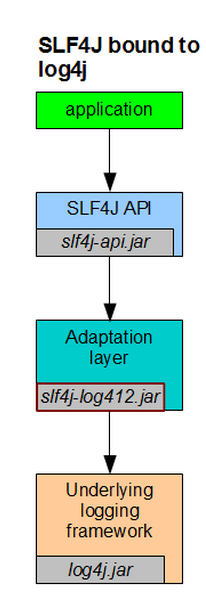

# slf4j-api、slf4j-log4j12以及log4j之间什么关系？

转载 2014年01月08日 17:41:59 

几乎在每个jar包里都可以看到log4j的身影，在多个子工程构成项目中，slf4j相关的冲突时不时就跳出来让你不爽，那么slf4j-api、slf4j-log4j12还有log4j他们是什么关系？我把自己了解的和大家简单分享一下：

​    slf4j:Simple Logging Facade for Java，为java提供的简单日志Facade。Facade：门面，更底层一点说就是接口。他允许用户以自己的喜好，在工程中通过slf4j接入不同的日志系统。更直观一点，slf4j是个数据线，一端嵌入程序，另一端链接日志系统，从而实现将程序中的信息导入到日志系统并记录。 

   因此，slf4j入口就是众多接口的集合，他不负责具体的日志实现，只在编译时负责寻找合适的日志系统进行绑定。具体有哪些接口，全部都定义在slf4j-api中。查看slf4j-api源码就可以发现，里面除了public final class LoggerFactory类之外，都是接口定义。因此，slf4j-api本质就是一个接口定义。

​      

下图比较清晰的描述了他们之间的关系：

     

  当系统采用log4j作为日志框架实现的调用关系：

1. slf4j-api.jar说明 : 首先系统包含slf4j-api作为日志接入的接口；在编译时slf4j-api中public final class LoggerFactor类中private final static void bind() 方法会寻找具体的日志实现类绑定，主要通过StaticLoggerBinder.getSingleton();语句调用
2. slf4j-log4j12.jar说明 : 链接slf4j-api和log4j中间的适配器。它实现了slf4j-api中StaticLoggerBinder接口，从而使得在编译时绑定的是slf4j-log4j12的getSingleton()方法
3. log4j.jar说明 : 这个是具体的日志系统。通过slf4j-log4j12初始化Log4j，达到最终日志的输出。

http://blog.csdn.net/tengdazhang770960436/article/details/18006127