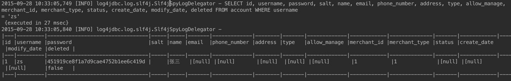

# 使用log4jdbc更有效的记录java sql日志

 发表于 2015-09-24 |  分类于 [软件技术 ](https://zacard.net/categories/%E8%BD%AF%E4%BB%B6%E6%8A%80%E6%9C%AF/)|

Log4jdbc 是一个开源 SQL 日志框架，它使用代理模式实现对常用的 JDBC Driver（ Oracle , Derby , MySQL , PostgreSQL , H2 , HSQLDB , …）操作的拦截，记录真实 SQL ，可以将占位符与参数全部合并在一起显示，方便直接拷贝 SQL 在 MySQL 等客户端直接执行，加快调试速度。

### Log4jdbc的特点

[Log4jdbc](https://github.com/arthurblake/log4jdbc)具有以下特点:

- 完全支持 JDBC3 和 JDBC4
- 配置简单，在大多数情况下，只需要将 JDBC 驱动类改成net.sf.log4jdbc.DriverSpy ，同时将 jdbc:log4jdbc 添加到现有的 JDBC URL 之前，最后配置日志记录的种类即可
- 将 Prepared Statements 中的绑定参数自动插入到对应的位置。在大多数情况下极大改善了可读性及调试工作
- SQL 的耗时信息能被获取从而帮助判断哪些语句执行得过慢，同时这些信息可以被工具识别得到一个关于慢 SQL 的报表
- SQL 连接信息也可以获取从而帮助诊断关于连接池或线程的问题
- 兼容任何 JDBC 驱动，需要 JDK1.4 及以上与 Slf4j1.x
- 开源软件，使用 Apache 2.0 License

### 使用步骤

#### 决定使用哪个版本的jar包

```
JDK1.5:log4jdbc-log4j2-jdbc3.jar
JDK1.6:log4jdbc-log4j2-jdbc4.jar
JDK1.7:log4jdbc-log4j2-jdbc4.1.jar  
JDK1.8:log4jdbc-log4j2-jdbc4.1.jar

```

#### 将 JAR 包添加进项目

这里只介绍maven方式引入

```
 <!--log4jdbc-->
 <dependency>
     <groupId>org.bgee.log4jdbc-log4j2</groupId>
     <artifactId>log4jdbc-log4j2-jdbc4.1</artifactId>
     <version>1.16</version>
 </dependency>
 <dependency>
     <groupId>org.slf4j</groupId>
     <artifactId>jcl-over-slf4j</artifactId>
     <version>1.7.5</version>
 </dependency>   
<dependency>  
     <groupId>org.slf4j</groupId>
     <artifactId>slf4j-api</artifactId>
     <version>1.7.5</version>
</dependency>  
<dependency>  
     <groupId>org.slf4j</groupId>
     <artifactId>slf4j-log4j12</artifactId>
     <version>1.7.5</version>
</dependency>  

```

#### 修改项目的JDBC驱动类

```
#jdbc.driver=com.mysql.jdbc.Driver

jdbc.driver=net.sf.log4jdbc.sql.jdbcapi.DriverSpy

```

#### 将jdbc:log4添加到现有的JDBC URL之前

```
#jdbc.url=jdbc:mysql://127.0.0.1:3306/test?useUnicode=true&amp;characterEncoding=UTF-8

jdbc.url=jdbc:log4jdbc:mysql://127.0.0.1:3306/test?useUnicode=true&amp;characterEncoding=UTF-8

```

#### 配置日志记录的种类

Log4jdbc 用以下几个可以配置的日志种类：

- jdbc.sqlonly : 仅记录 SQL
- jdbc.sqltiming ：记录 SQL 以及耗时信息
- jdbc.audit ：记录除了 ResultSet 之外的所有 JDBC 调用信息，会产生大量的记录，有利于调试跟踪具体的 JDBC 问题
- jdbc.resultset ：会产生更多的记录信息，因为记录了 ResultSet 的信息
- jdbc.connection ：记录连接打开、关闭等信息，有利于调试数据库连接相关问题

以上日志种类都可以设置为 DEBUG , INFO 或 ERROR 级别。当设置为 FATAL 或 OFF 时，意味关闭记录。

以下是一个采用 Log4j 作为具体日志系统的典型配置，将这些配置到 log4j.properties 里面：

```
log4j.logger.jdbc.sqlonly=OFF  
log4j.logger.jdbc.sqltiming=INFO  
log4j.logger.jdbc.audit=OFF  
log4j.logger.jdbc.resultset=OFF  
log4j.logger.jdbc.connection=OFF

```

#### 添加log4jdbc.log4j2.properties文件

这是最后一步，在项目的 CLASSPATH 路径下创建一个 log4jdbc.log4j2.properties 文件，告诉 Log4jdbc-log4j2 使用的是 Slf4j 来记录和打印日志，在该配置文件里增加：

```
log4jdbc.spylogdelegator.name=net.sf.log4jdbc.log.slf4j.Slf4jSpyLogDelegator

```

#### 运行项目，查看效果

[](http://7xlnw9.com1.z0.glb.clouddn.com/555.png)

来源： <https://zacard.net/2015/09/24/log4jdbc20150924/>