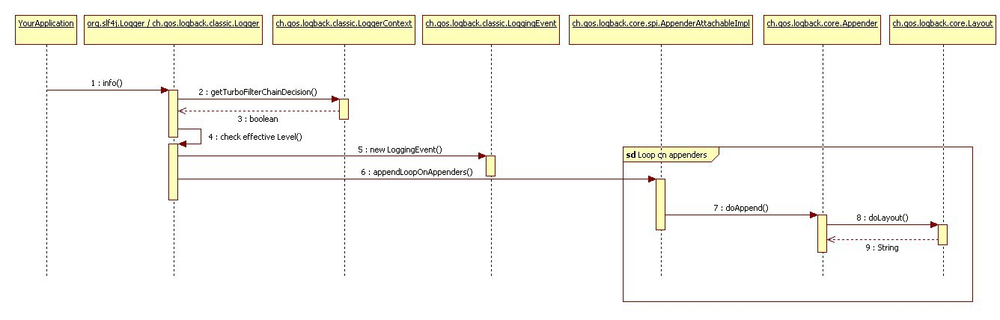
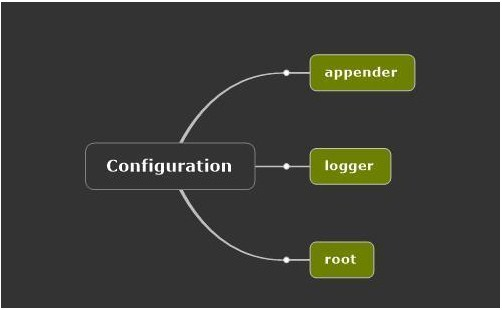

# 概览

简单地说，Logback 是一个 Java 领域的日志框架。它被认为是 Log4J 的继承人。Logback 主要由三个模块组成：

- logback-core
- logback-classic
- logback-access

logback-core 是其它模块的基础设施，其它模块基于它构建，显然，logback-core 提供了一些关键的通用机制。logback-classic 的地位和作用等同于 Log4J，它也被认为是 Log4J 的一个改进版，并且它实现了简单日志门面 SLF4J；而 logback-access 主要作为一个与 Servlet 容器交互的模块，比如说 tomcat 或者 jetty，提供一些与 HTTP 访问相关的功能。

目前 Logback 的使用很广泛，很多知名的开源软件都使用了 Logback作为日志框架，比如说 Akka，Apache Camel 等。

# Logback 与 Log4J

实际上，这两个日志框架都出自同一个开发者之手，Logback 相对于 Log4J 有更多的优点

- 同样的代码路径，Logback 执行更快
- 更充分的测试
- 原生实现了 SLF4J API（Log4J 还需要有一个中间转换层）
- 内容更丰富的文档
- 支持 XML 或者 Groovy 方式配置
- 配置文件自动热加载
- 从 IO 错误中优雅恢复
- 自动删除日志归档
- 自动压缩日志成为归档文件
- 支持 Prudent 模式，使多个 JVM 进程能记录同一个日志文件
- 支持配置文件中加入条件判断来适应不同的环境
- 更强大的过滤器
- 支持 SiftingAppender（可筛选 Appender）
- 异常栈信息带有包信息

# 快速上手

想在 Java 程序中使用 Logback，需要依赖三个 jar 包，分别是 slf4j-api，logback-core，logback-classic。其中 slf4j-api 并不是 Logback 的一部分，是另外一个项目，但是强烈建议将 slf4j 与 Logback 结合使用。要引用这些 jar 包，在 maven 项目中引入以下3个 dependencies

```
        <dependency>
            <groupId>org.slf4j</groupId>
            <artifactId>slf4j-api</artifactId>
            <version>1.7.5</version>
        </dependency>
        <dependency>
            <groupId>ch.qos.logback</groupId>
            <artifactId>logback-core</artifactId>
            <version>1.0.11</version>
        </dependency>
        <dependency>
            <groupId>ch.qos.logback</groupId>
            <artifactId>logback-classic</artifactId>
            <version>1.0.11</version>
        </dependency>
```

## 第一个简单的例子

```
package io.beansoft.logback.demo.universal;

import org.slf4j.Logger;
import org.slf4j.LoggerFactory;

/**
 *
 *
 * @author beanlam
 * @date 2017年2月9日 下午11:17:53
 * @version 1.0
 *
 */
public class SimpleDemo {

    private static final Logger logger = LoggerFactory.getLogger(SimpleDemo.class);

    public static void main(String[] args) {
        logger.info("Hello, this is a line of log message logged by Logback");
    }
}
```

以上代码的运行结果是：

```
23:19:41.131 [main] INFO i.b.l.demo.universal.SimpleDemo - Hello, this is a line of log message logged byLogback
```

注意到这里，代码里并没有引用任何一个跟 Logback 相关的类，而是引用了 SLF4J 相关的类，这边是使用 SLF4J 的好处，在需要将日志框架切换为其它日志框架时，无需改动已有的代码。

`LoggerFactory` 的 `getLogger()` 方法接收一个参数，以这个参数决定 logger 的名字，这里传入了 `SimpleDemo` 这个类的 Class 实例，那么 logger 的名字便是 `SimpleDemo` 这个类的全限定类名：`io.beansoft.logback.demo.universal.SimpleDemo`

## 让 Logback 打印出一些它自身的内部消息

```
package io.beansoft.logback.demo.universal;

import org.slf4j.Logger;
import org.slf4j.LoggerFactory;

import ch.qos.logback.classic.LoggerContext;
import ch.qos.logback.core.util.StatusPrinter;

/**
 *
 *
 * @author beanlam
 * @date 2017年2月9日 下午11:31:55
 * @version 1.0
 *
 */
public class LogInternalStateDemo {

    private static final Logger logger = LoggerFactory.getLogger(LogInternalStateDemo.class);
    
    public static void main(String[] args) {
        logger.info("Hello world");
        
        //打印 Logback 内部状态
        LoggerContext lc = (LoggerContext) LoggerFactory.getILoggerFactory();
        StatusPrinter.print(lc);
    }
}
```

除了打印正常的日志信息，还打印出了 Logback 自身的内部状态信息

```
23:33:19.340 [main] INFO  i.b.l.d.u.LogInternalStateDemo - Hello world
23:33:19,265 |-INFO in ch.qos.logback.classic.LoggerContext[default] - Could NOT find resource [logback.groovy]
23:33:19,265 |-INFO in ch.qos.logback.classic.LoggerContext[default] - Could NOT find resource [logback-test.xml]
23:33:19,265 |-INFO in ch.qos.logback.classic.LoggerContext[default] - Could NOT find resource [logback.xml]
23:33:19,266 |-INFO in ch.qos.logback.classic.LoggerContext[default] - Setting up default configuration.
```

# Logger，Appenders 与 Layouts

在 logback 里，最重要的三个类分别是

- Logger
- Appender
- Layout

Logger 类位于 logback-classic 模块中， 而 Appender 和 Layout 位于 logback-core 中，这意味着， Appender 和 Layout 并不关心 Logger 的存在，不依赖于 Logger，同时也能看出， Logger 会依赖于 Appender 和 Layout 的协助，日志信息才能被正常打印出来。

## 分层命名规则

为了可以控制哪些信息需要输出，哪些信息不需要输出，logback 中引进了一个 分层 概念。每个 logger 都有一个 name，这个 name 的格式与 Java 语言中的包名格式相同。这也是前面的例子中直接把一个 class 对象传进 LoggerFactory.getLogger() 方法作为参数的原因。

logger 的 name 格式决定了多个 logger 能够组成一个树状的结构，为了维护这个分层的树状结构，每个 logger 都被绑定到一个 logger 上下文中，这个上下文负责厘清各个 logger 之间的关系。

例如， 命名为 `io.beansoft` 的 logger，是命名为 `io.beansoft.logback` 的 logger 的父亲，是命名为 `io.beansoft.logback.demo`的 logger 的祖先。

在 logger 上下文中，有一个 root logger，作为所有 logger 的祖先，这是 logback 内部维护的一个 logger，并非开发者自定义的 logger。

可通过以下方式获得这个 logger :

```
Logger rootLogger = LoggerFactory.getLogger(org.slf4j.Logger.ROOT_LOGGER_NAME);
```

同样，通过 logger 的 name，就能获得对应的其它 logger 实例。

`Logger` 这个接口主要定义的方法有：

```
package org.slf4j; 
public interface Logger {

  // Printing methods: 
  public void trace(String message);
  public void debug(String message);
  public void info(String message); 
  public void warn(String message); 
  public void error(String message); 
}
```

## 日志打印级别

logger 有日志打印级别，可以为一个 logger 指定它的日志打印级别。如果不为一个 logger 指定打印级别，那么它将继承离他最近的一个有指定打印级别的祖先的打印级别。这里有一个容易混淆想不清楚的地方，如果 logger 先找它的父亲，而它的父亲没有指定打印级别，那么它会立即忽略它的父亲，往上继续寻找它爷爷，直到它找到 root logger。因此，也能看出来，要使用 logback， 必须为 root logger 指定日志打印级别。

日志打印级别从低级到高级排序的顺序是：
`TRACE < DEBUG < INFO < WARN < ERROR `
如果一个 logger 允许打印一条具有某个日志级别的信息，那么它也必须允许打印具有比这个日志级别更高级别的信息，而不允许打印具有比这个日志级别更低级别的信息。

举个例子：

```
package io.beansoft.logback.demo.universal;

import org.slf4j.Logger;
import org.slf4j.LoggerFactory;

import ch.qos.logback.classic.Level;

/**
 *
 *
 * @author beanlam
 * @date 2017年2月10日 上午12:20:33
 * @version 1.0
 *
 */
public class LogLevelDemo {

    public static void main(String[] args) {
        
        //这里强制类型转换时为了能设置 logger 的 Level
        ch.qos.logback.classic.Logger logger = 
                (ch.qos.logback.classic.Logger) LoggerFactory.getLogger("com.foo");
        logger.setLevel(Level.INFO);
        
        Logger barlogger = LoggerFactory.getLogger("com.foo.Bar");

        // 这个语句能打印，因为 WARN > INFO
        logger.warn("can be printed because WARN > INFO");

        // 这个语句不能打印，因为 DEBUG < INFO. 
        logger.debug("can not be printed because DEBUG < INFO");

        // barlogger 是 logger 的一个子 logger
        // 它继承了 logger 的级别 INFO
        // 以下语句能打印，因为 INFO >= INFO
        barlogger.info("can be printed because INFO >= INFO");

        // 以下语句不能打印，因为 DEBUG < INFO
        barlogger.debug("can not be printed because DEBUG < INFO");
    }
}
```

打印结果是：

```
00:27:19.251 [main] WARN  com.foo - can be printed because WARN > INFO
00:27:19.255 [main] INFO  com.foo.Bar - can be printed because INFO >= INFO
```

## 获取 logger

在 logback 中，每个 logger 都是一个单例，调用 `LoggerFactory.getLogger` 方法时，如果传入的 logger name 相同，获取到的 logger 都是同一个实例。

在为 logger 命名时，用类的全限定类名作为 logger name 是最好的策略，这样能够追踪到每一条日志消息的来源。

## Appender 和 Layout

在 logback 的世界中，日志信息不仅仅可以打印至 console，也可以打印至文件，甚至输出到网络流中，日志打印的目的地由 Appender 来决定，不同的 Appender 能将日志信息打印到不同的目的地去。

Appender 是绑定在 logger 上的，同时，一个 logger 可以绑定多个 Appender，意味着一条信息可以同时打印到不同的目的地去。例如，常见的做法是，日志信息既输出到控制台，同时也记录到日志文件中，这就需要为 logger 绑定两个不同的 logger。

Appender 是绑定在 logger 上的，而 logger 又有继承关系，因此一个 logger 打印信息时的目的地 Appender 需要参考它的父亲和祖先。在 logback 中，默认情况下，如果一个 logger 打印一条信息，那么这条信息首先会打印至它自己的 Appender，然后打印至它的父亲和父亲以上的祖先的 Appender，但如果它的父亲设置了 `additivity = false`，那么这个 logger 除了打印至它自己的 Appender 外，只会打印至其父亲的 Appender，因为它的父亲的 `additivity` 属性置为了 false，开始变得忘祖忘宗了，所以这个 logger 只认它父亲的 Appender；此外，对于这个 logger 的父亲来说，如果父亲的 logger 打印一条信息，那么它只会打印至自己的 Appender中（如果有的话），因为父亲已经忘记了爷爷及爷爷以上的那些父辈了。

打印的日志除了有打印的目的地外，还有日志信息的展示格式。在 logback 中，用 Layout 来代表日志打印格式。比如说，PatternLayout 能够识别以下这条格式：
`%-4relative [%thread] %-5level %logger{32} - %msg%n`
然后打印出来的格式效果是：
`176 [main] DEBUG manual.architecture.HelloWorld2 - Hello world.`

上面这个格式的第一个字段代表从程序启动开始后经过的毫秒数，第二个字段代表打印出这条日志的线程名字，第三个字段代表日志信息的日志打印级别，第四个字段代表 logger name，第五个字段是日志信息，第六个字段仅仅是代表一个换行符。

## 参数化打印日志

经常能看到打印日志的时候，使用以下这种方式打印日志：

```
logger.debug("the message is " + msg + " from " + somebody);
```

这种打印日志的方式有个缺点，就是无论日志级别是什么，程序总要先执行 `"the message is " + msg + " from " + somebody` 这段字符串的拼接操作。当 logger 设置的日志级别为比 DEBUG 级别更高级别时，DEBUG 级别的信息不回被打印出来的，显然，字符串拼接的操作是不必要的，当要拼接的字符串很大时，这无疑会带来很大的性能白白损耗。

于是，一种改进的打印日志方式被人们发现了：

```
if(logger.isDebugEnabled()) { 
  logger.debug("the message is " + msg + " from " + somebody);
}
```

这样的方式确实能避免字符串拼接的不必要损耗，但这也不是最好的方法，当日志级别为 DEBUG 时，那么打印这行消息，需要判断两次日志级别。一次是`logger.isDebugEnabled()`，另一次是 `logger.debug()` 方法内部也会做的判断。这样也会带来一点点效率问题，如果能找到更好的方法，谁愿意无视白白消耗的效率。

有一种更好的方法，那就是提供占位符的方式，以参数化的方式打印日志，例如上述的语句，可以是这样的写法：

```
logger.debug("the message {} is from {}", msg, somebody);
```

这样的方式，避免了字符串拼接，也避免了多一次日志级别的判断。

## logback 内部运行流程



 

当应用程序发起一个记录日志的请求，例如 info() 时，logback 的内部运行流程如下所示

1. 获得过滤器链条
2. 检查日志级别以决定是否继续打印
3. 创建一个 `LoggingEvent` 对象
4. 调用 Appenders
5. 进行日志信息格式化
6. 发送 `LoggingEvent` 到对应的目的地

## 有关性能问题

关于日志系统，人们讨论得最多的是性能问题，即使是小型的应用程序，也有可能输出大量的日志。打印日志中的不当处理，会引发各种性能问题，例如太多的日志记录请求可能使磁盘 IO 成为性能瓶颈，从而影响到应用程序的正常运行。在合适的时候记录日志、以更好的方式发起日志请求、以及合理设置日志级别方面，都有可能造成性能问题。关于性能问题，以下几个方面需要了解

- 建议使用占位符的方式参数化记录日志
- logback 内部机制保证 logger 在记录日志时，不必每一次都去遍历它的父辈以获得关于日志级别、Appender 的信息
- 在 logback 中，将日志信息格式化，以及输出到目的地，是最损耗性能的操作

# logback 配置

## 配置须知

### 配置方式

logback 提供的配置方式有以下几种：

- 编程式配置
- xml 格式
- groovy 格式

logback 在启动时，根据以下步骤寻找配置文件：

1. 在 classpath 中寻找 logback-test.xml文件
2. 如果找不到 logback-test.xml，则在 classpath 中寻找 logback.groovy 文件
3. 如果找不到 logback.groovy，则在 classpath 中寻找 logback.xml文件
4. 如果上述的文件都找不到，则 logback 会使用 JDK 的 SPI 机制查找 META-INF/services/ch.qos.logback.classic.spi.Configurator 中的 logback 配置实现类，这个实现类必须实现 `Configuration` 接口，使用它的实现来进行配置
5. 如果上述操作都不成功，logback 就会使用它自带的 `BasicConfigurator` 来配置，并将日志输出到 console

logback-test.xml 一般用来在测试代码中打日志，如果是 maven 项目，一般把 logback-test.xml 放在 src/test/resources 目录下。maven 打包的时候也不会把这个文件打进 jar 包里。logback 启动的时候解析配置文件大概需要 100 毫秒的时间，如果希望更快启动，可以采用 SPI 的方式。

### 默认的配置

前面有提到默认的配置，由 `BasicConfiguator` 类配置而成，这个类的配置可以用如下的配置文件来表示：

```
<configuration>

  <appender name="STDOUT" class="ch.qos.logback.core.ConsoleAppender">
    <!-- encoders are assigned the type
         ch.qos.logback.classic.encoder.PatternLayoutEncoder by default -->
    <encoder>
      <pattern>%d{HH:mm:ss.SSS} [%thread] %-5level %logger{36} - %msg%n</pattern>
    </encoder>
  </appender>

  <root level="debug">
    <appender-ref ref="STDOUT" />
  </root>
</configuration>
```

### 启动时打印状态信息

如果 logback 在启动时，解析配置文件时，出现了需要警告的信息或者错误信息，那 logback 会自动先打印出自身的状态信息。

如果希望正常情况下也打印出状态信息，则可以使用之前提到的方式，在代码里显式地调用使其输出：

```
public static void main(String[] args) {
  // assume SLF4J is bound to logback in the current environment
  LoggerContext lc = (LoggerContext) LoggerFactory.getILoggerFactory();
  // print logback's internal status
  StatusPrinter.print(lc);
  ...
}
```

也可以在配置文件中，指定 configuration 的 debug 属性为 true

```
<configuration debug="true">
    <appender name="STDOUT" class="ch.qos.logback.core.ConsoleAppender">
        <!-- encoders are assigned the type ch.qos.logback.classic.encoder.PatternLayoutEncoder 
            by default -->
        <encoder>
            <pattern>%d{HH:mm:ss.SSS} [%thread] %-5level %logger{36} - %msg%n
            </pattern>
        </encoder>
    </appender>

    <root level="debug">
        <appender-ref ref="STDOUT" />
    </root>
</configuration>
```

还可以指定一个 Listener：

```
<configuration>
  <statusListener class="ch.qos.logback.core.status.OnConsoleStatusListener" />  
  ... the rest of the configuration file  
</configuration>
```

### 重置默认的配置文件位置

设置 logback.configurationFile 系统变量，可以通过 -D 参数设置，所指定的文件名必须以 .xml 或者 .groovy 作为文件后缀，否则 logback 会忽略这些文件。

### 配置文件自动热加载

要使配置文件自动重载，需要把 scan 属性设置为 true，默认情况下每分钟才会扫描一次，可以指定扫描间隔：

```
<configuration scan="true" scanPeriod="30 seconds" > 
  ...
</configuration> 
```

注意扫描间隔要加上单位，可用的单位是 milliseconds，seconds，minutes 和 hours。如果只指定了数字，但没有指定单位，这默认单位为 milliseconds。

在 logback 内部，当设置 scan 属性为 true 后，一个叫做 `ReconfigureOnChangeFilter` 的过滤器就会被牵扯进来，它负责判断是否到了该扫描的时候，以及是否该重新加载配置。Logger 的任何一个打印日志的方法被调用时，都会触发这个过滤器，所以关于这个过滤器的自身的性能问题，变得十分重要。logback 目前采用这样一种机制，当 logger 的调用次数到达一定次数后，才真正让过滤器去做它要做的事情，这个次数默认是 16，而 logback 会在运行时根据调用的频繁度来动态调整这个数目。

### 输出异常栈时也打印出 jar 包的信息

这个属性默认是关闭，可通过以下方式开启：

```
<configuration packagingData="true">
  ...
</configuration>
```

也可以通过 LoggerContext 的 setPackagingDataEnabled(boolean) 方法来开启

```
 LoggerContext lc = (LoggerContext) LoggerFactory.getILoggerFactory();
 lc.setPackagingDataEnabled(true);
```

### 直接调用 JoranConfigurator

Joran 是 logback 使用的一个配置加载库，如果想要重新实现 logback 的配置机制，可以直接调用这个类 `JoranConfigurator` 来实现：

```
package chapters.configuration;

import org.slf4j.Logger;
import org.slf4j.LoggerFactory;

import ch.qos.logback.classic.LoggerContext;
import ch.qos.logback.classic.joran.JoranConfigurator;
import ch.qos.logback.core.joran.spi.JoranException;
import ch.qos.logback.core.util.StatusPrinter;

public class MyApp3 {
  final static Logger logger = LoggerFactory.getLogger(MyApp3.class);

  public static void main(String[] args) {
    // assume SLF4J is bound to logback in the current environment
    LoggerContext context = (LoggerContext) LoggerFactory.getILoggerFactory();
    
    try {
      JoranConfigurator configurator = new JoranConfigurator();
      configurator.setContext(context);
      // Call context.reset() to clear any previous configuration, e.g. default 
      // configuration. For multi-step configuration, omit calling context.reset().
      context.reset(); 
      configurator.doConfigure(args[0]);
    } catch (JoranException je) {
      // StatusPrinter will handle this
    }
    StatusPrinter.printInCaseOfErrorsOrWarnings(context);

    logger.info("Entering application.");

    Foo foo = new Foo();
    foo.doIt();
    logger.info("Exiting application.");
  }
}
```

## 配置文件格式

### 配置文件的基本结构



 

根节点是 configuration，可包含0个或多个 appender，0个或多个 logger，最多一个 root。

### 配置 logger 节点

在配置文件中，logger 的配置在<logger> 标签中配置，<logger> 标签只有一个属性是一定要的，那就是 name，除了 name 属性，还有 level 属性，additivity 属性可以配置，不过它们是可选的。
level 的取值可以是 `TRACE, DEBUG, INFO, WARN, ERROR, ALL, OFF, INHERITED, NULL`， 其中 `INHERITED` 和 `NULL` 的作用是一样的，并不是不打印任何日志，而是强制这个 logger 必须从其父辈继承一个日志级别。
additivity 的取值是一个布尔值，true 或者 false。

<logger> 标签下只有一种元素，那就是 <appender-ref>，可以有0个或多个，意味着绑定到这个 logger 上的 Appender。

### 配置 root 节点

<root> 标签和 <logger> 标签的配置类似，只不过 <root> 标签只允许一个属性，那就是 level 属性，并且它的取值范围只能取 `TRACE, DEBUG, INFO, WARN, ERROR, ALL, OFF`。
<root> 标签下允许有0个或者多个 <appender-ref>。

### 配置 appender 节点

<appender> 标签有两个必须填的属性，分别是 name 和 class，class 用来指定具体的实现类。<appender> 标签下可以包含至多一个 <layout>，0个或多个 <encoder>，0个或多个 <filter>，除了这些标签外，<appender> 下可以包含一些类似于 JavaBean 的配置标签。

<layout> 包含了一个必须填写的属性 class，用来指定具体的实现类，不过，如果该实现类的类型是 `PatternLayout` 时，那么可以不用填写。<layout> 也和 <appender> 一样，可以包含类似于 JavaBean 的配置标签。
<encoder> 标签包含一个必须填写的属性 class，用来指定具体的实现类，如果该类的类型是 `PatternLayoutEncoder` ，那么 class 属性可以不填。
如果想要往一个 logger 上绑定 appender，则使用以下方式：

```
<logger name="HELLO" level="debug">
    <appender-ref ref="FILE" />
    <appender-ref ref="STDOUT" />
</logger>

```

### 设置 Context Name

```
<configuration>
  <contextName>myAppName</contextName>
  <appender name="STDOUT" class="ch.qos.logback.core.ConsoleAppender">
    <encoder>
      <pattern>%d %contextName [%t] %level %logger{36} - %msg%n</pattern>
    </encoder>
  </appender>

  <root level="debug">
    <appender-ref ref="STDOUT" />
  </root>
</configuration>
```

### 变量替换

在 logback 中，支持以 ${varName} 来引用变量

#### 定义变量

可以直接在 logback.xml 中定义变量

```
<configuration>

  <property name="USER_HOME" value="/home/sebastien" />

  <appender name="FILE" class="ch.qos.logback.core.FileAppender">
    <file>${USER_HOME}/myApp.log</file>
    <encoder>
      <pattern>%msg%n</pattern>
    </encoder>
  </appender>

  <root level="debug">
    <appender-ref ref="FILE" />
  </root>
</configuration>
```

也可以通过大D参数来定义

```
java -DUSER_HOME="/home/sebastien" MyApp2
```

也可以通过外部文件来定义

```
<configuration>

  <property file="src/main/java/chapters/configuration/variables1.properties" />

  <appender name="FILE" class="ch.qos.logback.core.FileAppender">
     <file>${USER_HOME}/myApp.log</file>
     <encoder>
       <pattern>%msg%n</pattern>
     </encoder>
   </appender>

   <root level="debug">
     <appender-ref ref="FILE" />
   </root>
</configuration>
```

外部文件也支持 classpath 中的文件

```
<configuration>

  <property resource="resource1.properties" />

  <appender name="FILE" class="ch.qos.logback.core.FileAppender">
     <file>${USER_HOME}/myApp.log</file>
     <encoder>
       <pattern>%msg%n</pattern>
     </encoder>
   </appender>

   <root level="debug">
     <appender-ref ref="FILE" />
   </root>
</configuration>
```

外部文件的格式是 key-value 型。

```
USER_HOME=/home/sebastien
```

#### 变量的作用域

变量有三个作用域

- local
- context
- system

local 作用域在配置文件内有效，context 作用域的有效范围延伸至 logger context，system 作用域的范围最广，整个 JVM 内都有效。

logback 在替换变量时，首先搜索 local 变量，然后搜索 context，然后搜索 system。

如何为变量指定 scope ?

```
<configuration>

  <property scope="context" name="nodeId" value="firstNode" />

  <appender name="FILE" class="ch.qos.logback.core.FileAppender">
    <file>/opt/${nodeId}/myApp.log</file>
    <encoder>
      <pattern>%msg%n</pattern>
    </encoder>
  </appender>

  <root level="debug">
    <appender-ref ref="FILE" />
  </root>
</configuration>
```

#### 变量的默认值

在引用一个变量时，如果该变量未定义，那么可以为其指定默认值，做法是：

```
${aName:-golden}
```

#### 运行时定义变量

需要使用 <define> 标签，指定接口 `PropertyDfiner` 对应的实现类。如下所示：

```
<configuration>

  <define name="rootLevel" class="a.class.implementing.PropertyDefiner">
    <shape>round</shape>
    <color>brown</color>
    <size>24</size>
  </define>
 
  <root level="${rootLevel}"/>
</configuration>
```

#### 条件化处理配置文件

logback 允许在配置文件中定义条件语句，以决定配置的不同行为，具体语法格式如下：

```
   <!-- if-then form -->
   <if condition="some conditional expression">
    <then>
      ...
    </then>
  </if>
  
  <!-- if-then-else form -->
  <if condition="some conditional expression">
    <then>
      ...
    </then>
    <else>
      ...
    </else>    
  </if>
```

示例：

```
<configuration debug="true">

  <if condition='property("HOSTNAME").contains("torino")'>
    <then>
      <appender name="CON" class="ch.qos.logback.core.ConsoleAppender">
        <encoder>
          <pattern>%d %-5level %logger{35} - %msg %n</pattern>
        </encoder>
      </appender>
      <root>
        <appender-ref ref="CON" />
      </root>
    </then>
  </if>

  <appender name="FILE" class="ch.qos.logback.core.FileAppender">
    <file>${randomOutputDir}/conditional.log</file>
    <encoder>
      <pattern>%d %-5level %logger{35} - %msg %n</pattern>
   </encoder>
  </appender>

  <root level="ERROR">
     <appender-ref ref="FILE" />
  </root>
</configuration>
```

#### 从JNDI 获取变量

使用 <insertFromJNDI> 可以从 JNDI 加载变量，如下所示：

```
<configuration>
  <insertFromJNDI env-entry-name="java:comp/env/appName" as="appName" />
  <contextName>${appName}</contextName>

  <appender name="CONSOLE" class="ch.qos.logback.core.ConsoleAppender">
    <encoder>
      <pattern>%d ${CONTEXT_NAME} %level %msg %logger{50}%n</pattern>
    </encoder>
  </appender>

  <root level="DEBUG">
    <appender-ref ref="CONSOLE" />
  </root>
</configuration>
```

#### 文件包含

可以使用 ≶include> 标签在一个配置文件中包含另外一个配置文件，如下图所示：

```
<configuration>
  <include file="src/main/java/chapters/configuration/includedConfig.xml"/>

  <root level="DEBUG">
    <appender-ref ref="includedConsole" />
  </root>

</configuration>
```

被包含的文件必须有以下格式：

```
<included>
  <appender name="includedConsole" class="ch.qos.logback.core.ConsoleAppender">
    <encoder>
      <pattern>"%d - %m%n"</pattern>
    </encoder>
  </appender>
</included>
```

支持从多种源头包含从文件中包含

```
<include file="src/main/java/chapters/configuration/includedConfig.xml"/>
```

从 classpath 中包含

```
<include resource="includedConfig.xml"/>
```

从 URL 中包含

```
<include url="http://some.host.com/includedConfig.xml"/>
```

如果包含不成功，那么 logback 会打印出一条警告信息，如果不希望 logback 抱怨，只需这样做：

```
<include optional="true" ..../>
```

### 添加一个 Context Listener

`LoggerContextListener` 接口的实例能监听 logger context 上发生的事件，比如说日志级别的变化，添加的方式如下所示：

```
<configuration debug="true">
  <contextListener class="ch.qos.logback.classic.jul.LevelChangePropagator"/>
  .... 
</configuration>
```

- 5 天前发布

  [来源： ](https://segmentfault.com/a/1190000008315137)<https://segmentfault.com/a/1190000008315137>